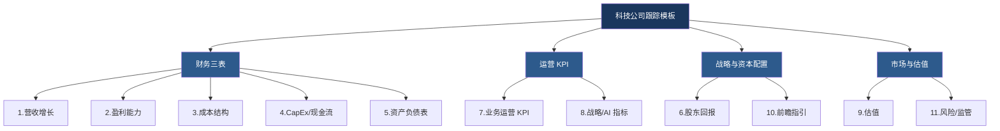

# 科技巨头研究模板：核心指标体系与跟踪框架
## ——以 Google/Alphabet 为例的买方投研视角

## 一、设计哲学：模板要解决什么问题

一个好的科技股跟踪模板,本质上是把**财报披露的 80+ 项数据**压缩成**一个能快速回答三个问题**的仪表盘:

1. **趋势是否出现拐点?**(增速、利润率、资本回报率的二阶导数)
2. **管理层叙事和数据是否一致?**(指引 vs 实际、commentary vs 边际变化)
3. **市场预期错在哪里?**(beat/miss、buy-side whisper vs sell-side consensus、SOTP 隐含估值)

只跟踪静态数字是没用的。模板的核心是**时间序列 + 拐点识别 + 指引一致性**。下面这套框架我建议按 11 个模块组织,任何一家科技巨头(MAG7、META、MSFT、TSM、BABA、Tencent)都可以套用,Google 只是其中一个具象化的标的。

---

## 二、核心指标体系(11 个模块)

### 模块 1:营收与增长(Revenue & Growth)

| 指标 | 为什么重要 | Google 特别关注点 |
|---|---|---|
| 总营收 YoY / QoQ | 顶层增速 | 拆分有机增长 vs 汇率影响 |
| **分部营收** | 揭示增长引擎 | Services / Cloud / Other Bets 三大段 |
| **业务线明细** | 二阶拆分 | Search & other / YouTube ads / Network / Subscriptions, Platforms & Devices |
| 地区营收 | 宏观敏感性 | US / EMEA / APAC / Other Americas |
| **常数汇率增速** (CC) | 剥离 FX 噪音 | Google 海外营收占比~50%,FX 影响显著 |
| TAC(流量获取成本)及占比 | 议价权与渠道结构 | TAC/营收比率长期下行是结构性利好 |
| Paid Clicks 增速 / Cost-per-Click 趋势 | 量价拆分 | 反映搜索货币化效率 |
| Cloud RPO(剩余履约义务) | **前瞻订单簿** | 与 AWS/Azure backlog 对照,衡量需求强度 |

> **解读重点**:Services 增速 < 名义 GDP 增速时拉响警报(意味着市占被吞食);Cloud 增速持续 < AWS/Azure 也是结构性问题。每季度必算 **YouTube ads 增速 vs Meta 增速**——这是数字广告 share shift 的关键 proxy。

### 模块 2:盈利能力(Profitability)

| 指标 | 关键解读 |
|---|---|
| 整体毛利率 | 跟踪 cloud mix-shift 影响 |
| **分部经营利润率** | Services / Cloud / Other Bets 各自单独跟踪——这是 SOTP 估值基础 |
| **Cloud 经营利润率** | 关注是否持续扩张(2023Q1 Google Cloud 首次盈利) |
| 整体经营利润率 | YoY 拆分:量价/成本/汇率/SBC |
| EBITDA / Adj. EBITDA | 与同业可比口径 |
| Net Income / EPS(GAAP & Non-GAAP) | 注意是否有 one-off |
| **SBC(股权激励)占营收比** | **科技股利润质量第一红线** |
| **经营利润率 ex-SBC** | 真实盈利能力 |
| Incremental Margin(增量利润率) | 操作杠杆 |

> **重点**:科技股最容易被忽视的是 SBC。Google 2023 全年 SBC 约 $22B(占营收 7%+),回购很大一部分是在"对冲稀释"。要养成把 SBC 加回 Capex 看"真实股东回报"的习惯。

### 模块 3:成本结构(Cost Structure)

跟踪四项费用的 **YoY 增速 vs 营收 YoY 增速**——若费用增速持续超过营收,operating leverage 会反向。

- COGS 及构成(尤其 D&A,因服务器折旧)
- R&D 绝对额 / 占比 / YoY
- S&M 绝对额 / 占比 / YoY
- G&A 绝对额 / 占比 / YoY
- **员工总数 + 人均营收 + 人均利润**(2023 年大裁员后的恢复路径)
- **服务器折旧年限假设**——Google 2023 年从 4 年延长到 6 年,当年贡献~$3.4B 经营利润,这是会计 tailwind,要在模型里独立标注

### 模块 4:资本开支与现金流(CapEx & Cash Flow)——你最关心的部分

| 指标 | 解读维度 |
|---|---|
| **绝对 CapEx** | YoY、QoQ 节奏 |
| **CapEx / 营收(资本密度)** | 与 hyperscaler 同业对比 |
| **CapEx 拆分** | 服务器/网络设备 vs 数据中心建设 vs 办公楼 |
| **AI 基础设施 CapEx 占比** | 当下市场最关注变量 |
| **指引 CapEx** | Alphabet 已开始按年给 capex 框架,2025 指引 ~$75B |
| **D&A 节奏** | CapEx 滞后转化为利润表压力 |
| **OCF(经营现金流)** | "印钞机"持续性 |
| **FCF = OCF - CapEx** | |
| **FCF 转化率 = FCF / Net Income** | 1.0x 以下要警觉 |
| **FCF Margin = FCF / Revenue** | Google 历史 ~25%,AI Capex 周期会压到 ~15% |

> **AI 资本周期框架**:Capex 大幅上升时,要看三个验证信号——(a) Cloud 营收增速是否同步 reaccelerate;(b) Cloud RPO 是否扩张;(c) 管理层是否给出"投资 → 回报"时间表。三者同时成立,capex 上行才是 EPS 利好;否则就是估值杀手。

### 模块 5:股东回报与资本配置(Capital Allocation)

| 指标 | 跟踪要点 |
|---|---|
| 回购金额(季度/年化) | 占 FCF 比例 |
| **净回购 = 回购 - SBC** | 真实减少股本的部分 |
| 股息(2024 Q2 起首次派息) | 股息率、payout ratio、增长路径 |
| 基本/稀释股本变化 YoY | 反算稀释速率 |
| **总股东回报率 = (回购+分红)/ 市值** | 与 FCF Yield 对比 |
| 现金 + 短期投资 / 长期债务 | Net cash position |
| 并购金额 + 战略意图 | Wiz $32B 收购等大型交易 |

### 模块 6:资产负债表(Balance Sheet)

- 现金及短期投资余额
- 长期债务(Google 债务极少,但要跟踪债券发行节奏)
- 净现金头寸(估值 SOTP 时要扣除)
- 商誉与无形资产
- 营运资金变化(尤其应收账款增速 vs 营收增速)

### 模块 7:业务运营 KPI(Operating KPIs)

这是科技股区别于传统行业的关键——**每家公司都有自己的"领先指标"**。

**Google 专属的运营 KPI:**
- Paid Clicks 增速 / Cost-per-Click 增速(广告量价分解)
- YouTube 观看时长(管理层有时披露)、Shorts 货币化进展
- YouTube 订阅用户(YouTube Premium + Music + TV)
- Google One 订阅用户
- **Cloud RPO 增速 + 大单数(>$1B 合同数量)**
- Cloud 客户数及大客户增速
- Workspace 付费席位
- Android 月活 / Pixel 出货
- Gemini API 调用量 / 月活(2024 年起逐步披露)

> 模板要预留"自定义 KPI"卡片位置——每家公司不同,Meta 看 ARPU/DAU,MSFT 看 Azure AI revenue contribution,NVDA 看 Datacenter $bn 节奏。

### 模块 8:战略与 AI 指标(Strategic / AI)

| 指标 | 来源 |
|---|---|
| AI 基础设施 CapEx | 财报 + 电话会 |
| TPU vs GPU 部署比例 | 行业渠道 + Hot Chips 等会议 |
| Gemini 模型节奏(版本、参数、推理成本) | 公司发布 |
| Cloud AI 营收贡献(管理层口径) | 电话会 commentary |
| Tokens / API 调用增速 | 部分公司开始披露 |
| **Search 用户行为变化**(AI Overview 渗透率、CTR 影响) | 第三方追踪(Similarweb/SemRush) |
| 第三方流量份额(StatCounter) | 监测 search 替代风险 |

### 模块 9:估值(Valuation)

| 指标 | 必算项 |
|---|---|
| P/E (NTM, LTM) | |
| EV/EBITDA (NTM) | |
| EV/Sales | 增速调整后 |
| FCF Yield | 与 10Y treasury 价差 |
| PEG | |
| **SOTP 拆分估值** | **Alphabet 必做** |

**Alphabet SOTP 框架(模板必备):**
- Google Services:可比 Meta(广告 multiple)
- Google Cloud:可比 MSFT Azure / AWS(SaaS/IaaS multiple,通常 8-12x EV/Sales)
- Other Bets:Waymo 单独估值(可参 Cruise/Tesla Robotaxi 隐含)
- 净现金/投资:加回市值

### 模块 10:前瞻指引与一致预期(Guidance & Consensus)

- 公司是否给出明确指引(Google 不给具体营收/利润指引,但给 capex framework 和定性 commentary)
- 关键 commentary 措辞变化(逐季对比电话会原文,"strong growth" → "solid growth" 这种语义弱化是 sell signal)
- 一致预期:营收/EPS/Cloud 营收 vs 财报实际值
- Buy-side whisper vs sell-side consensus 偏离度
- 盘后股价反应 vs 财报数字的不一致(意味着市场关注点不在数字上)

### 模块 11:风险与监管(Risks)

- DOJ 反垄断诉讼进展(Search 案、Adtech 案)
- EU DMA 合规成本与产品变更
- 中国监管(对 GMS/海外业务影响)
- **Search 替代风险量化**:ChatGPT Search、Perplexity、Apple Intelligence、Meta AI 的份额变化
- 关键人才流失(尤其 DeepMind、TPU 团队)

---

## 三、网页模板的页面布局建议

我推荐**单页面分区**结构,从上到下信息密度递减:

```mermaid
graph TB
    subgraph "Page Layout"
    H[Header: 公司基本信息 + 最新季度 + Beat/Miss 标签]
    K[KPI Cards 区:6-8 张<br/>Revenue / OP Margin / FCF / CapEx / Cloud Rev / SBC% / Buyback / Net Cash]
    T[Trend Charts 区:多季时间序列<br/>营收分部 / 利润率 / CapEx vs FCF / RPO 增速]
    S[Segment Deep-Dive:Services / Cloud / Other Bets 各一卡]
    C[CapEx & Cash Flow Panel:绝对值 + 占比 + 指引追踪]
    A[Capital Allocation Panel:回购 / 分红 / SBC / Net Buyback]
    F[Forward Indicators:RPO / Headcount / Backlog]
    E[Earnings Call Notes:管理层 commentary 关键摘录 + 措辞变化]
    V[Valuation Panel:P/E、EV/EBITDA、SOTP 隐含值]
    R[Risk Tracker:监管/竞争/技术替代]
    end

    H --> K --> T --> S --> C --> A --> F --> E --> V --> R

    style H fill:#1a365d,color:#fff
    style K fill:#2d5a8c,color:#fff
    style E fill:#7c2d12,color:#fff
```

**每个分区的具体组件建议:**

**Header**:股价、市值、当前 P/E、最新季度标签(如 Q3'25)、相对一致预期的颜色标签(绿/红 = Beat/Miss)

**KPI Cards**(8 张为佳):每张卡片显示——当前值 / YoY 变化 / 8 季度 sparkline / vs consensus 偏离

**Trend Charts**(柱+线组合,12-16 季度时间窗):
- 分部营收堆叠柱 + 总增速线
- 各分部经营利润率(三条线)
- CapEx 柱 + FCF 线 + Capex/Revenue 比率
- Cloud RPO 柱 + RPO 增速线
- SBC 柱 + SBC/Revenue%
- Buyback + Dividend 堆叠 + 总股东回报率

**Segment Deep-Dive**:每个分部一个卡片,包含——营收、增速、经营利润、利润率、关键 KPI(如 Services 看 paid clicks,Cloud 看 RPO)

**CapEx Panel**(你最关心的):
- 绝对 CapEx 季度柱状图(8-12 季度)
- CapEx / Revenue 比率
- 公司年度指引 vs YTD 进度条
- D&A 跟踪曲线(滞后 4-6 季度)
- AI infrastructure capex 占比(管理层口径)

**Capital Allocation Panel**:回购 + 分红 + SBC + Net Buyback 时间序列;股本数 YoY

**Forward Indicators**:Cloud RPO、Headcount、电话会指引摘录

**Earnings Call Notes**(★ 这是模板的差异化部分):
- CEO 开场陈述要点
- CFO 财务 commentary
- Q&A 中关于 AI、Capex、Cloud margin、Search 的核心问答
- **本季 vs 上季措辞对比**(自动 diff 功能最理想)

**Valuation Panel**:multiples 时间序列 + SOTP 表格(每个分部分别给可比公司倍数)

**Risk Tracker**:DOJ 案件进展、AI Overview CTR 数据、第三方流量份额

---

## 四、Alphabet 专属跟踪清单(独立 watchlist)

这些是 Google 区别于其他 MAG7 的**独有变量**,在模板里要单列:

1. **TAC 比率走势**——议价权代理变量
2. **服务器折旧年限假设**(目前 6 年)是否再次调整
3. **YouTube ads vs Meta family-of-apps ads** 增速差(数字广告 share war)
4. **Cloud 经营利润率** vs AWS / Azure 利润率收敛速度
5. **Other Bets 经营亏损**——尤其 Waymo cash burn 节奏
6. **AI Overview 对 Search 商业化的影响**(管理层口径 + 第三方监测)
7. **DOJ Search 反垄断救济措施**最终判决(Chrome 剥离?默认搜索协议?)
8. **TPU 出货与外部销售**(若开始向第三方销售,是模型 upside)
9. **Gemini 月活 / API 调用增速**——OpenAI 战场
10. **Apple Intelligence 中 Google 集成进展**(Search 默认协议续约)

---

## 五、实施建议

**数据来源(按可信度排序):**
1. **10-Q / 10-K(SEC EDGAR)**——最高置信度,作为模型 ground truth
2. **公司 IR 网站的 supplemental data**——分部历史数据已经整理好
3. **Earnings Call Transcript**——management commentary,通过 Bloomberg、Aiera、AlphaSense 或 IR 网站获取
4. **Sell-side 一致预期**——Bloomberg / Visible Alpha / Refinitiv
5. **第三方监测**——Similarweb(流量)、AppFigures(应用)、Sensor Tower——置信度中等,需交叉验证

**更新流程(我建议的 SOP):**
1. 财报当晚:抓 PR 里的核心数字 → 更新 KPI cards 和 Trend charts
2. T+1:听完电话会 → 更新 Earnings Call Notes 区,做措辞 diff
3. T+3:10-Q 发布 → 更新分部明细、cash flow、SBC 数据
4. T+7:更新 sell-side 一致预期变化、估值倍数、SOTP

**技术实现建议(给你的 Etsy 店和 OpenClaw 经验):**
- 数据存储:本地 SQLite 或 Postgres,按 `(company_id, fiscal_quarter, metric_name, value)` 长表存,便于时间序列查询
- 前端:静态 HTML + Chart.js / Plotly,你的 Futu 自定义指标经验可直接复用
- 自动化:每季度财报当天用 Python 脚本抓 SEC EDGAR 的 8-K,正则解析关键数字预填,再人工校对
- 多公司扩展:把 schema 抽象成 `metric_taxonomy`,Google/Meta/MSFT/NVDA 共用 80% 字段 + 各自 20% KPI

**横向比较视图(最后建议):**
强烈建议除了"单公司视图"再加一个"**hyperscaler 横向比较表**"——同一季度 GOOG / AMZN / MSFT / META 的 Capex、Revenue、Cloud growth、Operating margin 一行排开。AI 资本周期下,横向对比比纵向跟踪更能识别相对赢家。

---

如果你确认这个框架方向,我可以下一步:
1. **直接做出 HTML 静态模板**(Tailwind + Chart.js,可以本地打开,所有字段以 mock data 占位,你填数即可),或
2. **生成一个 Google FY24 Q4 实例化的版本**(把当前真实数据填入,作为基准模板),或
3. **设计后端 Python schema + SEC EDGAR 自动抓取脚本**,把整个流程自动化

你想从哪个开始?

---

## 六、参考资料

本文以专业买方分析师的方法论框架为主,主要参考以下信息源以便你后续填充实际数据:

- Alphabet 投资者关系页面(财报、10-K、10-Q 原文): https://abc.xyz/investor/
- SEC EDGAR(原始备案): https://www.sec.gov/cgi-bin/browse-edgar?action=getcompany&CIK=0001652044
- Alphabet earnings call transcripts(可在 IR 站点或 Seeking Alpha 找到)
- Visible Alpha / Bloomberg 一致预期(机构终端)
- Similarweb / StatCounter(第三方流量监测,中等置信度,作辅助验证用)
- CFA Institute《Equity Asset Valuation》—— SOTP、FCFE/FCFF 的标准方法论参考

> 注:本文为研究方法论框架,所列 Google 历史数字(如 SBC 规模、服务器折旧调整影响等)基于 Alphabet 历年 10-K 披露,具体数值在你每次填模板时请以 SEC 备案原文为准,避免引用我的记忆值。