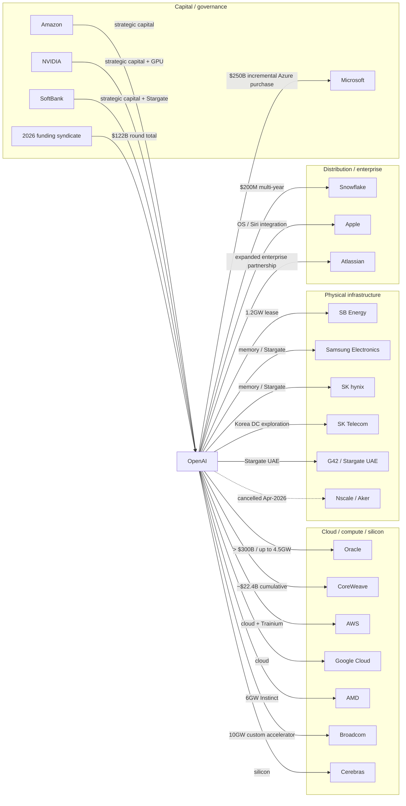
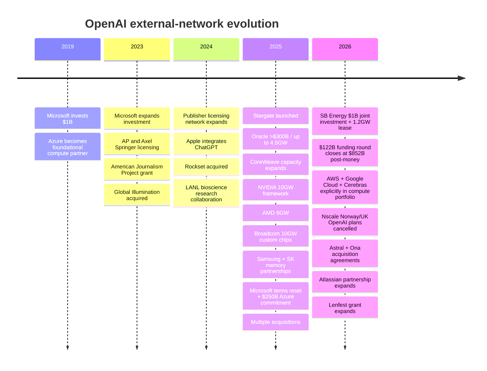
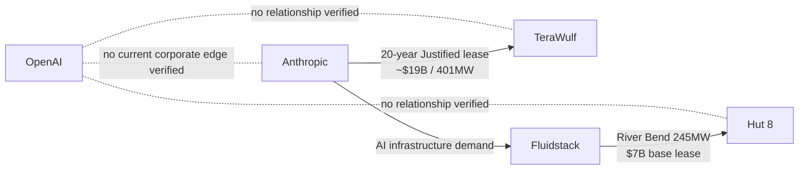
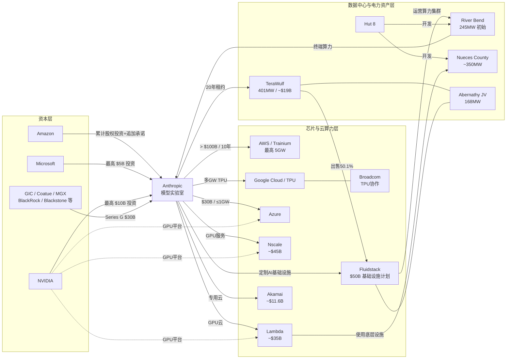

# Model lab关系图

Report: https://reports.instap.net/reports/2026-10-model-lab-network
Date: 2026-10-08
Coverage: complete-research-and-network-data

六家模型组织的资本、算力与全球基础设施网络；整合 OpenAI 与 Anthropic 研究，新增存储、融资、媒体授权、科研及收购关联，区分合同金额、建设容量和已投运资产。


> Integration note: Supplied by the author from drr.md, research date 2026-10-08. Source links and conclusions are attributed to that report and were not independently reverified during integration. Negative findings reflect its search scope.

# OpenAI External Relationship Network — Updated Merge Report

**Research date:** 2026-10-08\
**Target dataset:** `model-lab-network.json`\
**Entity:** OpenAI / OpenAI Group PBC / OpenAI Foundation\
**Purpose:** verifiable relationship records suitable for merging into the existing Model Lab Network dataset.

## Executive summary

The existing Model Lab Network already captures several of OpenAI’s largest compute and capital relationships, including Oracle, CoreWeave, AMD, Broadcom, SoftBank/SB Energy, Stargate UAE, Nscale and the February 2026 strategic investment commitments. However, a fresh review of the baseline JSON, OpenAI’s primary disclosures, counterparties’ official releases, filings, and the Aral research library shows that the OpenAI graph needs several **material additions and status corrections**.

The highest-priority merge changes are:

**First, the February 2026 financing records should be updated rather than duplicated.** OpenAI initially announced $110 billion of strategic commitments—$50 billion from Amazon, $30 billion from NVIDIA and $30 billion from SoftBank—but on **March 31, 2026** it disclosed that the round had actually **closed with $122 billion of committed capital at an $852 billion post-money valuation**, with Microsoft continuing to participate and a large institutional syndicate joining. The $122 billion is the round-level total; it should **not** be added on top of the earlier $110 billion. OpenAI also expanded its undrawn revolving credit facility to approximately $4.7 billion.

**Second, the Microsoft edge is materially more complex than a simple investor/cloud relationship.** The October 28, 2025 definitive agreement left Microsoft as OpenAI’s frontier-model partner, extended key model/product IP rights through 2032, preserved Azure API exclusivity until verified AGI, removed Microsoft’s right of first refusal on new OpenAI compute, and committed OpenAI to purchase an **incremental $250 billion of Azure services**. At recapitalization Microsoft’s holding was valued at roughly **$135 billion**, about **27%** on an as-converted diluted basis at that point.

**Third, Samsung and SK are major missing OpenAI infrastructure edges.** On October 1, 2025, OpenAI made Samsung Electronics and SK hynix strategic memory partners under Stargate, targeting capacity sufficient for **up to 900,000 DRAM wafer starts per month**. OpenAI also signed Korean data-center arrangements with Samsung SDS, Samsung C&T, Samsung Heavy Industries, SK Telecom and Korea’s Ministry of Science and ICT. Samsung SDS separately became an OpenAI-services reseller in Korea. These are not marginal supplier references—they are part of OpenAI’s stated global infrastructure architecture.

**Fourth, several older “potential” Stargate relationships need their status changed.** OpenAI’s July 2025 Norway announcement described Nscale/Aker as a prospective infrastructure partner and OpenAI as a potential initial offtaker; the UK announcement was similarly exploratory. But a September 2026 Bloomberg report reproduced in Aral from Nscale’s S-1 says **OpenAI cancelled the Norway and UK Nscale Stargate plans in April 2026**, with Microsoft taking over Norway and Google reportedly positioned to replace OpenAI in the UK. Those nodes should remain in the historical graph but be marked **cancelled / historical**, not active OpenAI capacity.

**Fifth, OpenAI’s current compute architecture is deliberately multi-provider.** OpenAI itself described its March 2026 infrastructure portfolio as cloud through **Microsoft, Oracle, AWS, CoreWeave and Google Cloud**; silicon through **NVIDIA, AMD, AWS Trainium, Cerebras and OpenAI/Broadcom custom chips**; and data centers through **Oracle, SB Energy and SoftBank**. The graph should therefore stop treating Microsoft/Azure as an exclusive compute relationship even though Azure retains API exclusivity under defined contractual terms.

Finally, the three entities specifically requested require careful treatment. **TeraWulf and Hut 8 do not have a verifiable direct OpenAI relationship in the sources reviewed. Their prominent AI-lab relationships are with Anthropic and its infrastructure partners, not OpenAI.** Anthropic likewise has **no verifiable current corporate partnership, investment or contract with OpenAI**; there is a historical people lineage because Anthropic was founded by former OpenAI personnel, but that is not a current corporate edge. TeraWulf’s 2026 Justified lease is with Anthropic, while Hut 8’s River Bend project is tied to Fluidstack/Anthropic.



## Scope and merge methodology

I treated a relationship as dataset-worthy when it was publicly attributable to OpenAI and met at least one of these tests: material capital exposure; contracted or proposed compute capacity; strategic hardware/supply-chain relationship; strategic product/distribution partnership; content or technology licensing; acquisition; grant; public research collaboration; or a present governance/person overlap. Ordinary customer references and generic API users were excluded unless OpenAI or the counterparty publicly elevated the arrangement into a strategic relationship.

The provided baseline JSON was inspected as the starting point. Its OpenAI records already contain, among others, Oracle, CoreWeave, AMD, AMD warrants, Broadcom, SoftBank/SB Energy, Stargate UAE, Nscale and the February 2026 Amazon/NVIDIA/SoftBank capital commitments.  The proposed actions below therefore use:

**KEEP** — baseline relationship remains substantively correct.\
**UPDATE** — retain the edge but change economics, status or current-progress fields.\
**ADD** — material relationship was not observed among the baseline OpenAI edges parsed for this review.\
**NEGATIVE** — explicit “no verifiable relationship found” control record requested by the user.

For forward-looking or conditional transactions, I do **not** treat announced capacity, warrants, memoranda of understanding, intended investments, or exploratory offtake as equivalent to cash paid or capacity operating. This distinction is especially important for NVIDIA’s 2025 10GW/$100 billion framework, the Nscale projects, AMD warrants, and several Stargate site announcements.

## Updated relationship table

| Merge | Date / range | Counterparty | Amount / scale | Type | Relationship and current progress | Sources |
|---|---|---|---|---|---|---|
| **ADD** | 2019-07-22 | Microsoft | **$1B investment** | investment | Microsoft invested $1B and became OpenAI’s preferred partner for commercializing AI technologies; Azure supercomputing infrastructure was a core component. This is the foundational capital/cloud edge. | [S04](https://openai.com/index/microsoft-invests-in-and-partners-with-openai/)  |
| **ADD / consolidate** | 2023-01-23 | Microsoft | “Multi-billion dollar”; exact primary-source amount unspecified | investment | Expanded multi-year partnership covering additional investment, Azure supercomputing and commercial deployment. Best represented as a historical financing milestone under the broader Microsoft relationship rather than a second unrelated edge. | [S05](https://blogs.microsoft.com/blog/2023/01/23/microsoftandopenaiextendpartnership/)  |
| **UPDATE** | 2025-10-28 onward | Microsoft | **$250B incremental Azure services purchase**; Microsoft stake valued **~$135B / ~27%** at recapitalization | contract | Definitive agreement extended model/product IP rights through 2032, retained Azure API exclusivity until independently verified AGI, removed Microsoft’s compute ROFR, and committed OpenAI to another $250B of Azure services. The ~27% stake is explicitly the recapitalization-date figure, not necessarily the post-March-2026 fully diluted percentage. | [S02](https://openai.com/index/next-chapter-of-microsoft-openai-partnership/), [S03](https://openai.com/our-structure/)  |
| **UPDATE** | 2026-02-27 → 2026-03-31 | Amazon, NVIDIA, SoftBank, Microsoft, a16z, D. E. Shaw Ventures, MGX, TPG, T. Rowe Price-advised accounts, BlackRock-affiliated funds, Blackstone, Coatue, Fidelity, Sequoia, Temasek, Thrive, UC Investments and others | **$122B committed capital; $852B post-money** | investment | Replace/roll up the baseline’s February $110B announcement. Initial anchors were $50B Amazon, $30B NVIDIA, $30B SoftBank; the round subsequently closed at $122B with broader participation. **Do not sum $110B + $122B.** | [S01](https://openai.com/index/accelerating-the-next-phase-ai/)  |
| **ADD** | 2026-03-31 | JPMorgan, Citi, Goldman Sachs, Morgan Stanley, Wells Fargo, Mizuho, RBC, SMBC, UBS, HSBC, Santander | **~$4.7B revolving credit facility; undrawn at close** | contract | OpenAI expanded its revolver to approximately $4.7B. The banking syndicate is an important financing/liquidity edge separate from the equity round. | [S01](https://openai.com/index/accelerating-the-next-phase-ai/)  |
| **ADD** | 2025-01-21 onward | SoftBank, Oracle, MGX | **$500B intended over 4 years; $100B intended immediately** | infrastructure deal | Stargate Project launched as OpenAI’s U.S. AI-infrastructure platform. SoftBank was designated financial lead, OpenAI operational lead, Masayoshi Son chair; Oracle and MGX were initial equity funders. These figures are program ambitions, not equivalent to executed OpenAI purchase contracts. | [S06](https://openai.com/index/announcing-the-stargate-project/)  |
| **UPDATE** | 2025-07 to present | Oracle | **>$300B over five years; up to 4.5GW** | infrastructure deal | Core Stargate/OCI relationship. OpenAI says the Oracle partnership exceeds $300B over five years. Abilene was already operating in 2025; multiple additional sites were announced. A New Mexico component later encountered permitting/financing delays, but that does **not** imply cancellation of the overall Oracle relationship. | [S07](https://openai.com/index/five-new-stargate-sites/), [A3](https://aral.instap.net/reports?topic_id=14425428548582552)  |
| **UPDATE** | 2025-03 → 2025-09-23 and ongoing | CoreWeave | **~$22.4B cumulative contracted capacity** | contract | Initial ~$11.9B agreement was expanded by ~$4B and then up to another $6.5B; the September order runs through May 2031. Aral’s September 2026 UBS report still identifies OpenAI as a major CoreWeave customer, supporting an active-status classification. | [S00](https://reports.instap.net/data/model-lab-network.json), [A4](https://aral.instap.net/reports?topic_id=55521524811245514)  |
| **UPDATE** | 2025-09-22 → 2026 | NVIDIA | 2025 LOI: **≥10GW systems / intended investment up to $100B**; 2026 package included **$30B capital and 5GW dedicated Vera Rubin capacity** | infrastructure deal | The September 2025 announcement was a framework/LOI, not $100B cash received. By February–March 2026 the relationship had been reframed around $30B of strategic capital plus 3GW inference and 2GW training on Vera Rubin. For the graph, keep the 2025 LOI as historical and use the 2026 package as the current state; do not double count them. | [S08](https://openai.com/index/openai-nvidia-systems-partnership/), [S01](https://openai.com/index/accelerating-the-next-phase-ai/)  |
| **KEEP / UPDATE** | 2025-10-06 onward | AMD | Amount unspecified; **6GW** AMD Instinct GPUs | infrastructure deal | Definitive multi-generation GPU agreement. First 1GW of MI450 systems was scheduled for 2H26. As of this research date the deployment window has begun, but no primary-source completion announcement was found in this review. | [S09](https://openai.com/index/openai-amd-strategic-partnership/)  |
| **KEEP** | 2025-10-06 onward | AMD | Warrants for **up to 160M AMD shares** | investment | Equity-linked component tied to deployment, commercial and share-price milestones. This is **not** a cash investment and should not be added to infrastructure contract value. | [S09](https://openai.com/index/openai-amd-strategic-partnership/)  |
| **KEEP / UPDATE** | 2025-10-13 → 2029 | Broadcom | Amount unspecified; **10GW custom accelerators** | infrastructure deal | OpenAI designs the accelerators; Broadcom co-develops and deploys racks/networking. Deployment was scheduled to begin in 2H26 and run through 2029. OpenAI’s March 2026 disclosure continued to identify the OpenAI/Broadcom chip as part of its silicon strategy. | [S10](https://openai.com/index/openai-and-broadcom-announce-strategic-collaboration/), [S01](https://openai.com/index/accelerating-the-next-phase-ai/)  |
| **ADD / consolidate** | 2026-02-27 onward | Amazon / AWS | Strategic capital plus cloud distribution/compute; cloud-contract amount unspecified | partnership | In addition to Amazon’s strategic investment, OpenAI identifies AWS as one of its core cloud platforms and AWS Trainium as part of its silicon portfolio. Treat capital and compute/distribution as distinct economic dimensions even if represented under one entity node. | [S01](https://openai.com/index/accelerating-the-next-phase-ai/)  |
| **ADD** | By 2026-03-31 | Google Cloud | unspecified | infrastructure deal | OpenAI explicitly lists Google Cloud among its current cloud infrastructure providers. This is a significant change from an Azure-centric historical model and should be represented as an active compute edge. | [S01](https://openai.com/index/accelerating-the-next-phase-ai/)  |
| **ADD** | By 2026-03-31 | Cerebras | unspecified | partnership | OpenAI publicly lists Cerebras among the silicon platforms in its infrastructure strategy. Public terms were not specified in the source reviewed. | [S01](https://openai.com/index/accelerating-the-next-phase-ai/)  |
| **UPDATE / ADD investment edge** | 2026-01-09 onward | SB Energy, SoftBank | **$1B total equity investment: $500M OpenAI + $500M SoftBank** | investment | OpenAI and SoftBank each invested $500M in SB Energy. This is a separate equity relationship and should not be collapsed into the Stargate site-development edge. | [S12](https://openai.com/index/stargate-sb-energy-partnership/)  |
| **UPDATE** | 2026-01-09 onward | SB Energy | **1.2GW data-center lease**; financial amount unspecified | infrastructure deal | OpenAI selected SB Energy to build and operate the Milam County campus and signed a 1.2GW lease. SB Energy also became an OpenAI customer and the parties formed a non-exclusive preferred data-center partnership. Facilities were described as under construction with service beginning in 2026. | [S12](https://openai.com/index/stargate-sb-energy-partnership/)  |
| **ADD — high priority** | 2025-10-01 onward | Samsung Electronics, SK hynix | Financial amount unspecified; target support for **up to 900,000 DRAM wafer starts/month** | infrastructure deal | Samsung and SK became strategic Stargate memory partners and agreed to accelerate advanced-memory capacity for OpenAI. Both also planned broader internal deployment of ChatGPT Enterprise/API capabilities. This is one of the clearest omissions from the current graph. | [S13](https://openai.com/index/samsung-and-sk-join-stargate/), [S14](https://news.samsung.com/global/samsung-and-openai-announce-strategic-partnership-to-accelerate-advancements-in-global-ai-infrastructure), [A5](https://aral.instap.net/reports?topic_id=82258815548451152)  |
| **ADD** | 2025-10-01 onward | Samsung SDS | unspecified | partnership | LOI covering AI-data-center design/development/operation; Samsung SDS also signed a reseller partnership for OpenAI services in Korea. | [S14](https://news.samsung.com/global/samsung-and-openai-announce-strategic-partnership-to-accelerate-advancements-in-global-ai-infrastructure)  |
| **ADD** | 2025-10-01 onward | Samsung C&T, Samsung Heavy Industries | unspecified | research collaboration | Parties agreed to assess additional AI-data-center capacity and explore floating data centers, floating power plants and control centers. This remains exploratory rather than committed deployed capacity. | [S14](https://news.samsung.com/global/samsung-and-openai-announce-strategic-partnership-to-accelerate-advancements-in-global-ai-infrastructure)  |
| **ADD** | 2025-10-01 onward | SK Telecom | unspecified | infrastructure deal | OpenAI and SK Telecom agreed to explore construction of an AI data center in Korea. Status remains exploration/MoU-stage in the primary announcement. | [S13](https://openai.com/index/samsung-and-sk-join-stargate/)  |
| **ADD** | 2025-10-01 onward | Korea Ministry of Science and ICT | unspecified | partnership | MoU to evaluate AI-data-center opportunities outside the Seoul metropolitan area. Government/infrastructure-policy edge rather than a commercial capacity contract. | [S13](https://openai.com/index/samsung-and-sk-join-stargate/)  |
| **UPDATE** | 2025-05-22 onward | G42, Oracle, NVIDIA, Cisco, SoftBank | 2026 reporting: **~$30B first 1GW phase**; official 2025 announcement: 1GW cluster with first 200MW targeted for 2026 | infrastructure deal | Stargate UAE remains strategically active. A September 2026 Reuters report preserved in Aral says the broader 5GW masterplan is being reconsidered/distributed geographically because of security threats, while the first 1GW phase is expected to continue. Mark **active but design/timeline under review**. | [S15](https://openai.com/index/introducing-stargate-uae/), [A2](https://aral.instap.net/reports?topic_id=22258815181252811)  |
| **UPDATE → cancelled** | 2025-07-31 → 2026-04 | Nscale, Aker | Planned 230MW initially; target 100k GPUs by end-2026; amount unspecified | infrastructure deal | Original Stargate Norway announcement made OpenAI a prospective initial offtaker. Nscale’s later S-1/Bloomberg reporting says OpenAI **cancelled the Norway plan in April 2026**, with Microsoft agreeing to take it over. Keep as historical, status `cancelled`. | [S16](https://openai.com/index/introducing-stargate-norway/), [A1](https://aral.instap.net/reports?topic_id=55521525825288524)  |
| **UPDATE → cancelled / replaced** | 2025-09-16 → 2026-04 | Nscale, NVIDIA | Exploratory **8k GPUs, potential 31k** | infrastructure deal | Stargate UK involved exploratory OpenAI offtake rather than a firm take-or-pay commitment. Nscale’s later S-1/Bloomberg reporting says OpenAI cancelled its Nscale UK plan in April 2026 and Google was expected to take its place. | [S17](https://openai.com/index/introducing-stargate-uk/), [A1](https://aral.instap.net/reports?topic_id=55521525825288524)  |
| **KEEP** | 2026-02-02 onward | Snowflake | **$200M multi-year** | partnership | Multi-year partnership to embed OpenAI models/products into Snowflake’s enterprise-data environment. Baseline already captures this material commercial edge. | [S00](https://reports.instap.net/data/model-lab-network.json)  |
| **ADD / update prior 2023 tie** | 2023 → 2026-10-06 | Atlassian | unspecified | partnership | Partnership expanded in October 2026: GPT‑6 family/GPT‑6 Astra/GPT‑5.6 integrated across Atlassian/Rovo; more than 3,000 Atlassian developers use Codex; Atlassian expanded ChatGPT Enterprise, while OpenAI itself uses Jira. Active and unusually reciprocal enterprise relationship. | [S19](https://openai.com/index/atlassian-partnership/)  |
| **ADD** | 2024-06-10 onward | Apple | unspecified | partnership | Apple integrated ChatGPT into iOS, iPadOS and macOS, including Siri and Writing Tools. This is a distribution/product-integration edge, not a disclosed capital relationship. | [S20](https://openai.com/index/openai-and-apple-announce-partnership/)  |
| **ADD** | 2026-08-18 onward | Code.org / CodeAI | unspecified | partnership | Joint AI-literacy initiative covering students and educators, an advisory council, Hour of AI and Builders Challenge programs over the following year. | [S21](https://openai.com/index/partnering-with-codeai/)  |
| **ADD** | 2023-07-13 onward | Associated Press | undisclosed | licensing | AP licensed part of its text archive, including material dating back to 1985, for OpenAI use; AP gained access to OpenAI technology. | [S26](https://www.ap.org/media-center/press-releases/2023/ap-open-ai-agree-to-share-select-news-content-and-technology-in-new-collaboration/)  |
| **ADD** | 2023-12-13 onward | Axel Springer | undisclosed | licensing | Global partnership covers current/archival content from brands including POLITICO, Business Insider, BILD and WELT, with attribution and training rights. | [S27](https://www.axelspringer.com/en/ax-press-release/axel-springer-and-openai-partner-to-deepen-beneficial-use-of-ai-in-journalism)  |
| **ADD** | 2024-03-13 onward | Le Monde, Prisa Media | undisclosed | licensing | Content partnership covering ChatGPT responses and model training, including Le Monde and Prisa properties. | [S28](https://openai.com/index/global-news-partnerships-le-monde-and-prisa-media/)  |
| **ADD** | 2024-04-29 onward | Financial Times | undisclosed | licensing | Strategic partnership and content licensing, with attributed FT summaries/links in ChatGPT and product collaboration. FT was also already a ChatGPT Enterprise customer. | [S29](https://aboutus.ft.com/press_release/financial-times-announces-strategic-partnership-with-openai)  |
| **ADD** | 2024-05 | Reddit | undisclosed | licensing | OpenAI received access to Reddit’s real-time structured content through its Data API; Reddit gained OpenAI-powered features and OpenAI became an advertising partner. | [S38](https://www.redditinc.com/blog/reddit-and-openai-build-partnership)  |
| **ADD** | 2024-05-22 onward | News Corp | undisclosed | licensing | Multi-year content relationship covering current and archival material across major News Corp publications for OpenAI products. | [S30](https://openai.com/index/news-corp-and-openai-sign-landmark-multi-year-global-partnership/)  |
| **ADD** | 2024-05-29 onward | The Atlantic | undisclosed | licensing | Content and product partnership focused on attribution/discoverability and access to OpenAI technology for publisher experiments. | [S31](https://www.theatlantic.com/press-releases/archive/2024/05/atlantic-and-openai-announce-strategic-content-product-partnership/678558/)  |
| **ADD** | 2024-05-29 onward | Vox Media | undisclosed | licensing | OpenAI may use Vox archives to improve ChatGPT while Vox uses OpenAI technology in publishing products. | [S32](https://www.voxmedia.com/2024/5/29/24167472/vox-media-and-openai-form-strategic-content-and-product-partnership)  |
| **ADD** | 2024-06-27 onward | TIME | undisclosed | licensing | Multi-year content agreement covering TIME’s current content and century-scale archive for attributed use in OpenAI products. | [S33](https://openai.com/index/time-and-openai-announce-strategic-content-partnership/)  |
| **ADD** | 2024-08-20 onward | Condé Nast | undisclosed | licensing | Partnership enables OpenAI products to surface content from Condé Nast brands with attribution/links. | [S34](https://openai.com/index/conde-nast/)  |
| **ADD** | 2024-10-08 onward | Hearst | undisclosed | licensing | Content partnership covering more than 20 magazine brands and more than 40 newspapers, with attribution and links in OpenAI products. | [S35](https://www.hearst.com/-/hearst-and-openai-announce-strategic-content-partnership)  |
| **ADD** | 2024-12-04 onward | Future plc | undisclosed | licensing | Strategic content partnership covering Future’s portfolio of 200+ media brands for ChatGPT content experiences. | [S36](https://openai.com/index/future-partnership/)  |
| **ADD** | 2025-02-10 onward | Schibsted Media | undisclosed | licensing | Content from VG, Aftenposten, Aftonbladet and Svenska Dagbladet made available for attributed ChatGPT experiences. | [S37](https://openai.com/index/schibsted-media-partnership/)  |
| **ADD** | 2023-07-18 onward | American Journalism Project | **$5M cash grant + up to $5M API credits** | grant | OpenAI supported AJP’s local-news AI work through a $5M grant plus up to $5M of API credits. | [S22](https://www.theajp.org/news-insights/press-releases/openai-commits-5-million-to-the-american-journalism-project-to-support-ai-powered-local-news/)  |
| **ADD** | 2026-09-28 onward | Lenfest Institute / Lenfest AI Collaborative | **$5M commitment + up to $5M software credits/engineering support** | grant | OpenAI doubled down on Lenfest’s journalism-AI initiatives through new cash support and up to an equivalent amount of software/engineering support. | [S23](https://openai.com/index/lenfest-ai-collaborative-expansion/)  |
| **ADD** | 2024-07-10 onward | Los Alamos National Laboratory | unspecified | research collaboration | Joint bioscience safety research evaluates how multimodal frontier models affect expert and novice performance in physical laboratory tasks and dual-use-risk evaluation. | [S24](https://openai.com/index/openai-and-los-alamos-national-laboratory-work-together/)  |
| **ADD / expand research edge** | 2025-01-30 onward | Los Alamos, Lawrence Livermore, Sandia National Laboratories, Microsoft | unspecified | research collaboration | OpenAI signed an agreement making reasoning models available to approximately 15,000 national-lab scientists, including deployment on the Venado NVIDIA supercomputer at LANL; work includes science, cybersecurity and carefully reviewed national-security use cases. | [S25](https://openai.com/index/strengthening-americas-ai-leadership-with-the-us-national-laboratories/)  |
| **ADD** | 2023-08-16 | Global Illumination | undisclosed | acquisition | OpenAI acquired the company; its full team joined OpenAI to work on core products including ChatGPT. Completed. | [S39](https://openai.com/index/openai-acquires-global-illumination/)  |
| **ADD** | 2024-06-21 | Rockset | undisclosed | acquisition | Acquired real-time analytics/database company Rockset; team joined OpenAI and technology was slated for integration into retrieval infrastructure. Completed. | [S40](https://openai.com/index/openai-acquires-rockset/)  |
| **ADD** | 2025-05-21 / 2025-07-09 update | io Products / Jony Ive’s design team | Primary source does not state consideration | acquisition | io Products’ team merged into OpenAI; Jony Ive/LoveFrom remained independent but continued deep design/creative collaboration. Treat the corporate acquisition and LoveFrom relationship separately conceptually even if displayed around one node. | [S41](https://openai.com/sam-and-jony/)  |
| **ADD** | 2025-09-02 | Statsig | Primary announcement: unspecified | acquisition | OpenAI announced acquisition of Statsig and planned for founder Vijaye Raji to become CTO of Applications. Announcement was subject to approval; later closing was not separately re-verified in this research pass. | [S42](https://openai.com/index/vijaye-raji-to-become-cto-of-applications-with-acquisition-of-statsig/)  |
| **ADD** | 2025-10-23 | Software Applications Inc. / Sky | undisclosed | acquisition | OpenAI acquired the maker of Sky for Mac; team joined OpenAI and Sky technology is intended for ChatGPT integration. OpenAI disclosed that a fund associated with Sam Altman held a passive investment, with independent board committees approving the deal. | [S43](https://openai.com/index/openai-acquires-software-applications-incorporated/)  |
| **ADD** | 2025-12-03 | Neptune.ai | undisclosed | acquisition | Definitive acquisition agreement after prior close collaboration on frontier-training experiment tracking. Public announcement described intended deep integration into OpenAI’s training stack. | [S44](https://openai.com/index/openai-to-acquire-neptune/)  |
| **ADD** | 2026-03-09 | Promptfoo | undisclosed | acquisition | OpenAI announced acquisition of Promptfoo to strengthen security/evaluation capabilities around OpenAI Frontier; announcement-stage transaction in the source reviewed. | [S45](https://openai.com/index/openai-to-acquire-promptfoo/)  |
| **ADD** | 2026-03-19 | Astral | undisclosed | acquisition | OpenAI agreed to acquire the company behind `uv`, `Ruff` and `ty` for integration with Codex. The primary announcement explicitly says closing is subject to customary conditions and regulatory approval; no later closing confirmation was located in this review. | [S46](https://openai.com/index/openai-to-acquire-astral/)  |
| **ADD** | 2026-06-11 | Ona | undisclosed | acquisition | OpenAI agreed to acquire Ona’s secure cloud-execution/orchestration technology for Codex. The parties remained separate pending customary closing and regulatory approvals at announcement. | [S47](https://openai.com/index/openai-to-acquire-ona/)  |
| **ADD** | Current as of 2026-10-08 | Sierra / Bret Taylor | none | board overlap | Bret Taylor is Chair of OpenAI’s board and co-founder of Sierra, creating a current people/governance overlap between two AI companies. This does **not** by itself imply a commercial OpenAI–Sierra contract. | [S03](https://openai.com/our-structure/), [S48](https://sierra.ai/author/bret-taylor)  |
| **NEGATIVE / historical people link only** | Through 2026-10-08 | Anthropic | none | other | **No verifiable current corporate relationship found.** Anthropic has historical people lineage to OpenAI through former OpenAI personnel, but the searches found no current OpenAI↔Anthropic investment, partnership, contract, infrastructure deal or licensing arrangement. Their 2026 infrastructure/deployment programs are separate and competitive. | [[S51]], [S52](https://www.anthropic.com/news/anthropic-invests-50-billion-in-american-ai-infrastructure)  |
| **NEGATIVE** | Through 2026-10-08 | TeraWulf | none | other | **no verifiable relationship found.** TeraWulf’s material frontier-model lease found in this research is with **Anthropic**, not OpenAI: a 20-year Justified-campus lease with roughly $19B contracted revenue and 401MW critical IT load. | [S49](https://investors.terawulf.com/news-events/press-releases/detail/142/terawulf-announces-anthropic-lease-at-justified-data-campus-and-sale-of-majority-interest-in-abernathy-joint-venture-to-fluidstack)  |
| **NEGATIVE** | Through 2026-10-08 | Hut 8 | none | other | **no verifiable relationship found.** Hut 8’s River Bend AI infrastructure is tied to Fluidstack/Anthropic; the announced Fluidstack lease was 245MW with $7B base-term revenue and Google financial support. No OpenAI counterparty was identified. | [S50](https://www.hut8.com/news-insights/press-releases/hut-8-announces-ai-infrastructure-partnership-with-anthropic-and-fluidstack)  |

A useful way to interpret the chronology is that OpenAI has progressively moved from **one strategic cloud partner** toward a highly diversified, vertically integrated infrastructure network:



## Critical status corrections and network interpretation

The largest analytical mistake the network could make is to sum headline numbers as though they were homogeneous liabilities or cash transactions. They are not. The `$500B Stargate`, `>$300B Oracle`, `$122B financing`, `$250B Azure purchase`, NVIDIA’s old `up to $100B intended investment`, CoreWeave’s `$22.4B`, and capacity figures in gigawatts belong to different economic categories and overlapping time horizons. They must remain separate attributes rather than a single “OpenAI commitments” total.

The more revealing structural change is **supplier diversification without abandoning Microsoft**. In October 2025 Microsoft surrendered its right of first refusal on OpenAI compute while retaining powerful IP/API rights; by March 2026 OpenAI explicitly described a cloud portfolio spanning Microsoft, Oracle, AWS, CoreWeave and Google Cloud. That suggests OpenAI is managing compute more like a hyperscale buyer with a portfolio of capacity and silicon suppliers than like a captive Azure tenant.

The **Samsung/SK relationship is strategically more important than a routine memory-purchase edge**. OpenAI is effectively moving one layer deeper into semiconductor capacity planning: Samsung Electronics and SK hynix are being asked to plan accelerated DRAM supply against OpenAI’s long-run infrastructure needs, while Samsung’s broader conglomerate participates in data centers, reseller distribution and even floating-data-center research. Samsung’s own release describes it as a “strategic memory partner,” not merely a spot supplier.

The same “deeper into the stack” pattern appears with Broadcom and AMD. OpenAI is designing its own accelerator with Broadcom and received milestone-linked AMD warrants alongside a 6GW deployment agreement. That means OpenAI’s network contains not just customer→supplier edges but **co-design, incentive alignment and quasi-vertical-integration edges**.

The most important negative update is **Nscale**. The July/September 2025 announcements were useful evidence of OpenAI exploring European Stargate capacity, but they should no longer be presented as active OpenAI capacity. Aral’s September 21, 2026 report reproducing Bloomberg’s reading of Nscale’s S-1 states that OpenAI cancelled its Norway and UK Nscale plans in **April 2026**. The same report says Microsoft took over Norway, while Google was expected to succeed OpenAI in the UK. This is exactly the kind of lifecycle update a static relationship graph tends to miss. [A1](https://aral.instap.net/reports?topic_id=55521525825288524)

The second important execution-risk edge is Oracle’s **Project Jupiter / New Mexico** component. OpenAI’s overall Oracle relationship remains active, but Aral reporting on September 24 describes Oracle issuing a force-majeure notice concerning a 2.45GW New Mexico campus after natural-gas-pipeline permitting setbacks, with an associated $18B financing trading below par and outside estimates pushing first power later than underwriting assumptions. That belongs in the **current progress / risk** field of the Oracle relation, not as evidence that the whole Oracle/OpenAI contract is cancelled. [A3](https://aral.instap.net/reports?topic_id=14425428548582552)

Stargate UAE likewise needs nuance. OpenAI’s original announcement established the G42/Oracle/NVIDIA/Cisco/SoftBank relationship and the planned 1GW cluster. September 2026 Reuters reporting carried by Aral indicates the broader 5GW UAE campus concept was being reconsidered after regional attacks, potentially shifting from one large campus to a distributed network with additional physical protection. The first 1GW phase was reported as continuing. The correct state is therefore **active / configuration under review**, not cancelled.  [A2](https://aral.instap.net/reports?topic_id=22258815181252811)

```mermaid
flowchart TB
    Demand["OpenAI model + product demand"]

    Demand --> Capital["Capital<br/>$122B 2026 round"]
    Demand --> Cloud["Cloud portfolio"]
    Demand --> Silicon["Silicon portfolio"]
    Demand --> DC["Physical data centers"]
    Demand --> Memory["Memory / semiconductor capacity"]
    Demand --> Distribution["Distribution + enterprise"]
    Demand --> Content["Content / data rights"]
    Demand --> MNA["M&A / capability absorption"]

    Cloud --> MS["Microsoft"]
    Cloud --> O["Oracle"]
    Cloud --> AWS2["AWS"]
    Cloud --> CW["CoreWeave"]
    Cloud --> GC["Google Cloud"]

    Silicon --> N["NVIDIA"]
    Silicon --> A["AMD"]
    Silicon --> T["AWS Trainium"]
    Silicon --> C["Cerebras"]
    Silicon --> B["Broadcom custom chip"]

    DC --> SBE2["SB Energy"]
    DC --> SB["SoftBank"]
    DC --> G["G42 / UAE"]

    Memory --> SS["Samsung"]
    Memory --> SK["SK hynix"]

    Distribution --> Apple["Apple"]
    Distribution --> Atl["Atlassian"]
    Distribution --> Snow["Snowflake"]

    Content --> Media["AP / FT / News Corp /<br/>Atlantic / Vox / TIME / etc."]

    MNA --> Dev["Astral / Ona / Statsig"]
    MNA --> Data["Rockset / Neptune"]
    MNA --> UX["io / Sky"]

    NS["Nscale"] -. "cancelled Apr 2026" .-> DC
```



## Anthropic, TeraWulf and Hut 8 validation

The user’s original concern about Anthropic–TeraWulf–Hut 8 connections is valid for the broader **Model Lab Network**, but those links should **not** be attached to the OpenAI node.

### Anthropic

I found **no verifiable current corporate OpenAI↔Anthropic relationship** through October 8, 2026. The meaningful connection is historical human-capital lineage: Anthropic was founded by former OpenAI personnel. That is worth representing in a broad genealogy/people layer, but it should not be rendered as a current investment, contract or infrastructure relationship.

Importantly, 2026 reporting shows OpenAI and Anthropic pursuing **separate** deployment/infrastructure vehicles rather than a joint venture.

**Recommended graph treatment:** historical `other / people lineage`, current status `no current corporate relationship verified`.

### TeraWulf

**no verifiable relationship found** between TeraWulf and OpenAI.

TeraWulf announced a **20-year Anthropic lease** at the Justified Data Campus in July 2026, representing approximately **$19 billion of contracted revenue** and **401MW of critical IT load**, with initial capacity targeted for the second half of 2027 and full ramp in early 2028. That is a strong **Anthropic → TeraWulf** infrastructure edge, not an OpenAI edge.

The Aral full-text search for `OpenAI TeraWulf` also returned no report records.

### Hut 8

**no verifiable relationship found** between Hut 8 and OpenAI.

Hut 8’s River Bend relationship is an AI-infrastructure deal with **Fluidstack**, associated with Anthropic capacity. Hut 8 announced a 15-year lease representing **$7 billion of base-term revenue for 245MW**, with renewal potential taking total contract value higher and Google providing a financial backstop. Independent October 2026 reporting also describes the site in the context of Fluidstack/Anthropic computing demand.

**Recommended Model Lab graph:**



The investment implication is important: **TeraWulf and Hut 8 are not generic “frontier-lab compute” proxies in the same way as CoreWeave or Oracle. Their currently verified lab concentration is materially more Anthropic-linked.** By contrast, CoreWeave has a directly documented OpenAI customer relationship, and Oracle’s giant contracted infrastructure program is explicitly tied to OpenAI/Stargate.

## JSON export

The following export mirrors the cited records above. `unspecified` is used whenever I could not verify a monetary value in a sufficiently reliable source. Conditional capacities, warrants and intended investments are explicitly labeled so downstream code does not mistakenly treat them as cash consideration.

```json
[
  {
    "date": "2019-07-22",
    "amount": "USD 1 billion",
    "counterparties": ["OpenAI", "Microsoft"],
    "relationship_type": "investment",
    "summary": "Microsoft invested $1 billion in OpenAI and became a preferred commercialization and Azure supercomputing partner.",
    "current_status_progress": "Historical foundation of the still-active Microsoft relationship; subsequently expanded and renegotiated.",
    "sources": [
      "https://openai.com/index/microsoft-invests-in-and-partners-with-openai/"
    ]
  },
  {
    "date": "2023-01-23",
    "amount": "multi-billion USD; exact primary-source amount unspecified",
    "counterparties": ["OpenAI", "Microsoft"],
    "relationship_type": "investment",
    "summary": "OpenAI and Microsoft expanded their multi-year partnership through additional investment, Azure compute and commercial deployment.",
    "current_status_progress": "Superseded in important respects by the October 2025 definitive agreement but remains part of the financing history.",
    "sources": [
      "https://blogs.microsoft.com/blog/2023/01/23/microsoftandopenaiextendpartnership/"
    ]
  },
  {
    "date": "2025-10-28 onward",
    "amount": "USD 250 billion incremental Azure services commitment; Microsoft investment valued at approximately USD 135 billion at recapitalization",
    "counterparties": ["OpenAI", "Microsoft"],
    "relationship_type": "contract",
    "summary": "Definitive partnership reset extended key Microsoft model/product IP rights through 2032, retained Azure API exclusivity until verified AGI, removed Microsoft's compute right of first refusal, and committed OpenAI to an incremental $250 billion of Azure services.",
    "current_status_progress": "Active. Microsoft remained a major investor and participated in OpenAI's March 2026 financing.",
    "sources": [
      "https://openai.com/index/next-chapter-of-microsoft-openai-partnership/",
      "https://openai.com/our-structure/"
    ]
  },
  {
    "date": "2026-02-27 to 2026-03-31",
    "amount": "USD 122 billion committed capital at USD 852 billion post-money valuation",
    "counterparties": [
      "OpenAI",
      "Amazon",
      "NVIDIA",
      "SoftBank",
      "Microsoft",
      "a16z",
      "D. E. Shaw Ventures",
      "MGX",
      "TPG",
      "T. Rowe Price-advised accounts",
      "BlackRock-affiliated funds",
      "Blackstone",
      "Coatue",
      "Fidelity Management & Research",
      "Sequoia Capital",
      "Temasek",
      "Thrive Capital",
      "UC Investments",
      "other disclosed institutional investors"
    ],
    "relationship_type": "investment",
    "summary": "OpenAI closed a $122 billion funding round. The earlier February strategic announcement included $50 billion from Amazon, $30 billion from NVIDIA and $30 billion from SoftBank; the March closing added broader participation.",
    "current_status_progress": "Closed March 31, 2026. The $122 billion total supersedes the earlier $110 billion announcement and should not be added to it.",
    "sources": [
      "https://openai.com/index/accelerating-the-next-phase-ai/"
    ]
  },
  {
    "date": "2026-03-31",
    "amount": "approximately USD 4.7 billion revolving credit facility; undrawn at close",
    "counterparties": ["OpenAI", "JPMorgan Chase", "Citi", "Goldman Sachs", "Morgan Stanley", "Wells Fargo", "Mizuho", "RBC", "SMBC", "UBS", "HSBC", "Santander"],
    "relationship_type": "contract",
    "summary": "Global bank syndicate supports OpenAI's expanded revolving credit facility.",
    "current_status_progress": "Facility was undrawn at the March 2026 financing close.",
    "sources": [
      "https://openai.com/index/accelerating-the-next-phase-ai/"
    ]
  },
  {
    "date": "2025-01-21 onward",
    "amount": "USD 500 billion intended over four years; USD 100 billion intended immediately",
    "counterparties": ["OpenAI", "SoftBank", "Oracle", "MGX"],
    "relationship_type": "infrastructure deal",
    "summary": "Stargate Project established a large-scale U.S. AI infrastructure platform, with SoftBank as financial lead and OpenAI as operational lead.",
    "current_status_progress": "Active umbrella program. Program-level investment ambitions should not be treated as a single executed OpenAI contract.",
    "sources": [
      "https://openai.com/index/announcing-the-stargate-project/"
    ]
  },
  {
    "date": "2025-07 onward",
    "amount": "more than USD 300 billion over five years; up to 4.5 GW",
    "counterparties": ["OpenAI", "Oracle"],
    "relationship_type": "infrastructure deal",
    "summary": "OpenAI contracted major Oracle Cloud/Stargate capacity across multiple U.S. data-center sites.",
    "current_status_progress": "Active overall. Abilene entered operation; the New Mexico Project Jupiter component later encountered permitting and financing delays.",
    "sources": [
      "https://openai.com/index/five-new-stargate-sites/",
      "https://aral.instap.net/reports?topic_id=14425428548582552",
      "https://aral.instap.net/reports?topic_id=82258281182885242"
    ]
  },
  {
    "date": "2025-03 to 2025-09-23 and ongoing",
    "amount": "approximately USD 22.4 billion cumulative contracted capacity",
    "counterparties": ["OpenAI", "CoreWeave"],
    "relationship_type": "contract",
    "summary": "OpenAI progressively expanded reserved CoreWeave cloud capacity through multiple agreements, including a September 2025 order of up to $6.5 billion.",
    "current_status_progress": "Active; September order extends through May 2031. 2026 sell-side research continues to identify OpenAI as a major CoreWeave customer.",
    "sources": [
      "https://reports.instap.net/data/model-lab-network.json",
      "https://aral.instap.net/reports?topic_id=55521524811245514"
    ]
  },
  {
    "date": "2025-09-22 to 2026",
    "amount": "2025 framework: intended investment up to USD 100 billion and at least 10 GW; 2026 strategic package included USD 30 billion investment and 5 GW dedicated Vera Rubin capacity",
    "counterparties": ["OpenAI", "NVIDIA"],
    "relationship_type": "infrastructure deal",
    "summary": "OpenAI and NVIDIA established a large systems/investment framework; subsequent 2026 arrangements reframed the relationship around strategic equity and dedicated training/inference capacity.",
    "current_status_progress": "Active. Treat the 2025 $100 billion figure as an intended framework, not cash received, and avoid double counting against the 2026 package.",
    "sources": [
      "https://openai.com/index/openai-nvidia-systems-partnership/",
      "https://openai.com/index/accelerating-the-next-phase-ai/"
    ]
  },
  {
    "date": "2025-10-06 onward",
    "amount": "unspecified; 6 GW capacity",
    "counterparties": ["OpenAI", "AMD"],
    "relationship_type": "infrastructure deal",
    "summary": "Definitive multi-generation agreement for 6 GW of AMD Instinct GPUs.",
    "current_status_progress": "First 1 GW of MI450 systems was scheduled for deployment in the second half of 2026; no separate completion announcement was identified in this review.",
    "sources": [
      "https://openai.com/index/openai-amd-strategic-partnership/"
    ]
  },
  {
    "date": "2025-10-06 onward",
    "amount": "warrants for up to 160 million AMD shares",
    "counterparties": ["OpenAI", "AMD"],
    "relationship_type": "investment",
    "summary": "AMD issued OpenAI milestone-linked warrants tied to deployments, commercial outcomes and share-price milestones.",
    "current_status_progress": "Conditional equity instrument; not equivalent to cash consideration.",
    "sources": [
      "https://openai.com/index/openai-amd-strategic-partnership/"
    ]
  },
  {
    "date": "2025-10-13 to 2029",
    "amount": "unspecified; 10 GW custom accelerator deployment",
    "counterparties": ["OpenAI", "Broadcom"],
    "relationship_type": "infrastructure deal",
    "summary": "OpenAI designs custom accelerators while Broadcom co-develops and deploys accelerator and networking systems.",
    "current_status_progress": "Deployment scheduled from the second half of 2026 through the end of 2029; OpenAI still listed its Broadcom chip in its March 2026 infrastructure strategy.",
    "sources": [
      "https://openai.com/index/openai-and-broadcom-announce-strategic-collaboration/",
      "https://openai.com/index/accelerating-the-next-phase-ai/"
    ]
  },
  {
    "date": "2026-02-27 onward",
    "amount": "strategic investment included in 2026 funding round; cloud economics unspecified",
    "counterparties": ["OpenAI", "Amazon", "AWS"],
    "relationship_type": "partnership",
    "summary": "Strategic relationship spanning Amazon investment, AWS cloud capacity/distribution and AWS Trainium silicon.",
    "current_status_progress": "Active; OpenAI lists AWS among its core cloud providers and Trainium among its silicon platforms.",
    "sources": [
      "https://openai.com/index/accelerating-the-next-phase-ai/"
    ]
  },
  {
    "date": "by 2026-03-31",
    "amount": "unspecified",
    "counterparties": ["OpenAI", "Google Cloud"],
    "relationship_type": "infrastructure deal",
    "summary": "Google Cloud is explicitly included in OpenAI's multi-cloud infrastructure portfolio.",
    "current_status_progress": "Active as of OpenAI's March 2026 infrastructure disclosure.",
    "sources": [
      "https://openai.com/index/accelerating-the-next-phase-ai/"
    ]
  },
  {
    "date": "by 2026-03-31",
    "amount": "unspecified",
    "counterparties": ["OpenAI", "Cerebras"],
    "relationship_type": "partnership",
    "summary": "OpenAI explicitly lists Cerebras among the silicon platforms supporting its infrastructure strategy.",
    "current_status_progress": "Active relationship disclosed by OpenAI; detailed commercial terms unspecified.",
    "sources": [
      "https://openai.com/index/accelerating-the-next-phase-ai/"
    ]
  },
  {
    "date": "2026-01-09 onward",
    "amount": "USD 1 billion total equity investment; USD 500 million OpenAI and USD 500 million SoftBank",
    "counterparties": ["OpenAI", "SoftBank", "SB Energy"],
    "relationship_type": "investment",
    "summary": "OpenAI and SoftBank each invested $500 million in SB Energy.",
    "current_status_progress": "Active equity relationship separate from the data-center lease.",
    "sources": [
      "https://openai.com/index/stargate-sb-energy-partnership/"
    ]
  },
  {
    "date": "2026-01-09 onward",
    "amount": "financial amount unspecified; 1.2 GW lease",
    "counterparties": ["OpenAI", "SB Energy"],
    "relationship_type": "infrastructure deal",
    "summary": "OpenAI selected SB Energy to build and operate the Milam County data-center campus and signed a 1.2 GW lease.",
    "current_status_progress": "Facilities described as under construction with service beginning in 2026; SB Energy also became an OpenAI customer.",
    "sources": [
      "https://openai.com/index/stargate-sb-energy-partnership/"
    ]
  },
  {
    "date": "2025-10-01 onward",
    "amount": "unspecified; advanced-memory capacity targeting up to 900,000 DRAM wafer starts per month",
    "counterparties": ["OpenAI", "Samsung Electronics", "SK hynix"],
    "relationship_type": "infrastructure deal",
    "summary": "Samsung Electronics and SK hynix became strategic memory partners for Stargate and agreed to accelerate advanced-memory production supporting OpenAI infrastructure.",
    "current_status_progress": "Active strategic partnerships; detailed purchase values and allocation remain unspecified.",
    "sources": [
      "https://openai.com/index/samsung-and-sk-join-stargate/",
      "https://news.samsung.com/global/samsung-and-openai-announce-strategic-partnership-to-accelerate-advancements-in-global-ai-infrastructure",
      "https://aral.instap.net/reports?topic_id=82258815548451152",
      "https://aral.instap.net/reports?topic_id=82258251441524222"
    ]
  },
  {
    "date": "2025-10-01 onward",
    "amount": "unspecified",
    "counterparties": ["OpenAI", "Samsung SDS"],
    "relationship_type": "partnership",
    "summary": "LOI covers AI-data-center development and operation; Samsung SDS also became a reseller for OpenAI services in Korea.",
    "current_status_progress": "Active strategic/reseller relationship; data-center component remains development-stage.",
    "sources": [
      "https://news.samsung.com/global/samsung-and-openai-announce-strategic-partnership-to-accelerate-advancements-in-global-ai-infrastructure"
    ]
  },
  {
    "date": "2025-10-01 onward",
    "amount": "unspecified",
    "counterparties": ["OpenAI", "Samsung C&T", "Samsung Heavy Industries"],
    "relationship_type": "research collaboration",
    "summary": "Parties agreed to explore global and floating AI data centers, floating power plants and control centers.",
    "current_status_progress": "Exploratory; no committed deployed capacity or monetary consideration disclosed.",
    "sources": [
      "https://news.samsung.com/global/samsung-and-openai-announce-strategic-partnership-to-accelerate-advancements-in-global-ai-infrastructure"
    ]
  },
  {
    "date": "2025-10-01 onward",
    "amount": "unspecified",
    "counterparties": ["OpenAI", "SK Telecom"],
    "relationship_type": "infrastructure deal",
    "summary": "Partnership to explore an AI data center in Korea.",
    "current_status_progress": "Exploratory/MoU-stage in the public announcement.",
    "sources": [
      "https://openai.com/index/samsung-and-sk-join-stargate/"
    ]
  },
  {
    "date": "2025-10-01 onward",
    "amount": "unspecified",
    "counterparties": ["OpenAI", "Korea Ministry of Science and ICT"],
    "relationship_type": "partnership",
    "summary": "MoU to evaluate AI-data-center development outside the Seoul metropolitan area.",
    "current_status_progress": "Evaluation-stage government infrastructure partnership.",
    "sources": [
      "https://openai.com/index/samsung-and-sk-join-stargate/"
    ]
  },
  {
    "date": "2025-05-22 onward",
    "amount": "approximately USD 30 billion reported for first 1 GW phase; original primary announcement did not specify this amount",
    "counterparties": ["OpenAI", "G42", "Oracle", "NVIDIA", "Cisco", "SoftBank"],
    "relationship_type": "infrastructure deal",
    "summary": "Stargate UAE established a 1 GW Abu Dhabi compute cluster as the first phase of a larger UAE-US AI campus.",
    "current_status_progress": "Active but broader 5 GW masterplan was reported in September 2026 as being redesigned for security and geographic distribution; first 1 GW phase expected to continue.",
    "sources": [
      "https://openai.com/index/introducing-stargate-uae/",
      "https://aral.instap.net/reports?topic_id=22258815181252811"
    ]
  },
  {
    "date": "2025-07-31 to 2026-04",
    "amount": "unspecified; original plan 230 MW with expansion ambition and target of 100,000 NVIDIA GPUs by end-2026",
    "counterparties": ["OpenAI", "Nscale", "Aker"],
    "relationship_type": "infrastructure deal",
    "summary": "Stargate Norway was announced with OpenAI as a prospective initial offtaker.",
    "current_status_progress": "Cancelled by OpenAI in April 2026 according to Nscale S-1/Bloomberg reporting carried by Aral; Microsoft agreed to take over the Norway capacity.",
    "sources": [
      "https://openai.com/index/introducing-stargate-norway/",
      "https://aral.instap.net/reports?topic_id=55521525825288524"
    ]
  },
  {
    "date": "2025-09-16 to 2026-04",
    "amount": "unspecified; exploratory 8,000 GPUs with potential scaling to 31,000",
    "counterparties": ["OpenAI", "Nscale", "NVIDIA"],
    "relationship_type": "infrastructure deal",
    "summary": "Stargate UK announcement contemplated OpenAI GPU offtake from Nscale infrastructure.",
    "current_status_progress": "OpenAI cancelled the Nscale UK plan in April 2026 according to Nscale S-1/Bloomberg reporting carried by Aral; Google was reportedly positioned as replacement.",
    "sources": [
      "https://openai.com/index/introducing-stargate-uk/",
      "https://aral.instap.net/reports?topic_id=55521525825288524"
    ]
  },
  {
    "date": "2026-02-02 onward",
    "amount": "USD 200 million multi-year",
    "counterparties": ["OpenAI", "Snowflake"],
    "relationship_type": "partnership",
    "summary": "Multi-year enterprise AI partnership integrating OpenAI capabilities into Snowflake's data platform.",
    "current_status_progress": "Active according to the existing Model Lab Network baseline.",
    "sources": [
      "https://reports.instap.net/data/model-lab-network.json"
    ]
  },
  {
    "date": "2023 to 2026-10-06",
    "amount": "unspecified",
    "counterparties": ["OpenAI", "Atlassian"],
    "relationship_type": "partnership",
    "summary": "Long-running enterprise partnership expanded in October 2026 across Atlassian products, Rovo, ChatGPT Enterprise and Codex.",
    "current_status_progress": "Active and expanded; more than 3,000 Atlassian developers were reported using Codex.",
    "sources": [
      "https://openai.com/index/atlassian-partnership/"
    ]
  },
  {
    "date": "2024-06-10 onward",
    "amount": "unspecified",
    "counterparties": ["OpenAI", "Apple"],
    "relationship_type": "partnership",
    "summary": "Apple integrated ChatGPT into iOS, iPadOS and macOS, including Siri and Writing Tools.",
    "current_status_progress": "Product-distribution/integration relationship; no disclosed capital consideration in the primary announcement.",
    "sources": [
      "https://openai.com/index/openai-and-apple-announce-partnership/"
    ]
  },
  {
    "date": "2026-08-18 onward",
    "amount": "unspecified",
    "counterparties": ["OpenAI", "CodeAI", "Code.org"],
    "relationship_type": "partnership",
    "summary": "AI-literacy partnership supporting students and educators through advisory, Hour of AI and Builders Challenge initiatives.",
    "current_status_progress": "Active program announced for the following year.",
    "sources": [
      "https://openai.com/index/partnering-with-codeai/"
    ]
  },
  {
    "date": "2023-07-13 onward",
    "amount": "undisclosed",
    "counterparties": ["OpenAI", "Associated Press"],
    "relationship_type": "licensing",
    "summary": "AP licensed portions of its text archive to OpenAI while gaining access to OpenAI technology.",
    "current_status_progress": "No public termination identified in this review.",
    "sources": [
      "https://www.ap.org/media-center/press-releases/2023/ap-open-ai-agree-to-share-select-news-content-and-technology-in-new-collaboration/"
    ]
  },
  {
    "date": "2023-12-13 onward",
    "amount": "undisclosed",
    "counterparties": ["OpenAI", "Axel Springer"],
    "relationship_type": "licensing",
    "summary": "Global content and technology partnership covering brands including POLITICO, Business Insider, BILD and WELT.",
    "current_status_progress": "Multi-year strategic content relationship; no public termination identified.",
    "sources": [
      "https://www.axelspringer.com/en/ax-press-release/axel-springer-and-openai-partner-to-deepen-beneficial-use-of-ai-in-journalism"
    ]
  },
  {
    "date": "2024-03-13 onward",
    "amount": "undisclosed",
    "counterparties": ["OpenAI", "Le Monde", "Prisa Media"],
    "relationship_type": "licensing",
    "summary": "Content partnerships provide attributed publisher material in ChatGPT and support model training.",
    "current_status_progress": "No public termination identified in this review.",
    "sources": [
      "https://openai.com/index/global-news-partnerships-le-monde-and-prisa-media/"
    ]
  },
  {
    "date": "2024-04-29 onward",
    "amount": "undisclosed",
    "counterparties": ["OpenAI", "Financial Times"],
    "relationship_type": "licensing",
    "summary": "Strategic licensing and product-development partnership with attribution and links to FT content.",
    "current_status_progress": "Ongoing multi-dimensional publisher and enterprise relationship unless otherwise terminated.",
    "sources": [
      "https://aboutus.ft.com/press_release/financial-times-announces-strategic-partnership-with-openai"
    ]
  },
  {
    "date": "2024-05 onward",
    "amount": "undisclosed",
    "counterparties": ["OpenAI", "Reddit"],
    "relationship_type": "licensing",
    "summary": "OpenAI received access to Reddit's real-time structured content through its Data API; Reddit gained OpenAI-powered capabilities and OpenAI became an advertising partner.",
    "current_status_progress": "Strategic data/product relationship; no termination identified in this review.",
    "sources": [
      "https://www.redditinc.com/blog/reddit-and-openai-build-partnership"
    ]
  },
  {
    "date": "2024-05-22 onward",
    "amount": "undisclosed",
    "counterparties": ["OpenAI", "News Corp"],
    "relationship_type": "licensing",
    "summary": "Multi-year agreement permits use of current and archival content from major News Corp publications in OpenAI products.",
    "current_status_progress": "Multi-year relationship; no public termination identified.",
    "sources": [
      "https://openai.com/index/news-corp-and-openai-sign-landmark-multi-year-global-partnership/"
    ]
  },
  {
    "date": "2024-05-29 onward",
    "amount": "undisclosed",
    "counterparties": ["OpenAI", "The Atlantic"],
    "relationship_type": "licensing",
    "summary": "Content and product partnership involving discoverability, attribution and publisher experimentation with OpenAI technology.",
    "current_status_progress": "No public termination identified.",
    "sources": [
      "https://www.theatlantic.com/press-releases/archive/2024/05/atlantic-and-openai-announce-strategic-content-product-partnership/678558/"
    ]
  },
  {
    "date": "2024-05-29 onward",
    "amount": "undisclosed",
    "counterparties": ["OpenAI", "Vox Media"],
    "relationship_type": "licensing",
    "summary": "Strategic partnership allows OpenAI to use Vox archives to enhance ChatGPT while Vox uses OpenAI technology in publishing products.",
    "current_status_progress": "No public termination identified.",
    "sources": [
      "https://www.voxmedia.com/2024/5/29/24167472/vox-media-and-openai-form-strategic-content-and-product-partnership"
    ]
  },
  {
    "date": "2024-06-27 onward",
    "amount": "undisclosed",
    "counterparties": ["OpenAI", "TIME"],
    "relationship_type": "licensing",
    "summary": "Multi-year agreement provides OpenAI access to TIME's current content and historical archive for attributed responses.",
    "current_status_progress": "Multi-year relationship; no public termination identified.",
    "sources": [
      "https://openai.com/index/time-and-openai-announce-strategic-content-partnership/"
    ]
  },
  {
    "date": "2024-08-20 onward",
    "amount": "undisclosed",
    "counterparties": ["OpenAI", "Condé Nast"],
    "relationship_type": "licensing",
    "summary": "OpenAI products may surface attributed content from Condé Nast brands.",
    "current_status_progress": "No public termination identified.",
    "sources": [
      "https://openai.com/index/conde-nast/"
    ]
  },
  {
    "date": "2024-10-08 onward",
    "amount": "undisclosed",
    "counterparties": ["OpenAI", "Hearst"],
    "relationship_type": "licensing",
    "summary": "Content partnership covers more than 20 magazine brands and more than 40 newspapers.",
    "current_status_progress": "No public termination identified.",
    "sources": [
      "https://www.hearst.com/-/hearst-and-openai-announce-strategic-content-partnership"
    ]
  },
  {
    "date": "2024-12-04 onward",
    "amount": "undisclosed",
    "counterparties": ["OpenAI", "Future plc"],
    "relationship_type": "licensing",
    "summary": "Strategic content partnership covers Future's portfolio of more than 200 media brands.",
    "current_status_progress": "No public termination identified.",
    "sources": [
      "https://openai.com/index/future-partnership/"
    ]
  },
  {
    "date": "2025-02-10 onward",
    "amount": "undisclosed",
    "counterparties": ["OpenAI", "Schibsted Media"],
    "relationship_type": "licensing",
    "summary": "Content from major Scandinavian news brands is made available for attributed ChatGPT experiences.",
    "current_status_progress": "No public termination identified.",
    "sources": [
      "https://openai.com/index/schibsted-media-partnership/"
    ]
  },
  {
    "date": "2023-07-18 onward",
    "amount": "USD 5 million cash grant plus up to USD 5 million of API credits",
    "counterparties": ["OpenAI", "American Journalism Project"],
    "relationship_type": "grant",
    "summary": "OpenAI funded experimentation and tooling for AI in local journalism.",
    "current_status_progress": "Programmatic grant relationship.",
    "sources": [
      "https://www.theajp.org/news-insights/press-releases/openai-commits-5-million-to-the-american-journalism-project-to-support-ai-powered-local-news/"
    ]
  },
  {
    "date": "2026-09-28 onward",
    "amount": "USD 5 million commitment plus up to USD 5 million in software credits and engineering support",
    "counterparties": ["OpenAI", "Lenfest Institute", "Lenfest AI Collaborative"],
    "relationship_type": "grant",
    "summary": "OpenAI expanded support for journalism-focused AI development and fellowships.",
    "current_status_progress": "Active newly expanded program.",
    "sources": [
      "https://openai.com/index/lenfest-ai-collaborative-expansion/"
    ]
  },
  {
    "date": "2024-07-10 onward",
    "amount": "unspecified",
    "counterparties": ["OpenAI", "Los Alamos National Laboratory"],
    "relationship_type": "research collaboration",
    "summary": "Joint bioscience safety research evaluates multimodal frontier-model effects in physical laboratory tasks.",
    "current_status_progress": "Research collaboration later broadened through the U.S. National Laboratories agreement.",
    "sources": [
      "https://openai.com/index/openai-and-los-alamos-national-laboratory-work-together/"
    ]
  },
  {
    "date": "2025-01-30 onward",
    "amount": "unspecified",
    "counterparties": ["OpenAI", "Los Alamos National Laboratory", "Lawrence Livermore National Laboratory", "Sandia National Laboratories", "Microsoft"],
    "relationship_type": "research collaboration",
    "summary": "OpenAI agreed to make reasoning models available to approximately 15,000 national-lab scientists, including deployment on the Venado NVIDIA supercomputer.",
    "current_status_progress": "Expanded public-sector scientific and national-security collaboration.",
    "sources": [
      "https://openai.com/index/strengthening-americas-ai-leadership-with-the-us-national-laboratories/"
    ]
  },
  {
    "date": "2023-08-16",
    "amount": "unspecified",
    "counterparties": ["OpenAI", "Global Illumination"],
    "relationship_type": "acquisition",
    "summary": "OpenAI acquired Global Illumination and its team joined OpenAI.",
    "current_status_progress": "Completed and integrated.",
    "sources": [
      "https://openai.com/index/openai-acquires-global-illumination/"
    ]
  },
  {
    "date": "2024-06-21",
    "amount": "unspecified",
    "counterparties": ["OpenAI", "Rockset"],
    "relationship_type": "acquisition",
    "summary": "OpenAI acquired real-time analytics database company Rockset to strengthen retrieval infrastructure.",
    "current_status_progress": "Completed; Rockset team joined OpenAI and technology was slated for product integration.",
    "sources": [
      "https://openai.com/index/openai-acquires-rockset/"
    ]
  },
  {
    "date": "2025-05-21 to 2025-07-09",
    "amount": "unspecified in primary source",
    "counterparties": ["OpenAI", "io Products", "Jony Ive", "LoveFrom"],
    "relationship_type": "acquisition",
    "summary": "io Products' team merged into OpenAI; Jony Ive and LoveFrom remained independent while taking a deep design role across OpenAI.",
    "current_status_progress": "io team integrated; LoveFrom relationship remains collaborative rather than acquired.",
    "sources": [
      "https://openai.com/sam-and-jony/"
    ]
  },
  {
    "date": "2025-09-02",
    "amount": "unspecified in primary announcement",
    "counterparties": ["OpenAI", "Statsig"],
    "relationship_type": "acquisition",
    "summary": "OpenAI announced the acquisition of Statsig and planned for founder Vijaye Raji to become CTO of Applications.",
    "current_status_progress": "Transaction was announced subject to approval; later closing was not separately re-verified in this research pass.",
    "sources": [
      "https://openai.com/index/vijaye-raji-to-become-cto-of-applications-with-acquisition-of-statsig/"
    ]
  },
  {
    "date": "2025-10-23",
    "amount": "unspecified",
    "counterparties": ["OpenAI", "Software Applications Incorporated", "Sky"],
    "relationship_type": "acquisition",
    "summary": "OpenAI acquired Software Applications Incorporated, maker of the Sky natural-language Mac interface.",
    "current_status_progress": "Completed; team joined OpenAI. OpenAI disclosed a passive investment by a fund associated with Sam Altman and independent board approval.",
    "sources": [
      "https://openai.com/index/openai-acquires-software-applications-incorporated/"
    ]
  },
  {
    "date": "2025-12-03",
    "amount": "unspecified",
    "counterparties": ["OpenAI", "Neptune.ai"],
    "relationship_type": "acquisition",
    "summary": "OpenAI entered a definitive agreement to acquire Neptune after collaborating on frontier-training experiment tooling.",
    "current_status_progress": "Integration into OpenAI's training stack was planned; later closing status was not separately re-verified.",
    "sources": [
      "https://openai.com/index/openai-to-acquire-neptune/"
    ]
  },
  {
    "date": "2026-03-09",
    "amount": "unspecified",
    "counterparties": ["OpenAI", "Promptfoo"],
    "relationship_type": "acquisition",
    "summary": "OpenAI announced acquisition of Promptfoo to expand security and evaluation capabilities.",
    "current_status_progress": "Announcement-stage transaction in the primary source reviewed.",
    "sources": [
      "https://openai.com/index/openai-to-acquire-promptfoo/"
    ]
  },
  {
    "date": "2026-03-19",
    "amount": "unspecified",
    "counterparties": ["OpenAI", "Astral"],
    "relationship_type": "acquisition",
    "summary": "OpenAI agreed to acquire Astral and integrate its Python developer tooling with Codex.",
    "current_status_progress": "Primary announcement says closing remains subject to customary conditions and regulatory approval; no later closing confirmation was identified.",
    "sources": [
      "https://openai.com/index/openai-to-acquire-astral/"
    ]
  },
  {
    "date": "2026-06-11",
    "amount": "unspecified",
    "counterparties": ["OpenAI", "Ona"],
    "relationship_type": "acquisition",
    "summary": "OpenAI agreed to acquire Ona's secure cloud execution and orchestration technology for Codex.",
    "current_status_progress": "At announcement, closing was subject to customary conditions and regulatory approvals and the companies remained independent until close.",
    "sources": [
      "https://openai.com/index/openai-to-acquire-ona/"
    ]
  },
  {
    "date": "current as of 2026-10-08",
    "amount": "none",
    "counterparties": ["OpenAI", "Bret Taylor", "Sierra"],
    "relationship_type": "board overlap",
    "summary": "Bret Taylor is Chair of OpenAI's board and co-founder of Sierra.",
    "current_status_progress": "Current governance/people overlap; no commercial OpenAI-Sierra relationship should be inferred solely from the shared individual.",
    "sources": [
      "https://openai.com/our-structure/",
      "https://sierra.ai/author/bret-taylor"
    ]
  },
  {
    "date": "as of 2026-10-08",
    "amount": "none",
    "counterparties": ["OpenAI", "Anthropic"],
    "relationship_type": "other",
    "summary": "No verifiable current corporate relationship found. Historical people lineage exists because Anthropic was founded by former OpenAI personnel, but no current OpenAI-Anthropic investment, contract, partnership, licensing or infrastructure deal was verified.",
    "current_status_progress": "Competitors with separate infrastructure/deployment strategies.",
    "sources": [
      "https://www.anthropic.com/news/anthropic-invests-50-billion-in-american-ai-infrastructure"
    ]
  },
  {
    "date": "as of 2026-10-08",
    "amount": "none",
    "counterparties": ["OpenAI", "TeraWulf"],
    "relationship_type": "other",
    "summary": "no verifiable relationship found",
    "current_status_progress": "TeraWulf's verified frontier-model relationship is with Anthropic, including a 20-year Justified campus lease, not OpenAI.",
    "sources": [
      "https://investors.terawulf.com/news-events/press-releases/detail/142/terawulf-announces-anthropic-lease-at-justified-data-campus-and-sale-of-majority-interest-in-abernathy-joint-venture-to-fluidstack"
    ]
  },
  {
    "date": "as of 2026-10-08",
    "amount": "none",
    "counterparties": ["OpenAI", "Hut 8"],
    "relationship_type": "other",
    "summary": "no verifiable relationship found",
    "current_status_progress": "Hut 8's River Bend AI infrastructure relationship is with Fluidstack/Anthropic; no OpenAI counterparty was identified.",
    "sources": [
      "https://www.hut8.com/news-insights/press-releases/hut-8-announces-ai-infrastructure-partnership-with-anthropic-and-fluidstack"
    ]
  }
]
```

## Sources

The source registry below is organized for direct import into an Obsidian research vault. Primary-company sources are preferred; Aral entries are explicitly separated as secondary/research-library evidence.

### Primary and official sources

- [[S00 Model Lab Network baseline]] — `https://reports.instap.net/data/model-lab-network.json`
- [[S01 OpenAI — $122B funding round / infrastructure strategy]] — `https://openai.com/index/accelerating-the-next-phase-ai/`
- [[S02 OpenAI — Microsoft partnership reset]] — `https://openai.com/index/next-chapter-of-microsoft-openai-partnership/`
- [[S03 OpenAI — corporate structure and board]] — `https://openai.com/our-structure/`
- [[S04 OpenAI — Microsoft 2019 investment]] — `https://openai.com/index/microsoft-invests-in-and-partners-with-openai/`
- [[S05 Microsoft — 2023 OpenAI expansion]] — `https://blogs.microsoft.com/blog/2023/01/23/microsoftandopenaiextendpartnership/`
- [[S06 OpenAI — Stargate launch]] — `https://openai.com/index/announcing-the-stargate-project/`
- [[S07 OpenAI — five new Stargate sites]] — `https://openai.com/index/five-new-stargate-sites/`
- [[S08 OpenAI — NVIDIA systems partnership]] — `https://openai.com/index/openai-nvidia-systems-partnership/`
- [[S09 OpenAI — AMD strategic partnership]] — `https://openai.com/index/openai-amd-strategic-partnership/`
- [[S10 OpenAI — Broadcom collaboration]] — `https://openai.com/index/openai-and-broadcom-announce-strategic-collaboration/`
- [[S12 OpenAI — SB Energy partnership]] — `https://openai.com/index/stargate-sb-energy-partnership/`
- [[S13 OpenAI — Samsung and SK join Stargate]] — `https://openai.com/index/samsung-and-sk-join-stargate/`
- [[S14 Samsung — OpenAI strategic partnership]] — `https://news.samsung.com/global/samsung-and-openai-announce-strategic-partnership-to-accelerate-advancements-in-global-ai-infrastructure`
- [[S15 OpenAI — Stargate UAE]] — `https://openai.com/index/introducing-stargate-uae/`
- [[S16 OpenAI — Stargate Norway]] — `https://openai.com/index/introducing-stargate-norway/`
- [[S17 OpenAI — Stargate UK]] — `https://openai.com/index/introducing-stargate-uk/`
- [[S19 OpenAI — Atlassian partnership expansion]] — `https://openai.com/index/atlassian-partnership/`
- [[S20 OpenAI — Apple partnership]] — `https://openai.com/index/openai-and-apple-announce-partnership/`
- [[S21 OpenAI — CodeAI]] — `https://openai.com/index/partnering-with-codeai/`
- [[S22 American Journalism Project — OpenAI grant]] — `https://www.theajp.org/news-insights/press-releases/openai-commits-5-million-to-the-american-journalism-project-to-support-ai-powered-local-news/`
- [[S23 OpenAI — Lenfest expansion]] — `https://openai.com/index/lenfest-ai-collaborative-expansion/`
- [[S24 OpenAI — LANL bioscience partnership]] — `https://openai.com/index/openai-and-los-alamos-national-laboratory-work-together/`
- [[S25 OpenAI — U.S. National Laboratories]] — `https://openai.com/index/strengthening-americas-ai-leadership-with-the-us-national-laboratories/`
- [[S26 Associated Press — OpenAI agreement]] — `https://www.ap.org/media-center/press-releases/2023/ap-open-ai-agree-to-share-select-news-content-and-technology-in-new-collaboration/`
- [[S27 Axel Springer — OpenAI partnership]] — `https://www.axelspringer.com/en/ax-press-release/axel-springer-and-openai-partner-to-deepen-beneficial-use-of-ai-in-journalism`
- [[S28 OpenAI — Le Monde / Prisa]] — `https://openai.com/index/global-news-partnerships-le-monde-and-prisa-media/`
- [[S29 Financial Times — OpenAI partnership]] — `https://aboutus.ft.com/press_release/financial-times-announces-strategic-partnership-with-openai`
- [[S30 OpenAI — News Corp]] — `https://openai.com/index/news-corp-and-openai-sign-landmark-multi-year-global-partnership/`
- [[S31 The Atlantic — OpenAI partnership]] — `https://www.theatlantic.com/press-releases/archive/2024/05/atlantic-and-openai-announce-strategic-content-product-partnership/678558/`
- [[S32 Vox Media — OpenAI partnership]] — `https://www.voxmedia.com/2024/5/29/24167472/vox-media-and-openai-form-strategic-content-and-product-partnership`
- [[S33 OpenAI — TIME]] — `https://openai.com/index/time-and-openai-announce-strategic-content-partnership/`
- [[S34 OpenAI — Condé Nast]] — `https://openai.com/index/conde-nast/`
- [[S35 Hearst — OpenAI partnership]] — `https://www.hearst.com/-/hearst-and-openai-announce-strategic-content-partnership`
- [[S36 OpenAI — Future partnership]] — `https://openai.com/index/future-partnership/`
- [[S37 OpenAI — Schibsted Media]] — `https://openai.com/index/schibsted-media-partnership/`
- [[S38 Reddit — OpenAI partnership]] — `https://www.redditinc.com/blog/reddit-and-openai-build-partnership`
- [[S39 OpenAI — Global Illumination acquisition]] — `https://openai.com/index/openai-acquires-global-illumination/`
- [[S40 OpenAI — Rockset acquisition]] — `https://openai.com/index/openai-acquires-rockset/`
- [[S41 OpenAI — Sam & Jony / io]] — `https://openai.com/sam-and-jony/`
- [[S42 OpenAI — Statsig acquisition]] — `https://openai.com/index/vijaye-raji-to-become-cto-of-applications-with-acquisition-of-statsig/`
- [[S43 OpenAI — Software Applications / Sky acquisition]] — `https://openai.com/index/openai-acquires-software-applications-incorporated/`
- [[S44 OpenAI — Neptune acquisition]] — `https://openai.com/index/openai-to-acquire-neptune/`
- [[S45 OpenAI — Promptfoo acquisition]] — `https://openai.com/index/openai-to-acquire-promptfoo/`
- [[S46 OpenAI — Astral acquisition]] — `https://openai.com/index/openai-to-acquire-astral/`
- [[S47 OpenAI — Ona acquisition]] — `https://openai.com/index/openai-to-acquire-ona/`
- [[S48 Sierra — Bret Taylor]] — `https://sierra.ai/author/bret-taylor`
- [[S49 TeraWulf — Anthropic lease]] — `https://investors.terawulf.com/news-events/press-releases/detail/142/terawulf-announces-anthropic-lease-at-justified-data-campus-and-sale-of-majority-interest-in-abernathy-joint-venture-to-fluidstack`
- [[S50 Hut 8 — Anthropic / Fluidstack infrastructure partnership]] — `https://www.hut8.com/news-insights/press-releases/hut-8-announces-ai-infrastructure-partnership-with-anthropic-and-fluidstack`
- [[S52 Anthropic — American AI infrastructure]] — `https://www.anthropic.com/news/anthropic-invests-50-billion-in-american-ai-infrastructure`

### Aral research-library sources

- [[A1 Nscale S-1 / Bloomberg — OpenAI Norway and UK cancellations]] — `https://aral.instap.net/reports?topic_id=55521525825288524`
- [[A2 Reuters / Aral — Stargate UAE security redesign]] — `https://aral.instap.net/reports?topic_id=22258815181252811`
- [[A3 Aral — Oracle Project Jupiter / Stargate financing and delay risk]] — `https://aral.instap.net/reports?topic_id=14425428548582552`
- [[A4 UBS / Aral — CoreWeave customer concentration and infrastructure outlook]] — `https://aral.instap.net/reports?topic_id=55521524811245514`
- [[A5 Aral — OpenAI / Samsung strategic-memory significance]] — `https://aral.instap.net/reports?topic_id=82258815548451152`
- [[A6 Aral — model companies moving toward direct memory procurement; OpenAI Samsung/SK reference]] — `https://aral.instap.net/reports?topic_id=82258251441524222`
- [[A7 Aral — Oracle credit/Stargate concentration discussion]] — `https://aral.instap.net/reports?topic_id=82258281182885242`


# Model Lab Network 公司关联更新：Anthropic 算力、资本与数据中心网络

## 执行摘要

截至 **2026-10-07**，对 Instap《2026-10 Model Lab Network》所指向的公开关系网进行反向重建，并以公司公告、SEC 文件、Reuters 等原始/权威资料和 Aral 研报库交叉核验后，最值得补入原图谱的不是单纯“谁投资了哪家模型公司”，而是 **Anthropic 已形成一张横跨资本、芯片、GPU 云、数据中心、电力资产的多层网络**。

最重要的新增关系包括：**Anthropic–TeraWulf** 的 20 年、约 **190 亿美元** Justified Data 数据中心租约；**Anthropic–Hut 8–Fluidstack** 的至少 245MW、潜在最高 2,295MW 基础设施合作；**Anthropic–Lambda–Hut 8** 的约 **350 亿美元/350MW** 云算力交易；**Anthropic–Nscale** 约 **450 亿美元** GPU 服务合同；以及此前容易遗漏的 **Anthropic–Akamai** 约 **116 亿美元** 七年期专用云合同，并附带 Akamai 股权权证。

与此同时，AWS、Google/Broadcom、Microsoft/NVIDIA 已从普通“云供应商”升级为 Anthropic 的**资本股东 + 芯片/云供应商 + 长期算力承购方/技术联合开发方**：AWS 的最新安排是 Anthropic 十年承诺 **超过 1,000 亿美元、最高 5GW** 新算力，同时 Amazon 追加 50 亿美元投资、未来另可追加最高 200 亿美元；Google/Broadcom 是多 GW TPU 路线；Microsoft/NVIDIA 则对应 **300 亿美元 Azure 算力承诺 + 最高 1GW NVIDIA 系统 + 最多 150 亿美元战略投资**。

**核心判断：Model Lab Network 应从“股权关系图”升级为“信用—算力—电力关系图”。** Anthropic 正把自身长期算力需求分散给 AWS、Google、Azure、Fluidstack、Nscale、Lambda、Akamai、TeraWulf 等不同层级供应商；这些长期承诺反过来成为数据中心开发商和 GPU 云融资的信用锚。Akamai 获得与商业合同挂钩的股权权证、TeraWulf 获得 20 年租约、Nscale 合同专门设置融资条件，都是这一结构已经实质化的证据。该判断属于基于已披露合同结构的推论，而非对未来业绩的推测。

需要特别说明：本次工具环境无法直接解析用户给定的 `reports.instap.net/reports/2026-10-model-lab-network` 动态页面正文，因此无法机械逐项比对原页面每一个节点；下表采用“**页面主题反向重建 + 全网新增关系 + Aral 核证**”方式。对无法由原始资料确认的 Aral 聚合数字，本文不直接视为已验证事实。

## 关联总表

| 时间 | 金额 | 关联方 | 类型 | 概要 | 截至 2026-10-07 进展 | 主要来源 |
|---|---:|---|---|---|---|---|
| 2023-02 | 未披露 | Anthropic ↔ Google Cloud | 云合作/供应链 | Anthropic 选择 Google Cloud，使用 GPU/TPU 集群训练、扩展和部署模型，并共同开发 AI 计算系统 | 后续已发展成百万级 TPU、多 GW 合作 | [W1](https://www.anthropic.com/news/anthropic-partners-with-google-cloud)  |
| 2023-05 | **4.5 亿美元**（整轮） | Anthropic ← Spark Capital、Google、Salesforce Ventures、Sound Ventures、Zoom Ventures 等 | 股权投资 | Series C，由 Spark Capital 领投；各参与方单独投资额未披露 | 已完成 | [W2](https://www.anthropic.com/news/anthropic-series-c)  |
| 2024-11 | **新增 40 亿美元；累计 80 亿美元** | Amazon → Anthropic；Anthropic ↔ AWS/Annapurna Labs | 股权+云+芯片联合开发 | Amazon 保持少数股权；AWS 成为主要云和训练合作伙伴；共同优化 Trainium/Neuron | 已扩展至 Project Rainier 和 2026 年新 5GW 框架 | [W3](https://www.anthropic.com/news/anthropic-amazon-trainium)  |
| 2025-09 | **130 亿美元** | Anthropic ← ICONIQ、Fidelity、Lightspeed、BlackRock、Blackstone、GIC、QIA 等 | 股权投资 | Series F，投后估值 1,830 亿美元 | 已完成 | [W4](https://www.anthropic.com/news/anthropic-raises-series-f-at-usd183b-post-money-valuation)  |
| 2025-10 | **数百亿美元** | Anthropic ↔ Google Cloud | 云/TPU供应 | 最高约 **100 万颗 TPU**，计划 2026 年上线明显超过 1GW 容量 | 是 Anthropic 三芯片平台之一 | [W5](https://www.anthropic.com/news/expanding-our-use-of-google-cloud-tpus-and-services)  |
| 2025-11 | **500 亿美元** | Anthropic ↔ Fluidstack | 战略合作/数据中心 | 在得州、纽约等建设 Anthropic 定制化算力设施 | 2026 年持续扩展，并衍生 Hut 8/TeraWulf 等基础设施链 | [W6](https://www.anthropic.com/news/anthropic-invests-50-billion-in-american-ai-infrastructure) [A1](https://aral.instap.net/reports?topic_id=55521512522251214)  |
| 2025-11 | **Azure 算力 300 亿美元；NVIDIA 最多投资 100 亿美元；Microsoft 最多 50 亿美元** | Anthropic ↔ Microsoft ↔ NVIDIA | 战略合作+股权+算力 | Claude 上 Azure；Anthropic 承购最高 1GW NVIDIA Grace Blackwell/Vera Rubin 算力；三方共同优化软硬件 | 已成为 AWS、GCP 之外第三大云平台路径 | [W7](https://www.anthropic.com/news/microsoft-nvidia-anthropic-announce-strategic-partnerships)  |
| 2025-12 | **合作金额未披露** | Anthropic ↔ Hut 8 ↔ Fluidstack | 数据中心/客户/供应链 | Hut 8 为 Anthropic 建至少 **245MW**、潜在最高 **2,295MW**；Fluidstack 运营计算集群 | River Bend 正在建设；2026-10-07 Axios 报道项目规模约 **100 亿美元**，目标 2027 年初投运；该 100 亿美元是项目投资规模，并非 Anthropic 合同额 | [W8](https://canada.hut8.com/resources/press-releases/hut-8-announces-ai-infrastructure-partnership-with-anthropic-and-fluidstack)[W9](https://www.axios.com/local/new-orleans/2026/10/07/data-center-louisiana-hut-8-anthropic)  |
| 2026-02 | **300 亿美元** | Anthropic ← GIC、Coatue、D.E. Shaw Ventures、MGX、BlackRock、Blackstone 等 | 股权投资 | Series G，投后估值 **3,800 亿美元**；包含此前 Microsoft/NVIDIA 投资的一部分 | 已完成 | [W10](https://www.anthropic.com/news/anthropic-raises-30-billion-series-g-funding-380-billion-post-money-valuation)  |
| 2026-04 | 未披露 | Anthropic ↔ Google ↔ Broadcom | 芯片/战略供应链 | 新签**多 GW**下一代 TPU 容量，自 2027 年起上线；绝大部分计划位于美国 | 已签协议，处建设/交付前阶段 | [W11](https://www.anthropic.com/news/google-broadcom-partnership-compute)  |
| 2026-04 | **算力承诺 >1,000 亿美元/10年；Amazon 当期投资 50 亿美元，未来最多再投 200 亿美元** | Anthropic ↔ Amazon/AWS | 云+股权+供应链 | 最高 **5GW** 新容量，覆盖 Trainium2–Trainium4；AWS 继续为主要训练/云供应商 | 2026 年已有 Trainium2/3 容量陆续上线 | [W12](https://www.anthropic.com/news/anthropic-amazon-compute) [A1](https://aral.instap.net/reports?topic_id=55521512522251214)  |
| 2026-07 | **约 190 亿美元** | Anthropic ↔ TeraWulf | 客户/20年租赁 | Anthropic 租用肯塔基 Justified Data 园区，约 **401MW IT load** | 首批预计 2027H2 上线，2028 年初达到 401MW | [W13](https://investors.terawulf.com/news-events/press-releases/detail/142/terawulf-announces-anthropic-lease-at-justified-data-campus-and-sale-of-majority-interest-in-abernathy-joint-venture-to-fluidstack) [A1](https://aral.instap.net/reports?topic_id=55521512522251214)  |
| 2026-07 | **成交价未披露；TeraWulf 原投入约 4.5 亿美元** | TeraWulf ↔ Fluidstack/投资者组 | 股权/资产交易 | TeraWulf 出售 Abernathy JV 的 **50.1%**，项目约 168MW；Fluidstack 继续主导项目 | 已签 definitive agreement，出售价格高于 TeraWulf 投入成本但具体金额未披露 | [W13](https://investors.terawulf.com/news-events/press-releases/detail/142/terawulf-announces-anthropic-lease-at-justified-data-campus-and-sale-of-majority-interest-in-abernathy-joint-venture-to-fluidstack)  |
| 2026-08 | **约 450 亿美元** | Anthropic ↔ Nscale | GPU云/客户 | Anthropic 租用 Nscale NVIDIA Vera Rubin NVL72 等专用 GPU 服务；SEC 合同显示同一站点四个 tranche 均专供 Anthropic | 合同已签；部分融资仍是项目履约的重要前置条件 | [W14](https://www.sec.gov/Archives/edgar/data/2110365/000119312526395475/ck0002110365-ex10_25.htm)[W15](https://www.sec.gov/Archives/edgar/data/2110365/000119312526395475/0001193125-26-395475-index.htm)  |
| 2026-08/09 | **约 350 亿美元** | Anthropic ↔ Lambda ↔ Hut 8 | 云算力/数据中心供应链 | Reuters 报道 Lambda 为 Anthropic 提供 NVIDIA 云算力；底层约 **350MW** 数据中心由 Hut 8 在得州 Nueces County 开发 | 已签云合同；项目仍处建设/算力部署阶段 | [W16](https://www.streetinsider.com/Reuters/Anthropic+signs+%2435+billion+cloud+deal+with+Nvidia-backed+Lambda%2C+source+says/27007212.html)  |
| 2026-09 | **约 116 亿美元** | Anthropic ↔ Akamai | 云服务+客户+潜在股权 | Akamai 向 Anthropic 提供专用云计算和托管支持；七年期 Project Plan 2/3；Anthropic 同时取得最高相当于 **7,741,020 股普通股**的权证经济敞口 | SEC 8-K 已正式披露，合同生效；权证分 tranche 按付款和新增合同价值归属 | [W17](https://www.sec.gov/Archives/edgar/data/1086222/000119312526401048/d288154d8k.htm)  |

表中金额必须注意**口径不可直接相加**。股权融资、模型公司自建投资、云算力购买承诺、数据中心租约总收入和底层项目资本开支属于不同经济层级。Aral 的一篇 2026-09-29 报告将 Anthropic 云基础设施承诺汇总到约 **5,180 亿美元**，并列出 AWS、GCP、Lambda/Nscale、Fluidstack、Azure、TeraWulf 等路径；这一材料非常适合作为关系发现器，但其中个别分项金额没有在本文检索到同等强度的原始披露，因此本文没有把 5,180 亿美元作为“经审计的总合同价值”直接采用。[A1](https://aral.instap.net/reports?topic_id=55521512522251214) 官方文件反而显示，各合同还包含不同期限、可选容量、融资条件、交付验收和取消条款。

## 重点新增关系与投资含义

### TeraWulf 与 Hut 8 是原网络中最值得补的两条边

**TeraWulf 已不是“Anthropic 的潜在上游”，而是明确的直接房东/基础设施供应商。** 2026 年 7 月 6 日双方正式签署 20 年租约，约 190 亿美元基础期限合同收入，401MW IT 负载；这使 WULF 对 Anthropic 的关系强度显著高于仅有意向书或间接云服务的基础设施公司。

**Hut 8 的关系更加复杂，但也更值得画进图。** 第一条链是 `Anthropic → Fluidstack → Hut 8 River Bend`，初始 245MW；第二条是 Anthropic 与 Hut 8 可以直接共同评估 Hut 8 其他开发管线，潜在再扩 1,050MW。到 2026 年 10 月 7 日，River Bend 已进入实质施工阶段，Axios 将项目规模描述为约 100 亿美元、预计 2027 年初投运。换言之，这已从 2025 年的远期合作转为可观测的在建资产。

此外，Reuters 披露的 **Lambda–Anthropic 350 亿美元合同又落到了 Hut 8 的约 350MW 得州项目上**，说明 HUT 与 Anthropic 之间至少存在两条不同的经济链：一条经 Fluidstack，一条经 Lambda。

### Akamai 是容易被漏掉、但经济实质极强的关系

Akamai 在 2026 年 9 月的 SEC 8-K 中首次把 Anthropic 关系量化为约 **116 亿美元**，并披露双方原始 Master Services Agreement 可追溯至 **2026-05-05**。更重要的是，Anthropic 获得 Akamai 权证，其归属条件与首笔付款及后续每增加 30 亿美元合同价值相关。

这意味着 Anthropic 与供应商关系正在从“客户付款”演变成**客户 + 潜在股东**的双重结构。它和 Amazon/Microsoft/NVIDIA 对 Anthropic 的“供应商 + 股东”结构形成镜像：资本关系开始沿算力供应链双向延伸。此为基于合同结构作出的分析判断。

### 模型实验室正在成为基础设施融资的信用核心

Nscale 的 SEC 合同尤其说明这一点：四个 tranche 被安排成单独协议以支持供应商融资，整个站点要求专供 Anthropic，并明确写入获得合格融资的要求；Anthropic 只有在交付并验收后才产生相关付款义务。

因此，与其只交易“GPU 需求增长”，更值得关注的是 **谁拥有已经签约的电力、土地和长期 investment-grade AI 客户合同**。TeraWulf 20 年期 190 亿美元租约、Hut 8/Fluidstack 的长期部署、Akamai 七年 116 亿美元合同都把模型实验室信用转换成了基础设施资产的融资能力和长期现金流可见度。

Aral 的基础设施主题研报同样把这种模式概括为“锁定稀缺电力 + 长租给模型/云客户”，并重点覆盖 Hut 8、TeraWulf、Cipher、Galaxy、IREN、Nebius 等标的。[A2](https://aral.instap.net/reports?topic_id=55521518855414524)[A3](https://aral.instap.net/reports?topic_id=45548858211185818) 其中值得保持纪律的一点是：**签约 MW ≠ 已上电 MW，合同总额 ≠ 当年收入，客户承诺 ≠ 无条件债权。**

### 尚不应写成确定关系的项目

Aral 中还出现了 **Anthropic 2.6GW NVIDIA 硬件采购**、与 Google/Broadcom 相关的 **600 亿美元芯片租赁融资**，以及 Anthropic 与 SpaceX/xAI 基础设施交易等线索。[A4](https://aral.instap.net/reports?topic_id=22258225542588821) 本次公开检索可以确认 Anthropic 确实大规模使用 NVIDIA GPU、并与 Google/Broadcom 签署多 GW 下一代 TPU 协议，但截至检索截止日，我没有找到与上述每一个具体 Aral 数字完全对应、且足以达到本文核心表核证标准的官方合同或监管文件，因此**不把这些金额作为已确认交易录入总表**。Anthropic 自身已明确其硬件策略同时覆盖 AWS Trainium、Google TPU 和 NVIDIA GPU。

同理，TeraWulf 与 Kentucky Power/AEP 的 **Muskie 园区** 2026 年将签约电力由 500MW 扩至 1GW、第二阶段提前到 2029 年，是值得跟踪的 WULF 独立扩容关系，但没有证据表明 Muskie 就是 Anthropic 的 Justified Data 401MW 项目，故不能把两者混为一谈。[A2](https://aral.instap.net/reports?topic_id=55521518855414524)

## 实体关系图

下面的图将“资本”和“物理算力”分层，能比普通股权图更准确地表现当前 Model Lab Network。关系及金额均对应上表已核证项目。



这张网络真正重要的变化是：**Amazon、Microsoft、NVIDIA 位于 Anthropic 上游资本层，同时又位于下游供应链；Fluidstack、Hut 8、TeraWulf、Nscale、Lambda、Akamai 则把 Anthropic 的需求继续向土地、电力、建筑、GPU 和债务融资传导。** 因而模型实验室的资本开支已经不是简单的“NVDA 收入”，而是一个能跨多层资产负债表传导的资本循环。

## 检索方法与关键词

本次采用“**页面 → 公司原始资料 → SEC → 权威媒体 → Aral 反查 → 再回原始资料核证**”的顺序。原 Instap 页面因动态站点访问限制未能直接读取正文，因此没有把搜索引擎无法抓取的页面内容自行补写为事实。

公开互联网检索主要使用了以下关键词组合：

```text
"2026-10-model-lab-network"
site:reports.instap.net "model lab network"
Anthropic TeraWulf lease Justified $19 billion
Anthropic Hut 8 Fluidstack 245 MW 2295 MW
Anthropic Fluidstack $50 billion
Anthropic AWS Amazon $100 billion 5GW
Anthropic Google TPU Broadcom multiple gigawatts
Anthropic Microsoft NVIDIA Azure $30 billion
Anthropic Nscale $45 billion
Anthropic Lambda $35 billion Hut 8 350 MW
Anthropic Akamai $11.6 billion
site:sec.gov Anthropic Akamai
site:sec.gov Anthropic Nscale GPU Services
Anthropic Series F $13 billion
Anthropic Series G $30 billion
Hut 8 River Bend Anthropic October 7 2026
TeraWulf Fluidstack Abernathy JV
```

Aral 库分别检索了：

```text
Anthropic
TeraWulf
Anthropic TeraWulf
Hut 8 Anthropic
Anthropic Fluidstack
Anthropic Nscale
Anthropic Akamai
AI基础设施 / 数据中心 / 算力 / 电力
```

核证原则为：**官方公告/SEC > 公司投资者关系材料 > Reuters 等权威媒体 > Aral 研报 > 其他行业媒体**。Aral 的优势在于发现关系和聚合产业链，原始文件用于确认交易金额、期限和法律状态；对于 Aral 报告自身标注“AI整理”或没有原始文件对应的数字，本报告保留但不升级为“已确认事实”。

## 来源索引

以下按 Obsidian 可直接整理的来源节点形式列出；英文资料均标记为 **[EN]**。

**W1 — Anthropic-Google-Cloud-2023** [EN] Anthropic，2023-02-03，Google Cloud 合作  
https://www.anthropic.com/news/anthropic-partners-with-google-cloud 

**W2 — Anthropic-Series-C** [EN] Anthropic，2023-05-23，4.5 亿美元 Series C  
https://www.anthropic.com/news/anthropic-series-c 

**W3 — Anthropic-Amazon-2024** [EN] Anthropic，2024-11-22，Amazon 累计投资 80 亿美元、AWS 成为主要云/训练合作伙伴  
https://www.anthropic.com/news/anthropic-amazon-trainium 

**W4 — Anthropic-Series-F** [EN] Anthropic，2025-09-02，130 亿美元 Series F  
https://www.anthropic.com/news/anthropic-raises-series-f-at-usd183b-post-money-valuation 

**W5 — Anthropic-Google-TPU-2025** [EN] Anthropic，2025-10-23，最高 100 万 TPU / 数百亿美元  
https://www.anthropic.com/news/expanding-our-use-of-google-cloud-tpus-and-services 

**W6 — Anthropic-Fluidstack** [EN] Anthropic，2025-11-12，500 亿美元美国 AI 基础设施计划  
https://www.anthropic.com/news/anthropic-invests-50-billion-in-american-ai-infrastructure 

**W7 — Anthropic-Microsoft-NVIDIA** [EN] Anthropic，2025-11-18，Azure/NVIDIA/战略投资  
https://www.anthropic.com/news/microsoft-nvidia-anthropic-announce-strategic-partnerships 

**W8 — Hut8-Anthropic-Fluidstack** [EN] Hut 8，2025-12-17，245MW—2,295MW AI 基础设施合作  
https://canada.hut8.com/resources/press-releases/hut-8-announces-ai-infrastructure-partnership-with-anthropic-and-fluidstack 

**W9 — River-Bend-Progress** [EN] Axios，2026-10-07，River Bend 现场建设进展  
https://www.axios.com/local/new-orleans/2026/10/07/data-center-louisiana-hut-8-anthropic 

**W10 — Anthropic-Series-G** [EN] Anthropic，2026-02-12，300 亿美元 Series G  
https://www.anthropic.com/news/anthropic-raises-30-billion-series-g-funding-380-billion-post-money-valuation 

**W11 — Anthropic-Google-Broadcom** [EN] Anthropic，2026-04-06，多 GW 下一代 TPU 合作  
https://www.anthropic.com/news/google-broadcom-partnership-compute 

**W12 — Anthropic-AWS-5GW** [EN] Anthropic，2026-04-20，>1,000 亿美元/10 年、最高 5GW  
https://www.anthropic.com/news/anthropic-amazon-compute 

**W13 — TeraWulf-Anthropic-Fluidstack** [EN] TeraWulf，2026-07-06，Anthropic 190 亿美元租约及 Abernathy 股权交易  
https://investors.terawulf.com/news-events/press-releases/detail/142/terawulf-announces-anthropic-lease-at-justified-data-campus-and-sale-of-majority-interest-in-abernathy-joint-venture-to-fluidstack 

**W14 — Anthropic-Nscale-SEC-Agreement** [EN] SEC，Nscale–Anthropic GPU Services Agreement  
https://www.sec.gov/Archives/edgar/data/2110365/000119312526395475/ck0002110365-ex10_25.htm 

**W15 — Nscale-SEC-Filing** [EN] SEC，Nscale filing index  
https://www.sec.gov/Archives/edgar/data/2110365/000119312526395475/0001193125-26-395475-index.htm 

**W16 — Anthropic-Lambda-Hut8** [EN] Reuters 转载，2026-08-31，350 亿美元 Lambda 云合同、约 350MW Hut 8 项目  
https://www.streetinsider.com/Reuters/Anthropic+signs+%2435+billion+cloud+deal+with+Nvidia-backed+Lambda%2C+source+says/27007212.html 

**W17 — Akamai-Anthropic-SEC** [EN] SEC，2026-09-24，Akamai–Anthropic 约 116 亿美元合同及权证  
https://www.sec.gov/Archives/edgar/data/1086222/000119312526401048/d288154d8k.htm 

**A1 — Aral-Anthropic-Cloud-Commitments** [中文] Aral，2026-09-29，Anthropic 云基础设施合同口径梳理；覆盖 AWS/GCP/Azure/TeraWulf 等  
https://aral.instap.net/reports?topic_id=55521512522251214

**A2 — Aral-TeraWulf-Kentucky-Power** [中文] Aral，2026-10-05，TeraWulf–Kentucky Power Muskie 园区签约容量 500MW→1GW  
https://aral.instap.net/reports?topic_id=55521518855414524

**A3 — Aral-AI-Infrastructure-Power** [中文] Aral，2026-08-28，AI 基建、电力资产及 Hut 8 等基础设施运营商分析  
https://aral.instap.net/reports?topic_id=45548858211185818

**A4 — Aral-Anthropic-Compute-Long-Term-Contracts** [中文] Aral，2026-10-06，Anthropic 长期算力采购、2.6GW NVIDIA 硬件等产业链线索  
https://aral.instap.net/reports?topic_id=22258225542588821


## Existing network and integration policy

title: Model lab关系图
researchedAt: 2026-10-08
version: 1.3
coverage: 六家模型组织及公开披露的主要资本、算力和企业合作；非全量交易数据库。
statusPolicy: 状态为最后一条官方证据所确认，不会按预计交付日期自动升级为投运。坐标为公开城市/县级示意，不代表精确机房入口。
capacityPolicy: MW/GW是公告中的功率或容量口径，不是FLOPS；规划、协议、园区和IT负载不可直接相加。同一容量可被多个合同覆盖，故不展示跨记录GW总和。
researchPolicy: 2026-10-08检索Caspian研报库并交叉核验官方披露；研报统计、消息和官方确认独立标注。硬件占比没有公开数据时保持null，不用平台标签推断100%。
updates: [{"date":"2026-10-06","text":"新增Google—Constellation两份购电协议与五年Gemini Enterprise合作；区分890MW增容、2700MW既有供电和IT算力。","sources":["aral-oct7","google-ceg"]},{"date":"2026-10-07","text":"补充Anthropic合同供应商占比、SpaceX双站与TeraWulf公司级交付统计；没有把公司统计分配到单站，也没有用传闻升级投运状态。","sources":["aral-oct7","aral-oct7-raw"]},{"date":"2026-10-08","text":"整合用户提供的2026-10-07研究：新增TeraWulf/Hut 8/Lambda/Nscale/Akamai及历史融资关系；保留原有SpaceX官方证据，研究正文对SpaceX的未核证判断仅代表该稿检索范围。","sources":["research-w1","research-w2","research-w3","research-w4","research-w5","research-w6","research-w7","research-w8","research-w9","research-w10","research-w11","research-w12","research-w13","research-w14","research-w15","research-w16","research-w17","research-a1","research-a2","research-a3","research-a4"]},{"date":"2026-10-08","text":"整合用户提供的OpenAI External Relationship Network报告：新增存储、云、芯片、资本、媒体授权、科研及收购关联；更新$122B融资轮、$4.7B未提取授信和欧洲Stargate取消状态。总额仅在项目／融资层记录，不分摊给未披露个人份额；未核实直接关系不绘制为合作边。","sources":["openai-research-s04","openai-research-s05","openai-research-s02","openai-research-s03","openai-research-s01","openai-research-s06","oai-sites","openai-research-a3","openai-research-a7","openai-research-a4","openai-research-s08","oai-amd","oai-avgo","openai-research-s12","openai-research-s13","openai-research-s14","openai-research-a5","openai-research-a6","oai-uae","openai-research-a2","oai-no","openai-research-a1","oai-uk","openai-research-s19","openai-research-s20","openai-research-s21","openai-research-s26","openai-research-s27","openai-research-s28","openai-research-s29","openai-research-s38","openai-research-s30","openai-research-s31","openai-research-s32","openai-research-s33","openai-research-s34","openai-research-s35","openai-research-s36","openai-research-s37","openai-research-s22","openai-research-s23","openai-research-s24","openai-research-s25","openai-research-s39","openai-research-s40","openai-research-s41","openai-research-s42","openai-research-s43","openai-research-s44","openai-research-s45","openai-research-s46","openai-research-s47","openai-research-s48","research-w6","research-w13","openai-research-s50"]}]
researchDocument: /research-topics/model-lab-network/research.md
integrationPolicy: Supplied research is attributed, not independently reverified at integration. Earlier official evidence and later updates remain intact; monetary and capacity figures must not be summed across layers.
openaiFundingRound: {"announcedAt":"2026-02-27","closedAt":"2026-03-31","committedCapitalB":122,"postMoneyValuationB":852,"priorAnnouncedCapitalB":110,"sources":["openai-research-s01"],"policy":"$122B supersedes $110B. Closed round with committed capital does not establish that all conditional tranches have been paid. Individual institutional allocations are undisclosed."}
openaiCreditFacility: {"announcedAt":"2026-03-31","facilityB":4.7,"drawnAtCloseB":0,"sources":["openai-research-s01"],"policy":"One shared bank facility; individual bank commitments undisclosed. Not equity financing or cash drawn."}
stargateProgramme: {"announcedAt":"2025-01-21","intendedInvestmentB":500,"intendedInitialInvestmentB":100,"term":"4 years","sources":["openai-research-s06"],"policy":"Program ambition shared across founding participants; not an executed single contract and not repeated per participant."}
openaiNegativeFindings: [{"counterparty":"anthropic","asOf":"2026-10-08","summary":"No verifiable current corporate relationship found. Historical people lineage exists because Anthropic was founded by former OpenAI personnel, but no current OpenAI-Anthropic investment, contract, partnership, licensing or infrastructure deal was verified.","note":"Competitors with separate infrastructure/deployment strategies.","sources":["research-w6"],"policy":"Search-scope finding; absence of a verified relationship is not proof of absence and is not rendered as a corporate edge."},{"counterparty":"wulf","asOf":"2026-10-08","summary":"no verifiable relationship found","note":"TeraWulf's verified frontier-model relationship is with Anthropic, including a 20-year Justified campus lease, not OpenAI.","sources":["research-w13"],"policy":"Search-scope finding; absence of a verified relationship is not proof of absence and is not rendered as a corporate edge."},{"counterparty":"hut8","asOf":"2026-10-08","summary":"no verifiable relationship found","note":"Hut 8's River Bend AI infrastructure relationship is with Fluidstack/Anthropic; no OpenAI counterparty was identified.","sources":["openai-research-s50"],"policy":"Search-scope finding; absence of a verified relationship is not proof of absence and is not rendered as a corporate edge."}]
openaiResearchDocument: /research-topics/model-lab-network/openai-research.md

The supplied draft’s SpaceX assessment is limited to its own search scope. Existing official Anthropic–SpaceX evidence is preserved separately in the network.


## entities

{"id":"anthropic","name":"Anthropic / Claude","role":"lab","ticker":"","country":"US","note":"独立模型实验室；ant为常用简称","isLab":true,"researchUpdate":{"asOf":"2026-10-07","note":"研报称未来10年算力采购承诺$518B；已签算力容量按供应方统计Google约45%、Amazon约35%。这是公司层面合同容量统计，不是本站TPU/Trainium安装占比，尚未经各方逐项确认。","sources":["aral-oct7","aral-oct7-raw"]}}

{"id":"openai","name":"OpenAI","role":"lab","ticker":"","country":"US","note":"模型与企业平台","isLab":true,"researchUpdate":{"asOf":"2026-10-08","note":"Supplied report: March 31 round closed with $122B committed capital at $852B post-money, replacing the $110B announcement. Cloud portfolio includes Microsoft, Oracle, AWS, CoreWeave and Google Cloud; silicon includes NVIDIA, AMD, Trainium, Cerebras and custom Broadcom chips. Undrawn revolver: ~$4.7B. No verified current corporate OpenAI relationship was found with Anthropic, TeraWulf or Hut 8 within this report’s search scope.","sources":["openai-research-s01"]}}

{"id":"deepmind","name":"Google DeepMind / Gemini","role":"lab","ticker":"","country":"UK","note":"Google内部模型组织；图中的Google设施不意味着Gemini专属容量","isLab":true}

{"id":"meta","name":"Meta / Llama","role":"lab","ticker":"META","country":"US","note":"同时为模型研发者与基础设施采购方","isLab":true}

{"id":"xai","name":"xAI / Grok","role":"lab","ticker":"","country":"US","note":"Grok模型组织；2026年2月被SpaceX收购，模型活动与母公司资本关系分别展示。","isLab":true}

{"id":"mistral","name":"Mistral AI","role":"lab","ticker":"","country":"FR","note":"欧洲模型与主权算力平台","isLab":true}

{"id":"amazon","name":"Amazon / AWS","role":"cloud","ticker":"AMZN","country":"US","note":"投资者、云服务与Trainium平台","isLab":false}

{"id":"google","name":"Alphabet / Google Cloud","role":"cloud","ticker":"GOOGL","country":"US","note":"投资、TPU、Vertex AI及数据中心","isLab":false}

{"id":"microsoft","name":"Microsoft / Azure","role":"cloud","ticker":"MSFT","country":"US","note":"股权、Azure采购与模型分发","isLab":false}

{"id":"oracle","name":"Oracle / OCI","role":"cloud","ticker":"ORCL","country":"US","note":"Stargate云基础设施","isLab":false}

{"id":"nvidia","name":"NVIDIA","role":"chip","ticker":"NVDA","country":"US","note":"","isLab":false}

{"id":"amd","name":"AMD","role":"chip","ticker":"AMD","country":"US","note":"","isLab":false}

{"id":"broadcom","name":"Broadcom","role":"chip","ticker":"AVGO","country":"US","note":"","isLab":false}

{"id":"asml","name":"ASML","role":"chip","ticker":"ASML","country":"NL","note":"","isLab":false}

{"id":"coreweave","name":"CoreWeave","role":"infrastructure","ticker":"CRWV","country":"US","note":"","isLab":false}

{"id":"fluidstack","name":"Fluidstack","role":"infrastructure","ticker":"","country":"US","note":"","isLab":false}

{"id":"nebius","name":"Nebius","role":"infrastructure","ticker":"NBIS","country":"NL","note":"","isLab":false}

{"id":"iren","name":"IREN","role":"infrastructure","ticker":"IREN","country":"AU","note":"","isLab":false}

{"id":"wulf","name":"TeraWulf","role":"infrastructure","ticker":"WULF","country":"US","note":"","isLab":false,"researchUpdate":{"asOf":"2026-10-07","note":"研报统计公司签约839MW、交付102MW；这是公司级数据，不能直接替换Lake Mariner某一承租分期的上线容量。","sources":["aral-oct7"]}}

{"id":"cipher","name":"Cipher Mining","role":"infrastructure","ticker":"CIFR","country":"US","note":"","isLab":false}

{"id":"nscale","name":"Nscale","role":"infrastructure","ticker":"","country":"UK","note":"","isLab":false}

{"id":"aker","name":"Aker","role":"infrastructure","ticker":"AKER.OL","country":"NO","note":"","isLab":false}

{"id":"sbenergy","name":"SB Energy","role":"infrastructure","ticker":"","country":"US","note":"","isLab":false}

{"id":"related","name":"Related Digital","role":"infrastructure","ticker":"","country":"US","note":"","isLab":false}

{"id":"g42","name":"G42","role":"infrastructure","ticker":"","country":"AE","note":"","isLab":false}

{"id":"spacex","name":"SpaceX","role":"infrastructure","ticker":"SPCX","country":"US","note":"2026年收购xAI；Q2 SEC文件确认6月完成IPO、上市代码SPCX。","isLab":false,"researchUpdate":{"asOf":"2026-10-07","note":"研报转述高盛：截至9月下旬Colossus I+II合计约100万GPU、1.81GW运营算力；不能全部分配给Colossus 1或Anthropic。另有约$40B融资消息，未计为完成融资。","sources":["aral-oct7"]}}

{"id":"ecodata","name":"EcoDataCenter","role":"infrastructure","ticker":"","country":"SE","note":"","isLab":false}

{"id":"softbank","name":"SoftBank","role":"investor","ticker":"9984.T","country":"JP","note":"","isLab":false}

{"id":"mgx","name":"MGX","role":"investor","ticker":"","country":"AE","note":"","isLab":false}

{"id":"gic","name":"GIC","role":"investor","ticker":"","country":"SG","note":"","isLab":false}

{"id":"coatue","name":"Coatue","role":"investor","ticker":"","country":"US","note":"","isLab":false}

{"id":"altimeter","name":"Altimeter","role":"investor","ticker":"","country":"US","note":"","isLab":false}

{"id":"dragoneer","name":"Dragoneer","role":"investor","ticker":"","country":"US","note":"","isLab":false}

{"id":"greenoaks","name":"Greenoaks","role":"investor","ticker":"","country":"US","note":"","isLab":false}

{"id":"sequoia","name":"Sequoia","role":"investor","ticker":"","country":"US","note":"","isLab":false}

{"id":"salesforce","name":"Salesforce","role":"enterprise","ticker":"CRM","country":"US","note":"","isLab":false}

{"id":"snowflake","name":"Snowflake","role":"enterprise","ticker":"SNOW","country":"US","note":"","isLab":false}

{"id":"accenture","name":"Accenture","role":"enterprise","ticker":"ACN","country":"IE","note":"","isLab":false}

{"id":"apple","name":"Apple","role":"enterprise","ticker":"AAPL","country":"US","note":"","isLab":false}

{"id":"cisco","name":"Cisco","role":"enterprise","ticker":"CSCO","country":"US","note":"","isLab":false}

{"id":"crowdstrike","name":"CrowdStrike","role":"enterprise","ticker":"CRWD","country":"US","note":"","isLab":false}

{"id":"paloalto","name":"Palo Alto Networks","role":"enterprise","ticker":"PANW","country":"US","note":"","isLab":false}

{"id":"jpmorgan","name":"JPMorganChase","role":"enterprise","ticker":"JPM","country":"US","note":"","isLab":false}

{"id":"vistra","name":"Vistra","role":"energy","ticker":"VST","country":"US","note":"","isLab":false}

{"id":"oklo","name":"Oklo","role":"energy","ticker":"OKLO","country":"US","note":"","isLab":false}

{"id":"terrapower","name":"TerraPower","role":"energy","ticker":"","country":"US","note":"","isLab":false}

{"id":"blueowl","name":"Blue Owl Capital","role":"investor","ticker":"OWL","country":"US","note":"旗下基金参与Hyperion园区合资，非投资Meta母公司","isLab":false}

{"id":"tsmc","name":"TSMC","role":"chip","ticker":"TSM","country":"TW","note":"晶圆代工；技术供应不等于直接承租模型算力","isLab":false}

{"id":"micron","name":"Micron","role":"chip","ticker":"MU","country":"US","note":"HBM供应商","isLab":false}

{"id":"skhynix","name":"SK hynix","role":"chip","ticker":"000660.KS","country":"KR","note":"HBM供应商","isLab":false}

{"id":"dell","name":"Dell Technologies","role":"infrastructure","ticker":"DELL","country":"US","note":"AI服务器系统合作","isLab":false}

{"id":"hpe","name":"Hewlett Packard Enterprise","role":"infrastructure","ticker":"HPE","country":"US","note":"AI服务器系统合作","isLab":false}

{"id":"supermicro","name":"Supermicro","role":"infrastructure","ticker":"SMCI","country":"US","note":"AI服务器系统合作","isLab":false}

{"id":"constellation","name":"Constellation Energy","role":"energy","ticker":"CEG","country":"US","note":"既有核电增容和长期电力供应；电力MW不等于已上线IT负载。","isLab":false}

{"id":"hut8","name":"Hut 8","role":"infrastructure","ticker":"HUT","country":"US","note":"Added from supplied 2026-10-07 research.","isLab":false}

{"id":"lambda","name":"Lambda","role":"cloud","ticker":"","country":"US","note":"Added from supplied 2026-10-07 research.","isLab":false}

{"id":"akamai","name":"Akamai","role":"cloud","ticker":"AKAM","country":"US","note":"Added from supplied 2026-10-07 research.","isLab":false}

{"id":"spark","name":"Spark Capital","role":"investor","ticker":"","country":"US","note":"Added from supplied 2026-10-07 research.","isLab":false}

{"id":"sound","name":"Sound Ventures","role":"investor","ticker":"","country":"US","note":"Added from supplied 2026-10-07 research.","isLab":false}

{"id":"zoom","name":"Zoom Ventures","role":"investor","ticker":"","country":"US","note":"Added from supplied 2026-10-07 research.","isLab":false}

{"id":"a16z","name":"a16z","role":"investor","ticker":"","country":"Not specified","note":"Counterparty identified in the supplied OpenAI external-network research (2026-10-08).","isLab":false}

{"id":"d-e-shaw-ventures","name":"D. E. Shaw Ventures","role":"investor","ticker":"","country":"Not specified","note":"Counterparty identified in the supplied OpenAI external-network research (2026-10-08).","isLab":false}

{"id":"tpg","name":"TPG","role":"investor","ticker":"","country":"Not specified","note":"Counterparty identified in the supplied OpenAI external-network research (2026-10-08).","isLab":false}

{"id":"t-rowe-price-advised-accounts","name":"T. Rowe Price-advised accounts","role":"investor","ticker":"","country":"Not specified","note":"Counterparty identified in the supplied OpenAI external-network research (2026-10-08).","isLab":false}

{"id":"blackrock-affiliated-funds","name":"BlackRock-affiliated funds","role":"investor","ticker":"","country":"Not specified","note":"Counterparty identified in the supplied OpenAI external-network research (2026-10-08).","isLab":false}

{"id":"blackstone","name":"Blackstone","role":"investor","ticker":"","country":"Not specified","note":"Counterparty identified in the supplied OpenAI external-network research (2026-10-08).","isLab":false}

{"id":"fidelity-management-research","name":"Fidelity Management & Research","role":"investor","ticker":"","country":"Not specified","note":"Counterparty identified in the supplied OpenAI external-network research (2026-10-08).","isLab":false}

{"id":"temasek","name":"Temasek","role":"investor","ticker":"","country":"Not specified","note":"Counterparty identified in the supplied OpenAI external-network research (2026-10-08).","isLab":false}

{"id":"thrive-capital","name":"Thrive Capital","role":"investor","ticker":"","country":"Not specified","note":"Counterparty identified in the supplied OpenAI external-network research (2026-10-08).","isLab":false}

{"id":"uc-investments","name":"UC Investments","role":"investor","ticker":"","country":"Not specified","note":"Counterparty identified in the supplied OpenAI external-network research (2026-10-08).","isLab":false}

{"id":"citi","name":"Citi","role":"investor","ticker":"","country":"Not specified","note":"Counterparty identified in the supplied OpenAI external-network research (2026-10-08).","isLab":false}

{"id":"goldman-sachs","name":"Goldman Sachs","role":"investor","ticker":"","country":"Not specified","note":"Counterparty identified in the supplied OpenAI external-network research (2026-10-08).","isLab":false}

{"id":"morgan-stanley","name":"Morgan Stanley","role":"investor","ticker":"","country":"Not specified","note":"Counterparty identified in the supplied OpenAI external-network research (2026-10-08).","isLab":false}

{"id":"wells-fargo","name":"Wells Fargo","role":"investor","ticker":"","country":"Not specified","note":"Counterparty identified in the supplied OpenAI external-network research (2026-10-08).","isLab":false}

{"id":"mizuho","name":"Mizuho","role":"investor","ticker":"","country":"Not specified","note":"Counterparty identified in the supplied OpenAI external-network research (2026-10-08).","isLab":false}

{"id":"rbc","name":"RBC","role":"investor","ticker":"","country":"Not specified","note":"Counterparty identified in the supplied OpenAI external-network research (2026-10-08).","isLab":false}

{"id":"smbc","name":"SMBC","role":"investor","ticker":"","country":"Not specified","note":"Counterparty identified in the supplied OpenAI external-network research (2026-10-08).","isLab":false}

{"id":"ubs","name":"UBS","role":"investor","ticker":"","country":"Not specified","note":"Counterparty identified in the supplied OpenAI external-network research (2026-10-08).","isLab":false}

{"id":"hsbc","name":"HSBC","role":"investor","ticker":"","country":"Not specified","note":"Counterparty identified in the supplied OpenAI external-network research (2026-10-08).","isLab":false}

{"id":"santander","name":"Santander","role":"investor","ticker":"","country":"Not specified","note":"Counterparty identified in the supplied OpenAI external-network research (2026-10-08).","isLab":false}

{"id":"cerebras","name":"Cerebras","role":"chip","ticker":"","country":"Not specified","note":"Counterparty identified in the supplied OpenAI external-network research (2026-10-08).","isLab":false}

{"id":"samsung-electronics","name":"Samsung Electronics","role":"chip","ticker":"","country":"KR","note":"Counterparty identified in the supplied OpenAI external-network research (2026-10-08).","isLab":false}

{"id":"samsung-sds","name":"Samsung SDS","role":"infrastructure","ticker":"","country":"KR","note":"Counterparty identified in the supplied OpenAI external-network research (2026-10-08).","isLab":false}

{"id":"samsung-c-t","name":"Samsung C&T","role":"infrastructure","ticker":"","country":"KR","note":"Counterparty identified in the supplied OpenAI external-network research (2026-10-08).","isLab":false}

{"id":"samsung-heavy-industries","name":"Samsung Heavy Industries","role":"infrastructure","ticker":"","country":"KR","note":"Counterparty identified in the supplied OpenAI external-network research (2026-10-08).","isLab":false}

{"id":"sk-telecom","name":"SK Telecom","role":"infrastructure","ticker":"","country":"KR","note":"Counterparty identified in the supplied OpenAI external-network research (2026-10-08).","isLab":false}

{"id":"korea-ministry-of-science-and-ict","name":"Korea Ministry of Science and ICT","role":"enterprise","ticker":"","country":"KR","note":"Counterparty identified in the supplied OpenAI external-network research (2026-10-08).","isLab":false}

{"id":"atlassian","name":"Atlassian","role":"enterprise","ticker":"","country":"Not specified","note":"Counterparty identified in the supplied OpenAI external-network research (2026-10-08).","isLab":false}

{"id":"codeai","name":"CodeAI","role":"enterprise","ticker":"","country":"Not specified","note":"Counterparty identified in the supplied OpenAI external-network research (2026-10-08).","isLab":false}

{"id":"associated-press","name":"Associated Press","role":"enterprise","ticker":"","country":"Not specified","note":"Counterparty identified in the supplied OpenAI external-network research (2026-10-08).","isLab":false}

{"id":"axel-springer","name":"Axel Springer","role":"enterprise","ticker":"","country":"Not specified","note":"Counterparty identified in the supplied OpenAI external-network research (2026-10-08).","isLab":false}

{"id":"le-monde","name":"Le Monde","role":"enterprise","ticker":"","country":"Not specified","note":"Counterparty identified in the supplied OpenAI external-network research (2026-10-08).","isLab":false}

{"id":"prisa-media","name":"Prisa Media","role":"enterprise","ticker":"","country":"Not specified","note":"Counterparty identified in the supplied OpenAI external-network research (2026-10-08).","isLab":false}

{"id":"financial-times","name":"Financial Times","role":"enterprise","ticker":"","country":"Not specified","note":"Counterparty identified in the supplied OpenAI external-network research (2026-10-08).","isLab":false}

{"id":"reddit","name":"Reddit","role":"enterprise","ticker":"","country":"Not specified","note":"Counterparty identified in the supplied OpenAI external-network research (2026-10-08).","isLab":false}

{"id":"news-corp","name":"News Corp","role":"enterprise","ticker":"","country":"Not specified","note":"Counterparty identified in the supplied OpenAI external-network research (2026-10-08).","isLab":false}

{"id":"the-atlantic","name":"The Atlantic","role":"enterprise","ticker":"","country":"Not specified","note":"Counterparty identified in the supplied OpenAI external-network research (2026-10-08).","isLab":false}

{"id":"vox-media","name":"Vox Media","role":"enterprise","ticker":"","country":"Not specified","note":"Counterparty identified in the supplied OpenAI external-network research (2026-10-08).","isLab":false}

{"id":"time","name":"TIME","role":"enterprise","ticker":"","country":"Not specified","note":"Counterparty identified in the supplied OpenAI external-network research (2026-10-08).","isLab":false}

{"id":"conde-nast","name":"Condé Nast","role":"enterprise","ticker":"","country":"Not specified","note":"Counterparty identified in the supplied OpenAI external-network research (2026-10-08).","isLab":false}

{"id":"hearst","name":"Hearst","role":"enterprise","ticker":"","country":"Not specified","note":"Counterparty identified in the supplied OpenAI external-network research (2026-10-08).","isLab":false}

{"id":"future-plc","name":"Future plc","role":"enterprise","ticker":"","country":"Not specified","note":"Counterparty identified in the supplied OpenAI external-network research (2026-10-08).","isLab":false}

{"id":"schibsted-media","name":"Schibsted Media","role":"enterprise","ticker":"","country":"Not specified","note":"Counterparty identified in the supplied OpenAI external-network research (2026-10-08).","isLab":false}

{"id":"american-journalism-project","name":"American Journalism Project","role":"enterprise","ticker":"","country":"Not specified","note":"Counterparty identified in the supplied OpenAI external-network research (2026-10-08).","isLab":false}

{"id":"lenfest","name":"Lenfest Institute","role":"enterprise","ticker":"","country":"Not specified","note":"Counterparty identified in the supplied OpenAI external-network research (2026-10-08).","isLab":false}

{"id":"los-alamos-national-laboratory","name":"Los Alamos National Laboratory","role":"enterprise","ticker":"","country":"Not specified","note":"Counterparty identified in the supplied OpenAI external-network research (2026-10-08).","isLab":false}

{"id":"lawrence-livermore-national-laboratory","name":"Lawrence Livermore National Laboratory","role":"enterprise","ticker":"","country":"Not specified","note":"Counterparty identified in the supplied OpenAI external-network research (2026-10-08).","isLab":false}

{"id":"sandia-national-laboratories","name":"Sandia National Laboratories","role":"enterprise","ticker":"","country":"Not specified","note":"Counterparty identified in the supplied OpenAI external-network research (2026-10-08).","isLab":false}

{"id":"global-illumination","name":"Global Illumination","role":"enterprise","ticker":"","country":"Not specified","note":"Counterparty identified in the supplied OpenAI external-network research (2026-10-08).","isLab":false}

{"id":"rockset","name":"Rockset","role":"enterprise","ticker":"","country":"Not specified","note":"Counterparty identified in the supplied OpenAI external-network research (2026-10-08).","isLab":false}

{"id":"io-products","name":"io Products","role":"enterprise","ticker":"","country":"Not specified","note":"Counterparty identified in the supplied OpenAI external-network research (2026-10-08).","isLab":false}

{"id":"statsig","name":"Statsig","role":"enterprise","ticker":"","country":"Not specified","note":"Counterparty identified in the supplied OpenAI external-network research (2026-10-08).","isLab":false}

{"id":"sky","name":"Software Applications Incorporated","role":"enterprise","ticker":"","country":"Not specified","note":"Counterparty identified in the supplied OpenAI external-network research (2026-10-08).","isLab":false}

{"id":"neptune-ai","name":"Neptune.ai","role":"enterprise","ticker":"","country":"Not specified","note":"Counterparty identified in the supplied OpenAI external-network research (2026-10-08).","isLab":false}

{"id":"promptfoo","name":"Promptfoo","role":"enterprise","ticker":"","country":"Not specified","note":"Counterparty identified in the supplied OpenAI external-network research (2026-10-08).","isLab":false}

{"id":"astral","name":"Astral","role":"enterprise","ticker":"","country":"Not specified","note":"Counterparty identified in the supplied OpenAI external-network research (2026-10-08).","isLab":false}

{"id":"ona","name":"Ona","role":"enterprise","ticker":"","country":"Not specified","note":"Counterparty identified in the supplied OpenAI external-network research (2026-10-08).","isLab":false}

{"id":"lovefrom","name":"LoveFrom","role":"enterprise","ticker":"","country":"Not specified","note":"Counterparty identified in the supplied OpenAI external-network research (2026-10-08).","isLab":false}

{"id":"sierra","name":"Sierra","role":"enterprise","ticker":"","country":"Not specified","note":"Counterparty identified in the supplied OpenAI external-network research (2026-10-08).","isLab":false}

## relations

{"id":"aws-ant-equity","source":"amazon","target":"anthropic","type":"investment","title":"累计$8B＋本次$5B投资","sources":["ant-aws"],"announcedAt":"2026-04-20","amountB":13,"currency":"USD","amountBasis":"cumulative-disclosed","status":"announced","hardware":[],"labs":["anthropic"],"term":null,"note":"包含此前8B与本次宣布5B；并非只在本轮投入13B，不保证全部已交割。","attribution":"direct"}

{"id":"aws-ant-option","source":"amazon","target":"anthropic","type":"investment","title":"未来追加投资上限$20B","sources":["ant-aws"],"announcedAt":"2026-04-20","amountB":20,"currency":"USD","amountBasis":"up-to","status":"conditional","hardware":[],"labs":["anthropic"],"term":null,"note":"未来投资额度；不与已宣布累计投资合并为已到账金额。","attribution":"direct"}

{"id":"ant-aws-compute","source":"anthropic","target":"amazon","type":"compute","title":"十年采购>$100B，容量上限5GW","sources":["ant-aws","aral-oct7"],"announcedAt":"2026-04-20","amountB":100,"currency":"USD","amountBasis":"lower-bound","status":"announced","hardware":["Trainium"],"labs":["anthropic"],"term":"10 years","note":"公告为超过100B；新容量近1GW预期2026年底上线，具体站点分配未披露。","attribution":"direct"}

{"id":"ant-google-compute","source":"anthropic","target":"google","type":"compute","title":"Google TPU容量扩展","sources":["ant-tpu","ant-spacex","aral-oct7"],"announcedAt":"2026-04-06","amountB":null,"currency":"USD","amountBasis":"not-disclosed","status":"announced","hardware":["TPU"],"labs":["anthropic"],"term":"Starting 2027","note":"4月公告为多个GW，5月更新为5GW。金额及具体站点未披露；不与旧1GW公告相加。","attribution":"direct"}

{"id":"ant-broadcom","source":"anthropic","target":"broadcom","type":"technology","title":"三方下一代TPU合作","sources":["ant-tpu"],"announcedAt":"2026-04-06","amountB":null,"currency":"USD","amountBasis":"not-disclosed","status":"announced","hardware":["TPU"],"labs":["anthropic"],"term":null,"note":"与Google同一三方项目，不另计一次5GW。","attribution":"direct"}

{"id":"ms-ant-equity","source":"microsoft","target":"anthropic","type":"investment","title":"投资承诺上限$5B","sources":["ant-msnv"],"announcedAt":"2025-11-18","amountB":5,"currency":"USD","amountBasis":"up-to","status":"conditional","hardware":[],"labs":["anthropic"],"term":null,"note":"","attribution":"direct"}

{"id":"nv-ant-equity","source":"nvidia","target":"anthropic","type":"investment","title":"投资承诺上限$10B","sources":["ant-msnv"],"announcedAt":"2025-11-18","amountB":10,"currency":"USD","amountBasis":"up-to","status":"conditional","hardware":[],"labs":["anthropic"],"term":null,"note":"","attribution":"direct"}

{"id":"ant-azure","source":"anthropic","target":"microsoft","type":"compute","title":"$30B Azure采购承诺","sources":["ant-msnv"],"announcedAt":"2025-11-18","amountB":30,"currency":"USD","amountBasis":"commitment","status":"announced","hardware":["NVIDIA"],"labs":["anthropic"],"term":null,"note":"附带至多1GW容量安排；未将其标成已经投运。","attribution":"direct"}

{"id":"ant-nvidia-tech","source":"anthropic","target":"nvidia","type":"technology","title":"模型与GPU架构联合优化","sources":["ant-msnv"],"announcedAt":"2025-11-18","amountB":null,"currency":"USD","amountBasis":"not-disclosed","status":"announced","hardware":["NVIDIA"],"labs":["anthropic"],"term":null,"note":"","attribution":"direct"}

{"id":"ant-fluid","source":"anthropic","target":"fluidstack","type":"compute","title":"$50B美国基础设施计划","sources":["ant-fluid"],"announcedAt":"2025-11-12","amountB":50,"currency":"USD","amountBasis":"programme","status":"announced","hardware":["NVIDIA"],"labs":["anthropic"],"term":null,"note":"基础设施投入计划，不是收购Fluidstack股权；公开公告只披露Texas和New York。","attribution":"direct"}

{"id":"ant-crwv","source":"anthropic","target":"coreweave","type":"compute","title":"多年算力协议；分阶段交付","sources":["ant-crwv"],"announcedAt":"2026-04-10","amountB":null,"currency":"USD","amountBasis":"not-disclosed","status":"announced","hardware":["NVIDIA"],"labs":["anthropic"],"term":"Multi-year","note":"金额、地点未披露；公告计划2026年稍后上线。","attribution":"direct"}

{"id":"ant-spacex","source":"anthropic","target":"spacex","type":"compute","title":"Colossus 1全站算力使用协议","sources":["ant-spacex","aral-oct7"],"announcedAt":"2026-05-06","amountB":null,"currency":"USD","amountBasis":"not-disclosed","status":"announced","hardware":["NVIDIA"],"labs":["anthropic"],"term":null,"note":"公告称超过300MW、22万GPU；协议上线期与站点已运行状态分开。","attribution":"direct"}

{"id":"ant-dist-amazon","source":"anthropic","target":"amazon","type":"distribution","title":"Claude云平台分发","sources":["ant-msnv"],"announcedAt":"2025-11-18","amountB":null,"currency":"USD","amountBasis":"not-disclosed","status":"active","hardware":[],"labs":["anthropic"],"term":null,"note":"模型分发关系，与该方向的算力采购分开记录。","attribution":"direct"}

{"id":"ant-dist-google","source":"anthropic","target":"google","type":"distribution","title":"Claude云平台分发","sources":["ant-msnv"],"announcedAt":"2025-11-18","amountB":null,"currency":"USD","amountBasis":"not-disclosed","status":"active","hardware":[],"labs":["anthropic"],"term":null,"note":"模型分发关系，与该方向的算力采购分开记录。","attribution":"direct"}

{"id":"ant-dist-microsoft","source":"anthropic","target":"microsoft","type":"distribution","title":"Claude云平台分发","sources":["ant-msnv"],"announcedAt":"2025-11-18","amountB":null,"currency":"USD","amountBasis":"not-disclosed","status":"active","hardware":[],"labs":["anthropic"],"term":null,"note":"模型分发关系，与该方向的算力采购分开记录。","attribution":"direct"}

{"id":"ant-g-gic","source":"gic","target":"anthropic","type":"investment","title":"Series G参与；个人额度未披露","sources":["ant-g"],"announcedAt":"2026-02-12","amountB":null,"currency":"USD","amountBasis":"not-disclosed","status":"announced","hardware":[],"labs":["anthropic"],"term":null,"note":"整轮30B，不把整轮金额分配给每个投资者。","attribution":"direct"}

{"id":"ant-g-coatue","source":"coatue","target":"anthropic","type":"investment","title":"Series G参与；个人额度未披露","sources":["ant-g"],"announcedAt":"2026-02-12","amountB":null,"currency":"USD","amountBasis":"not-disclosed","status":"announced","hardware":[],"labs":["anthropic"],"term":null,"note":"整轮30B，不把整轮金额分配给每个投资者。","attribution":"direct"}

{"id":"ant-g-mgx","source":"mgx","target":"anthropic","type":"investment","title":"Series G参与；个人额度未披露","sources":["ant-g"],"announcedAt":"2026-02-12","amountB":null,"currency":"USD","amountBasis":"not-disclosed","status":"announced","hardware":[],"labs":["anthropic"],"term":null,"note":"整轮30B，不把整轮金额分配给每个投资者。","attribution":"direct"}

{"id":"ant-h-altimeter","source":"altimeter","target":"anthropic","type":"investment","title":"Series H领投；个人额度未披露","sources":["ant-h"],"announcedAt":"2026-05-28","amountB":null,"currency":"USD","amountBasis":"not-disclosed","status":"announced","hardware":[],"labs":["anthropic"],"term":null,"note":"整轮65B，不等于每个领投方投资65B。","attribution":"direct"}

{"id":"ant-h-dragoneer","source":"dragoneer","target":"anthropic","type":"investment","title":"Series H领投；个人额度未披露","sources":["ant-h"],"announcedAt":"2026-05-28","amountB":null,"currency":"USD","amountBasis":"not-disclosed","status":"announced","hardware":[],"labs":["anthropic"],"term":null,"note":"整轮65B，不等于每个领投方投资65B。","attribution":"direct"}

{"id":"ant-h-greenoaks","source":"greenoaks","target":"anthropic","type":"investment","title":"Series H领投；个人额度未披露","sources":["ant-h"],"announcedAt":"2026-05-28","amountB":null,"currency":"USD","amountBasis":"not-disclosed","status":"announced","hardware":[],"labs":["anthropic"],"term":null,"note":"整轮65B，不等于每个领投方投资65B。","attribution":"direct"}

{"id":"ant-h-sequoia","source":"sequoia","target":"anthropic","type":"investment","title":"Series H领投；个人额度未披露","sources":["ant-h"],"announcedAt":"2026-05-28","amountB":null,"currency":"USD","amountBasis":"not-disclosed","status":"announced","hardware":[],"labs":["anthropic"],"term":null,"note":"整轮65B，不等于每个领投方投资65B。","attribution":"direct"}

{"id":"ant-crm","source":"anthropic","target":"salesforce","type":"partnership","title":"Claudeforce企业集成与治理","sources":["ant-crm"],"announcedAt":"2026-08-26","amountB":null,"currency":"USD","amountBasis":"not-disclosed","status":"announced","hardware":[],"labs":["anthropic"],"term":null,"note":"战略合作；未披露长协金额，不等于股权投资。","attribution":"direct"}

{"id":"ant-snow","source":"snowflake","target":"anthropic","type":"partnership","title":"$200M多年模型与GTM合作","sources":["ant-snow"],"announcedAt":"2025-12-03","amountB":0.2,"currency":"USD","amountBasis":"agreement","status":"announced","hardware":[],"labs":["anthropic"],"term":"Multi-year","note":"模型集成及联合市场推广，不是数据中心采购。","attribution":"direct"}

{"id":"ant-glass-apple","source":"anthropic","target":"apple","type":"partnership","title":"Glasswing防御安全合作","sources":["ant-glass"],"announcedAt":"2026-04-07","amountB":null,"currency":"USD","amountBasis":"not-disclosed","status":"announced","hardware":[],"labs":["anthropic"],"term":null,"note":"首批合作方；安全项目参与不等于商业采购长协。","attribution":"direct"}

{"id":"ant-glass-cisco","source":"anthropic","target":"cisco","type":"partnership","title":"Glasswing防御安全合作","sources":["ant-glass"],"announcedAt":"2026-04-07","amountB":null,"currency":"USD","amountBasis":"not-disclosed","status":"announced","hardware":[],"labs":["anthropic"],"term":null,"note":"首批合作方；安全项目参与不等于商业采购长协。","attribution":"direct"}

{"id":"ant-glass-crowdstrike","source":"anthropic","target":"crowdstrike","type":"partnership","title":"Glasswing防御安全合作","sources":["ant-glass"],"announcedAt":"2026-04-07","amountB":null,"currency":"USD","amountBasis":"not-disclosed","status":"announced","hardware":[],"labs":["anthropic"],"term":null,"note":"首批合作方；安全项目参与不等于商业采购长协。","attribution":"direct"}

{"id":"ant-glass-paloalto","source":"anthropic","target":"paloalto","type":"partnership","title":"Glasswing防御安全合作","sources":["ant-glass"],"announcedAt":"2026-04-07","amountB":null,"currency":"USD","amountBasis":"not-disclosed","status":"announced","hardware":[],"labs":["anthropic"],"term":null,"note":"首批合作方；安全项目参与不等于商业采购长协。","attribution":"direct"}

{"id":"ant-glass-jpmorgan","source":"anthropic","target":"jpmorgan","type":"partnership","title":"Glasswing防御安全合作","sources":["ant-glass"],"announcedAt":"2026-04-07","amountB":null,"currency":"USD","amountBasis":"not-disclosed","status":"announced","hardware":[],"labs":["anthropic"],"term":null,"note":"首批合作方；安全项目参与不等于商业采购长协。","attribution":"direct"}

{"id":"ms-oai-equity","source":"microsoft","target":"openai","type":"investment","title":"重组时持股约27%","sources":["oai-ms","openai-research-s02","openai-research-s03"],"announcedAt":"2025-10-28","amountB":null,"currency":"USD","amountBasis":"not-disclosed","status":"active","hardware":[],"labs":["openai"],"term":null,"note":"Definitive partnership reset extended key Microsoft model/product IP rights through 2032, retained Azure API exclusivity until verified AGI, removed Microsoft's compute right of first refusal, and committed OpenAI to an incremental $250 billion of Azure services. Active. Microsoft remained a major investor and participated in OpenAI's March 2026 financing. Amount / scale: USD 250 billion incremental Azure services commitment; Microsoft investment valued at approximately USD 135 billion at recapitalization [Supplied research, 2026-10-08.] The approximately $135B holding value and 27% stake refer to the 2025 recapitalization, not a new investment or the March 2026 diluted percentage.","attribution":"direct","researchRecord":2,"evidenceAsOf":"2026-10-08"}

{"id":"oai-ms-compute","source":"openai","target":"microsoft","type":"compute","title":"$250B增量Azure服务承诺","sources":["oai-ms","openai-research-s02","openai-research-s03"],"announcedAt":"2025-10-28","amountB":250,"currency":"USD","amountBasis":"commitment","status":"active","hardware":["NVIDIA"],"labs":["openai"],"term":"IP rights through 2032; Azure API terms subject to verified AGI","note":"Definitive partnership reset extended key Microsoft model/product IP rights through 2032, retained Azure API exclusivity until verified AGI, removed Microsoft's compute right of first refusal, and committed OpenAI to an incremental $250 billion of Azure services. Active. Microsoft remained a major investor and participated in OpenAI's March 2026 financing. Amount / scale: USD 250 billion incremental Azure services commitment; Microsoft investment valued at approximately USD 135 billion at recapitalization [Supplied research, 2026-10-08.]","attribution":"direct","researchRecord":2,"evidenceAsOf":"2026-10-08"}

{"id":"oai-fund-amazon","source":"amazon","target":"openai","type":"investment","title":"2026已关闭融资轮：Amazon投资承诺","sources":["oai-fund","openai-research-s01"],"announcedAt":"2026-02-27","amountB":50,"currency":"USD","amountBasis":"commitment","status":"conditional","hardware":[],"labs":["openai"],"term":null,"note":"OpenAI closed a $122 billion funding round. The earlier February strategic announcement included $50 billion from Amazon, $30 billion from NVIDIA and $30 billion from SoftBank; the March closing added broader participation. Closed March 31, 2026. The $122 billion total supersedes the earlier $110 billion announcement and should not be added to it. Amount / scale: USD 122 billion committed capital at USD 852 billion post-money valuation [Supplied research, 2026-10-08.] Original individual commitment retained; no assumption that all funds have been paid. February terms: $15B initially; remaining $35B conditional.","attribution":"direct","roundId":"openai-2026-03-round","researchRecord":3,"evidenceAsOf":"2026-10-08"}

{"id":"oai-fund-nvidia","source":"nvidia","target":"openai","type":"investment","title":"2026已关闭融资轮：NVIDIA投资承诺","sources":["oai-fund","openai-research-s01"],"announcedAt":"2026-02-27","amountB":30,"currency":"USD","amountBasis":"commitment","status":"announced","hardware":[],"labs":["openai"],"term":null,"note":"OpenAI closed a $122 billion funding round. The earlier February strategic announcement included $50 billion from Amazon, $30 billion from NVIDIA and $30 billion from SoftBank; the March closing added broader participation. Closed March 31, 2026. The $122 billion total supersedes the earlier $110 billion announcement and should not be added to it. Amount / scale: USD 122 billion committed capital at USD 852 billion post-money valuation [Supplied research, 2026-10-08.] Original individual commitment retained; no assumption that all funds have been paid.","attribution":"direct","roundId":"openai-2026-03-round","researchRecord":3,"evidenceAsOf":"2026-10-08"}

{"id":"oai-fund-softbank","source":"softbank","target":"openai","type":"investment","title":"2026已关闭融资轮：SoftBank投资承诺","sources":["oai-fund","openai-research-s01"],"announcedAt":"2026-02-27","amountB":30,"currency":"USD","amountBasis":"commitment","status":"announced","hardware":[],"labs":["openai"],"term":null,"note":"OpenAI closed a $122 billion funding round. The earlier February strategic announcement included $50 billion from Amazon, $30 billion from NVIDIA and $30 billion from SoftBank; the March closing added broader participation. Closed March 31, 2026. The $122 billion total supersedes the earlier $110 billion announcement and should not be added to it. Amount / scale: USD 122 billion committed capital at USD 852 billion post-money valuation [Supplied research, 2026-10-08.] Original individual commitment retained; no assumption that all funds have been paid.","attribution":"direct","roundId":"openai-2026-03-round","researchRecord":3,"evidenceAsOf":"2026-10-08"}

{"id":"oai-aws-compute","source":"openai","target":"amazon","type":"compute","title":"既有$38B＋增量$100B长协","sources":["oai-aws","openai-research-s01"],"announcedAt":"2026-02-27","amountB":138,"currency":"USD","amountBasis":"cumulative-agreements","status":"active","hardware":["Trainium","NVIDIA"],"labs":["openai"],"term":"Expansion: 8 years","note":"Strategic relationship spanning Amazon investment, AWS cloud capacity/distribution and AWS Trainium silicon. Active; OpenAI lists AWS among its core cloud providers and Trainium among its silicon platforms. Amount / scale: strategic investment included in 2026 funding round; cloud economics unspecified [Supplied research, 2026-10-08.] Existing official AWS evidence retains $38B prior + $100B expansion (8 years), about 2GW Trainium; do not add $138B to its components.","attribution":"direct","researchRecord":12,"evidenceAsOf":"2026-10-08"}

{"id":"oai-aws-dist","source":"openai","target":"amazon","type":"distribution","title":"Frontier第三方云分发及联合运行环境","sources":["oai-aws","openai-research-s01"],"announcedAt":"2026-02-27","amountB":null,"currency":"USD","amountBasis":"not-disclosed","status":"active","hardware":[],"labs":["openai"],"term":null,"note":"Strategic relationship spanning Amazon investment, AWS cloud capacity/distribution and AWS Trainium silicon. Active; OpenAI lists AWS among its core cloud providers and Trainium among its silicon platforms. Amount / scale: strategic investment included in 2026 funding round; cloud economics unspecified [Supplied research, 2026-10-08.]","attribution":"direct","researchRecord":12,"evidenceAsOf":"2026-10-08"}

{"id":"oai-nv-cap","source":"openai","target":"nvidia","type":"technology","title":"Vera Rubin训练2GW＋推理3GW","sources":["oai-fund","openai-research-s08","openai-research-s01"],"announcedAt":"2026-02-27","amountB":null,"currency":"USD","amountBasis":"not-disclosed","status":"announced","hardware":["NVIDIA"],"labs":["openai"],"term":null,"note":"OpenAI and NVIDIA established a large systems/investment framework; subsequent 2026 arrangements reframed the relationship around strategic equity and dedicated training/inference capacity. Active. Treat the 2025 $100 billion figure as an intended framework, not cash received, and avoid double counting against the 2026 package. Amount / scale: 2025 framework: intended investment up to USD 100 billion and at least 10 GW; 2026 strategic package included USD 30 billion investment and 5 GW dedicated Vera Rubin capacity [Supplied research, 2026-10-08.]","attribution":"direct","researchRecord":8,"evidenceAsOf":"2026-10-08"}

{"id":"oai-oracle","source":"openai","target":"oracle","type":"compute","title":"超过$300B，新增容量至多4.5GW","sources":["oai-sites","openai-research-a3","openai-research-a7"],"announcedAt":"2025-09-23","amountB":300,"currency":"USD","amountBasis":"lower-bound","status":"active","hardware":["NVIDIA"],"labs":["openai"],"term":"5 years","note":"OpenAI contracted major Oracle Cloud/Stargate capacity across multiple U.S. data-center sites. Active overall. Abilene entered operation; the New Mexico Project Jupiter component later encountered permitting and financing delays. Amount / scale: more than USD 300 billion over five years; up to 4.5 GW [Supplied research, 2026-10-08.]","attribution":"direct","researchRecord":6,"evidenceAsOf":"2026-10-08"}

{"id":"oai-coreweave","source":"openai","target":"coreweave","type":"compute","title":"累计协议上限约$22.4B","sources":["oai-crwv","openai-research-a4"],"announcedAt":"2025-09-25","amountB":22.4,"currency":"USD","amountBasis":"up-to-cumulative","status":"active","hardware":["NVIDIA"],"labs":["openai"],"term":"September 2025 order through May 2031","note":"OpenAI progressively expanded reserved CoreWeave cloud capacity through multiple agreements, including a September 2025 order of up to $6.5 billion. Active; September order extends through May 2031. 2026 sell-side research continues to identify OpenAI as a major CoreWeave customer. Amount / scale: approximately USD 22.4 billion cumulative contracted capacity [Supplied research, 2026-10-08.]","attribution":"direct","researchRecord":7,"evidenceAsOf":"2026-10-08"}

{"id":"oai-amd","source":"openai","target":"amd","type":"technology","title":"6GW多代GPU部署协议","sources":["oai-amd"],"announcedAt":"2025-10-06","amountB":null,"currency":"USD","amountBasis":"not-disclosed","status":"announced","hardware":["AMD"],"labs":["openai"],"term":null,"note":"Definitive multi-generation agreement for 6 GW of AMD Instinct GPUs. First 1 GW of MI450 systems was scheduled for deployment in the second half of 2026; no separate completion announcement was identified in this review. Amount / scale: unspecified; 6 GW capacity [Supplied research, 2026-10-08.]","attribution":"direct","researchRecord":9,"evidenceAsOf":"2026-10-08"}

{"id":"amd-warrant","source":"amd","target":"openai","type":"investment","title":"最多1.6亿股认股权","sources":["oai-amd"],"announcedAt":"2025-10-06","amountB":null,"currency":"USD","amountBasis":"not-disclosed","status":"conditional","hardware":[],"labs":["openai"],"term":null,"note":"AMD issued OpenAI milestone-linked warrants tied to deployments, commercial outcomes and share-price milestones. Conditional equity instrument; not equivalent to cash consideration. Amount / scale: warrants for up to 160 million AMD shares [Supplied research, 2026-10-08.]","attribution":"direct","researchRecord":10,"evidenceAsOf":"2026-10-08"}

{"id":"oai-avgo","source":"openai","target":"broadcom","type":"technology","title":"10GW自研加速器合作","sources":["oai-avgo","openai-research-s01"],"announcedAt":"2025-10-13","amountB":null,"currency":"USD","amountBasis":"not-disclosed","status":"announced","hardware":["Custom ASIC"],"labs":["openai"],"term":"2026–2029","note":"OpenAI designs custom accelerators while Broadcom co-develops and deploys accelerator and networking systems. Deployment scheduled from the second half of 2026 through the end of 2029; OpenAI still listed its Broadcom chip in its March 2026 infrastructure strategy. Amount / scale: unspecified; 10 GW custom accelerator deployment [Supplied research, 2026-10-08.]","attribution":"direct","researchRecord":11,"evidenceAsOf":"2026-10-08"}

{"id":"oai-build-softbank","source":"openai","target":"softbank","type":"construction","title":"Stargate站点开发合作","sources":["oai-sites"],"announcedAt":"2025-09-23","amountB":null,"currency":"USD","amountBasis":"not-disclosed","status":"announced","hardware":[],"labs":["openai"],"term":null,"note":"","attribution":"direct"}

{"id":"oai-build-sbenergy","source":"openai","target":"sbenergy","type":"construction","title":"Milam County 1.2GW租约及开发合作","sources":["oai-sites","openai-research-s12"],"announcedAt":"2026-01-09","amountB":null,"currency":"USD","amountBasis":"not-disclosed","status":"active","hardware":[],"labs":["openai"],"term":null,"note":"OpenAI selected SB Energy to build and operate the Milam County data-center campus and signed a 1.2 GW lease. Facilities described as under construction with service beginning in 2026; SB Energy also became an OpenAI customer. Amount / scale: financial amount unspecified; 1.2 GW lease [Supplied research, 2026-10-08.]","attribution":"direct","researchRecord":16,"evidenceAsOf":"2026-10-08"}

{"id":"oai-related","source":"oracle","target":"related","type":"construction","title":"Michigan校园开发","sources":["oai-mi"],"announcedAt":"2025-10-30","amountB":null,"currency":"USD","amountBasis":"not-disclosed","status":"announced","hardware":[],"labs":["openai"],"term":null,"note":"站点开发方；与模型实验室的间接基础设施联系。","attribution":"indirect"}

{"id":"oai-uae-g42","source":"openai","target":"g42","type":"construction","title":"Stargate UAE合作","sources":["oai-uae","openai-research-a2"],"announcedAt":"2025-05-22","amountB":null,"currency":"USD","amountBasis":"not-disclosed","status":"active","hardware":[],"labs":["openai"],"term":null,"note":"Stargate UAE established a 1 GW Abu Dhabi compute cluster as the first phase of a larger UAE-US AI campus. Active but broader 5 GW masterplan was reported in September 2026 as being redesigned for security and geographic distribution; first 1 GW phase expected to continue. Amount / scale: approximately USD 30 billion reported for first 1 GW phase; original primary announcement did not specify this amount [Supplied research, 2026-10-08.]","attribution":"direct","researchRecord":22,"evidenceAsOf":"2026-10-08"}

{"id":"oai-uae-cisco","source":"openai","target":"cisco","type":"construction","title":"Stargate UAE合作","sources":["oai-uae","openai-research-a2"],"announcedAt":"2025-05-22","amountB":null,"currency":"USD","amountBasis":"not-disclosed","status":"active","hardware":[],"labs":["openai"],"term":null,"note":"Stargate UAE established a 1 GW Abu Dhabi compute cluster as the first phase of a larger UAE-US AI campus. Active but broader 5 GW masterplan was reported in September 2026 as being redesigned for security and geographic distribution; first 1 GW phase expected to continue. Amount / scale: approximately USD 30 billion reported for first 1 GW phase; original primary announcement did not specify this amount [Supplied research, 2026-10-08.]","attribution":"direct","researchRecord":22,"evidenceAsOf":"2026-10-08"}

{"id":"oai-no-nscale","source":"openai","target":"nscale","type":"construction","title":"Stargate Norway潜在承购（已取消）","sources":["oai-no","openai-research-a1"],"announcedAt":"2025-07-31","amountB":null,"currency":"USD","amountBasis":"not-disclosed","status":"cancelled","hardware":[],"labs":["openai"],"term":null,"note":"Stargate Norway was announced with OpenAI as a prospective initial offtaker. Cancelled by OpenAI in April 2026 according to Nscale S-1/Bloomberg reporting carried by Aral; Microsoft agreed to take over the Norway capacity. Amount / scale: unspecified; original plan 230 MW with expansion ambition and target of 100,000 NVIDIA GPUs by end-2026 [Supplied research, 2026-10-08.]","attribution":"historical","cancelledAt":"2026-04","researchRecord":23,"evidenceAsOf":"2026-10-08"}

{"id":"oai-no-aker","source":"openai","target":"aker","type":"construction","title":"Stargate Norway潜在承购（已取消）","sources":["oai-no","openai-research-a1"],"announcedAt":"2025-07-31","amountB":null,"currency":"USD","amountBasis":"not-disclosed","status":"cancelled","hardware":[],"labs":["openai"],"term":null,"note":"Stargate Norway was announced with OpenAI as a prospective initial offtaker. Cancelled by OpenAI in April 2026 according to Nscale S-1/Bloomberg reporting carried by Aral; Microsoft agreed to take over the Norway capacity. Amount / scale: unspecified; original plan 230 MW with expansion ambition and target of 100,000 NVIDIA GPUs by end-2026 [Supplied research, 2026-10-08.]","attribution":"historical","cancelledAt":"2026-04","researchRecord":23,"evidenceAsOf":"2026-10-08"}

{"id":"ms-nscale","source":"microsoft","target":"nscale","type":"compute","title":"Narvik新增3万多Rubin GPU","sources":["nscale-no"],"announcedAt":"2026-04-14","amountB":null,"currency":"USD","amountBasis":"not-disclosed","status":"announced","hardware":["NVIDIA"],"labs":["openai"],"term":"2027","note":"与OpenAI关联为历史项目链路，不代表OpenAI确定是终端用户。","attribution":"historical"}

{"id":"oai-uk","source":"openai","target":"nscale","type":"construction","title":"Stargate UK潜在承购（已取消）","sources":["oai-uk","openai-research-a1"],"announcedAt":"2025-09-16","amountB":null,"currency":"USD","amountBasis":"not-disclosed","status":"cancelled","hardware":["NVIDIA"],"labs":["openai"],"term":null,"note":"Stargate UK announcement contemplated OpenAI GPU offtake from Nscale infrastructure. OpenAI cancelled the Nscale UK plan in April 2026 according to Nscale S-1/Bloomberg reporting carried by Aral; Google was reportedly positioned as replacement. Amount / scale: unspecified; exploratory 8,000 GPUs with potential scaling to 31,000 [Supplied research, 2026-10-08.]","attribution":"historical","cancelledAt":"2026-04","researchRecord":24,"evidenceAsOf":"2026-10-08"}

{"id":"oai-snow","source":"snowflake","target":"openai","type":"partnership","title":"$200M多年模型合作","sources":["oai-snow"],"announcedAt":"2026-02-02","amountB":0.2,"currency":"USD","amountBasis":"agreement","status":"active","hardware":[],"labs":["openai"],"term":"Multi-year","note":"Multi-year enterprise AI partnership integrating OpenAI capabilities into Snowflake's data platform. Active according to the existing Model Lab Network baseline. Amount / scale: USD 200 million multi-year [Supplied research, 2026-10-08.]","attribution":"direct","researchRecord":25,"evidenceAsOf":"2026-10-08"}

{"id":"oai-acn","source":"openai","target":"accenture","type":"partnership","title":"ChatGPT Enterprise与客户推广","sources":["oai-acn"],"announcedAt":"2025-12-01","amountB":null,"currency":"USD","amountBasis":"not-disclosed","status":"announced","hardware":[],"labs":["openai"],"term":null,"note":"","attribution":"direct"}

{"id":"meta-crwv","source":"meta","target":"coreweave","type":"compute","title":"至2032年约$21B容量协议","sources":["meta-crwv"],"announcedAt":"2026-04-09","amountB":21,"currency":"USD","amountBasis":"agreement","status":"announced","hardware":["NVIDIA"],"labs":["meta"],"term":"Through Dec 2032","note":"","attribution":"direct"}

{"id":"meta-nbis","source":"meta","target":"nebius","type":"compute","title":"固定$12B＋至多$15B追加容量","sources":["meta-nbis"],"announcedAt":"2026-03-16","amountB":27,"currency":"USD","amountBasis":"up-to","status":"announced","hardware":["NVIDIA"],"labs":["meta"],"term":"5 years","note":"第二部分是可用容量追加承诺，不能全视为固定backlog。","attribution":"direct"}

{"id":"ms-nbis","source":"microsoft","target":"nebius","type":"compute","title":"约$17.4B专用GPU基础设施","sources":["ms-nbis"],"announcedAt":"2025-09-08","amountB":17.4,"currency":"USD","amountBasis":"conditional-contract","status":"announced","hardware":["NVIDIA"],"labs":[],"term":"5 years / through 2031","note":"依赖部署和可用性；终端模型分配未披露。","attribution":"indirect"}

{"id":"ms-iren","source":"microsoft","target":"iren","type":"compute","title":"$9.7B AI Cloud合同","sources":["ms-iren"],"announcedAt":"2025-11-03","amountB":9.7,"currency":"USD","amountBasis":"agreement","status":"announced","hardware":["NVIDIA"],"labs":[],"term":"5 years","note":"不是Anthropic或OpenAI的直接合同；终端实验室未公开指定。","attribution":"indirect"}

{"id":"nv-crwv-invest","source":"nvidia","target":"coreweave","type":"investment","title":"$2B Class A股票投资","sources":["nv-crwv"],"announcedAt":"2026-01-26","amountB":2,"currency":"USD","amountBasis":"equity-purchase","status":"active","hardware":[],"labs":[],"term":null,"note":"","attribution":"indirect"}

{"id":"nv-crwv-tech","source":"coreweave","target":"nvidia","type":"technology","title":"联合建设AI工厂及平台协作","sources":["nv-crwv"],"announcedAt":"2026-01-26","amountB":null,"currency":"USD","amountBasis":"not-disclosed","status":"announced","hardware":["NVIDIA"],"labs":[],"term":null,"note":"","attribution":"indirect"}

{"id":"meta-nv","source":"meta","target":"nvidia","type":"technology","title":"多年代际GPU/CPU/网络合作","sources":["meta-nv"],"announcedAt":"2026-02-17","amountB":null,"currency":"USD","amountBasis":"not-disclosed","status":"announced","hardware":["NVIDIA"],"labs":["meta"],"term":null,"note":"","attribution":"direct"}

{"id":"meta-energy-vistra","source":"meta","target":"vistra","type":"energy","title":"核能长期采购或开发合作","sources":["meta-energy"],"announcedAt":"2026-01-09","amountB":null,"currency":"USD","amountBasis":"not-disclosed","status":"announced","hardware":[],"labs":["meta"],"term":null,"note":"发电容量不是IT算力；不同项目有不同上线期限。","attribution":"direct"}

{"id":"meta-energy-oklo","source":"meta","target":"oklo","type":"energy","title":"核能长期采购或开发合作","sources":["meta-energy"],"announcedAt":"2026-01-09","amountB":null,"currency":"USD","amountBasis":"not-disclosed","status":"announced","hardware":[],"labs":["meta"],"term":null,"note":"发电容量不是IT算力；不同项目有不同上线期限。","attribution":"direct"}

{"id":"meta-energy-terrapower","source":"meta","target":"terrapower","type":"energy","title":"核能长期采购或开发合作","sources":["meta-energy"],"announcedAt":"2026-01-09","amountB":null,"currency":"USD","amountBasis":"not-disclosed","status":"announced","hardware":[],"labs":["meta"],"term":null,"note":"发电容量不是IT算力；不同项目有不同上线期限。","attribution":"direct"}

{"id":"fluid-wulf","source":"fluidstack","target":"wulf","type":"construction","title":"Lake Mariner十年租赁约$6.7B","sources":["wulf-fluid"],"announcedAt":"2025-11-10","amountB":6.7,"currency":"USD","amountBasis":"contracted-lease","status":"announced","hardware":[],"labs":[],"term":"10 years","note":"未披露这些具体机房由Anthropic独享；仅显示Fluidstack间接链路。","attribution":"indirect"}

{"id":"google-wulf","source":"google","target":"wulf","type":"guarantee","title":"$3.2B信用增级","sources":["wulf-fluid"],"announcedAt":"2025-11-10","amountB":3.2,"currency":"USD","amountBasis":"credit-support","status":"announced","hardware":[],"labs":[],"term":null,"note":"担保信用支持，不是采购收入或股权投资额。","attribution":"indirect"}

{"id":"fluid-cipher","source":"fluidstack","target":"cipher","type":"construction","title":"Barber Lake十年168MW租赁","sources":["cifr-fluid"],"announcedAt":"2025-09-25","amountB":null,"currency":"USD","amountBasis":"not-disclosed","status":"announced","hardware":[],"labs":[],"term":"10 years","note":"具体终端模型实验室未披露，不能直接归属Anthropic。","attribution":"indirect"}

{"id":"google-cipher","source":"google","target":"cipher","type":"guarantee","title":"$1.4B租赁义务信用支持","sources":["cifr-fluid"],"announcedAt":"2025-10-01","amountB":1.4,"currency":"USD","amountBasis":"credit-support","status":"announced","hardware":[],"labs":[],"term":null,"note":"","attribution":"indirect"}

{"id":"cipher-google-equity","source":"cipher","target":"google","type":"investment","title":"为信用支持向Google授予约5.4%股权","sources":["cifr-fluid"],"announcedAt":"2025-10-01","amountB":null,"currency":"USD","amountBasis":"not-disclosed","status":"announced","hardware":[],"labs":[],"term":null,"note":"箭头表示股份授予。不是Google等额现金投资；比例仅为该披露时点。","attribution":"indirect"}

{"id":"asml-mistral-invest","source":"asml","target":"mistral","type":"investment","title":"Series C投资€1.3B","sources":["mistral-asml"],"announcedAt":"2025-09-09","amountB":1.3,"currency":"EUR","amountBasis":"equity-purchase","status":"announced","hardware":[],"labs":["mistral"],"term":null,"note":"公告约11%完全稀释持股，只对应当时融资。","attribution":"direct"}

{"id":"mistral-asml-tech","source":"mistral","target":"asml","type":"partnership","title":"长期工业模型与研发合作","sources":["mistral-asml"],"announcedAt":"2025-09-09","amountB":null,"currency":"USD","amountBasis":"not-disclosed","status":"announced","hardware":[],"labs":["mistral"],"term":"Long-term","note":"","attribution":"direct"}

{"id":"mistral-edc","source":"mistral","target":"ecodata","type":"construction","title":"Borlänge AI中心€1.2B计划","sources":["mistral-edc"],"announcedAt":"2026-02-11","amountB":1.2,"currency":"EUR","amountBasis":"programme","status":"announced","hardware":["NVIDIA"],"labs":["mistral"],"term":null,"note":"数字基础设施长期投入计划，非股权收购。","attribution":"direct"}

{"id":"google-deepmind","source":"google","target":"deepmind","type":"internal","title":"内部模型与TPU工程协同","sources":["google-tpu"],"announcedAt":"2025-11-25","amountB":null,"currency":"USD","amountBasis":"not-disclosed","status":"active","hardware":["TPU"],"labs":["deepmind"],"term":null,"note":"集团内部关系，不是外部商业采购合同。","attribution":"direct"}

{"id":"xai-spacex","source":"xai","target":"spacex","type":"technology","title":"Colossus基础设施关联","sources":["xai-site","ant-spacex"],"announcedAt":"2026-05-06","amountB":null,"currency":"USD","amountBasis":"not-disclosed","status":"announced","hardware":["NVIDIA"],"labs":["xai","anthropic"],"term":null,"note":"设施及模型组织关系；未把不明金额记为交易。","attribution":"direct"}

{"id":"google-ant-equity","source":"google","target":"anthropic","type":"investment","title":"非投票少数股权与可转债","sources":["google-ant-cma"],"announcedAt":"2024-11-19","amountB":null,"currency":"USD","amountBasis":"not-disclosed","status":"historical","hardware":[],"labs":["anthropic"],"term":null,"note":"监管决定确认截至2024年8月的股权与可转债安排。具体金额和持股比例被删节；不是截至2026年最新持股比例。","attribution":"direct"}

{"id":"crm-ant-equity","source":"salesforce","target":"anthropic","type":"investment","title":"Salesforce Ventures持续投资","sources":["sfv-ant"],"announcedAt":"2025-09-02","amountB":null,"currency":"USD","amountBasis":"not-disclosed","status":"historical","hardware":[],"labs":["anthropic"],"term":null,"note":"来源确认自2023年Series C以来的投资。13B为Series F整轮金额，未作为Salesforce单家投资金额。","attribution":"direct"}

{"id":"blueowl-meta","source":"blueowl","target":"meta","type":"construction","title":"Hyperion合资开发与建设融资","sources":["meta-blueowl"],"announcedAt":"2025-10-21","amountB":null,"currency":"USD","amountBasis":"not-disclosed","status":"announced","hardware":[],"labs":["meta"],"term":null,"note":"Blue Owl管理的基金持合资公司80%，Meta20%；合计开发成本约27B，不是Blue Owl向Meta支付27B的股权投资。","attribution":"direct"}

{"id":"nv-tsmc","source":"nvidia","target":"tsmc","type":"technology","title":"Blackwell 4NP制造工艺","sources":["nv-blackwell"],"announcedAt":"2024-03-18","amountB":null,"currency":"USD","amountBasis":"not-disclosed","status":"announced","hardware":["NVIDIA"],"labs":[],"term":null,"note":"披露技术与制造关系；采购金额、期限未披露。","attribution":"indirect"}

{"id":"nv-micron","source":"nvidia","target":"micron","type":"technology","title":"H200采用Micron HBM3E","sources":["mu-hbm"],"announcedAt":"2024-02-26","amountB":null,"currency":"USD","amountBasis":"not-disclosed","status":"historical","hardware":["NVIDIA"],"labs":[],"term":null,"note":"2024年产品代际供应证据，不推断2026年最新供应份额。","attribution":"indirect"}

{"id":"nv-skhynix","source":"nvidia","target":"skhynix","type":"technology","title":"NVIDIA HBM3供应合作","sources":["sk-hbm"],"announcedAt":"2022-06-08","amountB":null,"currency":"USD","amountBasis":"not-disclosed","status":"historical","hardware":["NVIDIA"],"labs":[],"term":null,"note":"2022年产品供应证据；当前HBM4份额及长协金额不在此记录内。","attribution":"indirect"}

{"id":"nv-dell","source":"nvidia","target":"dell","type":"technology","title":"Blackwell AI系统制造合作","sources":["nv-oem"],"announcedAt":"2024-06-02","amountB":null,"currency":"USD","amountBasis":"not-disclosed","status":"announced","hardware":["NVIDIA"],"labs":[],"term":null,"note":"系统合作，不代表OEM直接获得模型方算力采购合同。","attribution":"indirect"}

{"id":"nv-hpe","source":"nvidia","target":"hpe","type":"technology","title":"Blackwell AI系统制造合作","sources":["nv-oem"],"announcedAt":"2024-06-02","amountB":null,"currency":"USD","amountBasis":"not-disclosed","status":"announced","hardware":["NVIDIA"],"labs":[],"term":null,"note":"系统合作，不代表OEM直接获得模型方算力采购合同。","attribution":"indirect"}

{"id":"nv-supermicro","source":"nvidia","target":"supermicro","type":"technology","title":"Blackwell AI系统制造合作","sources":["nv-oem"],"announcedAt":"2024-06-02","amountB":null,"currency":"USD","amountBasis":"not-disclosed","status":"announced","hardware":["NVIDIA"],"labs":[],"term":null,"note":"系统合作，不代表OEM直接获得模型方算力采购合同。","attribution":"indirect"}

{"id":"spacex-xai-ownership","source":"spacex","target":"xai","type":"ownership","title":"SpaceX收购xAI，纳入AI业务","sources":["xai-merger","spcx-q2"],"announcedAt":"2026-02-02","amountB":null,"currency":"USD","amountBasis":"not-disclosed","status":"active","hardware":[],"labs":["xai"],"term":null,"note":"2026年2月官方确认收购完成；资本结构关系与Anthropic使用Colossus算力的采购关系独立。此记录不填写新闻报道中的估值。","attribution":"direct"}

{"id":"google-ceg-uprate","source":"google","target":"constellation","type":"energy","title":"890MW核电增容购电协议","sources":["google-ceg","aral-oct7"],"announcedAt":"2026-10-06","amountB":null,"currency":"USD","amountBasis":"not-disclosed","status":"announced","hardware":[],"labs":[],"term":"20 years; first uprate expected 2028","note":"11个机组增容；Constellation投资超过$4.3B，不是Google采购金额。新增电力不会直接记为Gemini算力。","attribution":"indirect"}

{"id":"google-ceg-supply","source":"google","target":"constellation","type":"energy","title":"2700MW既有电力供应协议","sources":["google-ceg","aral-oct7"],"announcedAt":"2026-10-06","amountB":null,"currency":"USD","amountBasis":"not-disclosed","status":"announced","hardware":[],"labs":[],"term":"15 years","note":"既有电力供给，不是新增核电。不得与890MW合并为近期新增算力。","attribution":"indirect"}

{"id":"ceg-gemini","source":"constellation","target":"google","type":"partnership","title":"Gemini Enterprise / AI for energy","sources":["google-ceg"],"announcedAt":"2026-10-06","amountB":null,"currency":"USD","amountBasis":"not-disclosed","status":"announced","hardware":[],"labs":["deepmind"],"term":"5 years","note":"发电运营AI应用合作；与购电合同分别记录。","attribution":"shared"}

{"id":"ant-terawulf-lease","source":"anthropic","target":"wulf","type":"compute","title":"Justified Data · 20-year ~$19B lease","sources":["research-w13"],"announcedAt":"2026-07-06","amountB":19,"currency":"USD","amountBasis":"base-term-contract","status":"announced","hardware":[],"labs":["anthropic"],"term":"20 years","note":"401MW IT load; first delivery expected H2 2027, full delivery early 2028. Contract total is not annual revenue.","attribution":"direct","researchAsOf":"2026-10-07"}

{"id":"ant-hut8-fluid","source":"anthropic","target":"hut8","type":"construction","title":"Fluidstack infrastructure · 245MW initially / up to 2,295MW","sources":["research-w8","research-w9"],"announcedAt":"2025-12-17","amountB":null,"currency":"USD","amountBasis":"not-disclosed","status":"announced","hardware":[],"labs":["anthropic"],"term":null,"note":"River Bend via Fluidstack; potential capacity is not commissioned capacity. ~$10B in Axios refers to project investment, not an Anthropic contract.","attribution":"direct","researchAsOf":"2026-10-07"}

{"id":"fluid-hut8-river","source":"fluidstack","target":"hut8","type":"construction","title":"River Bend · Fluidstack operates / Hut 8 develops","sources":["research-w8"],"announcedAt":"2025-12-17","amountB":null,"currency":"USD","amountBasis":"not-disclosed","status":"announced","hardware":[],"labs":["anthropic"],"term":null,"note":"Initial 245MW. An additional 1,050MW development pipeline is optional; capacities overlap the broader framework.","attribution":"direct","researchAsOf":"2026-10-07"}

{"id":"ant-lambda","source":"anthropic","target":"lambda","type":"compute","title":"Reported ~$35B NVIDIA cloud contract","sources":["research-w16"],"announcedAt":"2026-08-31","amountB":35,"currency":"USD","amountBasis":"reported-contract","status":"announced","hardware":["NVIDIA"],"labs":["anthropic"],"term":null,"note":"Reuters-reported agreement; underlying ~350MW Hut 8 Nueces County project is in development.","attribution":"direct","researchAsOf":"2026-10-07"}

{"id":"lambda-hut8","source":"lambda","target":"hut8","type":"compute","title":"Nueces County · ~350MW infrastructure","sources":["research-w16"],"announcedAt":"2026-08-31","amountB":null,"currency":"USD","amountBasis":"not-disclosed","status":"announced","hardware":["NVIDIA"],"labs":["anthropic"],"term":null,"note":"Underlying infrastructure for Lambda–Anthropic; do not count the $35B cloud contract again at this layer.","attribution":"direct","researchAsOf":"2026-10-07"}

{"id":"ant-nscale","source":"anthropic","target":"nscale","type":"compute","title":"~$45B dedicated GPU services","sources":["research-w14","research-w15"],"announcedAt":"2026-08","amountB":45,"currency":"USD","amountBasis":"approximate-contract","status":"announced","hardware":["NVIDIA"],"labs":["anthropic"],"term":null,"note":"Four tranches, dedicated site; financing, delivery and acceptance conditions apply.","attribution":"direct","researchAsOf":"2026-10-07"}

{"id":"ant-akamai","source":"anthropic","target":"akamai","type":"compute","title":"~$11.6B dedicated cloud / hosting","sources":["research-w17"],"announcedAt":"2026-09-24","amountB":11.6,"currency":"USD","amountBasis":"contract","status":"announced","hardware":[],"labs":["anthropic"],"term":"7 years","note":"Project Plans 2/3; original MSA dated May 5, 2026.","attribution":"direct","researchAsOf":"2026-10-07"}

{"id":"ant-akamai-warrants","source":"anthropic","target":"akamai","type":"investment","title":"Warrants · up to 7,741,020 common shares","sources":["research-w17"],"announcedAt":"2026-09-24","amountB":null,"currency":"USD","amountBasis":"not-disclosed","status":"conditional","hardware":[],"labs":["anthropic"],"term":null,"note":"Potential equity exposure; tranche vesting tied to payments and additional contract value. Not vested stock ownership.","attribution":"direct","researchAsOf":"2026-10-07"}

{"id":"terawulf-fluid-abernathy","source":"wulf","target":"fluidstack","type":"ownership","title":"Sale of 50.1% Abernathy JV interest","sources":["research-w13"],"announcedAt":"2026-07-06","amountB":null,"currency":"USD","amountBasis":"not-disclosed","status":"announced","hardware":[],"labs":["anthropic"],"term":null,"note":"Investor group / Fluidstack transaction; 168MW JV. Prior ~$450M cost is not sale proceeds.","attribution":"direct","researchAsOf":"2026-10-07"}

{"id":"spark-ant-series-c","source":"spark","target":"anthropic","type":"investment","title":"Series C participant · $450M total round","sources":["research-w2"],"announcedAt":"2023-05-23","amountB":null,"currency":"USD","amountBasis":"not-disclosed","status":"announced","hardware":[],"labs":["anthropic"],"term":null,"note":"Spark led; individual investments undisclosed. Whole-round value is not attributed to individual investors.","attribution":"direct","researchAsOf":"2026-10-07"}

{"id":"sound-ant-series-c","source":"sound","target":"anthropic","type":"investment","title":"Series C participant · $450M total round","sources":["research-w2"],"announcedAt":"2023-05-23","amountB":null,"currency":"USD","amountBasis":"not-disclosed","status":"announced","hardware":[],"labs":["anthropic"],"term":null,"note":"Spark led; individual investments undisclosed. Whole-round value is not attributed to individual investors.","attribution":"direct","researchAsOf":"2026-10-07"}

{"id":"zoom-ant-series-c","source":"zoom","target":"anthropic","type":"investment","title":"Series C participant · $450M total round","sources":["research-w2"],"announcedAt":"2023-05-23","amountB":null,"currency":"USD","amountBasis":"not-disclosed","status":"announced","hardware":[],"labs":["anthropic"],"term":null,"note":"Spark led; individual investments undisclosed. Whole-round value is not attributed to individual investors.","attribution":"direct","researchAsOf":"2026-10-07"}

{"id":"openai-research-00-microsoft","source":"microsoft","target":"openai","type":"investment","title":"2019年$1B基础投资","sources":["openai-research-s04"],"announcedAt":"2019-07-22","amountB":1,"currency":"USD","amountBasis":"agreement","status":"historical","hardware":[],"labs":["openai"],"term":null,"note":"Microsoft invested $1 billion in OpenAI and became a preferred commercialization and Azure supercomputing partner. Historical foundation of the still-active Microsoft relationship; subsequently expanded and renegotiated. Amount / scale: USD 1 billion [Supplied research, 2026-10-08.]","attribution":"direct","researchRecord":0,"evidenceAsOf":"2026-10-08"}

{"id":"openai-research-01-microsoft","source":"microsoft","target":"openai","type":"investment","title":"2023年多年追加投资（金额未披露）","sources":["openai-research-s05"],"announcedAt":"2023-01-23","amountB":null,"currency":"USD","amountBasis":"not-disclosed","status":"historical","hardware":[],"labs":["openai"],"term":null,"note":"OpenAI and Microsoft expanded their multi-year partnership through additional investment, Azure compute and commercial deployment. Superseded in important respects by the October 2025 definitive agreement but remains part of the financing history. Amount / scale: multi-billion USD; exact primary-source amount unspecified [Supplied research, 2026-10-08.]","attribution":"direct","researchRecord":1,"evidenceAsOf":"2026-10-08"}

{"id":"openai-research-03-microsoft","source":"microsoft","target":"openai","type":"investment","title":"参与2026年$122B融资轮（个人额度未披露）","sources":["openai-research-s01"],"announcedAt":"2026-03-31","amountB":null,"currency":"USD","amountBasis":"not-disclosed","status":"active","hardware":[],"labs":["openai"],"term":null,"note":"OpenAI closed a $122 billion funding round. The earlier February strategic announcement included $50 billion from Amazon, $30 billion from NVIDIA and $30 billion from SoftBank; the March closing added broader participation. Closed March 31, 2026. The $122 billion total supersedes the earlier $110 billion announcement and should not be added to it. Amount / scale: USD 122 billion committed capital at USD 852 billion post-money valuation [Supplied research, 2026-10-08.]","attribution":"direct","researchRecord":3,"evidenceAsOf":"2026-10-08","roundId":"openai-2026-03-round"}

{"id":"openai-research-03-a16z","source":"a16z","target":"openai","type":"investment","title":"参与2026年$122B融资轮（个人额度未披露）","sources":["openai-research-s01"],"announcedAt":"2026-03-31","amountB":null,"currency":"USD","amountBasis":"not-disclosed","status":"active","hardware":[],"labs":["openai"],"term":null,"note":"OpenAI closed a $122 billion funding round. The earlier February strategic announcement included $50 billion from Amazon, $30 billion from NVIDIA and $30 billion from SoftBank; the March closing added broader participation. Closed March 31, 2026. The $122 billion total supersedes the earlier $110 billion announcement and should not be added to it. Amount / scale: USD 122 billion committed capital at USD 852 billion post-money valuation [Supplied research, 2026-10-08.]","attribution":"direct","researchRecord":3,"evidenceAsOf":"2026-10-08","roundId":"openai-2026-03-round"}

{"id":"openai-research-03-d-e-shaw-ventures","source":"d-e-shaw-ventures","target":"openai","type":"investment","title":"参与2026年$122B融资轮（个人额度未披露）","sources":["openai-research-s01"],"announcedAt":"2026-03-31","amountB":null,"currency":"USD","amountBasis":"not-disclosed","status":"active","hardware":[],"labs":["openai"],"term":null,"note":"OpenAI closed a $122 billion funding round. The earlier February strategic announcement included $50 billion from Amazon, $30 billion from NVIDIA and $30 billion from SoftBank; the March closing added broader participation. Closed March 31, 2026. The $122 billion total supersedes the earlier $110 billion announcement and should not be added to it. Amount / scale: USD 122 billion committed capital at USD 852 billion post-money valuation [Supplied research, 2026-10-08.]","attribution":"direct","researchRecord":3,"evidenceAsOf":"2026-10-08","roundId":"openai-2026-03-round"}

{"id":"openai-research-03-mgx","source":"mgx","target":"openai","type":"investment","title":"参与2026年$122B融资轮（个人额度未披露）","sources":["openai-research-s01"],"announcedAt":"2026-03-31","amountB":null,"currency":"USD","amountBasis":"not-disclosed","status":"active","hardware":[],"labs":["openai"],"term":null,"note":"OpenAI closed a $122 billion funding round. The earlier February strategic announcement included $50 billion from Amazon, $30 billion from NVIDIA and $30 billion from SoftBank; the March closing added broader participation. Closed March 31, 2026. The $122 billion total supersedes the earlier $110 billion announcement and should not be added to it. Amount / scale: USD 122 billion committed capital at USD 852 billion post-money valuation [Supplied research, 2026-10-08.]","attribution":"direct","researchRecord":3,"evidenceAsOf":"2026-10-08","roundId":"openai-2026-03-round"}

{"id":"openai-research-03-tpg","source":"tpg","target":"openai","type":"investment","title":"参与2026年$122B融资轮（个人额度未披露）","sources":["openai-research-s01"],"announcedAt":"2026-03-31","amountB":null,"currency":"USD","amountBasis":"not-disclosed","status":"active","hardware":[],"labs":["openai"],"term":null,"note":"OpenAI closed a $122 billion funding round. The earlier February strategic announcement included $50 billion from Amazon, $30 billion from NVIDIA and $30 billion from SoftBank; the March closing added broader participation. Closed March 31, 2026. The $122 billion total supersedes the earlier $110 billion announcement and should not be added to it. Amount / scale: USD 122 billion committed capital at USD 852 billion post-money valuation [Supplied research, 2026-10-08.]","attribution":"direct","researchRecord":3,"evidenceAsOf":"2026-10-08","roundId":"openai-2026-03-round"}

{"id":"openai-research-03-t-rowe-price-advised-accounts","source":"t-rowe-price-advised-accounts","target":"openai","type":"investment","title":"参与2026年$122B融资轮（个人额度未披露）","sources":["openai-research-s01"],"announcedAt":"2026-03-31","amountB":null,"currency":"USD","amountBasis":"not-disclosed","status":"active","hardware":[],"labs":["openai"],"term":null,"note":"OpenAI closed a $122 billion funding round. The earlier February strategic announcement included $50 billion from Amazon, $30 billion from NVIDIA and $30 billion from SoftBank; the March closing added broader participation. Closed March 31, 2026. The $122 billion total supersedes the earlier $110 billion announcement and should not be added to it. Amount / scale: USD 122 billion committed capital at USD 852 billion post-money valuation [Supplied research, 2026-10-08.]","attribution":"direct","researchRecord":3,"evidenceAsOf":"2026-10-08","roundId":"openai-2026-03-round"}

{"id":"openai-research-03-blackrock-affiliated-funds","source":"blackrock-affiliated-funds","target":"openai","type":"investment","title":"参与2026年$122B融资轮（个人额度未披露）","sources":["openai-research-s01"],"announcedAt":"2026-03-31","amountB":null,"currency":"USD","amountBasis":"not-disclosed","status":"active","hardware":[],"labs":["openai"],"term":null,"note":"OpenAI closed a $122 billion funding round. The earlier February strategic announcement included $50 billion from Amazon, $30 billion from NVIDIA and $30 billion from SoftBank; the March closing added broader participation. Closed March 31, 2026. The $122 billion total supersedes the earlier $110 billion announcement and should not be added to it. Amount / scale: USD 122 billion committed capital at USD 852 billion post-money valuation [Supplied research, 2026-10-08.]","attribution":"direct","researchRecord":3,"evidenceAsOf":"2026-10-08","roundId":"openai-2026-03-round"}

{"id":"openai-research-03-blackstone","source":"blackstone","target":"openai","type":"investment","title":"参与2026年$122B融资轮（个人额度未披露）","sources":["openai-research-s01"],"announcedAt":"2026-03-31","amountB":null,"currency":"USD","amountBasis":"not-disclosed","status":"active","hardware":[],"labs":["openai"],"term":null,"note":"OpenAI closed a $122 billion funding round. The earlier February strategic announcement included $50 billion from Amazon, $30 billion from NVIDIA and $30 billion from SoftBank; the March closing added broader participation. Closed March 31, 2026. The $122 billion total supersedes the earlier $110 billion announcement and should not be added to it. Amount / scale: USD 122 billion committed capital at USD 852 billion post-money valuation [Supplied research, 2026-10-08.]","attribution":"direct","researchRecord":3,"evidenceAsOf":"2026-10-08","roundId":"openai-2026-03-round"}

{"id":"openai-research-03-coatue","source":"coatue","target":"openai","type":"investment","title":"参与2026年$122B融资轮（个人额度未披露）","sources":["openai-research-s01"],"announcedAt":"2026-03-31","amountB":null,"currency":"USD","amountBasis":"not-disclosed","status":"active","hardware":[],"labs":["openai"],"term":null,"note":"OpenAI closed a $122 billion funding round. The earlier February strategic announcement included $50 billion from Amazon, $30 billion from NVIDIA and $30 billion from SoftBank; the March closing added broader participation. Closed March 31, 2026. The $122 billion total supersedes the earlier $110 billion announcement and should not be added to it. Amount / scale: USD 122 billion committed capital at USD 852 billion post-money valuation [Supplied research, 2026-10-08.]","attribution":"direct","researchRecord":3,"evidenceAsOf":"2026-10-08","roundId":"openai-2026-03-round"}

{"id":"openai-research-03-fidelity-management-research","source":"fidelity-management-research","target":"openai","type":"investment","title":"参与2026年$122B融资轮（个人额度未披露）","sources":["openai-research-s01"],"announcedAt":"2026-03-31","amountB":null,"currency":"USD","amountBasis":"not-disclosed","status":"active","hardware":[],"labs":["openai"],"term":null,"note":"OpenAI closed a $122 billion funding round. The earlier February strategic announcement included $50 billion from Amazon, $30 billion from NVIDIA and $30 billion from SoftBank; the March closing added broader participation. Closed March 31, 2026. The $122 billion total supersedes the earlier $110 billion announcement and should not be added to it. Amount / scale: USD 122 billion committed capital at USD 852 billion post-money valuation [Supplied research, 2026-10-08.]","attribution":"direct","researchRecord":3,"evidenceAsOf":"2026-10-08","roundId":"openai-2026-03-round"}

{"id":"openai-research-03-sequoia","source":"sequoia","target":"openai","type":"investment","title":"参与2026年$122B融资轮（个人额度未披露）","sources":["openai-research-s01"],"announcedAt":"2026-03-31","amountB":null,"currency":"USD","amountBasis":"not-disclosed","status":"active","hardware":[],"labs":["openai"],"term":null,"note":"OpenAI closed a $122 billion funding round. The earlier February strategic announcement included $50 billion from Amazon, $30 billion from NVIDIA and $30 billion from SoftBank; the March closing added broader participation. Closed March 31, 2026. The $122 billion total supersedes the earlier $110 billion announcement and should not be added to it. Amount / scale: USD 122 billion committed capital at USD 852 billion post-money valuation [Supplied research, 2026-10-08.]","attribution":"direct","researchRecord":3,"evidenceAsOf":"2026-10-08","roundId":"openai-2026-03-round"}

{"id":"openai-research-03-temasek","source":"temasek","target":"openai","type":"investment","title":"参与2026年$122B融资轮（个人额度未披露）","sources":["openai-research-s01"],"announcedAt":"2026-03-31","amountB":null,"currency":"USD","amountBasis":"not-disclosed","status":"active","hardware":[],"labs":["openai"],"term":null,"note":"OpenAI closed a $122 billion funding round. The earlier February strategic announcement included $50 billion from Amazon, $30 billion from NVIDIA and $30 billion from SoftBank; the March closing added broader participation. Closed March 31, 2026. The $122 billion total supersedes the earlier $110 billion announcement and should not be added to it. Amount / scale: USD 122 billion committed capital at USD 852 billion post-money valuation [Supplied research, 2026-10-08.]","attribution":"direct","researchRecord":3,"evidenceAsOf":"2026-10-08","roundId":"openai-2026-03-round"}

{"id":"openai-research-03-thrive-capital","source":"thrive-capital","target":"openai","type":"investment","title":"参与2026年$122B融资轮（个人额度未披露）","sources":["openai-research-s01"],"announcedAt":"2026-03-31","amountB":null,"currency":"USD","amountBasis":"not-disclosed","status":"active","hardware":[],"labs":["openai"],"term":null,"note":"OpenAI closed a $122 billion funding round. The earlier February strategic announcement included $50 billion from Amazon, $30 billion from NVIDIA and $30 billion from SoftBank; the March closing added broader participation. Closed March 31, 2026. The $122 billion total supersedes the earlier $110 billion announcement and should not be added to it. Amount / scale: USD 122 billion committed capital at USD 852 billion post-money valuation [Supplied research, 2026-10-08.]","attribution":"direct","researchRecord":3,"evidenceAsOf":"2026-10-08","roundId":"openai-2026-03-round"}

{"id":"openai-research-03-uc-investments","source":"uc-investments","target":"openai","type":"investment","title":"参与2026年$122B融资轮（个人额度未披露）","sources":["openai-research-s01"],"announcedAt":"2026-03-31","amountB":null,"currency":"USD","amountBasis":"not-disclosed","status":"active","hardware":[],"labs":["openai"],"term":null,"note":"OpenAI closed a $122 billion funding round. The earlier February strategic announcement included $50 billion from Amazon, $30 billion from NVIDIA and $30 billion from SoftBank; the March closing added broader participation. Closed March 31, 2026. The $122 billion total supersedes the earlier $110 billion announcement and should not be added to it. Amount / scale: USD 122 billion committed capital at USD 852 billion post-money valuation [Supplied research, 2026-10-08.]","attribution":"direct","researchRecord":3,"evidenceAsOf":"2026-10-08","roundId":"openai-2026-03-round"}

{"id":"openai-research-04-jpmorgan","source":"jpmorgan","target":"openai","type":"guarantee","title":"参与约$4.7B循环授信银团（未提取）","sources":["openai-research-s01"],"announcedAt":"2026-03-31","amountB":null,"currency":"USD","amountBasis":"not-disclosed","status":"active","hardware":[],"labs":["openai"],"term":null,"note":"Global bank syndicate supports OpenAI's expanded revolving credit facility. Facility was undrawn at the March 2026 financing close. Amount / scale: approximately USD 4.7 billion revolving credit facility; undrawn at close [Supplied research, 2026-10-08.]","attribution":"direct","researchRecord":4,"evidenceAsOf":"2026-10-08","facilityId":"openai-2026-03-revolver"}

{"id":"openai-research-04-citi","source":"citi","target":"openai","type":"guarantee","title":"参与约$4.7B循环授信银团（未提取）","sources":["openai-research-s01"],"announcedAt":"2026-03-31","amountB":null,"currency":"USD","amountBasis":"not-disclosed","status":"active","hardware":[],"labs":["openai"],"term":null,"note":"Global bank syndicate supports OpenAI's expanded revolving credit facility. Facility was undrawn at the March 2026 financing close. Amount / scale: approximately USD 4.7 billion revolving credit facility; undrawn at close [Supplied research, 2026-10-08.]","attribution":"direct","researchRecord":4,"evidenceAsOf":"2026-10-08","facilityId":"openai-2026-03-revolver"}

{"id":"openai-research-04-goldman-sachs","source":"goldman-sachs","target":"openai","type":"guarantee","title":"参与约$4.7B循环授信银团（未提取）","sources":["openai-research-s01"],"announcedAt":"2026-03-31","amountB":null,"currency":"USD","amountBasis":"not-disclosed","status":"active","hardware":[],"labs":["openai"],"term":null,"note":"Global bank syndicate supports OpenAI's expanded revolving credit facility. Facility was undrawn at the March 2026 financing close. Amount / scale: approximately USD 4.7 billion revolving credit facility; undrawn at close [Supplied research, 2026-10-08.]","attribution":"direct","researchRecord":4,"evidenceAsOf":"2026-10-08","facilityId":"openai-2026-03-revolver"}

{"id":"openai-research-04-morgan-stanley","source":"morgan-stanley","target":"openai","type":"guarantee","title":"参与约$4.7B循环授信银团（未提取）","sources":["openai-research-s01"],"announcedAt":"2026-03-31","amountB":null,"currency":"USD","amountBasis":"not-disclosed","status":"active","hardware":[],"labs":["openai"],"term":null,"note":"Global bank syndicate supports OpenAI's expanded revolving credit facility. Facility was undrawn at the March 2026 financing close. Amount / scale: approximately USD 4.7 billion revolving credit facility; undrawn at close [Supplied research, 2026-10-08.]","attribution":"direct","researchRecord":4,"evidenceAsOf":"2026-10-08","facilityId":"openai-2026-03-revolver"}

{"id":"openai-research-04-wells-fargo","source":"wells-fargo","target":"openai","type":"guarantee","title":"参与约$4.7B循环授信银团（未提取）","sources":["openai-research-s01"],"announcedAt":"2026-03-31","amountB":null,"currency":"USD","amountBasis":"not-disclosed","status":"active","hardware":[],"labs":["openai"],"term":null,"note":"Global bank syndicate supports OpenAI's expanded revolving credit facility. Facility was undrawn at the March 2026 financing close. Amount / scale: approximately USD 4.7 billion revolving credit facility; undrawn at close [Supplied research, 2026-10-08.]","attribution":"direct","researchRecord":4,"evidenceAsOf":"2026-10-08","facilityId":"openai-2026-03-revolver"}

{"id":"openai-research-04-mizuho","source":"mizuho","target":"openai","type":"guarantee","title":"参与约$4.7B循环授信银团（未提取）","sources":["openai-research-s01"],"announcedAt":"2026-03-31","amountB":null,"currency":"USD","amountBasis":"not-disclosed","status":"active","hardware":[],"labs":["openai"],"term":null,"note":"Global bank syndicate supports OpenAI's expanded revolving credit facility. Facility was undrawn at the March 2026 financing close. Amount / scale: approximately USD 4.7 billion revolving credit facility; undrawn at close [Supplied research, 2026-10-08.]","attribution":"direct","researchRecord":4,"evidenceAsOf":"2026-10-08","facilityId":"openai-2026-03-revolver"}

{"id":"openai-research-04-rbc","source":"rbc","target":"openai","type":"guarantee","title":"参与约$4.7B循环授信银团（未提取）","sources":["openai-research-s01"],"announcedAt":"2026-03-31","amountB":null,"currency":"USD","amountBasis":"not-disclosed","status":"active","hardware":[],"labs":["openai"],"term":null,"note":"Global bank syndicate supports OpenAI's expanded revolving credit facility. Facility was undrawn at the March 2026 financing close. Amount / scale: approximately USD 4.7 billion revolving credit facility; undrawn at close [Supplied research, 2026-10-08.]","attribution":"direct","researchRecord":4,"evidenceAsOf":"2026-10-08","facilityId":"openai-2026-03-revolver"}

{"id":"openai-research-04-smbc","source":"smbc","target":"openai","type":"guarantee","title":"参与约$4.7B循环授信银团（未提取）","sources":["openai-research-s01"],"announcedAt":"2026-03-31","amountB":null,"currency":"USD","amountBasis":"not-disclosed","status":"active","hardware":[],"labs":["openai"],"term":null,"note":"Global bank syndicate supports OpenAI's expanded revolving credit facility. Facility was undrawn at the March 2026 financing close. Amount / scale: approximately USD 4.7 billion revolving credit facility; undrawn at close [Supplied research, 2026-10-08.]","attribution":"direct","researchRecord":4,"evidenceAsOf":"2026-10-08","facilityId":"openai-2026-03-revolver"}

{"id":"openai-research-04-ubs","source":"ubs","target":"openai","type":"guarantee","title":"参与约$4.7B循环授信银团（未提取）","sources":["openai-research-s01"],"announcedAt":"2026-03-31","amountB":null,"currency":"USD","amountBasis":"not-disclosed","status":"active","hardware":[],"labs":["openai"],"term":null,"note":"Global bank syndicate supports OpenAI's expanded revolving credit facility. Facility was undrawn at the March 2026 financing close. Amount / scale: approximately USD 4.7 billion revolving credit facility; undrawn at close [Supplied research, 2026-10-08.]","attribution":"direct","researchRecord":4,"evidenceAsOf":"2026-10-08","facilityId":"openai-2026-03-revolver"}

{"id":"openai-research-04-hsbc","source":"hsbc","target":"openai","type":"guarantee","title":"参与约$4.7B循环授信银团（未提取）","sources":["openai-research-s01"],"announcedAt":"2026-03-31","amountB":null,"currency":"USD","amountBasis":"not-disclosed","status":"active","hardware":[],"labs":["openai"],"term":null,"note":"Global bank syndicate supports OpenAI's expanded revolving credit facility. Facility was undrawn at the March 2026 financing close. Amount / scale: approximately USD 4.7 billion revolving credit facility; undrawn at close [Supplied research, 2026-10-08.]","attribution":"direct","researchRecord":4,"evidenceAsOf":"2026-10-08","facilityId":"openai-2026-03-revolver"}

{"id":"openai-research-04-santander","source":"santander","target":"openai","type":"guarantee","title":"参与约$4.7B循环授信银团（未提取）","sources":["openai-research-s01"],"announcedAt":"2026-03-31","amountB":null,"currency":"USD","amountBasis":"not-disclosed","status":"active","hardware":[],"labs":["openai"],"term":null,"note":"Global bank syndicate supports OpenAI's expanded revolving credit facility. Facility was undrawn at the March 2026 financing close. Amount / scale: approximately USD 4.7 billion revolving credit facility; undrawn at close [Supplied research, 2026-10-08.]","attribution":"direct","researchRecord":4,"evidenceAsOf":"2026-10-08","facilityId":"openai-2026-03-revolver"}

{"id":"openai-research-05-softbank","source":"openai","target":"softbank","type":"construction","title":"Stargate发起方／项目合作","sources":["openai-research-s06"],"announcedAt":"2025-01-21","amountB":null,"currency":"USD","amountBasis":"not-disclosed","status":"active","hardware":[],"labs":["openai"],"term":null,"note":"Stargate Project established a large-scale U.S. AI infrastructure platform, with SoftBank as financial lead and OpenAI as operational lead. Active umbrella program. Program-level investment ambitions should not be treated as a single executed OpenAI contract. Amount / scale: USD 500 billion intended over four years; USD 100 billion intended immediately [Supplied research, 2026-10-08.]","attribution":"direct","researchRecord":5,"evidenceAsOf":"2026-10-08","programmeId":"stargate-us"}

{"id":"openai-research-05-oracle","source":"openai","target":"oracle","type":"construction","title":"Stargate发起方／项目合作","sources":["openai-research-s06"],"announcedAt":"2025-01-21","amountB":null,"currency":"USD","amountBasis":"not-disclosed","status":"active","hardware":[],"labs":["openai"],"term":null,"note":"Stargate Project established a large-scale U.S. AI infrastructure platform, with SoftBank as financial lead and OpenAI as operational lead. Active umbrella program. Program-level investment ambitions should not be treated as a single executed OpenAI contract. Amount / scale: USD 500 billion intended over four years; USD 100 billion intended immediately [Supplied research, 2026-10-08.]","attribution":"direct","researchRecord":5,"evidenceAsOf":"2026-10-08","programmeId":"stargate-us"}

{"id":"openai-research-05-mgx","source":"openai","target":"mgx","type":"construction","title":"Stargate发起方／项目合作","sources":["openai-research-s06"],"announcedAt":"2025-01-21","amountB":null,"currency":"USD","amountBasis":"not-disclosed","status":"active","hardware":[],"labs":["openai"],"term":null,"note":"Stargate Project established a large-scale U.S. AI infrastructure platform, with SoftBank as financial lead and OpenAI as operational lead. Active umbrella program. Program-level investment ambitions should not be treated as a single executed OpenAI contract. Amount / scale: USD 500 billion intended over four years; USD 100 billion intended immediately [Supplied research, 2026-10-08.]","attribution":"direct","researchRecord":5,"evidenceAsOf":"2026-10-08","programmeId":"stargate-us"}

{"id":"openai-research-08-nvidia","source":"openai","target":"nvidia","type":"technology","title":"2025年10GW／至多$100B意向框架","sources":["openai-research-s08","openai-research-s01"],"announcedAt":"2025-09-22","amountB":null,"currency":"USD","amountBasis":"not-disclosed","status":"historical","hardware":["NVIDIA"],"labs":["openai"],"term":null,"note":"OpenAI and NVIDIA established a large systems/investment framework; subsequent 2026 arrangements reframed the relationship around strategic equity and dedicated training/inference capacity. Active. Treat the 2025 $100 billion figure as an intended framework, not cash received, and avoid double counting against the 2026 package. Amount / scale: 2025 framework: intended investment up to USD 100 billion and at least 10 GW; 2026 strategic package included USD 30 billion investment and 5 GW dedicated Vera Rubin capacity [Supplied research, 2026-10-08.] Historical LOI; the intended $100B is not assigned as a current cash amount or added to the 2026 round.","attribution":"direct","researchRecord":8,"evidenceAsOf":"2026-10-08"}

{"id":"openai-research-13-google","source":"openai","target":"google","type":"compute","title":"Google Cloud算力供应（条款未披露）","sources":["openai-research-s01"],"announcedAt":"2026-03-31","amountB":null,"currency":"USD","amountBasis":"not-disclosed","status":"active","hardware":[],"labs":["openai"],"term":null,"note":"Google Cloud is explicitly included in OpenAI's multi-cloud infrastructure portfolio. Active as of OpenAI's March 2026 infrastructure disclosure. Amount / scale: unspecified [Supplied research, 2026-10-08.]","attribution":"direct","researchRecord":13,"evidenceAsOf":"2026-10-08"}

{"id":"openai-research-14-cerebras","source":"openai","target":"cerebras","type":"technology","title":"Cerebras芯片平台合作（条款未披露）","sources":["openai-research-s01"],"announcedAt":"2026-03-31","amountB":null,"currency":"USD","amountBasis":"not-disclosed","status":"active","hardware":["Cerebras"],"labs":["openai"],"term":null,"note":"OpenAI explicitly lists Cerebras among the silicon platforms supporting its infrastructure strategy. Active relationship disclosed by OpenAI; detailed commercial terms unspecified. Amount / scale: unspecified [Supplied research, 2026-10-08.]","attribution":"direct","researchRecord":14,"evidenceAsOf":"2026-10-08"}

{"id":"openai-research-15-sbenergy","source":"openai","target":"sbenergy","type":"investment","title":"OpenAI向SB Energy投资$500M","sources":["openai-research-s12"],"announcedAt":"2026-01-09","amountB":0.5,"currency":"USD","amountBasis":"agreement","status":"active","hardware":[],"labs":["openai"],"term":null,"note":"OpenAI and SoftBank each invested $500 million in SB Energy. Active equity relationship separate from the data-center lease. Amount / scale: USD 1 billion total equity investment; USD 500 million OpenAI and USD 500 million SoftBank [Supplied research, 2026-10-08.]","attribution":"direct","researchRecord":15,"evidenceAsOf":"2026-10-08"}

{"id":"openai-research-15-sbenergy-softbank","source":"softbank","target":"sbenergy","type":"investment","title":"SoftBank向SB Energy投资$500M","sources":["openai-research-s12"],"announcedAt":"2026-01-09","amountB":0.5,"currency":"USD","amountBasis":"agreement","status":"active","hardware":[],"labs":["openai"],"term":null,"note":"OpenAI and SoftBank each invested $500 million in SB Energy. Active equity relationship separate from the data-center lease. Amount / scale: USD 1 billion total equity investment; USD 500 million OpenAI and USD 500 million SoftBank [Supplied research, 2026-10-08.]","attribution":"direct","researchRecord":15,"evidenceAsOf":"2026-10-08"}

{"id":"openai-research-17-samsung-electronics","source":"openai","target":"samsung-electronics","type":"technology","title":"Stargate先进存储战略合作","sources":["openai-research-s13","openai-research-s14","openai-research-a5","openai-research-a6"],"announcedAt":"2025-10-01","amountB":null,"currency":"USD","amountBasis":"not-disclosed","status":"active","hardware":[],"labs":["openai"],"term":null,"note":"Samsung Electronics and SK hynix became strategic memory partners for Stargate and agreed to accelerate advanced-memory production supporting OpenAI infrastructure. Active strategic partnerships; detailed purchase values and allocation remain unspecified. Amount / scale: unspecified; advanced-memory capacity targeting up to 900,000 DRAM wafer starts per month [Supplied research, 2026-10-08.] The up-to-900,000 wafer-starts/month target is shared; no per-supplier split or delivered output is inferred.","attribution":"direct","researchRecord":17,"evidenceAsOf":"2026-10-08"}

{"id":"openai-research-17-skhynix","source":"openai","target":"skhynix","type":"technology","title":"Stargate先进存储战略合作","sources":["openai-research-s13","openai-research-s14","openai-research-a5","openai-research-a6"],"announcedAt":"2025-10-01","amountB":null,"currency":"USD","amountBasis":"not-disclosed","status":"active","hardware":[],"labs":["openai"],"term":null,"note":"Samsung Electronics and SK hynix became strategic memory partners for Stargate and agreed to accelerate advanced-memory production supporting OpenAI infrastructure. Active strategic partnerships; detailed purchase values and allocation remain unspecified. Amount / scale: unspecified; advanced-memory capacity targeting up to 900,000 DRAM wafer starts per month [Supplied research, 2026-10-08.] The up-to-900,000 wafer-starts/month target is shared; no per-supplier split or delivered output is inferred.","attribution":"direct","researchRecord":17,"evidenceAsOf":"2026-10-08"}

{"id":"openai-research-18-samsung-sds","source":"openai","target":"samsung-sds","type":"construction","title":"韩国AI数据中心开发意向","sources":["openai-research-s14"],"announcedAt":"2025-10-01","amountB":null,"currency":"USD","amountBasis":"not-disclosed","status":"conditional","hardware":[],"labs":["openai"],"term":null,"note":"LOI covers AI-data-center development and operation; Samsung SDS also became a reseller for OpenAI services in Korea. Active strategic/reseller relationship; data-center component remains development-stage. Amount / scale: unspecified [Supplied research, 2026-10-08.]","attribution":"direct","researchRecord":18,"evidenceAsOf":"2026-10-08"}

{"id":"openai-research-18-samsung-sds-reseller","source":"openai","target":"samsung-sds","type":"distribution","title":"韩国OpenAI服务转售合作","sources":["openai-research-s14"],"announcedAt":"2025-10-01","amountB":null,"currency":"USD","amountBasis":"not-disclosed","status":"active","hardware":[],"labs":["openai"],"term":null,"note":"LOI covers AI-data-center development and operation; Samsung SDS also became a reseller for OpenAI services in Korea. Active strategic/reseller relationship; data-center component remains development-stage. Amount / scale: unspecified [Supplied research, 2026-10-08.]","attribution":"direct","researchRecord":18,"evidenceAsOf":"2026-10-08"}

{"id":"openai-research-19-samsung-c-t","source":"openai","target":"samsung-c-t","type":"research","title":"浮动数据中心／电力设施探索","sources":["openai-research-s14"],"announcedAt":"2025-10-01","amountB":null,"currency":"USD","amountBasis":"not-disclosed","status":"conditional","hardware":[],"labs":["openai"],"term":null,"note":"Parties agreed to explore global and floating AI data centers, floating power plants and control centers. Exploratory; no committed deployed capacity or monetary consideration disclosed. Amount / scale: unspecified [Supplied research, 2026-10-08.]","attribution":"direct","researchRecord":19,"evidenceAsOf":"2026-10-08"}

{"id":"openai-research-19-samsung-heavy-industries","source":"openai","target":"samsung-heavy-industries","type":"research","title":"浮动数据中心／电力设施探索","sources":["openai-research-s14"],"announcedAt":"2025-10-01","amountB":null,"currency":"USD","amountBasis":"not-disclosed","status":"conditional","hardware":[],"labs":["openai"],"term":null,"note":"Parties agreed to explore global and floating AI data centers, floating power plants and control centers. Exploratory; no committed deployed capacity or monetary consideration disclosed. Amount / scale: unspecified [Supplied research, 2026-10-08.]","attribution":"direct","researchRecord":19,"evidenceAsOf":"2026-10-08"}

{"id":"openai-research-20-sk-telecom","source":"openai","target":"sk-telecom","type":"construction","title":"韩国AI数据中心探索","sources":["openai-research-s13"],"announcedAt":"2025-10-01","amountB":null,"currency":"USD","amountBasis":"not-disclosed","status":"conditional","hardware":[],"labs":["openai"],"term":null,"note":"Partnership to explore an AI data center in Korea. Exploratory/MoU-stage in the public announcement. Amount / scale: unspecified [Supplied research, 2026-10-08.]","attribution":"direct","researchRecord":20,"evidenceAsOf":"2026-10-08"}

{"id":"openai-research-21-korea-ministry-of-science-and-ict","source":"openai","target":"korea-ministry-of-science-and-ict","type":"partnership","title":"韩国首都圈外AI数据中心评估MoU","sources":["openai-research-s13"],"announcedAt":"2025-10-01","amountB":null,"currency":"USD","amountBasis":"not-disclosed","status":"conditional","hardware":[],"labs":["openai"],"term":null,"note":"MoU to evaluate AI-data-center development outside the Seoul metropolitan area. Evaluation-stage government infrastructure partnership. Amount / scale: unspecified [Supplied research, 2026-10-08.]","attribution":"direct","researchRecord":21,"evidenceAsOf":"2026-10-08"}

{"id":"openai-research-22-oracle-uae","source":"openai","target":"oracle","type":"construction","title":"Stargate UAE项目合作","sources":["oai-uae","openai-research-a2"],"announcedAt":"2025-05-22","amountB":null,"currency":"USD","amountBasis":"not-disclosed","status":"active","hardware":[],"labs":["openai"],"term":null,"note":"Stargate UAE established a 1 GW Abu Dhabi compute cluster as the first phase of a larger UAE-US AI campus. Active but broader 5 GW masterplan was reported in September 2026 as being redesigned for security and geographic distribution; first 1 GW phase expected to continue. Amount / scale: approximately USD 30 billion reported for first 1 GW phase; original primary announcement did not specify this amount [Supplied research, 2026-10-08.]","attribution":"direct","researchRecord":22,"evidenceAsOf":"2026-10-08"}

{"id":"openai-research-22-nvidia-uae","source":"openai","target":"nvidia","type":"construction","title":"Stargate UAE项目合作","sources":["oai-uae","openai-research-a2"],"announcedAt":"2025-05-22","amountB":null,"currency":"USD","amountBasis":"not-disclosed","status":"active","hardware":[],"labs":["openai"],"term":null,"note":"Stargate UAE established a 1 GW Abu Dhabi compute cluster as the first phase of a larger UAE-US AI campus. Active but broader 5 GW masterplan was reported in September 2026 as being redesigned for security and geographic distribution; first 1 GW phase expected to continue. Amount / scale: approximately USD 30 billion reported for first 1 GW phase; original primary announcement did not specify this amount [Supplied research, 2026-10-08.]","attribution":"direct","researchRecord":22,"evidenceAsOf":"2026-10-08"}

{"id":"openai-research-22-softbank-uae","source":"openai","target":"softbank","type":"construction","title":"Stargate UAE项目合作","sources":["oai-uae","openai-research-a2"],"announcedAt":"2025-05-22","amountB":null,"currency":"USD","amountBasis":"not-disclosed","status":"active","hardware":[],"labs":["openai"],"term":null,"note":"Stargate UAE established a 1 GW Abu Dhabi compute cluster as the first phase of a larger UAE-US AI campus. Active but broader 5 GW masterplan was reported in September 2026 as being redesigned for security and geographic distribution; first 1 GW phase expected to continue. Amount / scale: approximately USD 30 billion reported for first 1 GW phase; original primary announcement did not specify this amount [Supplied research, 2026-10-08.]","attribution":"direct","researchRecord":22,"evidenceAsOf":"2026-10-08"}

{"id":"openai-research-26-atlassian","source":"openai","target":"atlassian","type":"partnership","title":"Atlassian／Rovo／Codex企业合作扩展","sources":["openai-research-s19"],"announcedAt":"2026-10-06","amountB":null,"currency":"USD","amountBasis":"not-disclosed","status":"active","hardware":[],"labs":["openai"],"term":null,"note":"Long-running enterprise partnership expanded in October 2026 across Atlassian products, Rovo, ChatGPT Enterprise and Codex. Active and expanded; more than 3,000 Atlassian developers were reported using Codex. Amount / scale: unspecified [Supplied research, 2026-10-08.]","attribution":"direct","researchRecord":26,"evidenceAsOf":"2026-10-08"}

{"id":"openai-research-27-apple","source":"openai","target":"apple","type":"distribution","title":"ChatGPT与Siri／Writing Tools集成","sources":["openai-research-s20"],"announcedAt":"2024-06-10","amountB":null,"currency":"USD","amountBasis":"not-disclosed","status":"active","hardware":[],"labs":["openai"],"term":null,"note":"Apple integrated ChatGPT into iOS, iPadOS and macOS, including Siri and Writing Tools. Product-distribution/integration relationship; no disclosed capital consideration in the primary announcement. Amount / scale: unspecified [Supplied research, 2026-10-08.]","attribution":"direct","researchRecord":27,"evidenceAsOf":"2026-10-08"}

{"id":"openai-research-28-codeai","source":"openai","target":"codeai","type":"partnership","title":"Code.org／CodeAI AI教育合作","sources":["openai-research-s21"],"announcedAt":"2026-08-18","amountB":null,"currency":"USD","amountBasis":"not-disclosed","status":"active","hardware":[],"labs":["openai"],"term":null,"note":"AI-literacy partnership supporting students and educators through advisory, Hour of AI and Builders Challenge initiatives. Active program announced for the following year. Amount / scale: unspecified [Supplied research, 2026-10-08.]","attribution":"direct","researchRecord":28,"evidenceAsOf":"2026-10-08"}

{"id":"openai-research-29-associated-press","source":"openai","target":"associated-press","type":"licensing","title":"内容／数据授权合作","sources":["openai-research-s26"],"announcedAt":"2023-07-13","amountB":null,"currency":"USD","amountBasis":"not-disclosed","status":"announced","hardware":[],"labs":["openai"],"term":null,"note":"AP licensed portions of its text archive to OpenAI while gaining access to OpenAI technology. No public termination identified in this review. Amount / scale: undisclosed [Supplied research, 2026-10-08.] The supplied review found no termination; ongoing validity is not independently established.","attribution":"direct","researchRecord":29,"evidenceAsOf":"2026-10-08"}

{"id":"openai-research-30-axel-springer","source":"openai","target":"axel-springer","type":"licensing","title":"内容／数据授权合作","sources":["openai-research-s27"],"announcedAt":"2023-12-13","amountB":null,"currency":"USD","amountBasis":"not-disclosed","status":"announced","hardware":[],"labs":["openai"],"term":null,"note":"Global content and technology partnership covering brands including POLITICO, Business Insider, BILD and WELT. Multi-year strategic content relationship; no public termination identified. Amount / scale: undisclosed [Supplied research, 2026-10-08.] The supplied review found no termination; ongoing validity is not independently established.","attribution":"direct","researchRecord":30,"evidenceAsOf":"2026-10-08"}

{"id":"openai-research-31-le-monde","source":"openai","target":"le-monde","type":"licensing","title":"内容／数据授权合作","sources":["openai-research-s28"],"announcedAt":"2024-03-13","amountB":null,"currency":"USD","amountBasis":"not-disclosed","status":"announced","hardware":[],"labs":["openai"],"term":null,"note":"Content partnerships provide attributed publisher material in ChatGPT and support model training. No public termination identified in this review. Amount / scale: undisclosed [Supplied research, 2026-10-08.] The supplied review found no termination; ongoing validity is not independently established.","attribution":"direct","researchRecord":31,"evidenceAsOf":"2026-10-08"}

{"id":"openai-research-31-prisa-media","source":"openai","target":"prisa-media","type":"licensing","title":"内容／数据授权合作","sources":["openai-research-s28"],"announcedAt":"2024-03-13","amountB":null,"currency":"USD","amountBasis":"not-disclosed","status":"announced","hardware":[],"labs":["openai"],"term":null,"note":"Content partnerships provide attributed publisher material in ChatGPT and support model training. No public termination identified in this review. Amount / scale: undisclosed [Supplied research, 2026-10-08.] The supplied review found no termination; ongoing validity is not independently established.","attribution":"direct","researchRecord":31,"evidenceAsOf":"2026-10-08"}

{"id":"openai-research-32-financial-times","source":"openai","target":"financial-times","type":"licensing","title":"内容／数据授权合作","sources":["openai-research-s29"],"announcedAt":"2024-04-29","amountB":null,"currency":"USD","amountBasis":"not-disclosed","status":"announced","hardware":[],"labs":["openai"],"term":null,"note":"Strategic licensing and product-development partnership with attribution and links to FT content. Ongoing multi-dimensional publisher and enterprise relationship unless otherwise terminated. Amount / scale: undisclosed [Supplied research, 2026-10-08.] The supplied review found no termination; ongoing validity is not independently established.","attribution":"direct","researchRecord":32,"evidenceAsOf":"2026-10-08"}

{"id":"openai-research-33-reddit","source":"openai","target":"reddit","type":"licensing","title":"内容／数据授权合作","sources":["openai-research-s38"],"announcedAt":"2024-05","amountB":null,"currency":"USD","amountBasis":"not-disclosed","status":"announced","hardware":[],"labs":["openai"],"term":null,"note":"OpenAI received access to Reddit's real-time structured content through its Data API; Reddit gained OpenAI-powered capabilities and OpenAI became an advertising partner. Strategic data/product relationship; no termination identified in this review. Amount / scale: undisclosed [Supplied research, 2026-10-08.] The supplied review found no termination; ongoing validity is not independently established.","attribution":"direct","researchRecord":33,"evidenceAsOf":"2026-10-08"}

{"id":"openai-research-34-news-corp","source":"openai","target":"news-corp","type":"licensing","title":"内容／数据授权合作","sources":["openai-research-s30"],"announcedAt":"2024-05-22","amountB":null,"currency":"USD","amountBasis":"not-disclosed","status":"announced","hardware":[],"labs":["openai"],"term":null,"note":"Multi-year agreement permits use of current and archival content from major News Corp publications in OpenAI products. Multi-year relationship; no public termination identified. Amount / scale: undisclosed [Supplied research, 2026-10-08.] The supplied review found no termination; ongoing validity is not independently established.","attribution":"direct","researchRecord":34,"evidenceAsOf":"2026-10-08"}

{"id":"openai-research-35-the-atlantic","source":"openai","target":"the-atlantic","type":"licensing","title":"内容／数据授权合作","sources":["openai-research-s31"],"announcedAt":"2024-05-29","amountB":null,"currency":"USD","amountBasis":"not-disclosed","status":"announced","hardware":[],"labs":["openai"],"term":null,"note":"Content and product partnership involving discoverability, attribution and publisher experimentation with OpenAI technology. No public termination identified. Amount / scale: undisclosed [Supplied research, 2026-10-08.] The supplied review found no termination; ongoing validity is not independently established.","attribution":"direct","researchRecord":35,"evidenceAsOf":"2026-10-08"}

{"id":"openai-research-36-vox-media","source":"openai","target":"vox-media","type":"licensing","title":"内容／数据授权合作","sources":["openai-research-s32"],"announcedAt":"2024-05-29","amountB":null,"currency":"USD","amountBasis":"not-disclosed","status":"announced","hardware":[],"labs":["openai"],"term":null,"note":"Strategic partnership allows OpenAI to use Vox archives to enhance ChatGPT while Vox uses OpenAI technology in publishing products. No public termination identified. Amount / scale: undisclosed [Supplied research, 2026-10-08.] The supplied review found no termination; ongoing validity is not independently established.","attribution":"direct","researchRecord":36,"evidenceAsOf":"2026-10-08"}

{"id":"openai-research-37-time","source":"openai","target":"time","type":"licensing","title":"内容／数据授权合作","sources":["openai-research-s33"],"announcedAt":"2024-06-27","amountB":null,"currency":"USD","amountBasis":"not-disclosed","status":"announced","hardware":[],"labs":["openai"],"term":null,"note":"Multi-year agreement provides OpenAI access to TIME's current content and historical archive for attributed responses. Multi-year relationship; no public termination identified. Amount / scale: undisclosed [Supplied research, 2026-10-08.] The supplied review found no termination; ongoing validity is not independently established.","attribution":"direct","researchRecord":37,"evidenceAsOf":"2026-10-08"}

{"id":"openai-research-38-conde-nast","source":"openai","target":"conde-nast","type":"licensing","title":"内容／数据授权合作","sources":["openai-research-s34"],"announcedAt":"2024-08-20","amountB":null,"currency":"USD","amountBasis":"not-disclosed","status":"announced","hardware":[],"labs":["openai"],"term":null,"note":"OpenAI products may surface attributed content from Condé Nast brands. No public termination identified. Amount / scale: undisclosed [Supplied research, 2026-10-08.] The supplied review found no termination; ongoing validity is not independently established.","attribution":"direct","researchRecord":38,"evidenceAsOf":"2026-10-08"}

{"id":"openai-research-39-hearst","source":"openai","target":"hearst","type":"licensing","title":"内容／数据授权合作","sources":["openai-research-s35"],"announcedAt":"2024-10-08","amountB":null,"currency":"USD","amountBasis":"not-disclosed","status":"announced","hardware":[],"labs":["openai"],"term":null,"note":"Content partnership covers more than 20 magazine brands and more than 40 newspapers. No public termination identified. Amount / scale: undisclosed [Supplied research, 2026-10-08.] The supplied review found no termination; ongoing validity is not independently established.","attribution":"direct","researchRecord":39,"evidenceAsOf":"2026-10-08"}

{"id":"openai-research-40-future-plc","source":"openai","target":"future-plc","type":"licensing","title":"内容／数据授权合作","sources":["openai-research-s36"],"announcedAt":"2024-12-04","amountB":null,"currency":"USD","amountBasis":"not-disclosed","status":"announced","hardware":[],"labs":["openai"],"term":null,"note":"Strategic content partnership covers Future's portfolio of more than 200 media brands. No public termination identified. Amount / scale: undisclosed [Supplied research, 2026-10-08.] The supplied review found no termination; ongoing validity is not independently established.","attribution":"direct","researchRecord":40,"evidenceAsOf":"2026-10-08"}

{"id":"openai-research-41-schibsted-media","source":"openai","target":"schibsted-media","type":"licensing","title":"内容／数据授权合作","sources":["openai-research-s37"],"announcedAt":"2025-02-10","amountB":null,"currency":"USD","amountBasis":"not-disclosed","status":"announced","hardware":[],"labs":["openai"],"term":null,"note":"Content from major Scandinavian news brands is made available for attributed ChatGPT experiences. No public termination identified. Amount / scale: undisclosed [Supplied research, 2026-10-08.] The supplied review found no termination; ongoing validity is not independently established.","attribution":"direct","researchRecord":41,"evidenceAsOf":"2026-10-08"}

{"id":"openai-research-42-american-journalism-project","source":"openai","target":"american-journalism-project","type":"grant","title":"$5M现金支持＋至多$5M额度／服务","sources":["openai-research-s22"],"announcedAt":"2023-07-18","amountB":0.005,"currency":"USD","amountBasis":"agreement","status":"active","hardware":[],"labs":["openai"],"term":null,"note":"OpenAI funded experimentation and tooling for AI in local journalism. Programmatic grant relationship. Amount / scale: USD 5 million cash grant plus up to USD 5 million of API credits [Supplied research, 2026-10-08.] amountB includes only $5M cash / cash commitment; up to $5M noncash support is separate.","attribution":"direct","researchRecord":42,"evidenceAsOf":"2026-10-08"}

{"id":"openai-research-43-lenfest","source":"openai","target":"lenfest","type":"grant","title":"$5M现金支持＋至多$5M额度／服务","sources":["openai-research-s23"],"announcedAt":"2026-09-28","amountB":0.005,"currency":"USD","amountBasis":"commitment","status":"active","hardware":[],"labs":["openai"],"term":null,"note":"OpenAI expanded support for journalism-focused AI development and fellowships. Active newly expanded program. Amount / scale: USD 5 million commitment plus up to USD 5 million in software credits and engineering support [Supplied research, 2026-10-08.] amountB includes only $5M cash / cash commitment; up to $5M noncash support is separate.","attribution":"direct","researchRecord":43,"evidenceAsOf":"2026-10-08"}

{"id":"openai-research-44-los-alamos-national-laboratory","source":"openai","target":"los-alamos-national-laboratory","type":"research","title":"生物科学与模型安全研究","sources":["openai-research-s24"],"announcedAt":"2024-07-10","amountB":null,"currency":"USD","amountBasis":"not-disclosed","status":"active","hardware":[],"labs":["openai"],"term":null,"note":"Joint bioscience safety research evaluates multimodal frontier-model effects in physical laboratory tasks. Research collaboration later broadened through the U.S. National Laboratories agreement. Amount / scale: unspecified [Supplied research, 2026-10-08.]","attribution":"direct","researchRecord":44,"evidenceAsOf":"2026-10-08"}

{"id":"openai-research-45-los-alamos-national-laboratory","source":"openai","target":"los-alamos-national-laboratory","type":"research","title":"美国国家实验室推理模型科研合作","sources":["openai-research-s25"],"announcedAt":"2025-01-30","amountB":null,"currency":"USD","amountBasis":"not-disclosed","status":"active","hardware":["NVIDIA"],"labs":["openai"],"term":null,"note":"OpenAI agreed to make reasoning models available to approximately 15,000 national-lab scientists, including deployment on the Venado NVIDIA supercomputer. Expanded public-sector scientific and national-security collaboration. Amount / scale: unspecified [Supplied research, 2026-10-08.]","attribution":"direct","researchRecord":45,"evidenceAsOf":"2026-10-08"}

{"id":"openai-research-45-lawrence-livermore-national-laboratory","source":"openai","target":"lawrence-livermore-national-laboratory","type":"research","title":"美国国家实验室推理模型科研合作","sources":["openai-research-s25"],"announcedAt":"2025-01-30","amountB":null,"currency":"USD","amountBasis":"not-disclosed","status":"active","hardware":["NVIDIA"],"labs":["openai"],"term":null,"note":"OpenAI agreed to make reasoning models available to approximately 15,000 national-lab scientists, including deployment on the Venado NVIDIA supercomputer. Expanded public-sector scientific and national-security collaboration. Amount / scale: unspecified [Supplied research, 2026-10-08.]","attribution":"direct","researchRecord":45,"evidenceAsOf":"2026-10-08"}

{"id":"openai-research-45-sandia-national-laboratories","source":"openai","target":"sandia-national-laboratories","type":"research","title":"美国国家实验室推理模型科研合作","sources":["openai-research-s25"],"announcedAt":"2025-01-30","amountB":null,"currency":"USD","amountBasis":"not-disclosed","status":"active","hardware":["NVIDIA"],"labs":["openai"],"term":null,"note":"OpenAI agreed to make reasoning models available to approximately 15,000 national-lab scientists, including deployment on the Venado NVIDIA supercomputer. Expanded public-sector scientific and national-security collaboration. Amount / scale: unspecified [Supplied research, 2026-10-08.]","attribution":"direct","researchRecord":45,"evidenceAsOf":"2026-10-08"}

{"id":"openai-research-45-microsoft","source":"openai","target":"microsoft","type":"research","title":"美国国家实验室推理模型科研合作","sources":["openai-research-s25"],"announcedAt":"2025-01-30","amountB":null,"currency":"USD","amountBasis":"not-disclosed","status":"active","hardware":["NVIDIA"],"labs":["openai"],"term":null,"note":"OpenAI agreed to make reasoning models available to approximately 15,000 national-lab scientists, including deployment on the Venado NVIDIA supercomputer. Expanded public-sector scientific and national-security collaboration. Amount / scale: unspecified [Supplied research, 2026-10-08.]","attribution":"direct","researchRecord":45,"evidenceAsOf":"2026-10-08"}

{"id":"openai-research-46-global-illumination","source":"openai","target":"global-illumination","type":"ownership","title":"收购：Global Illumination（已完成）","sources":["openai-research-s39"],"announcedAt":"2023-08-16","amountB":null,"currency":"USD","amountBasis":"not-disclosed","status":"active","hardware":[],"labs":["openai"],"term":null,"note":"OpenAI acquired Global Illumination and its team joined OpenAI. Completed and integrated. Amount / scale: unspecified [Supplied research, 2026-10-08.]","attribution":"direct","researchRecord":46,"evidenceAsOf":"2026-10-08"}

{"id":"openai-research-47-rockset","source":"openai","target":"rockset","type":"ownership","title":"收购：Rockset（已完成）","sources":["openai-research-s40"],"announcedAt":"2024-06-21","amountB":null,"currency":"USD","amountBasis":"not-disclosed","status":"active","hardware":[],"labs":["openai"],"term":null,"note":"OpenAI acquired real-time analytics database company Rockset to strengthen retrieval infrastructure. Completed; Rockset team joined OpenAI and technology was slated for product integration. Amount / scale: unspecified [Supplied research, 2026-10-08.]","attribution":"direct","researchRecord":47,"evidenceAsOf":"2026-10-08"}

{"id":"openai-research-48-io-products","source":"openai","target":"io-products","type":"ownership","title":"收购：io Products（已完成）","sources":["openai-research-s41"],"announcedAt":"2025-07-09","amountB":null,"currency":"USD","amountBasis":"not-disclosed","status":"active","hardware":[],"labs":["openai"],"term":null,"note":"io Products' team merged into OpenAI; Jony Ive and LoveFrom remained independent while taking a deep design role across OpenAI. io team integrated; LoveFrom relationship remains collaborative rather than acquired. Amount / scale: unspecified in primary source [Supplied research, 2026-10-08.]","attribution":"direct","researchRecord":48,"evidenceAsOf":"2026-10-08"}

{"id":"openai-research-49-statsig","source":"openai","target":"statsig","type":"ownership","title":"收购：Statsig（待确认交割）","sources":["openai-research-s42"],"announcedAt":"2025-09-02","amountB":null,"currency":"USD","amountBasis":"not-disclosed","status":"conditional","hardware":[],"labs":["openai"],"term":null,"note":"OpenAI announced the acquisition of Statsig and planned for founder Vijaye Raji to become CTO of Applications. Transaction was announced subject to approval; later closing was not separately re-verified in this research pass. Amount / scale: unspecified in primary announcement [Supplied research, 2026-10-08.]","attribution":"direct","researchRecord":49,"evidenceAsOf":"2026-10-08"}

{"id":"openai-research-50-sky","source":"openai","target":"sky","type":"ownership","title":"收购：Software Applications Incorporated（已完成）","sources":["openai-research-s43"],"announcedAt":"2025-10-23","amountB":null,"currency":"USD","amountBasis":"not-disclosed","status":"active","hardware":[],"labs":["openai"],"term":null,"note":"OpenAI acquired Software Applications Incorporated, maker of the Sky natural-language Mac interface. Completed; team joined OpenAI. OpenAI disclosed a passive investment by a fund associated with Sam Altman and independent board approval. Amount / scale: unspecified [Supplied research, 2026-10-08.]","attribution":"direct","researchRecord":50,"evidenceAsOf":"2026-10-08"}

{"id":"openai-research-51-neptune-ai","source":"openai","target":"neptune-ai","type":"ownership","title":"收购：Neptune.ai（待确认交割）","sources":["openai-research-s44"],"announcedAt":"2025-12-03","amountB":null,"currency":"USD","amountBasis":"not-disclosed","status":"conditional","hardware":[],"labs":["openai"],"term":null,"note":"OpenAI entered a definitive agreement to acquire Neptune after collaborating on frontier-training experiment tooling. Integration into OpenAI's training stack was planned; later closing status was not separately re-verified. Amount / scale: unspecified [Supplied research, 2026-10-08.]","attribution":"direct","researchRecord":51,"evidenceAsOf":"2026-10-08"}

{"id":"openai-research-52-promptfoo","source":"openai","target":"promptfoo","type":"ownership","title":"收购：Promptfoo（待确认交割）","sources":["openai-research-s45"],"announcedAt":"2026-03-09","amountB":null,"currency":"USD","amountBasis":"not-disclosed","status":"conditional","hardware":[],"labs":["openai"],"term":null,"note":"OpenAI announced acquisition of Promptfoo to expand security and evaluation capabilities. Announcement-stage transaction in the primary source reviewed. Amount / scale: unspecified [Supplied research, 2026-10-08.]","attribution":"direct","researchRecord":52,"evidenceAsOf":"2026-10-08"}

{"id":"openai-research-53-astral","source":"openai","target":"astral","type":"ownership","title":"收购：Astral（待确认交割）","sources":["openai-research-s46"],"announcedAt":"2026-03-19","amountB":null,"currency":"USD","amountBasis":"not-disclosed","status":"conditional","hardware":[],"labs":["openai"],"term":null,"note":"OpenAI agreed to acquire Astral and integrate its Python developer tooling with Codex. Primary announcement says closing remains subject to customary conditions and regulatory approval; no later closing confirmation was identified. Amount / scale: unspecified [Supplied research, 2026-10-08.]","attribution":"direct","researchRecord":53,"evidenceAsOf":"2026-10-08"}

{"id":"openai-research-54-ona","source":"openai","target":"ona","type":"ownership","title":"收购：Ona（待确认交割）","sources":["openai-research-s47"],"announcedAt":"2026-06-11","amountB":null,"currency":"USD","amountBasis":"not-disclosed","status":"conditional","hardware":[],"labs":["openai"],"term":null,"note":"OpenAI agreed to acquire Ona's secure cloud execution and orchestration technology for Codex. At announcement, closing was subject to customary conditions and regulatory approvals and the companies remained independent until close. Amount / scale: unspecified [Supplied research, 2026-10-08.]","attribution":"direct","researchRecord":54,"evidenceAsOf":"2026-10-08"}

{"id":"openai-research-48-lovefrom-design","source":"openai","target":"lovefrom","type":"partnership","title":"Jony Ive／LoveFrom独立设计合作","sources":["openai-research-s41"],"announcedAt":"2025-07-09","amountB":null,"currency":"USD","amountBasis":"not-disclosed","status":"active","hardware":[],"labs":["openai"],"term":null,"note":"io Products' team merged into OpenAI; Jony Ive and LoveFrom remained independent while taking a deep design role across OpenAI. io team integrated; LoveFrom relationship remains collaborative rather than acquired. Amount / scale: unspecified in primary source [Supplied research, 2026-10-08.] LoveFrom remains independent; no acquisition edge is created for Jony Ive or LoveFrom.","attribution":"direct","researchRecord":48,"evidenceAsOf":"2026-10-08"}

{"id":"openai-research-55-sierra","source":"openai","target":"sierra","type":"governance","title":"Bret Taylor共同治理／人员关联","sources":["openai-research-s03","openai-research-s48"],"announcedAt":"2026-10-08","amountB":null,"currency":"USD","amountBasis":"not-disclosed","status":"active","hardware":[],"labs":["openai"],"term":null,"note":"Bret Taylor is Chair of OpenAI's board and co-founder of Sierra. Current governance/people overlap; no commercial OpenAI-Sierra relationship should be inferred solely from the shared individual. Amount / scale: none [Supplied research, 2026-10-08.] This is a people overlap, not a verified commercial partnership. Date is observation date, not appointment date.","attribution":"direct","researchRecord":55,"evidenceAsOf":"2026-10-08"}

## sites

{"id":"rainier","name":"Project Rainier · St Joseph County","country":"US","region":"Indiana","lat":41.67,"lng":-86.39,"status":"operational","statusAsOf":"2026-04-20","entities":["amazon"],"labs":["anthropic"],"hardware":["Trainium"],"sources":["rainier","ant-aws","aral-jul28"],"capacityMW":null,"capacityBasis":"Not disclosed","note":"代表已公开的Indiana集群位置；Rainier跨多个站点，百万芯片不能全部分配给本点。","attribution":"direct","coordinatePrecision":"county","expectedCompletion":"Operational; wider Rainier expansion has separate milestones","onlineCapacity":null,"plannedCapacity":null,"acceleratorCount":"~500,000 Trainium2 at Rainier launch across multiple sites; no county allocation","hardwareDetails":[{"supplier":"Trainium","models":"Trainium2","sharePct":null,"evidence":"Platform disclosed; site allocation / share not disclosed"}]}

{"id":"abilene","name":"Stargate · Abilene","country":"US","region":"Texas","lat":32.45,"lng":-99.73,"status":"operational","statusAsOf":"2026-01-20","entities":["oracle"],"labs":["openai"],"hardware":["NVIDIA"],"sources":["oai-community","oai-sites"],"capacityMW":null,"capacityBasis":"Not disclosed","note":"已有训练与推理运行，但不代表整个规划校园全部完工。","attribution":"direct","coordinatePrecision":"city","expectedCompletion":"Training / inference operational; full campus completion not disclosed","onlineCapacity":null,"plannedCapacity":null,"acceleratorCount":null,"hardwareDetails":[{"supplier":"NVIDIA","models":"","sharePct":null,"evidence":"Platform disclosed; site allocation / share not disclosed"}]}

{"id":"lordstown","name":"Stargate · Lordstown","country":"US","region":"Ohio","lat":41.17,"lng":-80.87,"status":"construction","statusAsOf":"2025-09-23","entities":["softbank"],"labs":["openai"],"hardware":["NVIDIA"],"sources":["oai-sites"],"capacityMW":null,"capacityBasis":"Not disclosed","note":"公告确认已破土；计划2026运行，不用计划日期自动改成投运。","attribution":"direct","coordinatePrecision":"city","expectedCompletion":"2026 (original target; actual delivery unconfirmed)","onlineCapacity":null,"plannedCapacity":null,"acceleratorCount":null,"hardwareDetails":[{"supplier":"NVIDIA","models":"","sharePct":null,"evidence":"Platform disclosed; site allocation / share not disclosed"}]}

{"id":"milam","name":"Stargate · Milam County","country":"US","region":"Texas","lat":30.79,"lng":-96.98,"status":"construction","statusAsOf":"2026-01-09","entities":["softbank","sbenergy"],"labs":["openai"],"hardware":["NVIDIA"],"sources":["oai-sites","openai-research-s12"],"capacityMW":1200,"capacityBasis":"OpenAI lease target; not operating capacity","note":"OpenAI selected SB Energy to build and operate the Milam County data-center campus and signed a 1.2 GW lease. Facilities described as under construction with service beginning in 2026; SB Energy also became an OpenAI customer. Amount / scale: financial amount unspecified; 1.2 GW lease [Supplied research, 2026-10-08.]","attribution":"direct","coordinatePrecision":"county","expectedCompletion":"Service beginning in 2026 per supplied report; actual commissioning unconfirmed","onlineCapacity":null,"plannedCapacity":"1200 MW lease target","acceleratorCount":null,"hardwareDetails":[{"supplier":"NVIDIA","models":"","sharePct":null,"evidence":"Platform disclosed; site allocation / share not disclosed"}]}

{"id":"shackelford","name":"Stargate · Shackelford County","country":"US","region":"Texas","lat":32.75,"lng":-99.3,"status":"planned","statusAsOf":"2025-09-23","entities":["oracle"],"labs":["openai"],"hardware":["NVIDIA"],"sources":["oai-sites"],"capacityMW":null,"capacityBasis":"Not disclosed","note":"已选址；没有单站投运或容量证明。","attribution":"direct","coordinatePrecision":"county","expectedCompletion":"Not disclosed","onlineCapacity":null,"plannedCapacity":null,"acceleratorCount":null,"hardwareDetails":[{"supplier":"NVIDIA","models":"","sharePct":null,"evidence":"Platform disclosed; site allocation / share not disclosed"}]}

{"id":"dona-ana","name":"Stargate · Doña Ana County","country":"US","region":"New Mexico","lat":32.35,"lng":-106.83,"status":"planned","statusAsOf":"2025-09-23","entities":["oracle"],"labs":["openai"],"hardware":["NVIDIA"],"sources":["oai-sites","openai-research-a3","openai-research-a7"],"capacityMW":null,"capacityBasis":"Not disclosed","note":"公告为选定站点，建设进度未在本数据集独立确认。 Active overall. Abilene entered operation; the New Mexico Project Jupiter component later encountered permitting and financing delays. Delay/risk from supplied secondary research; no commissioning upgrade.","attribution":"direct","coordinatePrecision":"county","expectedCompletion":"Not disclosed","onlineCapacity":null,"plannedCapacity":null,"acceleratorCount":null,"hardwareDetails":[{"supplier":"NVIDIA","models":"","sharePct":null,"evidence":"Platform disclosed; site allocation / share not disclosed"}],"researchAsOf":"2026-10-08"}

{"id":"saline","name":"Stargate · Saline Township","country":"US","region":"Michigan","lat":42.14,"lng":-83.83,"status":"planned","statusAsOf":"2025-10-30","entities":["oracle","related"],"labs":["openai"],"hardware":["NVIDIA"],"sources":["oai-mi"],"capacityMW":1000,"capacityBasis":"Announced campus target (more than)","note":"原公告预计2026初开工；未把预定开工视作施工证据。容量为超过1GW目标，不是IT已投运值。","attribution":"direct","coordinatePrecision":"township","expectedCompletion":"Construction was scheduled for early 2026; completion undisclosed","onlineCapacity":null,"plannedCapacity":"1000 MW · Announced campus target (more than)","acceleratorCount":null,"hardwareDetails":[{"supplier":"NVIDIA","models":"","sharePct":null,"evidence":"Platform disclosed; site allocation / share not disclosed"}]}

{"id":"uae","name":"Stargate UAE · Abu Dhabi","country":"AE","region":"Abu Dhabi","lat":24.45,"lng":54.38,"status":"planned","statusAsOf":"2025-05-22","entities":["g42","oracle"],"labs":["openai"],"hardware":["NVIDIA"],"sources":["oai-uae","openai-research-a2"],"capacityMW":1000,"capacityBasis":"Announced cluster target","note":"2026预计首期200MW；没有本数据集投运确认。不是整个5GW园区都属于OpenAI。 Stargate UAE established a 1 GW Abu Dhabi compute cluster as the first phase of a larger UAE-US AI campus. Active but broader 5 GW masterplan was reported in September 2026 as being redesigned for security and geographic distribution; first 1 GW phase expected to continue. Amount / scale: approximately USD 30 billion reported for first 1 GW phase; original primary announcement did not specify this amount [Supplied research, 2026-10-08.] Reported $30B belongs to a shared first-phase program; not assigned as an OpenAI contract amount.","attribution":"direct","coordinatePrecision":"city","expectedCompletion":"First 200 MW targeted in 2026; full 1 GW schedule undisclosed","onlineCapacity":null,"plannedCapacity":"1000 MW · Announced cluster target","acceleratorCount":null,"hardwareDetails":[{"supplier":"NVIDIA","models":"","sharePct":null,"evidence":"Platform disclosed; site allocation / share not disclosed"}],"researchAsOf":"2026-10-08"}

{"id":"narvik","name":"Narvik · Nscale / Aker","country":"NO","region":"Nordland","lat":68.44,"lng":17.43,"status":"planned","statusAsOf":"2026-04-14","entities":["nscale","aker","microsoft"],"labs":["openai"],"hardware":["NVIDIA"],"sources":["oai-no","nscale-no","openai-research-a1"],"capacityMW":230,"capacityBasis":"Campus target","note":"Stargate Norway was announced with OpenAI as a prospective initial offtaker. Cancelled by OpenAI in April 2026 according to Nscale S-1/Bloomberg reporting carried by Aral; Microsoft agreed to take over the Norway capacity. Amount / scale: unspecified; original plan 230 MW with expansion ambition and target of 100,000 NVIDIA GPUs by end-2026 [Supplied research, 2026-10-08.] The campus itself is not classified as cancelled: Microsoft took over capacity. OpenAI attribution is historical only.","attribution":"historical","coordinatePrecision":"city","expectedCompletion":"2027 Rubin deployment for Microsoft; OpenAI offtake cancelled April 2026","onlineCapacity":null,"plannedCapacity":"230 MW · Campus target","acceleratorCount":null,"hardwareDetails":[{"supplier":"NVIDIA","models":"","sharePct":null,"evidence":"Platform disclosed; site allocation / share not disclosed"}],"researchAsOf":"2026-10-08"}

{"id":"colossus","name":"Colossus 1 · Memphis","country":"US","region":"Tennessee","lat":35.06,"lng":-90.05,"status":"operational","statusAsOf":"2026-05-06","entities":["spacex","xai"],"labs":["anthropic","xai"],"hardware":["NVIDIA"],"sources":["xai-site","ant-spacex"],"capacityMW":300,"capacityBasis":"Disclosed compute access (more than)","note":"设施已运行；Anthropic协议覆盖全站容量，不能同时把整站计入两家实验室自有容量。","attribution":"direct","coordinatePrecision":"city","expectedCompletion":"Facility operational; Anthropic access targeted within May 2026","onlineCapacity":">300 MW facility compute capacity; Anthropic handover not independently confirmed","plannedCapacity":null,"acceleratorCount":">220,000 NVIDIA GPUs (facility-wide; May 2026 disclosure)","hardwareDetails":[{"supplier":"NVIDIA","models":"","sharePct":null,"evidence":"Platform disclosed; site allocation / share not disclosed"}]}

{"id":"lake-mariner","name":"Lake Mariner · Fluidstack phases","country":"US","region":"New York","lat":43.3,"lng":-78.96,"status":"construction","statusAsOf":"2026-05-08","entities":["wulf","fluidstack"],"labs":[],"hardware":["NVIDIA"],"sources":["wulf-q1","wulf-fluid"],"capacityMW":200,"capacityBasis":"Contracted critical IT load (more than)","note":"代表Fluidstack承租建设分期；并非现有其他客户机房状态。终端实验室未披露。","attribution":"indirect","coordinatePrecision":"city","expectedCompletion":"Not disclosed","onlineCapacity":null,"plannedCapacity":"200 MW · Contracted critical IT load (more than)","acceleratorCount":null,"hardwareDetails":[{"supplier":"NVIDIA","models":"","sharePct":null,"evidence":"Platform disclosed; site allocation / share not disclosed"}]}

{"id":"barber-lake","name":"Barber Lake · Fluidstack","country":"US","region":"Texas","lat":31.94,"lng":-101.83,"status":"planned","statusAsOf":"2025-10-01","entities":["cipher","fluidstack"],"labs":[],"hardware":["NVIDIA"],"sources":["cifr-fluid"],"capacityMW":168,"capacityBasis":"Contracted site capacity","note":"原披露预期2026年9月交付、10月起租；未确认实际交付，不因日期到达标成投运。","attribution":"indirect","coordinatePrecision":"city","expectedCompletion":"September 2026 delivery / October lease start (original targets; unconfirmed)","onlineCapacity":null,"plannedCapacity":"168 MW · Contracted site capacity","acceleratorCount":null,"hardwareDetails":[{"supplier":"NVIDIA","models":"","sharePct":null,"evidence":"Platform disclosed; site allocation / share not disclosed"}]}

{"id":"prometheus","name":"Prometheus · New Albany","country":"US","region":"Ohio","lat":40.08,"lng":-82.81,"status":"construction","statusAsOf":"2026-01-09","entities":["meta"],"labs":["meta"],"hardware":["NVIDIA"],"sources":["meta-energy","meta-infra"],"capacityMW":1000,"capacityBasis":"Announced cluster target","note":"官方称建设中、计划2026上线；本数据集尚无投运确认。","attribution":"direct","coordinatePrecision":"city","expectedCompletion":"2026 target; delivery unconfirmed","onlineCapacity":null,"plannedCapacity":"1000 MW · Announced cluster target","acceleratorCount":null,"hardwareDetails":[{"supplier":"NVIDIA","models":"","sharePct":null,"evidence":"Platform disclosed; site allocation / share not disclosed"}]}

{"id":"hyperion","name":"Hyperion · Richland Parish","country":"US","region":"Louisiana","lat":32.42,"lng":-91.79,"status":"construction","statusAsOf":"2025-10-21","entities":["meta","blueowl"],"labs":["meta"],"hardware":["NVIDIA"],"sources":["meta-infra","meta-blueowl"],"capacityMW":null,"capacityBasis":"Not disclosed","note":"官方预计2028开始上线；县级代表坐标。","attribution":"direct","coordinatePrecision":"parish","expectedCompletion":"First online capacity targeted in 2028","onlineCapacity":null,"plannedCapacity":null,"acceleratorCount":null,"hardwareDetails":[{"supplier":"NVIDIA","models":"","sharePct":null,"evidence":"Platform disclosed; site allocation / share not disclosed"}]}

{"id":"google-waltham","name":"Google · Waltham Cross","country":"UK","region":"England","lat":51.69,"lng":-0.03,"status":"operational","statusAsOf":"2025-09-16","entities":["google"],"labs":["deepmind"],"hardware":[],"sources":["google-uk"],"capacityMW":null,"capacityBasis":"Not disclosed","note":"Google共享基础设施，未披露Gemini专属芯片与功率。硬件平台标签代表集团，非该站配置确认。 本站硬件配置未确认，标记使用Unknown颜色，避免将集团TPU平台当成现场设备。","attribution":"shared","coordinatePrecision":"city","expectedCompletion":"Not disclosed","onlineCapacity":null,"plannedCapacity":null,"acceleratorCount":null,"hardwareDetails":[]}

{"id":"mistral-borlange","name":"Mistral · Borlänge","country":"SE","region":"Dalarna","lat":60.49,"lng":15.44,"status":"planned","statusAsOf":"2026-02-11","entities":["mistral","ecodata"],"labs":["mistral"],"hardware":["NVIDIA"],"sources":["mistral-edc"],"capacityMW":null,"capacityBasis":"Not disclosed","note":"已宣布合作建设，未确认投运；城市代表坐标。","attribution":"direct","coordinatePrecision":"city","expectedCompletion":"Not disclosed","onlineCapacity":null,"plannedCapacity":null,"acceleratorCount":null,"hardwareDetails":[{"supplier":"NVIDIA","models":"","sharePct":null,"evidence":"Platform disclosed; site allocation / share not disclosed"}]}

{"id":"ant-tpu-unmapped","name":"Anthropic · Google/Broadcom新增TPU","country":"US","region":"Site undisclosed","lat":null,"lng":null,"status":"planned","statusAsOf":"2026-05-06","entities":["google","broadcom"],"labs":["anthropic"],"hardware":["TPU"],"sources":["ant-tpu","ant-spacex"],"capacityMW":5000,"capacityBasis":"Multi-site agreement target","note":"主要在美国；2027开始上线。无精确地点，不放在Google总部。","attribution":"direct","coordinatePrecision":"undisclosed","expectedCompletion":"Starting 2027","onlineCapacity":null,"plannedCapacity":"5000 MW · Multi-site agreement target","acceleratorCount":null,"hardwareDetails":[{"supplier":"TPU","models":"","sharePct":null,"evidence":"Platform disclosed; site allocation / share not disclosed"}]}

{"id":"ant-aws-unmapped","name":"Anthropic · AWS新增容量","country":"Global","region":"Site undisclosed","lat":null,"lng":null,"status":"planned","statusAsOf":"2026-04-20","entities":["amazon"],"labs":["anthropic"],"hardware":["Trainium"],"sources":["ant-aws"],"capacityMW":5000,"capacityBasis":"Agreement upper limit","note":"新增上限5GW，近1GW预期2026年底上线；含欧洲和亚洲推理扩展，位置未披露。","attribution":"direct","coordinatePrecision":"undisclosed","expectedCompletion":"Nearly 1 GW targeted by end of 2026; full 5 GW schedule undisclosed","onlineCapacity":null,"plannedCapacity":"5000 MW · Agreement upper limit","acceleratorCount":null,"hardwareDetails":[{"supplier":"Trainium","models":"","sharePct":null,"evidence":"Platform disclosed; site allocation / share not disclosed"}]}

{"id":"ant-fluid-unmapped","name":"Anthropic · Fluidstack美国项目","country":"US","region":"Texas / New York","lat":null,"lng":null,"status":"planned","statusAsOf":"2025-11-12","entities":["fluidstack"],"labs":["anthropic"],"hardware":["NVIDIA"],"sources":["ant-fluid"],"capacityMW":null,"capacityBasis":"Not disclosed","note":"公开信息仅州级；不将Lake Mariner或Barber Lake无证据绑定为具体Anthropic站点。","attribution":"direct","coordinatePrecision":"undisclosed","expectedCompletion":"Starting 2026 (original programme target)","onlineCapacity":null,"plannedCapacity":null,"acceleratorCount":null,"hardwareDetails":[{"supplier":"NVIDIA","models":"","sharePct":null,"evidence":"Platform disclosed; site allocation / share not disclosed"}]}

{"id":"ant-crwv-unmapped","name":"Anthropic · CoreWeave容量","country":"US","region":"Site undisclosed","lat":null,"lng":null,"status":"planned","statusAsOf":"2026-04-10","entities":["coreweave"],"labs":["anthropic"],"hardware":["NVIDIA"],"sources":["ant-crwv"],"capacityMW":null,"capacityBasis":"Not disclosed","note":"计划2026分阶段上线，金额与站点未披露。","attribution":"direct","coordinatePrecision":"undisclosed","expectedCompletion":"Phased delivery later in 2026","onlineCapacity":null,"plannedCapacity":null,"acceleratorCount":null,"hardwareDetails":[{"supplier":"NVIDIA","models":"","sharePct":null,"evidence":"Platform disclosed; site allocation / share not disclosed"}]}

{"id":"oai-aws-unmapped","name":"OpenAI · AWS Trainium扩展","country":"Global","region":"Site undisclosed","lat":null,"lng":null,"status":"planned","statusAsOf":"2026-02-27","entities":["amazon"],"labs":["openai"],"hardware":["Trainium"],"sources":["oai-aws"],"capacityMW":2000,"capacityBasis":"Agreement target","note":"不能将2GW按猜测分配到AWS某一个园区。","attribution":"direct","coordinatePrecision":"undisclosed","expectedCompletion":"Not disclosed","onlineCapacity":null,"plannedCapacity":"2000 MW · Agreement target","acceleratorCount":null,"hardwareDetails":[{"supplier":"Trainium","models":"","sharePct":null,"evidence":"Platform disclosed; site allocation / share not disclosed"}]}

{"id":"oai-rubin-unmapped","name":"OpenAI · NVIDIA Vera Rubin","country":"Global","region":"Site undisclosed","lat":null,"lng":null,"status":"planned","statusAsOf":"2026-02-27","entities":["nvidia"],"labs":["openai"],"hardware":["NVIDIA"],"sources":["oai-fund"],"capacityMW":5000,"capacityBasis":"Training + inference target","note":"3GW推理＋2GW训练；可能与其他采购安排重叠，不加总。","attribution":"direct","coordinatePrecision":"undisclosed","expectedCompletion":"Not disclosed","onlineCapacity":null,"plannedCapacity":"5000 MW · Training + inference target","acceleratorCount":null,"hardwareDetails":[{"supplier":"NVIDIA","models":"","sharePct":null,"evidence":"Platform disclosed; site allocation / share not disclosed"}]}

{"id":"oai-uk-unmapped","name":"Stargate UK · 潜在承购","country":"UK","region":"Site undisclosed","lat":null,"lng":null,"status":"planned","statusAsOf":"2025-09-16","entities":["nscale"],"labs":["openai"],"hardware":["NVIDIA"],"sources":["oai-uk"],"capacityMW":null,"capacityBasis":"Not disclosed","note":"潜在8000GPU首期与31000GPU扩展意向，未披露足以定位的站点。","attribution":"direct","coordinatePrecision":"undisclosed","expectedCompletion":"Not disclosed; potential offtake only","onlineCapacity":null,"plannedCapacity":null,"acceleratorCount":null,"hardwareDetails":[{"supplier":"NVIDIA","models":"","sharePct":null,"evidence":"Platform disclosed; site allocation / share not disclosed"}]}

{"id":"justified-data","name":"Justified Data · Kentucky","country":"US","region":"Kentucky","lat":null,"lng":null,"status":"planned","statusAsOf":"2026-07-06","entities":["wulf"],"labs":["anthropic"],"hardware":[],"sources":["research-w13"],"capacityMW":401,"capacityBasis":"IT load","note":"20-year ~$19B Anthropic lease. No precise location in supplied research; not placed on map.","attribution":"direct","coordinatePrecision":"unmapped","expectedCompletion":"First delivery H2 2027; full 401MW early 2028","onlineCapacity":null,"plannedCapacity":"401MW (IT load)","acceleratorCount":null,"hardwareDetails":[]}

{"id":"river-bend","name":"River Bend · Hut 8 / Fluidstack","country":"US","region":"Louisiana","lat":null,"lng":null,"status":"construction","statusAsOf":"2026-10-07","entities":["hut8","fluidstack"],"labs":["anthropic"],"hardware":[],"sources":["research-w8","research-w9"],"capacityMW":245,"capacityBasis":"Initial infrastructure capacity","note":"245MW initial, optional expansion is separate. ~$10B project investment is not contract value. Location left unmapped until verified.","attribution":"direct","coordinatePrecision":"unmapped","expectedCompletion":"Early 2027 target reported by Axios","onlineCapacity":null,"plannedCapacity":"245MW (Initial infrastructure capacity)","acceleratorCount":null,"hardwareDetails":[]}

{"id":"nueces-county","name":"Nueces County · Hut 8 / Lambda","country":"US","region":"Texas","lat":null,"lng":null,"status":"construction","statusAsOf":"2026-08-31","entities":["hut8","lambda"],"labs":["anthropic"],"hardware":[],"sources":["research-w16"],"capacityMW":350,"capacityBasis":"Reported data center capacity","note":"Underlying infrastructure for Lambda–Anthropic cloud agreement. No exact site coordinates in research; remains unmapped.","attribution":"direct","coordinatePrecision":"unmapped","expectedCompletion":"Not disclosed","onlineCapacity":null,"plannedCapacity":"350MW (Reported data center capacity)","acceleratorCount":null,"hardwareDetails":[]}

## sources

{"id":"ant-aws","title":"Anthropic / Amazon：5GW、十年采购与新增投资","url":"https://www.anthropic.com/news/anthropic-amazon-compute","publishedAt":"2026-04-20","accessedAt":"2026-10-08","grade":"primary","kind":"official"}

{"id":"ant-tpu","title":"Anthropic / Google / Broadcom：下一代TPU容量","url":"https://www.anthropic.com/news/google-broadcom-partnership-compute","publishedAt":"2026-04-06","accessedAt":"2026-10-08","grade":"primary","kind":"official"}

{"id":"ant-spacex","title":"Anthropic / SpaceX：Colossus 1及5GW TPU更新","url":"https://www.anthropic.com/news/higher-limits-spacex","publishedAt":"2026-05-06","accessedAt":"2026-10-08","grade":"primary","kind":"official"}

{"id":"ant-msnv","title":"Anthropic / Microsoft / NVIDIA 战略合作","url":"https://www.anthropic.com/news/microsoft-nvidia-anthropic-announce-strategic-partnerships","publishedAt":"2025-11-18","accessedAt":"2026-10-08","grade":"primary","kind":"official"}

{"id":"ant-fluid","title":"Anthropic / Fluidstack：美国基础设施计划","url":"https://www.anthropic.com/news/anthropic-invests-50-billion-in-american-ai-infrastructure","publishedAt":"2025-11-12","accessedAt":"2026-10-08","grade":"primary","kind":"official"}

{"id":"ant-crwv","title":"CoreWeave / Anthropic 多年协议","url":"https://investors.coreweave.com/news/news-details/2026/CoreWeave-Announces-Multi-Year-Agreement-With-Anthropic/","publishedAt":"2026-04-10","accessedAt":"2026-10-08","grade":"primary","kind":"official"}

{"id":"ant-g","title":"Anthropic Series G 融资参与方","url":"https://www.anthropic.com/news/anthropic-raises-30-billion-series-g-funding-380-billion-post-money-valuation","publishedAt":"2026-02-12","accessedAt":"2026-10-08","grade":"primary","kind":"official"}

{"id":"ant-h","title":"Anthropic Series H 融资参与方","url":"https://www.anthropic.com/news/series-h","publishedAt":"2026-05-28","accessedAt":"2026-10-08","grade":"primary","kind":"official"}

{"id":"ant-google","title":"Anthropic / Google Cloud 初始合作","url":"https://www.anthropic.com/news/anthropic-partners-with-google-cloud","publishedAt":"2023-02-03","accessedAt":"2026-10-08","grade":"primary","kind":"official"}

{"id":"ant-glass","title":"Project Glasswing 首批合作方","url":"https://www.anthropic.com/project/glasswing","publishedAt":"2026-04-07","accessedAt":"2026-10-08","grade":"primary","kind":"official"}

{"id":"ant-crm","title":"Salesforce / Anthropic Claudeforce","url":"https://www.salesforce.com/news/press-releases/2026/08/26/salesforce-and-anthropic-announce-claudeforce/","publishedAt":"2026-08-26","accessedAt":"2026-10-08","grade":"primary","kind":"official"}

{"id":"ant-snow","title":"Snowflake / Anthropic 多年合作","url":"https://www.anthropic.com/news/snowflake-anthropic-expanded-partnership","publishedAt":"2025-12-03","accessedAt":"2026-10-08","grade":"primary","kind":"official"}

{"id":"oai-fund","title":"OpenAI：2026年融资及NVIDIA容量安排","url":"https://openai.com/index/scaling-ai-for-everyone/","publishedAt":"2026-02-27","accessedAt":"2026-10-08","grade":"primary","kind":"official"}

{"id":"oai-aws","title":"OpenAI / Amazon：投资及八年采购扩展","url":"https://openai.com/index/amazon-partnership/","publishedAt":"2026-02-27","accessedAt":"2026-10-08","grade":"primary","kind":"official"}

{"id":"oai-ms","title":"Microsoft / OpenAI：资本重组后协议","url":"https://blogs.microsoft.com/blog/2025/10/28/the-next-chapter-of-the-microsoft-openai-partnership/","publishedAt":"2025-10-28","accessedAt":"2026-10-08","grade":"primary","kind":"official"}

{"id":"oai-sites","title":"Stargate五个新美国站点","url":"https://openai.com/index/five-new-stargate-sites/","publishedAt":"2025-09-23","accessedAt":"2026-10-08","grade":"primary","kind":"official"}

{"id":"oai-community","title":"Stargate：Abilene投运与美国项目进度","url":"https://openai.com/index/stargate-community/","publishedAt":"2026-01-20","accessedAt":"2026-10-08","grade":"primary","kind":"official"}

{"id":"oai-mi","title":"Stargate Michigan / Related Digital","url":"https://openai.com/index/expanding-stargate-to-michigan/","publishedAt":"2025-10-30","accessedAt":"2026-10-08","grade":"primary","kind":"official"}

{"id":"oai-uae","title":"Stargate UAE 初始公告","url":"https://openai.com/index/introducing-stargate-uae/","publishedAt":"2025-05-22","accessedAt":"2026-10-08","grade":"primary","kind":"official"}

{"id":"oai-no","title":"Stargate Norway 初始意向","url":"https://openai.com/index/introducing-stargate-norway/","publishedAt":"2025-07-31","accessedAt":"2026-10-08","grade":"primary","kind":"official"}

{"id":"oai-uk","title":"Stargate UK 初始公告","url":"https://openai.com/index/introducing-stargate-uk/","publishedAt":"2025-09-16","accessedAt":"2026-10-08","grade":"primary","kind":"official"}

{"id":"nscale-no","title":"Nscale / Microsoft：Narvik容量更新","url":"https://www.nscale.com/press-releases/nscale-microsoft-norway","publishedAt":"2026-04-14","accessedAt":"2026-10-08","grade":"primary","kind":"official"}

{"id":"oai-amd","title":"AMD / OpenAI：6GW及认股权","url":"https://openai.com/index/openai-amd-strategic-partnership/","publishedAt":"2025-10-06","accessedAt":"2026-10-08","grade":"primary","kind":"official"}

{"id":"oai-avgo","title":"Broadcom / OpenAI：10GW定制加速器","url":"https://openai.com/index/openai-and-broadcom-announce-strategic-collaboration/","publishedAt":"2025-10-13","accessedAt":"2026-10-08","grade":"primary","kind":"official"}

{"id":"oai-crwv","title":"CoreWeave / OpenAI：协议总额上限","url":"https://www.coreweave.com/news/coreweave-expands-agreement-with-openai-by-up-to-6-5b","publishedAt":"2025-09-25","accessedAt":"2026-10-08","grade":"primary","kind":"official"}

{"id":"oai-snow","title":"Snowflake / OpenAI：多年合作","url":"https://openai.com/index/snowflake-partnership/","publishedAt":"2026-02-02","accessedAt":"2026-10-08","grade":"primary","kind":"official"}

{"id":"oai-acn","title":"Accenture / OpenAI：企业推广","url":"https://openai.com/index/accenture-partnership/","publishedAt":"2025-12-01","accessedAt":"2026-10-08","grade":"primary","kind":"official"}

{"id":"meta-crwv","title":"Meta / CoreWeave：至2032年容量协议","url":"https://www.coreweave.com/news/coreweave-and-meta-announce-21-billion-expanded-ai-infrastructure-agreement","publishedAt":"2026-04-09","accessedAt":"2026-10-08","grade":"primary","kind":"official"}

{"id":"meta-nbis","title":"Meta / Nebius：固定容量与追加可用容量","url":"https://nebius.com/newsroom/nebius-signs-new-ai-infrastructure-agreement-with-meta","publishedAt":"2026-03-16","accessedAt":"2026-10-08","grade":"primary","kind":"official"}

{"id":"ms-nbis","title":"Nebius / Microsoft：Vineland专用GPU合同（SEC）","url":"https://www.sec.gov/Archives/edgar/data/1513845/000110465925110025/tm2530771-1_424b5.htm","publishedAt":null,"accessedAt":"2026-10-08","grade":"primary","kind":"official"}

{"id":"ms-iren","title":"IREN / Microsoft：AI Cloud合同","url":"https://irisenergy.gcs-web.com/news-releases/news-release-details/iren-secures-97bn-ai-cloud-contract-microsoft","publishedAt":"2025-11-03","accessedAt":"2026-10-08","grade":"primary","kind":"official"}

{"id":"nv-crwv","title":"NVIDIA投资CoreWeave并合作建设AI工厂","url":"https://nvidianews.nvidia.com/news/nvidia-and-coreweave-strengthen-collaboration-to-accelerate-buildout-of-ai-factories","publishedAt":"2026-01-26","accessedAt":"2026-10-08","grade":"primary","kind":"official"}

{"id":"meta-nv","title":"Meta / NVIDIA 多年代际基础设施合作","url":"https://nvidianews.nvidia.com/news/meta-builds-ai-infrastructure-with-nvidia","publishedAt":"2026-02-17","accessedAt":"2026-10-08","grade":"primary","kind":"official"}

{"id":"meta-energy","title":"Meta：核能项目、Prometheus位置与状态","url":"https://about.fb.com/news/2026/01/meta-nuclear-energy-projects-power-american-ai-leadership/","publishedAt":"2026-01-09","accessedAt":"2026-10-08","grade":"primary","kind":"official"}

{"id":"meta-infra","title":"Meta：Prometheus / Hyperion建设","url":"https://engineering.fb.com/2025/09/29/data-infrastructure/metas-infrastructure-evolution-and-the-advent-of-ai/","publishedAt":"2025-09-29","accessedAt":"2026-10-08","grade":"primary","kind":"official"}

{"id":"wulf-fluid","title":"TeraWulf：Fluidstack长协及Google信用增级","url":"https://investors.terawulf.com/news-events/press-releases/detail/126/terawulf-reports-third-quarter-2025-results","publishedAt":"2025-11-10","accessedAt":"2026-10-08","grade":"primary","kind":"official"}

{"id":"wulf-q1","title":"TeraWulf：Lake Mariner施工进度","url":"https://d1io3yog0oux5.cloudfront.net/_566c3c88fc927ebef0698674ef867646/terawulf/news/2026-05-08_TeraWulf_Reports_First_Quarter_2026_140.pdf","publishedAt":"2026-05-08","accessedAt":"2026-10-08","grade":"primary","kind":"official"}

{"id":"cifr-fluid","title":"Cipher：Barber Lake合同、Google信用支持与股份","url":"https://investors.ciphermining.com/static-files/14485cf7-a788-4dcf-9d81-a9d806a695d1","publishedAt":"2025-10-01","accessedAt":"2026-10-08","grade":"primary","kind":"official"}

{"id":"rainier","title":"AWS Project Rainier：投运与St Joseph县位置","url":"https://www.aboutamazon.com/news/aws/aws-project-rainier-ai-trainium-chips-compute-cluster","publishedAt":"2025-10-29","accessedAt":"2026-10-08","grade":"primary","kind":"official"}

{"id":"xai-site","title":"SpaceXAI：Memphis Colossus站点","url":"https://x.ai/memphis","publishedAt":null,"accessedAt":"2026-10-08","grade":"primary","kind":"official"}

{"id":"google-uk","title":"Google：Waltham Cross数据中心开幕","url":"https://blog.google/company-news/inside-google/around-the-globe/google-europe/united-kingdom/waltham-cross-data-centre/","publishedAt":"2025-09-16","accessedAt":"2026-10-08","grade":"primary","kind":"official"}

{"id":"google-tpu","title":"Google DeepMind与TPU团队协作","url":"https://blog.google/innovation-and-ai/infrastructure-and-cloud/google-cloud/ironwood-google-tpu-things-to-know/","publishedAt":"2025-11-25","accessedAt":"2026-10-08","grade":"primary","kind":"official"}

{"id":"mistral-asml","title":"ASML：Mistral投资、持股及长期合作","url":"https://www.asml.com/en/news/press-releases/2025/asml-mistral-ai-enter-strategic-partnership","publishedAt":"2025-09-09","accessedAt":"2026-10-08","grade":"primary","kind":"official"}

{"id":"mistral-edc","title":"Mistral / EcoDataCenter：Borlänge项目","url":"https://ecodatacenter.tech/press/mistral-ai-and-ecodatacenter-partner-to-build-ai-focused-data-center-in-sweden-3431886","publishedAt":"2026-02-11","accessedAt":"2026-10-08","grade":"primary","kind":"official"}

{"id":"google-ant-cma","title":"CMA：Google在Anthropic的非投票股权及可转债","url":"https://assets.publishing.service.gov.uk/media/676959bae6ff7c8a1fde9d33/Full_text_decision__.pdf","publishedAt":"2024-12-24","accessedAt":"2026-10-08","grade":"primary","kind":"official"}

{"id":"sfv-ant","title":"Salesforce Ventures：Anthropic Series F及2023年以来投资","url":"https://salesforceventures.com/perspectives/anthropics-13b-series-f/","publishedAt":"2025-09-02","accessedAt":"2026-10-08","grade":"primary","kind":"official"}

{"id":"meta-blueowl","title":"Meta：Hyperion合资开发、租赁与担保","url":"https://about.fb.com/news/2025/10/meta-blue-owl-capital-develop-hyperion-data-center/","publishedAt":"2025-10-21","accessedAt":"2026-10-08","grade":"primary","kind":"official"}

{"id":"nv-blackwell","title":"NVIDIA：Blackwell的TSMC 4NP工艺","url":"https://nvidianews.nvidia.com/news/nvidia-blackwell-platform-arrives-to-power-a-new-era-of-computing","publishedAt":"2024-03-18","accessedAt":"2026-10-08","grade":"primary","kind":"official"}

{"id":"mu-hbm","title":"Micron：HBM3E量产及NVIDIA H200采用","url":"https://investors.micron.com/news/press-release/2024/Micron-Commences-Volume-Production-of-Industry-Leading-HBM3E-Solution-to-Accelerate-the-Growth-of-AI-02-26-2024/default.aspx","publishedAt":"2024-02-26","accessedAt":"2026-10-08","grade":"primary","kind":"official"}

{"id":"sk-hbm","title":"SK hynix：为NVIDIA供应HBM3","url":"https://news.skhynix.com/en/sk-hynix-to-supply-industrys-first-hbm3-dram-to-nvidia/","publishedAt":"2022-06-08","accessedAt":"2026-10-08","grade":"primary","kind":"official"}

{"id":"nv-oem","title":"NVIDIA：Blackwell服务器制造商合作","url":"https://nvidianews.nvidia.com/news/computer-industry-ai-factories-data-centers/","publishedAt":"2024-06-02","accessedAt":"2026-10-08","grade":"primary","kind":"official"}

{"id":"xai-merger","title":"xAI：SpaceX已收购xAI","url":"https://x.ai/news/xai-joins-spacex","publishedAt":"2026-02-02","accessedAt":"2026-10-08","grade":"primary","kind":"official"}

{"id":"spcx-q2","title":"SpaceX 2026 Q2 10-Q：上市代码与合并完成","url":"https://www.sec.gov/Archives/edgar/data/1181412/000162828026052535/spcx-20260630.htm","publishedAt":"2026-08-04","accessedAt":"2026-10-08","grade":"primary","kind":"official"}

{"id":"aral-oct7","title":"404K科技晚报：算力供给、核电和交付验证","publishedAt":"2026-10-07","url":"https://aral.instap.net/reports?topic_id=45548554814882188","kind":"research"}

{"id":"aral-oct7-raw","title":"信息汇总晚报：Anthropic采购与供应布局","publishedAt":"2026-10-07","url":"https://aral.instap.net/reports?topic_id=14425442518845842","kind":"research"}

{"id":"aral-jul28","title":"科技早报：AWS Rainier与Anthropic需求","publishedAt":"2026-07-28","url":"https://aral.instap.net/reports?topic_id=82255448842821222","kind":"research"}

{"id":"aral-cooling","title":"Bernstein：CDU与冷水机组服务周期","publishedAt":"2026-10-06","url":"https://aral.instap.net/reports?topic_id=14425442555184512","kind":"research"}

{"id":"google-ceg","title":"Google / Constellation：核电增容与Gemini Enterprise","publishedAt":"2026-10-06","url":"https://www.constellationenergy.com/news/2026/10/google-and-constellation-announce-landmark-agreement-to-bring-890-mw-of-new-nuclear-capacity-to-pjm-grid.html","kind":"official"}

{"id":"research-w1","title":"[EN] Anthropic，2023-02-03，Google Cloud 合作","url":"https://www.anthropic.com/news/anthropic-partners-with-google-cloud","publishedAt":null,"accessedAt":"2026-10-08","grade":"primary","kind":"official","verification":"Source attribution from supplied research; not independently reverified during integration."}

{"id":"research-w2","title":"[EN] Anthropic，2023-05-23，4.5 亿美元 Series C","url":"https://www.anthropic.com/news/anthropic-series-c","publishedAt":null,"accessedAt":"2026-10-08","grade":"primary","kind":"official","verification":"Source attribution from supplied research; not independently reverified during integration."}

{"id":"research-w3","title":"[EN] Anthropic，2024-11-22，Amazon 累计投资 80 亿美元、AWS 成为主要云/训练合作伙伴","url":"https://www.anthropic.com/news/anthropic-amazon-trainium","publishedAt":null,"accessedAt":"2026-10-08","grade":"primary","kind":"official","verification":"Source attribution from supplied research; not independently reverified during integration."}

{"id":"research-w4","title":"[EN] Anthropic，2025-09-02，130 亿美元 Series F","url":"https://www.anthropic.com/news/anthropic-raises-series-f-at-usd183b-post-money-valuation","publishedAt":null,"accessedAt":"2026-10-08","grade":"primary","kind":"official","verification":"Source attribution from supplied research; not independently reverified during integration."}

{"id":"research-w5","title":"[EN] Anthropic，2025-10-23，最高 100 万 TPU / 数百亿美元","url":"https://www.anthropic.com/news/expanding-our-use-of-google-cloud-tpus-and-services","publishedAt":null,"accessedAt":"2026-10-08","grade":"primary","kind":"official","verification":"Source attribution from supplied research; not independently reverified during integration."}

{"id":"research-w6","title":"[EN] Anthropic，2025-11-12，500 亿美元美国 AI 基础设施计划","url":"https://www.anthropic.com/news/anthropic-invests-50-billion-in-american-ai-infrastructure","publishedAt":null,"accessedAt":"2026-10-08","grade":"primary","kind":"official","verification":"Source attribution from supplied research; not independently reverified during integration."}

{"id":"research-w7","title":"[EN] Anthropic，2025-11-18，Azure/NVIDIA/战略投资","url":"https://www.anthropic.com/news/microsoft-nvidia-anthropic-announce-strategic-partnerships","publishedAt":null,"accessedAt":"2026-10-08","grade":"primary","kind":"official","verification":"Source attribution from supplied research; not independently reverified during integration."}

{"id":"research-w8","title":"[EN] Hut 8，2025-12-17，245MW—2,295MW AI 基础设施合作","url":"https://canada.hut8.com/resources/press-releases/hut-8-announces-ai-infrastructure-partnership-with-anthropic-and-fluidstack","publishedAt":null,"accessedAt":"2026-10-08","grade":"primary","kind":"official","verification":"Source attribution from supplied research; not independently reverified during integration."}

{"id":"research-w9","title":"[EN] Axios，2026-10-07，River Bend 现场建设进展","url":"https://www.axios.com/local/new-orleans/2026/10/07/data-center-louisiana-hut-8-anthropic","publishedAt":null,"accessedAt":"2026-10-08","grade":"secondary","kind":"media","verification":"Source attribution from supplied research; not independently reverified during integration."}

{"id":"research-w10","title":"[EN] Anthropic，2026-02-12，300 亿美元 Series G","url":"https://www.anthropic.com/news/anthropic-raises-30-billion-series-g-funding-380-billion-post-money-valuation","publishedAt":null,"accessedAt":"2026-10-08","grade":"primary","kind":"official","verification":"Source attribution from supplied research; not independently reverified during integration."}

{"id":"research-w11","title":"[EN] Anthropic，2026-04-06，多 GW 下一代 TPU 合作","url":"https://www.anthropic.com/news/google-broadcom-partnership-compute","publishedAt":null,"accessedAt":"2026-10-08","grade":"primary","kind":"official","verification":"Source attribution from supplied research; not independently reverified during integration."}

{"id":"research-w12","title":"[EN] Anthropic，2026-04-20，>1,000 亿美元/10 年、最高 5GW","url":"https://www.anthropic.com/news/anthropic-amazon-compute","publishedAt":null,"accessedAt":"2026-10-08","grade":"primary","kind":"official","verification":"Source attribution from supplied research; not independently reverified during integration."}

{"id":"research-w13","title":"[EN] TeraWulf，2026-07-06，Anthropic 190 亿美元租约及 Abernathy 股权交易","url":"https://investors.terawulf.com/news-events/press-releases/detail/142/terawulf-announces-anthropic-lease-at-justified-data-campus-and-sale-of-majority-interest-in-abernathy-joint-venture-to-fluidstack","publishedAt":null,"accessedAt":"2026-10-08","grade":"primary","kind":"official","verification":"Source attribution from supplied research; not independently reverified during integration."}

{"id":"research-w14","title":"[EN] SEC，Nscale–Anthropic GPU Services Agreement","url":"https://www.sec.gov/Archives/edgar/data/2110365/000119312526395475/ck0002110365-ex10_25.htm","publishedAt":null,"accessedAt":"2026-10-08","grade":"primary","kind":"official","verification":"Source attribution from supplied research; not independently reverified during integration."}

{"id":"research-w15","title":"[EN] SEC，Nscale filing index","url":"https://www.sec.gov/Archives/edgar/data/2110365/000119312526395475/0001193125-26-395475-index.htm","publishedAt":null,"accessedAt":"2026-10-08","grade":"primary","kind":"official","verification":"Source attribution from supplied research; not independently reverified during integration."}

{"id":"research-w16","title":"[EN] Reuters 转载，2026-08-31，350 亿美元 Lambda 云合同、约 350MW Hut 8 项目","url":"https://www.streetinsider.com/Reuters/Anthropic+signs+%2435+billion+cloud+deal+with+Nvidia-backed+Lambda%2C+source+says/27007212.html","publishedAt":null,"accessedAt":"2026-10-08","grade":"secondary","kind":"media","verification":"Source attribution from supplied research; not independently reverified during integration."}

{"id":"research-w17","title":"[EN] SEC，2026-09-24，Akamai–Anthropic 约 116 亿美元合同及权证","url":"https://www.sec.gov/Archives/edgar/data/1086222/000119312526401048/d288154d8k.htm","publishedAt":null,"accessedAt":"2026-10-08","grade":"primary","kind":"official","verification":"Source attribution from supplied research; not independently reverified during integration."}

{"id":"research-a1","title":"[中文] Aral，2026-09-29，Anthropic 云基础设施合同口径梳理；覆盖 AWS/GCP/Azure/TeraWulf 等","url":"https://aral.instap.net/reports?topic_id=55521512522251214","publishedAt":null,"accessedAt":"2026-10-08","grade":"secondary","kind":"research","verification":"Source attribution from supplied research; not independently reverified during integration."}

{"id":"research-a2","title":"[中文] Aral，2026-10-05，TeraWulf–Kentucky Power Muskie 园区签约容量 500MW→1GW","url":"https://aral.instap.net/reports?topic_id=55521518855414524","publishedAt":null,"accessedAt":"2026-10-08","grade":"secondary","kind":"research","verification":"Source attribution from supplied research; not independently reverified during integration."}

{"id":"research-a3","title":"[中文] Aral，2026-08-28，AI 基建、电力资产及 Hut 8 等基础设施运营商分析","url":"https://aral.instap.net/reports?topic_id=45548858211185818","publishedAt":null,"accessedAt":"2026-10-08","grade":"secondary","kind":"research","verification":"Source attribution from supplied research; not independently reverified during integration."}

{"id":"research-a4","title":"[中文] Aral，2026-10-06，Anthropic 长期算力采购、2.6GW NVIDIA 硬件等产业链线索","url":"https://aral.instap.net/reports?topic_id=22258225542588821","publishedAt":null,"accessedAt":"2026-10-08","grade":"secondary","kind":"research","verification":"Source attribution from supplied research; not independently reverified during integration."}

{"id":"openai-research-s04","title":"OpenAI — Microsoft 2019 investment","url":"https://openai.com/index/microsoft-invests-in-and-partners-with-openai/","publishedAt":null,"accessedAt":"2026-10-08","grade":"primary","kind":"official","integrationNote":"Referenced by supplied drr.md; not independently reverified during integration."}

{"id":"openai-research-s05","title":"Microsoft — 2023 OpenAI expansion","url":"https://blogs.microsoft.com/blog/2023/01/23/microsoftandopenaiextendpartnership/","publishedAt":null,"accessedAt":"2026-10-08","grade":"primary","kind":"official","integrationNote":"Referenced by supplied drr.md; not independently reverified during integration."}

{"id":"openai-research-s02","title":"OpenAI — Microsoft partnership reset","url":"https://openai.com/index/next-chapter-of-microsoft-openai-partnership/","publishedAt":null,"accessedAt":"2026-10-08","grade":"primary","kind":"official","integrationNote":"Referenced by supplied drr.md; not independently reverified during integration."}

{"id":"openai-research-s03","title":"OpenAI — corporate structure and board","url":"https://openai.com/our-structure/","publishedAt":null,"accessedAt":"2026-10-08","grade":"primary","kind":"official","integrationNote":"Referenced by supplied drr.md; not independently reverified during integration."}

{"id":"openai-research-s01","title":"OpenAI — $122B funding round / infrastructure strategy","url":"https://openai.com/index/accelerating-the-next-phase-ai/","publishedAt":null,"accessedAt":"2026-10-08","grade":"primary","kind":"official","integrationNote":"Referenced by supplied drr.md; not independently reverified during integration."}

{"id":"openai-research-s06","title":"OpenAI — Stargate launch","url":"https://openai.com/index/announcing-the-stargate-project/","publishedAt":null,"accessedAt":"2026-10-08","grade":"primary","kind":"official","integrationNote":"Referenced by supplied drr.md; not independently reverified during integration."}

{"id":"openai-research-a3","title":"Aral — Oracle Project Jupiter / Stargate financing and delay risk","url":"https://aral.instap.net/reports?topic_id=14425428548582552","publishedAt":null,"accessedAt":"2026-10-08","grade":"secondary","kind":"research","integrationNote":"Referenced by supplied drr.md; not independently reverified during integration."}

{"id":"openai-research-a7","title":"Aral — Oracle credit/Stargate concentration discussion","url":"https://aral.instap.net/reports?topic_id=82258281182885242","publishedAt":null,"accessedAt":"2026-10-08","grade":"secondary","kind":"research","integrationNote":"Referenced by supplied drr.md; not independently reverified during integration."}

{"id":"openai-research-a4","title":"UBS / Aral — CoreWeave customer concentration and infrastructure outlook","url":"https://aral.instap.net/reports?topic_id=55521524811245514","publishedAt":null,"accessedAt":"2026-10-08","grade":"secondary","kind":"research","integrationNote":"Referenced by supplied drr.md; not independently reverified during integration."}

{"id":"openai-research-s08","title":"OpenAI — NVIDIA systems partnership","url":"https://openai.com/index/openai-nvidia-systems-partnership/","publishedAt":null,"accessedAt":"2026-10-08","grade":"primary","kind":"official","integrationNote":"Referenced by supplied drr.md; not independently reverified during integration."}

{"id":"openai-research-s12","title":"OpenAI — SB Energy partnership","url":"https://openai.com/index/stargate-sb-energy-partnership/","publishedAt":null,"accessedAt":"2026-10-08","grade":"primary","kind":"official","integrationNote":"Referenced by supplied drr.md; not independently reverified during integration."}

{"id":"openai-research-s13","title":"OpenAI — Samsung and SK join Stargate","url":"https://openai.com/index/samsung-and-sk-join-stargate/","publishedAt":null,"accessedAt":"2026-10-08","grade":"primary","kind":"official","integrationNote":"Referenced by supplied drr.md; not independently reverified during integration."}

{"id":"openai-research-s14","title":"Samsung — OpenAI strategic partnership","url":"https://news.samsung.com/global/samsung-and-openai-announce-strategic-partnership-to-accelerate-advancements-in-global-ai-infrastructure","publishedAt":null,"accessedAt":"2026-10-08","grade":"primary","kind":"official","integrationNote":"Referenced by supplied drr.md; not independently reverified during integration."}

{"id":"openai-research-a5","title":"Aral — OpenAI / Samsung strategic-memory significance","url":"https://aral.instap.net/reports?topic_id=82258815548451152","publishedAt":null,"accessedAt":"2026-10-08","grade":"secondary","kind":"research","integrationNote":"Referenced by supplied drr.md; not independently reverified during integration."}

{"id":"openai-research-a6","title":"Aral — model companies moving toward direct memory procurement; OpenAI Samsung/SK reference","url":"https://aral.instap.net/reports?topic_id=82258251441524222","publishedAt":null,"accessedAt":"2026-10-08","grade":"secondary","kind":"research","integrationNote":"Referenced by supplied drr.md; not independently reverified during integration."}

{"id":"openai-research-a2","title":"Reuters / Aral — Stargate UAE security redesign","url":"https://aral.instap.net/reports?topic_id=22258815181252811","publishedAt":null,"accessedAt":"2026-10-08","grade":"secondary","kind":"research","integrationNote":"Referenced by supplied drr.md; not independently reverified during integration."}

{"id":"openai-research-a1","title":"Nscale S-1 / Bloomberg — OpenAI Norway and UK cancellations","url":"https://aral.instap.net/reports?topic_id=55521525825288524","publishedAt":null,"accessedAt":"2026-10-08","grade":"secondary","kind":"research","integrationNote":"Referenced by supplied drr.md; not independently reverified during integration."}

{"id":"openai-research-s19","title":"OpenAI — Atlassian partnership expansion","url":"https://openai.com/index/atlassian-partnership/","publishedAt":null,"accessedAt":"2026-10-08","grade":"primary","kind":"official","integrationNote":"Referenced by supplied drr.md; not independently reverified during integration."}

{"id":"openai-research-s20","title":"OpenAI — Apple partnership","url":"https://openai.com/index/openai-and-apple-announce-partnership/","publishedAt":null,"accessedAt":"2026-10-08","grade":"primary","kind":"official","integrationNote":"Referenced by supplied drr.md; not independently reverified during integration."}

{"id":"openai-research-s21","title":"OpenAI — CodeAI","url":"https://openai.com/index/partnering-with-codeai/","publishedAt":null,"accessedAt":"2026-10-08","grade":"primary","kind":"official","integrationNote":"Referenced by supplied drr.md; not independently reverified during integration."}

{"id":"openai-research-s26","title":"Associated Press — OpenAI agreement","url":"https://www.ap.org/media-center/press-releases/2023/ap-open-ai-agree-to-share-select-news-content-and-technology-in-new-collaboration/","publishedAt":null,"accessedAt":"2026-10-08","grade":"primary","kind":"official","integrationNote":"Referenced by supplied drr.md; not independently reverified during integration."}

{"id":"openai-research-s27","title":"Axel Springer — OpenAI partnership","url":"https://www.axelspringer.com/en/ax-press-release/axel-springer-and-openai-partner-to-deepen-beneficial-use-of-ai-in-journalism","publishedAt":null,"accessedAt":"2026-10-08","grade":"primary","kind":"official","integrationNote":"Referenced by supplied drr.md; not independently reverified during integration."}

{"id":"openai-research-s28","title":"OpenAI — Le Monde / Prisa","url":"https://openai.com/index/global-news-partnerships-le-monde-and-prisa-media/","publishedAt":null,"accessedAt":"2026-10-08","grade":"primary","kind":"official","integrationNote":"Referenced by supplied drr.md; not independently reverified during integration."}

{"id":"openai-research-s29","title":"Financial Times — OpenAI partnership","url":"https://aboutus.ft.com/press_release/financial-times-announces-strategic-partnership-with-openai","publishedAt":null,"accessedAt":"2026-10-08","grade":"primary","kind":"official","integrationNote":"Referenced by supplied drr.md; not independently reverified during integration."}

{"id":"openai-research-s38","title":"Reddit — OpenAI partnership","url":"https://www.redditinc.com/blog/reddit-and-openai-build-partnership","publishedAt":null,"accessedAt":"2026-10-08","grade":"primary","kind":"official","integrationNote":"Referenced by supplied drr.md; not independently reverified during integration."}

{"id":"openai-research-s30","title":"OpenAI — News Corp","url":"https://openai.com/index/news-corp-and-openai-sign-landmark-multi-year-global-partnership/","publishedAt":null,"accessedAt":"2026-10-08","grade":"primary","kind":"official","integrationNote":"Referenced by supplied drr.md; not independently reverified during integration."}

{"id":"openai-research-s31","title":"The Atlantic — OpenAI partnership","url":"https://www.theatlantic.com/press-releases/archive/2024/05/atlantic-and-openai-announce-strategic-content-product-partnership/678558/","publishedAt":null,"accessedAt":"2026-10-08","grade":"primary","kind":"official","integrationNote":"Referenced by supplied drr.md; not independently reverified during integration."}

{"id":"openai-research-s32","title":"Vox Media — OpenAI partnership","url":"https://www.voxmedia.com/2024/5/29/24167472/vox-media-and-openai-form-strategic-content-and-product-partnership","publishedAt":null,"accessedAt":"2026-10-08","grade":"primary","kind":"official","integrationNote":"Referenced by supplied drr.md; not independently reverified during integration."}

{"id":"openai-research-s33","title":"OpenAI — TIME","url":"https://openai.com/index/time-and-openai-announce-strategic-content-partnership/","publishedAt":null,"accessedAt":"2026-10-08","grade":"primary","kind":"official","integrationNote":"Referenced by supplied drr.md; not independently reverified during integration."}

{"id":"openai-research-s34","title":"OpenAI — Condé Nast","url":"https://openai.com/index/conde-nast/","publishedAt":null,"accessedAt":"2026-10-08","grade":"primary","kind":"official","integrationNote":"Referenced by supplied drr.md; not independently reverified during integration."}

{"id":"openai-research-s35","title":"Hearst — OpenAI partnership","url":"https://www.hearst.com/-/hearst-and-openai-announce-strategic-content-partnership","publishedAt":null,"accessedAt":"2026-10-08","grade":"primary","kind":"official","integrationNote":"Referenced by supplied drr.md; not independently reverified during integration."}

{"id":"openai-research-s36","title":"OpenAI — Future partnership","url":"https://openai.com/index/future-partnership/","publishedAt":null,"accessedAt":"2026-10-08","grade":"primary","kind":"official","integrationNote":"Referenced by supplied drr.md; not independently reverified during integration."}

{"id":"openai-research-s37","title":"OpenAI — Schibsted Media","url":"https://openai.com/index/schibsted-media-partnership/","publishedAt":null,"accessedAt":"2026-10-08","grade":"primary","kind":"official","integrationNote":"Referenced by supplied drr.md; not independently reverified during integration."}

{"id":"openai-research-s22","title":"American Journalism Project — OpenAI grant","url":"https://www.theajp.org/news-insights/press-releases/openai-commits-5-million-to-the-american-journalism-project-to-support-ai-powered-local-news/","publishedAt":null,"accessedAt":"2026-10-08","grade":"primary","kind":"official","integrationNote":"Referenced by supplied drr.md; not independently reverified during integration."}

{"id":"openai-research-s23","title":"OpenAI — Lenfest expansion","url":"https://openai.com/index/lenfest-ai-collaborative-expansion/","publishedAt":null,"accessedAt":"2026-10-08","grade":"primary","kind":"official","integrationNote":"Referenced by supplied drr.md; not independently reverified during integration."}

{"id":"openai-research-s24","title":"OpenAI — LANL bioscience partnership","url":"https://openai.com/index/openai-and-los-alamos-national-laboratory-work-together/","publishedAt":null,"accessedAt":"2026-10-08","grade":"primary","kind":"official","integrationNote":"Referenced by supplied drr.md; not independently reverified during integration."}

{"id":"openai-research-s25","title":"OpenAI — U.S. National Laboratories","url":"https://openai.com/index/strengthening-americas-ai-leadership-with-the-us-national-laboratories/","publishedAt":null,"accessedAt":"2026-10-08","grade":"primary","kind":"official","integrationNote":"Referenced by supplied drr.md; not independently reverified during integration."}

{"id":"openai-research-s39","title":"OpenAI — Global Illumination acquisition","url":"https://openai.com/index/openai-acquires-global-illumination/","publishedAt":null,"accessedAt":"2026-10-08","grade":"primary","kind":"official","integrationNote":"Referenced by supplied drr.md; not independently reverified during integration."}

{"id":"openai-research-s40","title":"OpenAI — Rockset acquisition","url":"https://openai.com/index/openai-acquires-rockset/","publishedAt":null,"accessedAt":"2026-10-08","grade":"primary","kind":"official","integrationNote":"Referenced by supplied drr.md; not independently reverified during integration."}

{"id":"openai-research-s41","title":"OpenAI — Sam & Jony / io","url":"https://openai.com/sam-and-jony/","publishedAt":null,"accessedAt":"2026-10-08","grade":"primary","kind":"official","integrationNote":"Referenced by supplied drr.md; not independently reverified during integration."}

{"id":"openai-research-s42","title":"OpenAI — Statsig acquisition","url":"https://openai.com/index/vijaye-raji-to-become-cto-of-applications-with-acquisition-of-statsig/","publishedAt":null,"accessedAt":"2026-10-08","grade":"primary","kind":"official","integrationNote":"Referenced by supplied drr.md; not independently reverified during integration."}

{"id":"openai-research-s43","title":"OpenAI — Software Applications / Sky acquisition","url":"https://openai.com/index/openai-acquires-software-applications-incorporated/","publishedAt":null,"accessedAt":"2026-10-08","grade":"primary","kind":"official","integrationNote":"Referenced by supplied drr.md; not independently reverified during integration."}

{"id":"openai-research-s44","title":"OpenAI — Neptune acquisition","url":"https://openai.com/index/openai-to-acquire-neptune/","publishedAt":null,"accessedAt":"2026-10-08","grade":"primary","kind":"official","integrationNote":"Referenced by supplied drr.md; not independently reverified during integration."}

{"id":"openai-research-s45","title":"OpenAI — Promptfoo acquisition","url":"https://openai.com/index/openai-to-acquire-promptfoo/","publishedAt":null,"accessedAt":"2026-10-08","grade":"primary","kind":"official","integrationNote":"Referenced by supplied drr.md; not independently reverified during integration."}

{"id":"openai-research-s46","title":"OpenAI — Astral acquisition","url":"https://openai.com/index/openai-to-acquire-astral/","publishedAt":null,"accessedAt":"2026-10-08","grade":"primary","kind":"official","integrationNote":"Referenced by supplied drr.md; not independently reverified during integration."}

{"id":"openai-research-s47","title":"OpenAI — Ona acquisition","url":"https://openai.com/index/openai-to-acquire-ona/","publishedAt":null,"accessedAt":"2026-10-08","grade":"primary","kind":"official","integrationNote":"Referenced by supplied drr.md; not independently reverified during integration."}

{"id":"openai-research-s48","title":"Sierra — Bret Taylor","url":"https://sierra.ai/author/bret-taylor","publishedAt":null,"accessedAt":"2026-10-08","grade":"primary","kind":"official","integrationNote":"Referenced by supplied drr.md; not independently reverified during integration."}

{"id":"openai-research-s50","title":"Hut 8 — Anthropic / Fluidstack infrastructure partnership","url":"https://www.hut8.com/news-insights/press-releases/hut-8-announces-ai-infrastructure-partnership-with-anthropic-and-fluidstack","publishedAt":null,"accessedAt":"2026-10-08","grade":"primary","kind":"official","integrationNote":"Referenced by supplied drr.md; not independently reverified during integration."}

## Existing data files

- https://reports.instap.net/data/model-lab-network.json
- https://reports.instap.net/data/model-lab-world.geojson
- https://reports.instap.net/research-topics/model-lab-network/index.html
- https://reports.instap.net/research-topics/model-lab-network/openai-research-records.json
- https://reports.instap.net/research-topics/model-lab-network/openai-research.md
- https://reports.instap.net/research-topics/model-lab-network/research.md
