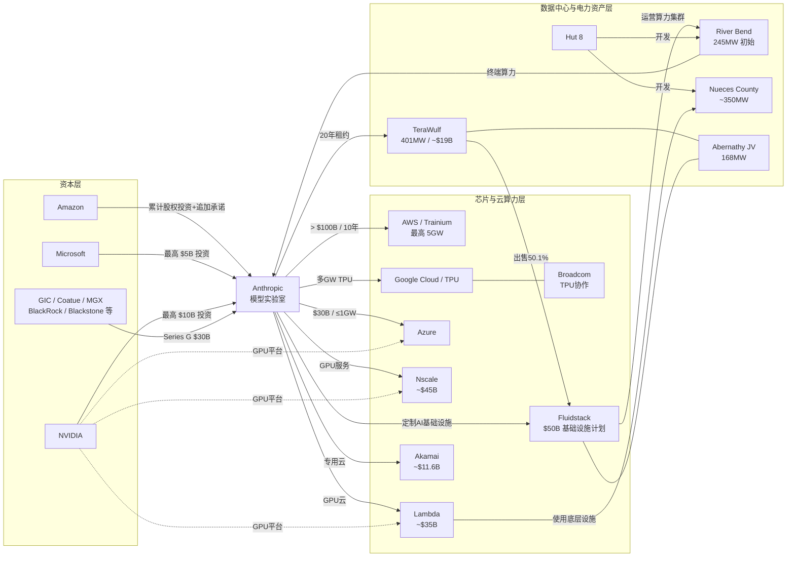

# Model lab关系图

Report: https://reports.instap.net/reports/2026-10-model-lab-network
Date: 2026-10-08
Coverage: complete-research-and-network-data

六家模型组织的资本、算力与全球基础设施网络；新增 Anthropic–TeraWulf、Hut 8、Lambda、Nscale、Akamai 关系及完整研究稿，区分合同金额、建设容量和已投运资产。


# Model Lab Network 公司关联更新：Anthropic 算力、资本与数据中心网络

## 执行摘要

截至 **2026-10-07**，对 Instap《2026-10 Model Lab Network》所指向的公开关系网进行反向重建，并以公司公告、SEC 文件、Reuters 等原始/权威资料和 Aral 研报库交叉核验后，最值得补入原图谱的不是单纯“谁投资了哪家模型公司”，而是 **Anthropic 已形成一张横跨资本、芯片、GPU 云、数据中心、电力资产的多层网络**。

最重要的新增关系包括：**Anthropic–TeraWulf** 的 20 年、约 **190 亿美元** Justified Data 数据中心租约；**Anthropic–Hut 8–Fluidstack** 的至少 245MW、潜在最高 2,295MW 基础设施合作；**Anthropic–Lambda–Hut 8** 的约 **350 亿美元/350MW** 云算力交易；**Anthropic–Nscale** 约 **450 亿美元** GPU 服务合同；以及此前容易遗漏的 **Anthropic–Akamai** 约 **116 亿美元** 七年期专用云合同，并附带 Akamai 股权权证。

与此同时，AWS、Google/Broadcom、Microsoft/NVIDIA 已从普通“云供应商”升级为 Anthropic 的**资本股东 + 芯片/云供应商 + 长期算力承购方/技术联合开发方**：AWS 的最新安排是 Anthropic 十年承诺 **超过 1,000 亿美元、最高 5GW** 新算力，同时 Amazon 追加 50 亿美元投资、未来另可追加最高 200 亿美元；Google/Broadcom 是多 GW TPU 路线；Microsoft/NVIDIA 则对应 **300 亿美元 Azure 算力承诺 + 最高 1GW NVIDIA 系统 + 最多 150 亿美元战略投资**。

**核心判断：Model Lab Network 应从“股权关系图”升级为“信用—算力—电力关系图”。** Anthropic 正把自身长期算力需求分散给 AWS、Google、Azure、Fluidstack、Nscale、Lambda、Akamai、TeraWulf 等不同层级供应商；这些长期承诺反过来成为数据中心开发商和 GPU 云融资的信用锚。Akamai 获得与商业合同挂钩的股权权证、TeraWulf 获得 20 年租约、Nscale 合同专门设置融资条件，都是这一结构已经实质化的证据。该判断属于基于已披露合同结构的推论，而非对未来业绩的推测。

需要特别说明：本次工具环境无法直接解析用户给定的 `reports.instap.net/reports/2026-10-model-lab-network` 动态页面正文，因此无法机械逐项比对原页面每一个节点；下表采用“**页面主题反向重建 + 全网新增关系 + Aral 核证**”方式。对无法由原始资料确认的 Aral 聚合数字，本文不直接视为已验证事实。

## 关联总表

| 时间 | 金额 | 关联方 | 类型 | 概要 | 截至 2026-10-07 进展 | 主要来源 |
|---|---:|---|---|---|---|---|
| 2023-02 | 未披露 | Anthropic ↔ Google Cloud | 云合作/供应链 | Anthropic 选择 Google Cloud，使用 GPU/TPU 集群训练、扩展和部署模型，并共同开发 AI 计算系统 | 后续已发展成百万级 TPU、多 GW 合作 | [W1](https://www.anthropic.com/news/anthropic-partners-with-google-cloud)  |
| 2023-05 | **4.5 亿美元**（整轮） | Anthropic ← Spark Capital、Google、Salesforce Ventures、Sound Ventures、Zoom Ventures 等 | 股权投资 | Series C，由 Spark Capital 领投；各参与方单独投资额未披露 | 已完成 | [W2](https://www.anthropic.com/news/anthropic-series-c)  |
| 2024-11 | **新增 40 亿美元；累计 80 亿美元** | Amazon → Anthropic；Anthropic ↔ AWS/Annapurna Labs | 股权+云+芯片联合开发 | Amazon 保持少数股权；AWS 成为主要云和训练合作伙伴；共同优化 Trainium/Neuron | 已扩展至 Project Rainier 和 2026 年新 5GW 框架 | [W3](https://www.anthropic.com/news/anthropic-amazon-trainium)  |
| 2025-09 | **130 亿美元** | Anthropic ← ICONIQ、Fidelity、Lightspeed、BlackRock、Blackstone、GIC、QIA 等 | 股权投资 | Series F，投后估值 1,830 亿美元 | 已完成 | [W4](https://www.anthropic.com/news/anthropic-raises-series-f-at-usd183b-post-money-valuation)  |
| 2025-10 | **数百亿美元** | Anthropic ↔ Google Cloud | 云/TPU供应 | 最高约 **100 万颗 TPU**，计划 2026 年上线明显超过 1GW 容量 | 是 Anthropic 三芯片平台之一 | [W5](https://www.anthropic.com/news/expanding-our-use-of-google-cloud-tpus-and-services)  |
| 2025-11 | **500 亿美元** | Anthropic ↔ Fluidstack | 战略合作/数据中心 | 在得州、纽约等建设 Anthropic 定制化算力设施 | 2026 年持续扩展，并衍生 Hut 8/TeraWulf 等基础设施链 | [W6](https://www.anthropic.com/news/anthropic-invests-50-billion-in-american-ai-infrastructure) [A1](https://aral.instap.net/reports?topic_id=55521512522251214)  |
| 2025-11 | **Azure 算力 300 亿美元；NVIDIA 最多投资 100 亿美元；Microsoft 最多 50 亿美元** | Anthropic ↔ Microsoft ↔ NVIDIA | 战略合作+股权+算力 | Claude 上 Azure；Anthropic 承购最高 1GW NVIDIA Grace Blackwell/Vera Rubin 算力；三方共同优化软硬件 | 已成为 AWS、GCP 之外第三大云平台路径 | [W7](https://www.anthropic.com/news/microsoft-nvidia-anthropic-announce-strategic-partnerships)  |
| 2025-12 | **合作金额未披露** | Anthropic ↔ Hut 8 ↔ Fluidstack | 数据中心/客户/供应链 | Hut 8 为 Anthropic 建至少 **245MW**、潜在最高 **2,295MW**；Fluidstack 运营计算集群 | River Bend 正在建设；2026-10-07 Axios 报道项目规模约 **100 亿美元**，目标 2027 年初投运；该 100 亿美元是项目投资规模，并非 Anthropic 合同额 | [W8](https://canada.hut8.com/resources/press-releases/hut-8-announces-ai-infrastructure-partnership-with-anthropic-and-fluidstack)[W9](https://www.axios.com/local/new-orleans/2026/10/07/data-center-louisiana-hut-8-anthropic)  |
| 2026-02 | **300 亿美元** | Anthropic ← GIC、Coatue、D.E. Shaw Ventures、MGX、BlackRock、Blackstone 等 | 股权投资 | Series G，投后估值 **3,800 亿美元**；包含此前 Microsoft/NVIDIA 投资的一部分 | 已完成 | [W10](https://www.anthropic.com/news/anthropic-raises-30-billion-series-g-funding-380-billion-post-money-valuation)  |
| 2026-04 | 未披露 | Anthropic ↔ Google ↔ Broadcom | 芯片/战略供应链 | 新签**多 GW**下一代 TPU 容量，自 2027 年起上线；绝大部分计划位于美国 | 已签协议，处建设/交付前阶段 | [W11](https://www.anthropic.com/news/google-broadcom-partnership-compute)  |
| 2026-04 | **算力承诺 >1,000 亿美元/10年；Amazon 当期投资 50 亿美元，未来最多再投 200 亿美元** | Anthropic ↔ Amazon/AWS | 云+股权+供应链 | 最高 **5GW** 新容量，覆盖 Trainium2–Trainium4；AWS 继续为主要训练/云供应商 | 2026 年已有 Trainium2/3 容量陆续上线 | [W12](https://www.anthropic.com/news/anthropic-amazon-compute) [A1](https://aral.instap.net/reports?topic_id=55521512522251214)  |
| 2026-07 | **约 190 亿美元** | Anthropic ↔ TeraWulf | 客户/20年租赁 | Anthropic 租用肯塔基 Justified Data 园区，约 **401MW IT load** | 首批预计 2027H2 上线，2028 年初达到 401MW | [W13](https://investors.terawulf.com/news-events/press-releases/detail/142/terawulf-announces-anthropic-lease-at-justified-data-campus-and-sale-of-majority-interest-in-abernathy-joint-venture-to-fluidstack) [A1](https://aral.instap.net/reports?topic_id=55521512522251214)  |
| 2026-07 | **成交价未披露；TeraWulf 原投入约 4.5 亿美元** | TeraWulf ↔ Fluidstack/投资者组 | 股权/资产交易 | TeraWulf 出售 Abernathy JV 的 **50.1%**，项目约 168MW；Fluidstack 继续主导项目 | 已签 definitive agreement，出售价格高于 TeraWulf 投入成本但具体金额未披露 | [W13](https://investors.terawulf.com/news-events/press-releases/detail/142/terawulf-announces-anthropic-lease-at-justified-data-campus-and-sale-of-majority-interest-in-abernathy-joint-venture-to-fluidstack)  |
| 2026-08 | **约 450 亿美元** | Anthropic ↔ Nscale | GPU云/客户 | Anthropic 租用 Nscale NVIDIA Vera Rubin NVL72 等专用 GPU 服务；SEC 合同显示同一站点四个 tranche 均专供 Anthropic | 合同已签；部分融资仍是项目履约的重要前置条件 | [W14](https://www.sec.gov/Archives/edgar/data/2110365/000119312526395475/ck0002110365-ex10_25.htm)[W15](https://www.sec.gov/Archives/edgar/data/2110365/000119312526395475/0001193125-26-395475-index.htm)  |
| 2026-08/09 | **约 350 亿美元** | Anthropic ↔ Lambda ↔ Hut 8 | 云算力/数据中心供应链 | Reuters 报道 Lambda 为 Anthropic 提供 NVIDIA 云算力；底层约 **350MW** 数据中心由 Hut 8 在得州 Nueces County 开发 | 已签云合同；项目仍处建设/算力部署阶段 | [W16](https://www.streetinsider.com/Reuters/Anthropic+signs+%2435+billion+cloud+deal+with+Nvidia-backed+Lambda%2C+source+says/27007212.html)  |
| 2026-09 | **约 116 亿美元** | Anthropic ↔ Akamai | 云服务+客户+潜在股权 | Akamai 向 Anthropic 提供专用云计算和托管支持；七年期 Project Plan 2/3；Anthropic 同时取得最高相当于 **7,741,020 股普通股**的权证经济敞口 | SEC 8-K 已正式披露，合同生效；权证分 tranche 按付款和新增合同价值归属 | [W17](https://www.sec.gov/Archives/edgar/data/1086222/000119312526401048/d288154d8k.htm)  |

表中金额必须注意**口径不可直接相加**。股权融资、模型公司自建投资、云算力购买承诺、数据中心租约总收入和底层项目资本开支属于不同经济层级。Aral 的一篇 2026-09-29 报告将 Anthropic 云基础设施承诺汇总到约 **5,180 亿美元**，并列出 AWS、GCP、Lambda/Nscale、Fluidstack、Azure、TeraWulf 等路径；这一材料非常适合作为关系发现器，但其中个别分项金额没有在本文检索到同等强度的原始披露，因此本文没有把 5,180 亿美元作为“经审计的总合同价值”直接采用。[A1](https://aral.instap.net/reports?topic_id=55521512522251214) 官方文件反而显示，各合同还包含不同期限、可选容量、融资条件、交付验收和取消条款。

## 重点新增关系与投资含义

### TeraWulf 与 Hut 8 是原网络中最值得补的两条边

**TeraWulf 已不是“Anthropic 的潜在上游”，而是明确的直接房东/基础设施供应商。** 2026 年 7 月 6 日双方正式签署 20 年租约，约 190 亿美元基础期限合同收入，401MW IT 负载；这使 WULF 对 Anthropic 的关系强度显著高于仅有意向书或间接云服务的基础设施公司。

**Hut 8 的关系更加复杂，但也更值得画进图。** 第一条链是 `Anthropic → Fluidstack → Hut 8 River Bend`，初始 245MW；第二条是 Anthropic 与 Hut 8 可以直接共同评估 Hut 8 其他开发管线，潜在再扩 1,050MW。到 2026 年 10 月 7 日，River Bend 已进入实质施工阶段，Axios 将项目规模描述为约 100 亿美元、预计 2027 年初投运。换言之，这已从 2025 年的远期合作转为可观测的在建资产。

此外，Reuters 披露的 **Lambda–Anthropic 350 亿美元合同又落到了 Hut 8 的约 350MW 得州项目上**，说明 HUT 与 Anthropic 之间至少存在两条不同的经济链：一条经 Fluidstack，一条经 Lambda。

### Akamai 是容易被漏掉、但经济实质极强的关系

Akamai 在 2026 年 9 月的 SEC 8-K 中首次把 Anthropic 关系量化为约 **116 亿美元**，并披露双方原始 Master Services Agreement 可追溯至 **2026-05-05**。更重要的是，Anthropic 获得 Akamai 权证，其归属条件与首笔付款及后续每增加 30 亿美元合同价值相关。

这意味着 Anthropic 与供应商关系正在从“客户付款”演变成**客户 + 潜在股东**的双重结构。它和 Amazon/Microsoft/NVIDIA 对 Anthropic 的“供应商 + 股东”结构形成镜像：资本关系开始沿算力供应链双向延伸。此为基于合同结构作出的分析判断。

### 模型实验室正在成为基础设施融资的信用核心

Nscale 的 SEC 合同尤其说明这一点：四个 tranche 被安排成单独协议以支持供应商融资，整个站点要求专供 Anthropic，并明确写入获得合格融资的要求；Anthropic 只有在交付并验收后才产生相关付款义务。

因此，与其只交易“GPU 需求增长”，更值得关注的是 **谁拥有已经签约的电力、土地和长期 investment-grade AI 客户合同**。TeraWulf 20 年期 190 亿美元租约、Hut 8/Fluidstack 的长期部署、Akamai 七年 116 亿美元合同都把模型实验室信用转换成了基础设施资产的融资能力和长期现金流可见度。

Aral 的基础设施主题研报同样把这种模式概括为“锁定稀缺电力 + 长租给模型/云客户”，并重点覆盖 Hut 8、TeraWulf、Cipher、Galaxy、IREN、Nebius 等标的。[A2](https://aral.instap.net/reports?topic_id=55521518855414524)[A3](https://aral.instap.net/reports?topic_id=45548858211185818) 其中值得保持纪律的一点是：**签约 MW ≠ 已上电 MW，合同总额 ≠ 当年收入，客户承诺 ≠ 无条件债权。**

### 尚不应写成确定关系的项目

Aral 中还出现了 **Anthropic 2.6GW NVIDIA 硬件采购**、与 Google/Broadcom 相关的 **600 亿美元芯片租赁融资**，以及 Anthropic 与 SpaceX/xAI 基础设施交易等线索。[A4](https://aral.instap.net/reports?topic_id=22258225542588821) 本次公开检索可以确认 Anthropic 确实大规模使用 NVIDIA GPU、并与 Google/Broadcom 签署多 GW 下一代 TPU 协议，但截至检索截止日，我没有找到与上述每一个具体 Aral 数字完全对应、且足以达到本文核心表核证标准的官方合同或监管文件，因此**不把这些金额作为已确认交易录入总表**。Anthropic 自身已明确其硬件策略同时覆盖 AWS Trainium、Google TPU 和 NVIDIA GPU。

同理，TeraWulf 与 Kentucky Power/AEP 的 **Muskie 园区** 2026 年将签约电力由 500MW 扩至 1GW、第二阶段提前到 2029 年，是值得跟踪的 WULF 独立扩容关系，但没有证据表明 Muskie 就是 Anthropic 的 Justified Data 401MW 项目，故不能把两者混为一谈。[A2](https://aral.instap.net/reports?topic_id=55521518855414524)

## 实体关系图

下面的图将“资本”和“物理算力”分层，能比普通股权图更准确地表现当前 Model Lab Network。关系及金额均对应上表已核证项目。



这张网络真正重要的变化是：**Amazon、Microsoft、NVIDIA 位于 Anthropic 上游资本层，同时又位于下游供应链；Fluidstack、Hut 8、TeraWulf、Nscale、Lambda、Akamai 则把 Anthropic 的需求继续向土地、电力、建筑、GPU 和债务融资传导。** 因而模型实验室的资本开支已经不是简单的“NVDA 收入”，而是一个能跨多层资产负债表传导的资本循环。

## 检索方法与关键词

本次采用“**页面 → 公司原始资料 → SEC → 权威媒体 → Aral 反查 → 再回原始资料核证**”的顺序。原 Instap 页面因动态站点访问限制未能直接读取正文，因此没有把搜索引擎无法抓取的页面内容自行补写为事实。

公开互联网检索主要使用了以下关键词组合：

```text
"2026-10-model-lab-network"
site:reports.instap.net "model lab network"
Anthropic TeraWulf lease Justified $19 billion
Anthropic Hut 8 Fluidstack 245 MW 2295 MW
Anthropic Fluidstack $50 billion
Anthropic AWS Amazon $100 billion 5GW
Anthropic Google TPU Broadcom multiple gigawatts
Anthropic Microsoft NVIDIA Azure $30 billion
Anthropic Nscale $45 billion
Anthropic Lambda $35 billion Hut 8 350 MW
Anthropic Akamai $11.6 billion
site:sec.gov Anthropic Akamai
site:sec.gov Anthropic Nscale GPU Services
Anthropic Series F $13 billion
Anthropic Series G $30 billion
Hut 8 River Bend Anthropic October 7 2026
TeraWulf Fluidstack Abernathy JV
```

Aral 库分别检索了：

```text
Anthropic
TeraWulf
Anthropic TeraWulf
Hut 8 Anthropic
Anthropic Fluidstack
Anthropic Nscale
Anthropic Akamai
AI基础设施 / 数据中心 / 算力 / 电力
```

核证原则为：**官方公告/SEC > 公司投资者关系材料 > Reuters 等权威媒体 > Aral 研报 > 其他行业媒体**。Aral 的优势在于发现关系和聚合产业链，原始文件用于确认交易金额、期限和法律状态；对于 Aral 报告自身标注“AI整理”或没有原始文件对应的数字，本报告保留但不升级为“已确认事实”。

## 来源索引

以下按 Obsidian 可直接整理的来源节点形式列出；英文资料均标记为 **[EN]**。

**W1 — Anthropic-Google-Cloud-2023** [EN] Anthropic，2023-02-03，Google Cloud 合作  
https://www.anthropic.com/news/anthropic-partners-with-google-cloud 

**W2 — Anthropic-Series-C** [EN] Anthropic，2023-05-23，4.5 亿美元 Series C  
https://www.anthropic.com/news/anthropic-series-c 

**W3 — Anthropic-Amazon-2024** [EN] Anthropic，2024-11-22，Amazon 累计投资 80 亿美元、AWS 成为主要云/训练合作伙伴  
https://www.anthropic.com/news/anthropic-amazon-trainium 

**W4 — Anthropic-Series-F** [EN] Anthropic，2025-09-02，130 亿美元 Series F  
https://www.anthropic.com/news/anthropic-raises-series-f-at-usd183b-post-money-valuation 

**W5 — Anthropic-Google-TPU-2025** [EN] Anthropic，2025-10-23，最高 100 万 TPU / 数百亿美元  
https://www.anthropic.com/news/expanding-our-use-of-google-cloud-tpus-and-services 

**W6 — Anthropic-Fluidstack** [EN] Anthropic，2025-11-12，500 亿美元美国 AI 基础设施计划  
https://www.anthropic.com/news/anthropic-invests-50-billion-in-american-ai-infrastructure 

**W7 — Anthropic-Microsoft-NVIDIA** [EN] Anthropic，2025-11-18，Azure/NVIDIA/战略投资  
https://www.anthropic.com/news/microsoft-nvidia-anthropic-announce-strategic-partnerships 

**W8 — Hut8-Anthropic-Fluidstack** [EN] Hut 8，2025-12-17，245MW—2,295MW AI 基础设施合作  
https://canada.hut8.com/resources/press-releases/hut-8-announces-ai-infrastructure-partnership-with-anthropic-and-fluidstack 

**W9 — River-Bend-Progress** [EN] Axios，2026-10-07，River Bend 现场建设进展  
https://www.axios.com/local/new-orleans/2026/10/07/data-center-louisiana-hut-8-anthropic 

**W10 — Anthropic-Series-G** [EN] Anthropic，2026-02-12，300 亿美元 Series G  
https://www.anthropic.com/news/anthropic-raises-30-billion-series-g-funding-380-billion-post-money-valuation 

**W11 — Anthropic-Google-Broadcom** [EN] Anthropic，2026-04-06，多 GW 下一代 TPU 合作  
https://www.anthropic.com/news/google-broadcom-partnership-compute 

**W12 — Anthropic-AWS-5GW** [EN] Anthropic，2026-04-20，>1,000 亿美元/10 年、最高 5GW  
https://www.anthropic.com/news/anthropic-amazon-compute 

**W13 — TeraWulf-Anthropic-Fluidstack** [EN] TeraWulf，2026-07-06，Anthropic 190 亿美元租约及 Abernathy 股权交易  
https://investors.terawulf.com/news-events/press-releases/detail/142/terawulf-announces-anthropic-lease-at-justified-data-campus-and-sale-of-majority-interest-in-abernathy-joint-venture-to-fluidstack 

**W14 — Anthropic-Nscale-SEC-Agreement** [EN] SEC，Nscale–Anthropic GPU Services Agreement  
https://www.sec.gov/Archives/edgar/data/2110365/000119312526395475/ck0002110365-ex10_25.htm 

**W15 — Nscale-SEC-Filing** [EN] SEC，Nscale filing index  
https://www.sec.gov/Archives/edgar/data/2110365/000119312526395475/0001193125-26-395475-index.htm 

**W16 — Anthropic-Lambda-Hut8** [EN] Reuters 转载，2026-08-31，350 亿美元 Lambda 云合同、约 350MW Hut 8 项目  
https://www.streetinsider.com/Reuters/Anthropic+signs+%2435+billion+cloud+deal+with+Nvidia-backed+Lambda%2C+source+says/27007212.html 

**W17 — Akamai-Anthropic-SEC** [EN] SEC，2026-09-24，Akamai–Anthropic 约 116 亿美元合同及权证  
https://www.sec.gov/Archives/edgar/data/1086222/000119312526401048/d288154d8k.htm 

**A1 — Aral-Anthropic-Cloud-Commitments** [中文] Aral，2026-09-29，Anthropic 云基础设施合同口径梳理；覆盖 AWS/GCP/Azure/TeraWulf 等  
https://aral.instap.net/reports?topic_id=55521512522251214

**A2 — Aral-TeraWulf-Kentucky-Power** [中文] Aral，2026-10-05，TeraWulf–Kentucky Power Muskie 园区签约容量 500MW→1GW  
https://aral.instap.net/reports?topic_id=55521518855414524

**A3 — Aral-AI-Infrastructure-Power** [中文] Aral，2026-08-28，AI 基建、电力资产及 Hut 8 等基础设施运营商分析  
https://aral.instap.net/reports?topic_id=45548858211185818

**A4 — Aral-Anthropic-Compute-Long-Term-Contracts** [中文] Aral，2026-10-06，Anthropic 长期算力采购、2.6GW NVIDIA 硬件等产业链线索  
https://aral.instap.net/reports?topic_id=22258225542588821


## Existing network and integration policy

title: Model lab关系图
researchedAt: 2026-10-08
version: 1.2
coverage: 六家模型组织及公开披露的主要资本、算力和企业合作；非全量交易数据库。
statusPolicy: 状态为最后一条官方证据所确认，不会按预计交付日期自动升级为投运。坐标为公开城市/县级示意，不代表精确机房入口。
capacityPolicy: MW/GW是公告中的功率或容量口径，不是FLOPS；规划、协议、园区和IT负载不可直接相加。同一容量可被多个合同覆盖，故不展示跨记录GW总和。
researchPolicy: 2026-10-08检索Caspian研报库并交叉核验官方披露；研报统计、消息和官方确认独立标注。硬件占比没有公开数据时保持null，不用平台标签推断100%。
updates: [{"date":"2026-10-06","text":"新增Google—Constellation两份购电协议与五年Gemini Enterprise合作；区分890MW增容、2700MW既有供电和IT算力。","sources":["aral-oct7","google-ceg"]},{"date":"2026-10-07","text":"补充Anthropic合同供应商占比、SpaceX双站与TeraWulf公司级交付统计；没有把公司统计分配到单站，也没有用传闻升级投运状态。","sources":["aral-oct7","aral-oct7-raw"]},{"date":"2026-10-08","text":"整合用户提供的2026-10-07研究：新增TeraWulf/Hut 8/Lambda/Nscale/Akamai及历史融资关系；保留原有SpaceX官方证据，研究正文对SpaceX的未核证判断仅代表该稿检索范围。","sources":["research-w1","research-w2","research-w3","research-w4","research-w5","research-w6","research-w7","research-w8","research-w9","research-w10","research-w11","research-w12","research-w13","research-w14","research-w15","research-w16","research-w17","research-a1","research-a2","research-a3","research-a4"]}]
researchDocument: /research-topics/model-lab-network/research.md
integrationPolicy: Supplied research is attributed, not independently reverified at integration. Earlier official evidence and later updates remain intact; monetary and capacity figures must not be summed across layers.

The supplied draft’s SpaceX assessment is limited to its own search scope. Existing official Anthropic–SpaceX evidence is preserved separately in the network.


## entities

{"id":"anthropic","name":"Anthropic / Claude","role":"lab","ticker":"","country":"US","note":"独立模型实验室；ant为常用简称","isLab":true,"researchUpdate":{"asOf":"2026-10-07","note":"研报称未来10年算力采购承诺$518B；已签算力容量按供应方统计Google约45%、Amazon约35%。这是公司层面合同容量统计，不是本站TPU/Trainium安装占比，尚未经各方逐项确认。","sources":["aral-oct7","aral-oct7-raw"]}}

{"id":"openai","name":"OpenAI","role":"lab","ticker":"","country":"US","note":"模型与企业平台","isLab":true}

{"id":"deepmind","name":"Google DeepMind / Gemini","role":"lab","ticker":"","country":"UK","note":"Google内部模型组织；图中的Google设施不意味着Gemini专属容量","isLab":true}

{"id":"meta","name":"Meta / Llama","role":"lab","ticker":"META","country":"US","note":"同时为模型研发者与基础设施采购方","isLab":true}

{"id":"xai","name":"xAI / Grok","role":"lab","ticker":"","country":"US","note":"Grok模型组织；2026年2月被SpaceX收购，模型活动与母公司资本关系分别展示。","isLab":true}

{"id":"mistral","name":"Mistral AI","role":"lab","ticker":"","country":"FR","note":"欧洲模型与主权算力平台","isLab":true}

{"id":"amazon","name":"Amazon / AWS","role":"cloud","ticker":"AMZN","country":"US","note":"投资者、云服务与Trainium平台","isLab":false}

{"id":"google","name":"Alphabet / Google Cloud","role":"cloud","ticker":"GOOGL","country":"US","note":"投资、TPU、Vertex AI及数据中心","isLab":false}

{"id":"microsoft","name":"Microsoft / Azure","role":"cloud","ticker":"MSFT","country":"US","note":"股权、Azure采购与模型分发","isLab":false}

{"id":"oracle","name":"Oracle / OCI","role":"cloud","ticker":"ORCL","country":"US","note":"Stargate云基础设施","isLab":false}

{"id":"nvidia","name":"NVIDIA","role":"chip","ticker":"NVDA","country":"US","note":"","isLab":false}

{"id":"amd","name":"AMD","role":"chip","ticker":"AMD","country":"US","note":"","isLab":false}

{"id":"broadcom","name":"Broadcom","role":"chip","ticker":"AVGO","country":"US","note":"","isLab":false}

{"id":"asml","name":"ASML","role":"chip","ticker":"ASML","country":"NL","note":"","isLab":false}

{"id":"coreweave","name":"CoreWeave","role":"infrastructure","ticker":"CRWV","country":"US","note":"","isLab":false}

{"id":"fluidstack","name":"Fluidstack","role":"infrastructure","ticker":"","country":"US","note":"","isLab":false}

{"id":"nebius","name":"Nebius","role":"infrastructure","ticker":"NBIS","country":"NL","note":"","isLab":false}

{"id":"iren","name":"IREN","role":"infrastructure","ticker":"IREN","country":"AU","note":"","isLab":false}

{"id":"wulf","name":"TeraWulf","role":"infrastructure","ticker":"WULF","country":"US","note":"","isLab":false,"researchUpdate":{"asOf":"2026-10-07","note":"研报统计公司签约839MW、交付102MW；这是公司级数据，不能直接替换Lake Mariner某一承租分期的上线容量。","sources":["aral-oct7"]}}

{"id":"cipher","name":"Cipher Mining","role":"infrastructure","ticker":"CIFR","country":"US","note":"","isLab":false}

{"id":"nscale","name":"Nscale","role":"infrastructure","ticker":"","country":"UK","note":"","isLab":false}

{"id":"aker","name":"Aker","role":"infrastructure","ticker":"AKER.OL","country":"NO","note":"","isLab":false}

{"id":"sbenergy","name":"SB Energy","role":"infrastructure","ticker":"","country":"US","note":"","isLab":false}

{"id":"related","name":"Related Digital","role":"infrastructure","ticker":"","country":"US","note":"","isLab":false}

{"id":"g42","name":"G42","role":"infrastructure","ticker":"","country":"AE","note":"","isLab":false}

{"id":"spacex","name":"SpaceX","role":"infrastructure","ticker":"SPCX","country":"US","note":"2026年收购xAI；Q2 SEC文件确认6月完成IPO、上市代码SPCX。","isLab":false,"researchUpdate":{"asOf":"2026-10-07","note":"研报转述高盛：截至9月下旬Colossus I+II合计约100万GPU、1.81GW运营算力；不能全部分配给Colossus 1或Anthropic。另有约$40B融资消息，未计为完成融资。","sources":["aral-oct7"]}}

{"id":"ecodata","name":"EcoDataCenter","role":"infrastructure","ticker":"","country":"SE","note":"","isLab":false}

{"id":"softbank","name":"SoftBank","role":"investor","ticker":"9984.T","country":"JP","note":"","isLab":false}

{"id":"mgx","name":"MGX","role":"investor","ticker":"","country":"AE","note":"","isLab":false}

{"id":"gic","name":"GIC","role":"investor","ticker":"","country":"SG","note":"","isLab":false}

{"id":"coatue","name":"Coatue","role":"investor","ticker":"","country":"US","note":"","isLab":false}

{"id":"altimeter","name":"Altimeter","role":"investor","ticker":"","country":"US","note":"","isLab":false}

{"id":"dragoneer","name":"Dragoneer","role":"investor","ticker":"","country":"US","note":"","isLab":false}

{"id":"greenoaks","name":"Greenoaks","role":"investor","ticker":"","country":"US","note":"","isLab":false}

{"id":"sequoia","name":"Sequoia","role":"investor","ticker":"","country":"US","note":"","isLab":false}

{"id":"salesforce","name":"Salesforce","role":"enterprise","ticker":"CRM","country":"US","note":"","isLab":false}

{"id":"snowflake","name":"Snowflake","role":"enterprise","ticker":"SNOW","country":"US","note":"","isLab":false}

{"id":"accenture","name":"Accenture","role":"enterprise","ticker":"ACN","country":"IE","note":"","isLab":false}

{"id":"apple","name":"Apple","role":"enterprise","ticker":"AAPL","country":"US","note":"","isLab":false}

{"id":"cisco","name":"Cisco","role":"enterprise","ticker":"CSCO","country":"US","note":"","isLab":false}

{"id":"crowdstrike","name":"CrowdStrike","role":"enterprise","ticker":"CRWD","country":"US","note":"","isLab":false}

{"id":"paloalto","name":"Palo Alto Networks","role":"enterprise","ticker":"PANW","country":"US","note":"","isLab":false}

{"id":"jpmorgan","name":"JPMorganChase","role":"enterprise","ticker":"JPM","country":"US","note":"","isLab":false}

{"id":"vistra","name":"Vistra","role":"energy","ticker":"VST","country":"US","note":"","isLab":false}

{"id":"oklo","name":"Oklo","role":"energy","ticker":"OKLO","country":"US","note":"","isLab":false}

{"id":"terrapower","name":"TerraPower","role":"energy","ticker":"","country":"US","note":"","isLab":false}

{"id":"blueowl","name":"Blue Owl Capital","role":"investor","ticker":"OWL","country":"US","note":"旗下基金参与Hyperion园区合资，非投资Meta母公司","isLab":false}

{"id":"tsmc","name":"TSMC","role":"chip","ticker":"TSM","country":"TW","note":"晶圆代工；技术供应不等于直接承租模型算力","isLab":false}

{"id":"micron","name":"Micron","role":"chip","ticker":"MU","country":"US","note":"HBM供应商","isLab":false}

{"id":"skhynix","name":"SK hynix","role":"chip","ticker":"000660.KS","country":"KR","note":"HBM供应商","isLab":false}

{"id":"dell","name":"Dell Technologies","role":"infrastructure","ticker":"DELL","country":"US","note":"AI服务器系统合作","isLab":false}

{"id":"hpe","name":"Hewlett Packard Enterprise","role":"infrastructure","ticker":"HPE","country":"US","note":"AI服务器系统合作","isLab":false}

{"id":"supermicro","name":"Supermicro","role":"infrastructure","ticker":"SMCI","country":"US","note":"AI服务器系统合作","isLab":false}

{"id":"constellation","name":"Constellation Energy","role":"energy","ticker":"CEG","country":"US","note":"既有核电增容和长期电力供应；电力MW不等于已上线IT负载。","isLab":false}

{"id":"hut8","name":"Hut 8","role":"infrastructure","ticker":"HUT","country":"US","note":"Added from supplied 2026-10-07 research.","isLab":false}

{"id":"lambda","name":"Lambda","role":"cloud","ticker":"","country":"US","note":"Added from supplied 2026-10-07 research.","isLab":false}

{"id":"akamai","name":"Akamai","role":"cloud","ticker":"AKAM","country":"US","note":"Added from supplied 2026-10-07 research.","isLab":false}

{"id":"spark","name":"Spark Capital","role":"investor","ticker":"","country":"US","note":"Added from supplied 2026-10-07 research.","isLab":false}

{"id":"sound","name":"Sound Ventures","role":"investor","ticker":"","country":"US","note":"Added from supplied 2026-10-07 research.","isLab":false}

{"id":"zoom","name":"Zoom Ventures","role":"investor","ticker":"","country":"US","note":"Added from supplied 2026-10-07 research.","isLab":false}

## relations

{"id":"aws-ant-equity","source":"amazon","target":"anthropic","type":"investment","title":"累计$8B＋本次$5B投资","sources":["ant-aws"],"announcedAt":"2026-04-20","amountB":13,"currency":"USD","amountBasis":"cumulative-disclosed","status":"announced","hardware":[],"labs":["anthropic"],"term":null,"note":"包含此前8B与本次宣布5B；并非只在本轮投入13B，不保证全部已交割。","attribution":"direct"}

{"id":"aws-ant-option","source":"amazon","target":"anthropic","type":"investment","title":"未来追加投资上限$20B","sources":["ant-aws"],"announcedAt":"2026-04-20","amountB":20,"currency":"USD","amountBasis":"up-to","status":"conditional","hardware":[],"labs":["anthropic"],"term":null,"note":"未来投资额度；不与已宣布累计投资合并为已到账金额。","attribution":"direct"}

{"id":"ant-aws-compute","source":"anthropic","target":"amazon","type":"compute","title":"十年采购>$100B，容量上限5GW","sources":["ant-aws","aral-oct7"],"announcedAt":"2026-04-20","amountB":100,"currency":"USD","amountBasis":"lower-bound","status":"announced","hardware":["Trainium"],"labs":["anthropic"],"term":"10 years","note":"公告为超过100B；新容量近1GW预期2026年底上线，具体站点分配未披露。","attribution":"direct"}

{"id":"ant-google-compute","source":"anthropic","target":"google","type":"compute","title":"Google TPU容量扩展","sources":["ant-tpu","ant-spacex","aral-oct7"],"announcedAt":"2026-04-06","amountB":null,"currency":"USD","amountBasis":"not-disclosed","status":"announced","hardware":["TPU"],"labs":["anthropic"],"term":"Starting 2027","note":"4月公告为多个GW，5月更新为5GW。金额及具体站点未披露；不与旧1GW公告相加。","attribution":"direct"}

{"id":"ant-broadcom","source":"anthropic","target":"broadcom","type":"technology","title":"三方下一代TPU合作","sources":["ant-tpu"],"announcedAt":"2026-04-06","amountB":null,"currency":"USD","amountBasis":"not-disclosed","status":"announced","hardware":["TPU"],"labs":["anthropic"],"term":null,"note":"与Google同一三方项目，不另计一次5GW。","attribution":"direct"}

{"id":"ms-ant-equity","source":"microsoft","target":"anthropic","type":"investment","title":"投资承诺上限$5B","sources":["ant-msnv"],"announcedAt":"2025-11-18","amountB":5,"currency":"USD","amountBasis":"up-to","status":"conditional","hardware":[],"labs":["anthropic"],"term":null,"note":"","attribution":"direct"}

{"id":"nv-ant-equity","source":"nvidia","target":"anthropic","type":"investment","title":"投资承诺上限$10B","sources":["ant-msnv"],"announcedAt":"2025-11-18","amountB":10,"currency":"USD","amountBasis":"up-to","status":"conditional","hardware":[],"labs":["anthropic"],"term":null,"note":"","attribution":"direct"}

{"id":"ant-azure","source":"anthropic","target":"microsoft","type":"compute","title":"$30B Azure采购承诺","sources":["ant-msnv"],"announcedAt":"2025-11-18","amountB":30,"currency":"USD","amountBasis":"commitment","status":"announced","hardware":["NVIDIA"],"labs":["anthropic"],"term":null,"note":"附带至多1GW容量安排；未将其标成已经投运。","attribution":"direct"}

{"id":"ant-nvidia-tech","source":"anthropic","target":"nvidia","type":"technology","title":"模型与GPU架构联合优化","sources":["ant-msnv"],"announcedAt":"2025-11-18","amountB":null,"currency":"USD","amountBasis":"not-disclosed","status":"announced","hardware":["NVIDIA"],"labs":["anthropic"],"term":null,"note":"","attribution":"direct"}

{"id":"ant-fluid","source":"anthropic","target":"fluidstack","type":"compute","title":"$50B美国基础设施计划","sources":["ant-fluid"],"announcedAt":"2025-11-12","amountB":50,"currency":"USD","amountBasis":"programme","status":"announced","hardware":["NVIDIA"],"labs":["anthropic"],"term":null,"note":"基础设施投入计划，不是收购Fluidstack股权；公开公告只披露Texas和New York。","attribution":"direct"}

{"id":"ant-crwv","source":"anthropic","target":"coreweave","type":"compute","title":"多年算力协议；分阶段交付","sources":["ant-crwv"],"announcedAt":"2026-04-10","amountB":null,"currency":"USD","amountBasis":"not-disclosed","status":"announced","hardware":["NVIDIA"],"labs":["anthropic"],"term":"Multi-year","note":"金额、地点未披露；公告计划2026年稍后上线。","attribution":"direct"}

{"id":"ant-spacex","source":"anthropic","target":"spacex","type":"compute","title":"Colossus 1全站算力使用协议","sources":["ant-spacex","aral-oct7"],"announcedAt":"2026-05-06","amountB":null,"currency":"USD","amountBasis":"not-disclosed","status":"announced","hardware":["NVIDIA"],"labs":["anthropic"],"term":null,"note":"公告称超过300MW、22万GPU；协议上线期与站点已运行状态分开。","attribution":"direct"}

{"id":"ant-dist-amazon","source":"anthropic","target":"amazon","type":"distribution","title":"Claude云平台分发","sources":["ant-msnv"],"announcedAt":"2025-11-18","amountB":null,"currency":"USD","amountBasis":"not-disclosed","status":"active","hardware":[],"labs":["anthropic"],"term":null,"note":"模型分发关系，与该方向的算力采购分开记录。","attribution":"direct"}

{"id":"ant-dist-google","source":"anthropic","target":"google","type":"distribution","title":"Claude云平台分发","sources":["ant-msnv"],"announcedAt":"2025-11-18","amountB":null,"currency":"USD","amountBasis":"not-disclosed","status":"active","hardware":[],"labs":["anthropic"],"term":null,"note":"模型分发关系，与该方向的算力采购分开记录。","attribution":"direct"}

{"id":"ant-dist-microsoft","source":"anthropic","target":"microsoft","type":"distribution","title":"Claude云平台分发","sources":["ant-msnv"],"announcedAt":"2025-11-18","amountB":null,"currency":"USD","amountBasis":"not-disclosed","status":"active","hardware":[],"labs":["anthropic"],"term":null,"note":"模型分发关系，与该方向的算力采购分开记录。","attribution":"direct"}

{"id":"ant-g-gic","source":"gic","target":"anthropic","type":"investment","title":"Series G参与；个人额度未披露","sources":["ant-g"],"announcedAt":"2026-02-12","amountB":null,"currency":"USD","amountBasis":"not-disclosed","status":"announced","hardware":[],"labs":["anthropic"],"term":null,"note":"整轮30B，不把整轮金额分配给每个投资者。","attribution":"direct"}

{"id":"ant-g-coatue","source":"coatue","target":"anthropic","type":"investment","title":"Series G参与；个人额度未披露","sources":["ant-g"],"announcedAt":"2026-02-12","amountB":null,"currency":"USD","amountBasis":"not-disclosed","status":"announced","hardware":[],"labs":["anthropic"],"term":null,"note":"整轮30B，不把整轮金额分配给每个投资者。","attribution":"direct"}

{"id":"ant-g-mgx","source":"mgx","target":"anthropic","type":"investment","title":"Series G参与；个人额度未披露","sources":["ant-g"],"announcedAt":"2026-02-12","amountB":null,"currency":"USD","amountBasis":"not-disclosed","status":"announced","hardware":[],"labs":["anthropic"],"term":null,"note":"整轮30B，不把整轮金额分配给每个投资者。","attribution":"direct"}

{"id":"ant-h-altimeter","source":"altimeter","target":"anthropic","type":"investment","title":"Series H领投；个人额度未披露","sources":["ant-h"],"announcedAt":"2026-05-28","amountB":null,"currency":"USD","amountBasis":"not-disclosed","status":"announced","hardware":[],"labs":["anthropic"],"term":null,"note":"整轮65B，不等于每个领投方投资65B。","attribution":"direct"}

{"id":"ant-h-dragoneer","source":"dragoneer","target":"anthropic","type":"investment","title":"Series H领投；个人额度未披露","sources":["ant-h"],"announcedAt":"2026-05-28","amountB":null,"currency":"USD","amountBasis":"not-disclosed","status":"announced","hardware":[],"labs":["anthropic"],"term":null,"note":"整轮65B，不等于每个领投方投资65B。","attribution":"direct"}

{"id":"ant-h-greenoaks","source":"greenoaks","target":"anthropic","type":"investment","title":"Series H领投；个人额度未披露","sources":["ant-h"],"announcedAt":"2026-05-28","amountB":null,"currency":"USD","amountBasis":"not-disclosed","status":"announced","hardware":[],"labs":["anthropic"],"term":null,"note":"整轮65B，不等于每个领投方投资65B。","attribution":"direct"}

{"id":"ant-h-sequoia","source":"sequoia","target":"anthropic","type":"investment","title":"Series H领投；个人额度未披露","sources":["ant-h"],"announcedAt":"2026-05-28","amountB":null,"currency":"USD","amountBasis":"not-disclosed","status":"announced","hardware":[],"labs":["anthropic"],"term":null,"note":"整轮65B，不等于每个领投方投资65B。","attribution":"direct"}

{"id":"ant-crm","source":"anthropic","target":"salesforce","type":"partnership","title":"Claudeforce企业集成与治理","sources":["ant-crm"],"announcedAt":"2026-08-26","amountB":null,"currency":"USD","amountBasis":"not-disclosed","status":"announced","hardware":[],"labs":["anthropic"],"term":null,"note":"战略合作；未披露长协金额，不等于股权投资。","attribution":"direct"}

{"id":"ant-snow","source":"snowflake","target":"anthropic","type":"partnership","title":"$200M多年模型与GTM合作","sources":["ant-snow"],"announcedAt":"2025-12-03","amountB":0.2,"currency":"USD","amountBasis":"agreement","status":"announced","hardware":[],"labs":["anthropic"],"term":"Multi-year","note":"模型集成及联合市场推广，不是数据中心采购。","attribution":"direct"}

{"id":"ant-glass-apple","source":"anthropic","target":"apple","type":"partnership","title":"Glasswing防御安全合作","sources":["ant-glass"],"announcedAt":"2026-04-07","amountB":null,"currency":"USD","amountBasis":"not-disclosed","status":"announced","hardware":[],"labs":["anthropic"],"term":null,"note":"首批合作方；安全项目参与不等于商业采购长协。","attribution":"direct"}

{"id":"ant-glass-cisco","source":"anthropic","target":"cisco","type":"partnership","title":"Glasswing防御安全合作","sources":["ant-glass"],"announcedAt":"2026-04-07","amountB":null,"currency":"USD","amountBasis":"not-disclosed","status":"announced","hardware":[],"labs":["anthropic"],"term":null,"note":"首批合作方；安全项目参与不等于商业采购长协。","attribution":"direct"}

{"id":"ant-glass-crowdstrike","source":"anthropic","target":"crowdstrike","type":"partnership","title":"Glasswing防御安全合作","sources":["ant-glass"],"announcedAt":"2026-04-07","amountB":null,"currency":"USD","amountBasis":"not-disclosed","status":"announced","hardware":[],"labs":["anthropic"],"term":null,"note":"首批合作方；安全项目参与不等于商业采购长协。","attribution":"direct"}

{"id":"ant-glass-paloalto","source":"anthropic","target":"paloalto","type":"partnership","title":"Glasswing防御安全合作","sources":["ant-glass"],"announcedAt":"2026-04-07","amountB":null,"currency":"USD","amountBasis":"not-disclosed","status":"announced","hardware":[],"labs":["anthropic"],"term":null,"note":"首批合作方；安全项目参与不等于商业采购长协。","attribution":"direct"}

{"id":"ant-glass-jpmorgan","source":"anthropic","target":"jpmorgan","type":"partnership","title":"Glasswing防御安全合作","sources":["ant-glass"],"announcedAt":"2026-04-07","amountB":null,"currency":"USD","amountBasis":"not-disclosed","status":"announced","hardware":[],"labs":["anthropic"],"term":null,"note":"首批合作方；安全项目参与不等于商业采购长协。","attribution":"direct"}

{"id":"ms-oai-equity","source":"microsoft","target":"openai","type":"investment","title":"重组时持股约27%","sources":["oai-ms"],"announcedAt":"2025-10-28","amountB":null,"currency":"USD","amountBasis":"not-disclosed","status":"active","hardware":[],"labs":["openai"],"term":null,"note":"27%仅对应2025年重组时点；后续融资稀释未统一核验。135B是当时持股估值，不是新增投入。","attribution":"direct"}

{"id":"oai-ms-compute","source":"openai","target":"microsoft","type":"compute","title":"$250B增量Azure服务承诺","sources":["oai-ms"],"announcedAt":"2025-10-28","amountB":250,"currency":"USD","amountBasis":"commitment","status":"announced","hardware":["NVIDIA"],"labs":["openai"],"term":null,"note":"","attribution":"direct"}

{"id":"oai-fund-amazon","source":"amazon","target":"openai","type":"investment","title":"2026轮投资承诺","sources":["oai-fund"],"announcedAt":"2026-02-27","amountB":50,"currency":"USD","amountBasis":"commitment","status":"conditional","hardware":[],"labs":["openai"],"term":null,"note":"融资公告额度不等于交割完成。Amazon先15B、其余35B附条件。","attribution":"direct"}

{"id":"oai-fund-nvidia","source":"nvidia","target":"openai","type":"investment","title":"2026轮投资承诺","sources":["oai-fund"],"announcedAt":"2026-02-27","amountB":30,"currency":"USD","amountBasis":"commitment","status":"announced","hardware":[],"labs":["openai"],"term":null,"note":"融资公告额度不等于交割完成。Amazon先15B、其余35B附条件。","attribution":"direct"}

{"id":"oai-fund-softbank","source":"softbank","target":"openai","type":"investment","title":"2026轮投资承诺","sources":["oai-fund"],"announcedAt":"2026-02-27","amountB":30,"currency":"USD","amountBasis":"commitment","status":"announced","hardware":[],"labs":["openai"],"term":null,"note":"融资公告额度不等于交割完成。Amazon先15B、其余35B附条件。","attribution":"direct"}

{"id":"oai-aws-compute","source":"openai","target":"amazon","type":"compute","title":"既有$38B＋增量$100B长协","sources":["oai-aws"],"announcedAt":"2026-02-27","amountB":138,"currency":"USD","amountBasis":"cumulative-agreements","status":"announced","hardware":["Trainium","NVIDIA"],"labs":["openai"],"term":"Expansion: 8 years","note":"138B包含旧38B，不能重复加总；约2GW Trainium容量按协议逐步部署。","attribution":"direct"}

{"id":"oai-aws-dist","source":"openai","target":"amazon","type":"distribution","title":"Frontier第三方云分发及联合运行环境","sources":["oai-aws"],"announcedAt":"2026-02-27","amountB":null,"currency":"USD","amountBasis":"not-disclosed","status":"announced","hardware":[],"labs":["openai"],"term":null,"note":"","attribution":"direct"}

{"id":"oai-nv-cap","source":"openai","target":"nvidia","type":"technology","title":"Vera Rubin训练2GW＋推理3GW","sources":["oai-fund"],"announcedAt":"2026-02-27","amountB":null,"currency":"USD","amountBasis":"not-disclosed","status":"announced","hardware":["NVIDIA"],"labs":["openai"],"term":null,"note":"容量安排；与云服务商和Stargate站点可能重叠，不能相加。","attribution":"direct"}

{"id":"oai-oracle","source":"openai","target":"oracle","type":"compute","title":"超过$300B，新增容量至多4.5GW","sources":["oai-sites"],"announcedAt":"2025-09-23","amountB":300,"currency":"USD","amountBasis":"lower-bound","status":"announced","hardware":["NVIDIA"],"labs":["openai"],"term":"5 years","note":"","attribution":"direct"}

{"id":"oai-coreweave","source":"openai","target":"coreweave","type":"compute","title":"累计协议上限约$22.4B","sources":["oai-crwv"],"announcedAt":"2025-09-25","amountB":22.4,"currency":"USD","amountBasis":"up-to-cumulative","status":"announced","hardware":["NVIDIA"],"labs":["openai"],"term":null,"note":"已包含多轮增量；未公开精确机房分配。","attribution":"direct"}

{"id":"oai-amd","source":"openai","target":"amd","type":"technology","title":"6GW多代GPU部署协议","sources":["oai-amd"],"announcedAt":"2025-10-06","amountB":null,"currency":"USD","amountBasis":"not-disclosed","status":"announced","hardware":["AMD"],"labs":["openai"],"term":null,"note":"第一1GW计划2026下半年开始；不等于6GW全部已部署。","attribution":"direct"}

{"id":"amd-warrant","source":"amd","target":"openai","type":"investment","title":"最多1.6亿股认股权","sources":["oai-amd"],"announcedAt":"2025-10-06","amountB":null,"currency":"USD","amountBasis":"not-disclosed","status":"conditional","hardware":[],"labs":["openai"],"term":null,"note":"方向表示AMD授予OpenAI认股权；不是AMD向OpenAI支付现金。解锁取决于部署里程碑。","attribution":"direct"}

{"id":"oai-avgo","source":"openai","target":"broadcom","type":"technology","title":"10GW自研加速器合作","sources":["oai-avgo"],"announcedAt":"2025-10-13","amountB":null,"currency":"USD","amountBasis":"not-disclosed","status":"announced","hardware":["Custom ASIC"],"labs":["openai"],"term":"2026–2029","note":"技术合作，不把10GW理解为一个已建成机房。","attribution":"direct"}

{"id":"oai-build-softbank","source":"openai","target":"softbank","type":"construction","title":"Stargate站点开发合作","sources":["oai-sites"],"announcedAt":"2025-09-23","amountB":null,"currency":"USD","amountBasis":"not-disclosed","status":"announced","hardware":[],"labs":["openai"],"term":null,"note":"","attribution":"direct"}

{"id":"oai-build-sbenergy","source":"openai","target":"sbenergy","type":"construction","title":"Stargate站点开发合作","sources":["oai-sites"],"announcedAt":"2025-09-23","amountB":null,"currency":"USD","amountBasis":"not-disclosed","status":"announced","hardware":[],"labs":["openai"],"term":null,"note":"","attribution":"direct"}

{"id":"oai-related","source":"oracle","target":"related","type":"construction","title":"Michigan校园开发","sources":["oai-mi"],"announcedAt":"2025-10-30","amountB":null,"currency":"USD","amountBasis":"not-disclosed","status":"announced","hardware":[],"labs":["openai"],"term":null,"note":"站点开发方；与模型实验室的间接基础设施联系。","attribution":"indirect"}

{"id":"oai-uae-g42","source":"openai","target":"g42","type":"construction","title":"Stargate UAE合作","sources":["oai-uae"],"announcedAt":"2025-05-22","amountB":null,"currency":"USD","amountBasis":"not-disclosed","status":"announced","hardware":[],"labs":["openai"],"term":null,"note":"","attribution":"direct"}

{"id":"oai-uae-cisco","source":"openai","target":"cisco","type":"construction","title":"Stargate UAE合作","sources":["oai-uae"],"announcedAt":"2025-05-22","amountB":null,"currency":"USD","amountBasis":"not-disclosed","status":"announced","hardware":[],"labs":["openai"],"term":null,"note":"","attribution":"direct"}

{"id":"oai-no-nscale","source":"openai","target":"nscale","type":"construction","title":"Norway初始潜在承购合作","sources":["oai-no"],"announcedAt":"2025-07-31","amountB":null,"currency":"USD","amountBasis":"not-disclosed","status":"historical","hardware":[],"labs":["openai"],"term":null,"note":"初始公告是潜在offtaker；2026年Narvik新增容量协议指向Microsoft，不推断为OpenAI专属。","attribution":"direct"}

{"id":"oai-no-aker","source":"openai","target":"aker","type":"construction","title":"Norway初始潜在承购合作","sources":["oai-no"],"announcedAt":"2025-07-31","amountB":null,"currency":"USD","amountBasis":"not-disclosed","status":"historical","hardware":[],"labs":["openai"],"term":null,"note":"初始公告是潜在offtaker；2026年Narvik新增容量协议指向Microsoft，不推断为OpenAI专属。","attribution":"direct"}

{"id":"ms-nscale","source":"microsoft","target":"nscale","type":"compute","title":"Narvik新增3万多Rubin GPU","sources":["nscale-no"],"announcedAt":"2026-04-14","amountB":null,"currency":"USD","amountBasis":"not-disclosed","status":"announced","hardware":["NVIDIA"],"labs":["openai"],"term":"2027","note":"与OpenAI关联为历史项目链路，不代表OpenAI确定是终端用户。","attribution":"historical"}

{"id":"oai-uk","source":"openai","target":"nscale","type":"construction","title":"Stargate UK潜在GPU承购","sources":["oai-uk"],"announcedAt":"2025-09-16","amountB":null,"currency":"USD","amountBasis":"not-disclosed","status":"conditional","hardware":["NVIDIA"],"labs":["openai"],"term":null,"note":"公告为探索8000GPU、未来可扩31000GPU，非已建成证明。","attribution":"direct"}

{"id":"oai-snow","source":"snowflake","target":"openai","type":"partnership","title":"$200M多年模型合作","sources":["oai-snow"],"announcedAt":"2026-02-02","amountB":0.2,"currency":"USD","amountBasis":"agreement","status":"announced","hardware":[],"labs":["openai"],"term":"Multi-year","note":"","attribution":"direct"}

{"id":"oai-acn","source":"openai","target":"accenture","type":"partnership","title":"ChatGPT Enterprise与客户推广","sources":["oai-acn"],"announcedAt":"2025-12-01","amountB":null,"currency":"USD","amountBasis":"not-disclosed","status":"announced","hardware":[],"labs":["openai"],"term":null,"note":"","attribution":"direct"}

{"id":"meta-crwv","source":"meta","target":"coreweave","type":"compute","title":"至2032年约$21B容量协议","sources":["meta-crwv"],"announcedAt":"2026-04-09","amountB":21,"currency":"USD","amountBasis":"agreement","status":"announced","hardware":["NVIDIA"],"labs":["meta"],"term":"Through Dec 2032","note":"","attribution":"direct"}

{"id":"meta-nbis","source":"meta","target":"nebius","type":"compute","title":"固定$12B＋至多$15B追加容量","sources":["meta-nbis"],"announcedAt":"2026-03-16","amountB":27,"currency":"USD","amountBasis":"up-to","status":"announced","hardware":["NVIDIA"],"labs":["meta"],"term":"5 years","note":"第二部分是可用容量追加承诺，不能全视为固定backlog。","attribution":"direct"}

{"id":"ms-nbis","source":"microsoft","target":"nebius","type":"compute","title":"约$17.4B专用GPU基础设施","sources":["ms-nbis"],"announcedAt":"2025-09-08","amountB":17.4,"currency":"USD","amountBasis":"conditional-contract","status":"announced","hardware":["NVIDIA"],"labs":[],"term":"5 years / through 2031","note":"依赖部署和可用性；终端模型分配未披露。","attribution":"indirect"}

{"id":"ms-iren","source":"microsoft","target":"iren","type":"compute","title":"$9.7B AI Cloud合同","sources":["ms-iren"],"announcedAt":"2025-11-03","amountB":9.7,"currency":"USD","amountBasis":"agreement","status":"announced","hardware":["NVIDIA"],"labs":[],"term":"5 years","note":"不是Anthropic或OpenAI的直接合同；终端实验室未公开指定。","attribution":"indirect"}

{"id":"nv-crwv-invest","source":"nvidia","target":"coreweave","type":"investment","title":"$2B Class A股票投资","sources":["nv-crwv"],"announcedAt":"2026-01-26","amountB":2,"currency":"USD","amountBasis":"equity-purchase","status":"active","hardware":[],"labs":[],"term":null,"note":"","attribution":"indirect"}

{"id":"nv-crwv-tech","source":"coreweave","target":"nvidia","type":"technology","title":"联合建设AI工厂及平台协作","sources":["nv-crwv"],"announcedAt":"2026-01-26","amountB":null,"currency":"USD","amountBasis":"not-disclosed","status":"announced","hardware":["NVIDIA"],"labs":[],"term":null,"note":"","attribution":"indirect"}

{"id":"meta-nv","source":"meta","target":"nvidia","type":"technology","title":"多年代际GPU/CPU/网络合作","sources":["meta-nv"],"announcedAt":"2026-02-17","amountB":null,"currency":"USD","amountBasis":"not-disclosed","status":"announced","hardware":["NVIDIA"],"labs":["meta"],"term":null,"note":"","attribution":"direct"}

{"id":"meta-energy-vistra","source":"meta","target":"vistra","type":"energy","title":"核能长期采购或开发合作","sources":["meta-energy"],"announcedAt":"2026-01-09","amountB":null,"currency":"USD","amountBasis":"not-disclosed","status":"announced","hardware":[],"labs":["meta"],"term":null,"note":"发电容量不是IT算力；不同项目有不同上线期限。","attribution":"direct"}

{"id":"meta-energy-oklo","source":"meta","target":"oklo","type":"energy","title":"核能长期采购或开发合作","sources":["meta-energy"],"announcedAt":"2026-01-09","amountB":null,"currency":"USD","amountBasis":"not-disclosed","status":"announced","hardware":[],"labs":["meta"],"term":null,"note":"发电容量不是IT算力；不同项目有不同上线期限。","attribution":"direct"}

{"id":"meta-energy-terrapower","source":"meta","target":"terrapower","type":"energy","title":"核能长期采购或开发合作","sources":["meta-energy"],"announcedAt":"2026-01-09","amountB":null,"currency":"USD","amountBasis":"not-disclosed","status":"announced","hardware":[],"labs":["meta"],"term":null,"note":"发电容量不是IT算力；不同项目有不同上线期限。","attribution":"direct"}

{"id":"fluid-wulf","source":"fluidstack","target":"wulf","type":"construction","title":"Lake Mariner十年租赁约$6.7B","sources":["wulf-fluid"],"announcedAt":"2025-11-10","amountB":6.7,"currency":"USD","amountBasis":"contracted-lease","status":"announced","hardware":[],"labs":[],"term":"10 years","note":"未披露这些具体机房由Anthropic独享；仅显示Fluidstack间接链路。","attribution":"indirect"}

{"id":"google-wulf","source":"google","target":"wulf","type":"guarantee","title":"$3.2B信用增级","sources":["wulf-fluid"],"announcedAt":"2025-11-10","amountB":3.2,"currency":"USD","amountBasis":"credit-support","status":"announced","hardware":[],"labs":[],"term":null,"note":"担保信用支持，不是采购收入或股权投资额。","attribution":"indirect"}

{"id":"fluid-cipher","source":"fluidstack","target":"cipher","type":"construction","title":"Barber Lake十年168MW租赁","sources":["cifr-fluid"],"announcedAt":"2025-09-25","amountB":null,"currency":"USD","amountBasis":"not-disclosed","status":"announced","hardware":[],"labs":[],"term":"10 years","note":"具体终端模型实验室未披露，不能直接归属Anthropic。","attribution":"indirect"}

{"id":"google-cipher","source":"google","target":"cipher","type":"guarantee","title":"$1.4B租赁义务信用支持","sources":["cifr-fluid"],"announcedAt":"2025-10-01","amountB":1.4,"currency":"USD","amountBasis":"credit-support","status":"announced","hardware":[],"labs":[],"term":null,"note":"","attribution":"indirect"}

{"id":"cipher-google-equity","source":"cipher","target":"google","type":"investment","title":"为信用支持向Google授予约5.4%股权","sources":["cifr-fluid"],"announcedAt":"2025-10-01","amountB":null,"currency":"USD","amountBasis":"not-disclosed","status":"announced","hardware":[],"labs":[],"term":null,"note":"箭头表示股份授予。不是Google等额现金投资；比例仅为该披露时点。","attribution":"indirect"}

{"id":"asml-mistral-invest","source":"asml","target":"mistral","type":"investment","title":"Series C投资€1.3B","sources":["mistral-asml"],"announcedAt":"2025-09-09","amountB":1.3,"currency":"EUR","amountBasis":"equity-purchase","status":"announced","hardware":[],"labs":["mistral"],"term":null,"note":"公告约11%完全稀释持股，只对应当时融资。","attribution":"direct"}

{"id":"mistral-asml-tech","source":"mistral","target":"asml","type":"partnership","title":"长期工业模型与研发合作","sources":["mistral-asml"],"announcedAt":"2025-09-09","amountB":null,"currency":"USD","amountBasis":"not-disclosed","status":"announced","hardware":[],"labs":["mistral"],"term":"Long-term","note":"","attribution":"direct"}

{"id":"mistral-edc","source":"mistral","target":"ecodata","type":"construction","title":"Borlänge AI中心€1.2B计划","sources":["mistral-edc"],"announcedAt":"2026-02-11","amountB":1.2,"currency":"EUR","amountBasis":"programme","status":"announced","hardware":["NVIDIA"],"labs":["mistral"],"term":null,"note":"数字基础设施长期投入计划，非股权收购。","attribution":"direct"}

{"id":"google-deepmind","source":"google","target":"deepmind","type":"internal","title":"内部模型与TPU工程协同","sources":["google-tpu"],"announcedAt":"2025-11-25","amountB":null,"currency":"USD","amountBasis":"not-disclosed","status":"active","hardware":["TPU"],"labs":["deepmind"],"term":null,"note":"集团内部关系，不是外部商业采购合同。","attribution":"direct"}

{"id":"xai-spacex","source":"xai","target":"spacex","type":"technology","title":"Colossus基础设施关联","sources":["xai-site","ant-spacex"],"announcedAt":"2026-05-06","amountB":null,"currency":"USD","amountBasis":"not-disclosed","status":"announced","hardware":["NVIDIA"],"labs":["xai","anthropic"],"term":null,"note":"设施及模型组织关系；未把不明金额记为交易。","attribution":"direct"}

{"id":"google-ant-equity","source":"google","target":"anthropic","type":"investment","title":"非投票少数股权与可转债","sources":["google-ant-cma"],"announcedAt":"2024-11-19","amountB":null,"currency":"USD","amountBasis":"not-disclosed","status":"historical","hardware":[],"labs":["anthropic"],"term":null,"note":"监管决定确认截至2024年8月的股权与可转债安排。具体金额和持股比例被删节；不是截至2026年最新持股比例。","attribution":"direct"}

{"id":"crm-ant-equity","source":"salesforce","target":"anthropic","type":"investment","title":"Salesforce Ventures持续投资","sources":["sfv-ant"],"announcedAt":"2025-09-02","amountB":null,"currency":"USD","amountBasis":"not-disclosed","status":"historical","hardware":[],"labs":["anthropic"],"term":null,"note":"来源确认自2023年Series C以来的投资。13B为Series F整轮金额，未作为Salesforce单家投资金额。","attribution":"direct"}

{"id":"blueowl-meta","source":"blueowl","target":"meta","type":"construction","title":"Hyperion合资开发与建设融资","sources":["meta-blueowl"],"announcedAt":"2025-10-21","amountB":null,"currency":"USD","amountBasis":"not-disclosed","status":"announced","hardware":[],"labs":["meta"],"term":null,"note":"Blue Owl管理的基金持合资公司80%，Meta20%；合计开发成本约27B，不是Blue Owl向Meta支付27B的股权投资。","attribution":"direct"}

{"id":"nv-tsmc","source":"nvidia","target":"tsmc","type":"technology","title":"Blackwell 4NP制造工艺","sources":["nv-blackwell"],"announcedAt":"2024-03-18","amountB":null,"currency":"USD","amountBasis":"not-disclosed","status":"announced","hardware":["NVIDIA"],"labs":[],"term":null,"note":"披露技术与制造关系；采购金额、期限未披露。","attribution":"indirect"}

{"id":"nv-micron","source":"nvidia","target":"micron","type":"technology","title":"H200采用Micron HBM3E","sources":["mu-hbm"],"announcedAt":"2024-02-26","amountB":null,"currency":"USD","amountBasis":"not-disclosed","status":"historical","hardware":["NVIDIA"],"labs":[],"term":null,"note":"2024年产品代际供应证据，不推断2026年最新供应份额。","attribution":"indirect"}

{"id":"nv-skhynix","source":"nvidia","target":"skhynix","type":"technology","title":"NVIDIA HBM3供应合作","sources":["sk-hbm"],"announcedAt":"2022-06-08","amountB":null,"currency":"USD","amountBasis":"not-disclosed","status":"historical","hardware":["NVIDIA"],"labs":[],"term":null,"note":"2022年产品供应证据；当前HBM4份额及长协金额不在此记录内。","attribution":"indirect"}

{"id":"nv-dell","source":"nvidia","target":"dell","type":"technology","title":"Blackwell AI系统制造合作","sources":["nv-oem"],"announcedAt":"2024-06-02","amountB":null,"currency":"USD","amountBasis":"not-disclosed","status":"announced","hardware":["NVIDIA"],"labs":[],"term":null,"note":"系统合作，不代表OEM直接获得模型方算力采购合同。","attribution":"indirect"}

{"id":"nv-hpe","source":"nvidia","target":"hpe","type":"technology","title":"Blackwell AI系统制造合作","sources":["nv-oem"],"announcedAt":"2024-06-02","amountB":null,"currency":"USD","amountBasis":"not-disclosed","status":"announced","hardware":["NVIDIA"],"labs":[],"term":null,"note":"系统合作，不代表OEM直接获得模型方算力采购合同。","attribution":"indirect"}

{"id":"nv-supermicro","source":"nvidia","target":"supermicro","type":"technology","title":"Blackwell AI系统制造合作","sources":["nv-oem"],"announcedAt":"2024-06-02","amountB":null,"currency":"USD","amountBasis":"not-disclosed","status":"announced","hardware":["NVIDIA"],"labs":[],"term":null,"note":"系统合作，不代表OEM直接获得模型方算力采购合同。","attribution":"indirect"}

{"id":"spacex-xai-ownership","source":"spacex","target":"xai","type":"ownership","title":"SpaceX收购xAI，纳入AI业务","sources":["xai-merger","spcx-q2"],"announcedAt":"2026-02-02","amountB":null,"currency":"USD","amountBasis":"not-disclosed","status":"active","hardware":[],"labs":["xai"],"term":null,"note":"2026年2月官方确认收购完成；资本结构关系与Anthropic使用Colossus算力的采购关系独立。此记录不填写新闻报道中的估值。","attribution":"direct"}

{"id":"google-ceg-uprate","source":"google","target":"constellation","type":"energy","title":"890MW核电增容购电协议","sources":["google-ceg","aral-oct7"],"announcedAt":"2026-10-06","amountB":null,"currency":"USD","amountBasis":"not-disclosed","status":"announced","hardware":[],"labs":[],"term":"20 years; first uprate expected 2028","note":"11个机组增容；Constellation投资超过$4.3B，不是Google采购金额。新增电力不会直接记为Gemini算力。","attribution":"indirect"}

{"id":"google-ceg-supply","source":"google","target":"constellation","type":"energy","title":"2700MW既有电力供应协议","sources":["google-ceg","aral-oct7"],"announcedAt":"2026-10-06","amountB":null,"currency":"USD","amountBasis":"not-disclosed","status":"announced","hardware":[],"labs":[],"term":"15 years","note":"既有电力供给，不是新增核电。不得与890MW合并为近期新增算力。","attribution":"indirect"}

{"id":"ceg-gemini","source":"constellation","target":"google","type":"partnership","title":"Gemini Enterprise / AI for energy","sources":["google-ceg"],"announcedAt":"2026-10-06","amountB":null,"currency":"USD","amountBasis":"not-disclosed","status":"announced","hardware":[],"labs":["deepmind"],"term":"5 years","note":"发电运营AI应用合作；与购电合同分别记录。","attribution":"shared"}

{"id":"ant-terawulf-lease","source":"anthropic","target":"wulf","type":"compute","title":"Justified Data · 20-year ~$19B lease","sources":["research-w13"],"announcedAt":"2026-07-06","amountB":19,"currency":"USD","amountBasis":"base-term-contract","status":"announced","hardware":[],"labs":["anthropic"],"term":"20 years","note":"401MW IT load; first delivery expected H2 2027, full delivery early 2028. Contract total is not annual revenue.","attribution":"direct","researchAsOf":"2026-10-07"}

{"id":"ant-hut8-fluid","source":"anthropic","target":"hut8","type":"construction","title":"Fluidstack infrastructure · 245MW initially / up to 2,295MW","sources":["research-w8","research-w9"],"announcedAt":"2025-12-17","amountB":null,"currency":"USD","amountBasis":"not-disclosed","status":"announced","hardware":[],"labs":["anthropic"],"term":null,"note":"River Bend via Fluidstack; potential capacity is not commissioned capacity. ~$10B in Axios refers to project investment, not an Anthropic contract.","attribution":"direct","researchAsOf":"2026-10-07"}

{"id":"fluid-hut8-river","source":"fluidstack","target":"hut8","type":"construction","title":"River Bend · Fluidstack operates / Hut 8 develops","sources":["research-w8"],"announcedAt":"2025-12-17","amountB":null,"currency":"USD","amountBasis":"not-disclosed","status":"announced","hardware":[],"labs":["anthropic"],"term":null,"note":"Initial 245MW. An additional 1,050MW development pipeline is optional; capacities overlap the broader framework.","attribution":"direct","researchAsOf":"2026-10-07"}

{"id":"ant-lambda","source":"anthropic","target":"lambda","type":"compute","title":"Reported ~$35B NVIDIA cloud contract","sources":["research-w16"],"announcedAt":"2026-08-31","amountB":35,"currency":"USD","amountBasis":"reported-contract","status":"announced","hardware":["NVIDIA"],"labs":["anthropic"],"term":null,"note":"Reuters-reported agreement; underlying ~350MW Hut 8 Nueces County project is in development.","attribution":"direct","researchAsOf":"2026-10-07"}

{"id":"lambda-hut8","source":"lambda","target":"hut8","type":"compute","title":"Nueces County · ~350MW infrastructure","sources":["research-w16"],"announcedAt":"2026-08-31","amountB":null,"currency":"USD","amountBasis":"not-disclosed","status":"announced","hardware":["NVIDIA"],"labs":["anthropic"],"term":null,"note":"Underlying infrastructure for Lambda–Anthropic; do not count the $35B cloud contract again at this layer.","attribution":"direct","researchAsOf":"2026-10-07"}

{"id":"ant-nscale","source":"anthropic","target":"nscale","type":"compute","title":"~$45B dedicated GPU services","sources":["research-w14","research-w15"],"announcedAt":"2026-08","amountB":45,"currency":"USD","amountBasis":"approximate-contract","status":"announced","hardware":["NVIDIA"],"labs":["anthropic"],"term":null,"note":"Four tranches, dedicated site; financing, delivery and acceptance conditions apply.","attribution":"direct","researchAsOf":"2026-10-07"}

{"id":"ant-akamai","source":"anthropic","target":"akamai","type":"compute","title":"~$11.6B dedicated cloud / hosting","sources":["research-w17"],"announcedAt":"2026-09-24","amountB":11.6,"currency":"USD","amountBasis":"contract","status":"announced","hardware":[],"labs":["anthropic"],"term":"7 years","note":"Project Plans 2/3; original MSA dated May 5, 2026.","attribution":"direct","researchAsOf":"2026-10-07"}

{"id":"ant-akamai-warrants","source":"anthropic","target":"akamai","type":"investment","title":"Warrants · up to 7,741,020 common shares","sources":["research-w17"],"announcedAt":"2026-09-24","amountB":null,"currency":"USD","amountBasis":"not-disclosed","status":"conditional","hardware":[],"labs":["anthropic"],"term":null,"note":"Potential equity exposure; tranche vesting tied to payments and additional contract value. Not vested stock ownership.","attribution":"direct","researchAsOf":"2026-10-07"}

{"id":"terawulf-fluid-abernathy","source":"wulf","target":"fluidstack","type":"ownership","title":"Sale of 50.1% Abernathy JV interest","sources":["research-w13"],"announcedAt":"2026-07-06","amountB":null,"currency":"USD","amountBasis":"not-disclosed","status":"announced","hardware":[],"labs":["anthropic"],"term":null,"note":"Investor group / Fluidstack transaction; 168MW JV. Prior ~$450M cost is not sale proceeds.","attribution":"direct","researchAsOf":"2026-10-07"}

{"id":"spark-ant-series-c","source":"spark","target":"anthropic","type":"investment","title":"Series C participant · $450M total round","sources":["research-w2"],"announcedAt":"2023-05-23","amountB":null,"currency":"USD","amountBasis":"not-disclosed","status":"announced","hardware":[],"labs":["anthropic"],"term":null,"note":"Spark led; individual investments undisclosed. Whole-round value is not attributed to individual investors.","attribution":"direct","researchAsOf":"2026-10-07"}

{"id":"sound-ant-series-c","source":"sound","target":"anthropic","type":"investment","title":"Series C participant · $450M total round","sources":["research-w2"],"announcedAt":"2023-05-23","amountB":null,"currency":"USD","amountBasis":"not-disclosed","status":"announced","hardware":[],"labs":["anthropic"],"term":null,"note":"Spark led; individual investments undisclosed. Whole-round value is not attributed to individual investors.","attribution":"direct","researchAsOf":"2026-10-07"}

{"id":"zoom-ant-series-c","source":"zoom","target":"anthropic","type":"investment","title":"Series C participant · $450M total round","sources":["research-w2"],"announcedAt":"2023-05-23","amountB":null,"currency":"USD","amountBasis":"not-disclosed","status":"announced","hardware":[],"labs":["anthropic"],"term":null,"note":"Spark led; individual investments undisclosed. Whole-round value is not attributed to individual investors.","attribution":"direct","researchAsOf":"2026-10-07"}

## sites

{"id":"rainier","name":"Project Rainier · St Joseph County","country":"US","region":"Indiana","lat":41.67,"lng":-86.39,"status":"operational","statusAsOf":"2026-04-20","entities":["amazon"],"labs":["anthropic"],"hardware":["Trainium"],"sources":["rainier","ant-aws","aral-jul28"],"capacityMW":null,"capacityBasis":"Not disclosed","note":"代表已公开的Indiana集群位置；Rainier跨多个站点，百万芯片不能全部分配给本点。","attribution":"direct","coordinatePrecision":"county","expectedCompletion":"Operational; wider Rainier expansion has separate milestones","onlineCapacity":null,"plannedCapacity":null,"acceleratorCount":"~500,000 Trainium2 at Rainier launch across multiple sites; no county allocation","hardwareDetails":[{"supplier":"Trainium","models":"Trainium2","sharePct":null,"evidence":"Platform disclosed; site allocation / share not disclosed"}]}

{"id":"abilene","name":"Stargate · Abilene","country":"US","region":"Texas","lat":32.45,"lng":-99.73,"status":"operational","statusAsOf":"2026-01-20","entities":["oracle"],"labs":["openai"],"hardware":["NVIDIA"],"sources":["oai-community","oai-sites"],"capacityMW":null,"capacityBasis":"Not disclosed","note":"已有训练与推理运行，但不代表整个规划校园全部完工。","attribution":"direct","coordinatePrecision":"city","expectedCompletion":"Training / inference operational; full campus completion not disclosed","onlineCapacity":null,"plannedCapacity":null,"acceleratorCount":null,"hardwareDetails":[{"supplier":"NVIDIA","models":"","sharePct":null,"evidence":"Platform disclosed; site allocation / share not disclosed"}]}

{"id":"lordstown","name":"Stargate · Lordstown","country":"US","region":"Ohio","lat":41.17,"lng":-80.87,"status":"construction","statusAsOf":"2025-09-23","entities":["softbank"],"labs":["openai"],"hardware":["NVIDIA"],"sources":["oai-sites"],"capacityMW":null,"capacityBasis":"Not disclosed","note":"公告确认已破土；计划2026运行，不用计划日期自动改成投运。","attribution":"direct","coordinatePrecision":"city","expectedCompletion":"2026 (original target; actual delivery unconfirmed)","onlineCapacity":null,"plannedCapacity":null,"acceleratorCount":null,"hardwareDetails":[{"supplier":"NVIDIA","models":"","sharePct":null,"evidence":"Platform disclosed; site allocation / share not disclosed"}]}

{"id":"milam","name":"Stargate · Milam County","country":"US","region":"Texas","lat":30.79,"lng":-96.98,"status":"planned","statusAsOf":"2025-09-23","entities":["softbank","sbenergy"],"labs":["openai"],"hardware":["NVIDIA"],"sources":["oai-sites"],"capacityMW":null,"capacityBasis":"Not disclosed","note":"公告确认开发计划；与Lordstown合计目标1.5GW，未分摊到本点。","attribution":"direct","coordinatePrecision":"county","expectedCompletion":"Not disclosed for this site","onlineCapacity":null,"plannedCapacity":null,"acceleratorCount":null,"hardwareDetails":[{"supplier":"NVIDIA","models":"","sharePct":null,"evidence":"Platform disclosed; site allocation / share not disclosed"}]}

{"id":"shackelford","name":"Stargate · Shackelford County","country":"US","region":"Texas","lat":32.75,"lng":-99.3,"status":"planned","statusAsOf":"2025-09-23","entities":["oracle"],"labs":["openai"],"hardware":["NVIDIA"],"sources":["oai-sites"],"capacityMW":null,"capacityBasis":"Not disclosed","note":"已选址；没有单站投运或容量证明。","attribution":"direct","coordinatePrecision":"county","expectedCompletion":"Not disclosed","onlineCapacity":null,"plannedCapacity":null,"acceleratorCount":null,"hardwareDetails":[{"supplier":"NVIDIA","models":"","sharePct":null,"evidence":"Platform disclosed; site allocation / share not disclosed"}]}

{"id":"dona-ana","name":"Stargate · Doña Ana County","country":"US","region":"New Mexico","lat":32.35,"lng":-106.83,"status":"planned","statusAsOf":"2025-09-23","entities":["oracle"],"labs":["openai"],"hardware":["NVIDIA"],"sources":["oai-sites"],"capacityMW":null,"capacityBasis":"Not disclosed","note":"公告为选定站点，建设进度未在本数据集独立确认。","attribution":"direct","coordinatePrecision":"county","expectedCompletion":"Not disclosed","onlineCapacity":null,"plannedCapacity":null,"acceleratorCount":null,"hardwareDetails":[{"supplier":"NVIDIA","models":"","sharePct":null,"evidence":"Platform disclosed; site allocation / share not disclosed"}]}

{"id":"saline","name":"Stargate · Saline Township","country":"US","region":"Michigan","lat":42.14,"lng":-83.83,"status":"planned","statusAsOf":"2025-10-30","entities":["oracle","related"],"labs":["openai"],"hardware":["NVIDIA"],"sources":["oai-mi"],"capacityMW":1000,"capacityBasis":"Announced campus target (more than)","note":"原公告预计2026初开工；未把预定开工视作施工证据。容量为超过1GW目标，不是IT已投运值。","attribution":"direct","coordinatePrecision":"township","expectedCompletion":"Construction was scheduled for early 2026; completion undisclosed","onlineCapacity":null,"plannedCapacity":"1000 MW · Announced campus target (more than)","acceleratorCount":null,"hardwareDetails":[{"supplier":"NVIDIA","models":"","sharePct":null,"evidence":"Platform disclosed; site allocation / share not disclosed"}]}

{"id":"uae","name":"Stargate UAE · Abu Dhabi","country":"AE","region":"Abu Dhabi","lat":24.45,"lng":54.38,"status":"planned","statusAsOf":"2025-05-22","entities":["g42","oracle"],"labs":["openai"],"hardware":["NVIDIA"],"sources":["oai-uae"],"capacityMW":1000,"capacityBasis":"Announced cluster target","note":"2026预计首期200MW；没有本数据集投运确认。不是整个5GW园区都属于OpenAI。","attribution":"direct","coordinatePrecision":"city","expectedCompletion":"First 200 MW targeted in 2026; full 1 GW schedule undisclosed","onlineCapacity":null,"plannedCapacity":"1000 MW · Announced cluster target","acceleratorCount":null,"hardwareDetails":[{"supplier":"NVIDIA","models":"","sharePct":null,"evidence":"Platform disclosed; site allocation / share not disclosed"}]}

{"id":"narvik","name":"Narvik · Nscale / Aker","country":"NO","region":"Nordland","lat":68.44,"lng":17.43,"status":"planned","statusAsOf":"2026-04-14","entities":["nscale","aker","microsoft"],"labs":["openai"],"hardware":["NVIDIA"],"sources":["oai-no","nscale-no"],"capacityMW":230,"capacityBasis":"Campus target","note":"2025曾宣布OpenAI潜在承购；2026新增Rubin容量合同指向Microsoft、2027部署。OpenAI分配待确认。","attribution":"historical","coordinatePrecision":"city","expectedCompletion":"2027 Rubin deployment; OpenAI allocation unconfirmed","onlineCapacity":null,"plannedCapacity":"230 MW · Campus target","acceleratorCount":null,"hardwareDetails":[{"supplier":"NVIDIA","models":"","sharePct":null,"evidence":"Platform disclosed; site allocation / share not disclosed"}]}

{"id":"colossus","name":"Colossus 1 · Memphis","country":"US","region":"Tennessee","lat":35.06,"lng":-90.05,"status":"operational","statusAsOf":"2026-05-06","entities":["spacex","xai"],"labs":["anthropic","xai"],"hardware":["NVIDIA"],"sources":["xai-site","ant-spacex"],"capacityMW":300,"capacityBasis":"Disclosed compute access (more than)","note":"设施已运行；Anthropic协议覆盖全站容量，不能同时把整站计入两家实验室自有容量。","attribution":"direct","coordinatePrecision":"city","expectedCompletion":"Facility operational; Anthropic access targeted within May 2026","onlineCapacity":">300 MW facility compute capacity; Anthropic handover not independently confirmed","plannedCapacity":null,"acceleratorCount":">220,000 NVIDIA GPUs (facility-wide; May 2026 disclosure)","hardwareDetails":[{"supplier":"NVIDIA","models":"","sharePct":null,"evidence":"Platform disclosed; site allocation / share not disclosed"}]}

{"id":"lake-mariner","name":"Lake Mariner · Fluidstack phases","country":"US","region":"New York","lat":43.3,"lng":-78.96,"status":"construction","statusAsOf":"2026-05-08","entities":["wulf","fluidstack"],"labs":[],"hardware":["NVIDIA"],"sources":["wulf-q1","wulf-fluid"],"capacityMW":200,"capacityBasis":"Contracted critical IT load (more than)","note":"代表Fluidstack承租建设分期；并非现有其他客户机房状态。终端实验室未披露。","attribution":"indirect","coordinatePrecision":"city","expectedCompletion":"Not disclosed","onlineCapacity":null,"plannedCapacity":"200 MW · Contracted critical IT load (more than)","acceleratorCount":null,"hardwareDetails":[{"supplier":"NVIDIA","models":"","sharePct":null,"evidence":"Platform disclosed; site allocation / share not disclosed"}]}

{"id":"barber-lake","name":"Barber Lake · Fluidstack","country":"US","region":"Texas","lat":31.94,"lng":-101.83,"status":"planned","statusAsOf":"2025-10-01","entities":["cipher","fluidstack"],"labs":[],"hardware":["NVIDIA"],"sources":["cifr-fluid"],"capacityMW":168,"capacityBasis":"Contracted site capacity","note":"原披露预期2026年9月交付、10月起租；未确认实际交付，不因日期到达标成投运。","attribution":"indirect","coordinatePrecision":"city","expectedCompletion":"September 2026 delivery / October lease start (original targets; unconfirmed)","onlineCapacity":null,"plannedCapacity":"168 MW · Contracted site capacity","acceleratorCount":null,"hardwareDetails":[{"supplier":"NVIDIA","models":"","sharePct":null,"evidence":"Platform disclosed; site allocation / share not disclosed"}]}

{"id":"prometheus","name":"Prometheus · New Albany","country":"US","region":"Ohio","lat":40.08,"lng":-82.81,"status":"construction","statusAsOf":"2026-01-09","entities":["meta"],"labs":["meta"],"hardware":["NVIDIA"],"sources":["meta-energy","meta-infra"],"capacityMW":1000,"capacityBasis":"Announced cluster target","note":"官方称建设中、计划2026上线；本数据集尚无投运确认。","attribution":"direct","coordinatePrecision":"city","expectedCompletion":"2026 target; delivery unconfirmed","onlineCapacity":null,"plannedCapacity":"1000 MW · Announced cluster target","acceleratorCount":null,"hardwareDetails":[{"supplier":"NVIDIA","models":"","sharePct":null,"evidence":"Platform disclosed; site allocation / share not disclosed"}]}

{"id":"hyperion","name":"Hyperion · Richland Parish","country":"US","region":"Louisiana","lat":32.42,"lng":-91.79,"status":"construction","statusAsOf":"2025-10-21","entities":["meta","blueowl"],"labs":["meta"],"hardware":["NVIDIA"],"sources":["meta-infra","meta-blueowl"],"capacityMW":null,"capacityBasis":"Not disclosed","note":"官方预计2028开始上线；县级代表坐标。","attribution":"direct","coordinatePrecision":"parish","expectedCompletion":"First online capacity targeted in 2028","onlineCapacity":null,"plannedCapacity":null,"acceleratorCount":null,"hardwareDetails":[{"supplier":"NVIDIA","models":"","sharePct":null,"evidence":"Platform disclosed; site allocation / share not disclosed"}]}

{"id":"google-waltham","name":"Google · Waltham Cross","country":"UK","region":"England","lat":51.69,"lng":-0.03,"status":"operational","statusAsOf":"2025-09-16","entities":["google"],"labs":["deepmind"],"hardware":[],"sources":["google-uk"],"capacityMW":null,"capacityBasis":"Not disclosed","note":"Google共享基础设施，未披露Gemini专属芯片与功率。硬件平台标签代表集团，非该站配置确认。 本站硬件配置未确认，标记使用Unknown颜色，避免将集团TPU平台当成现场设备。","attribution":"shared","coordinatePrecision":"city","expectedCompletion":"Not disclosed","onlineCapacity":null,"plannedCapacity":null,"acceleratorCount":null,"hardwareDetails":[]}

{"id":"mistral-borlange","name":"Mistral · Borlänge","country":"SE","region":"Dalarna","lat":60.49,"lng":15.44,"status":"planned","statusAsOf":"2026-02-11","entities":["mistral","ecodata"],"labs":["mistral"],"hardware":["NVIDIA"],"sources":["mistral-edc"],"capacityMW":null,"capacityBasis":"Not disclosed","note":"已宣布合作建设，未确认投运；城市代表坐标。","attribution":"direct","coordinatePrecision":"city","expectedCompletion":"Not disclosed","onlineCapacity":null,"plannedCapacity":null,"acceleratorCount":null,"hardwareDetails":[{"supplier":"NVIDIA","models":"","sharePct":null,"evidence":"Platform disclosed; site allocation / share not disclosed"}]}

{"id":"ant-tpu-unmapped","name":"Anthropic · Google/Broadcom新增TPU","country":"US","region":"Site undisclosed","lat":null,"lng":null,"status":"planned","statusAsOf":"2026-05-06","entities":["google","broadcom"],"labs":["anthropic"],"hardware":["TPU"],"sources":["ant-tpu","ant-spacex"],"capacityMW":5000,"capacityBasis":"Multi-site agreement target","note":"主要在美国；2027开始上线。无精确地点，不放在Google总部。","attribution":"direct","coordinatePrecision":"undisclosed","expectedCompletion":"Starting 2027","onlineCapacity":null,"plannedCapacity":"5000 MW · Multi-site agreement target","acceleratorCount":null,"hardwareDetails":[{"supplier":"TPU","models":"","sharePct":null,"evidence":"Platform disclosed; site allocation / share not disclosed"}]}

{"id":"ant-aws-unmapped","name":"Anthropic · AWS新增容量","country":"Global","region":"Site undisclosed","lat":null,"lng":null,"status":"planned","statusAsOf":"2026-04-20","entities":["amazon"],"labs":["anthropic"],"hardware":["Trainium"],"sources":["ant-aws"],"capacityMW":5000,"capacityBasis":"Agreement upper limit","note":"新增上限5GW，近1GW预期2026年底上线；含欧洲和亚洲推理扩展，位置未披露。","attribution":"direct","coordinatePrecision":"undisclosed","expectedCompletion":"Nearly 1 GW targeted by end of 2026; full 5 GW schedule undisclosed","onlineCapacity":null,"plannedCapacity":"5000 MW · Agreement upper limit","acceleratorCount":null,"hardwareDetails":[{"supplier":"Trainium","models":"","sharePct":null,"evidence":"Platform disclosed; site allocation / share not disclosed"}]}

{"id":"ant-fluid-unmapped","name":"Anthropic · Fluidstack美国项目","country":"US","region":"Texas / New York","lat":null,"lng":null,"status":"planned","statusAsOf":"2025-11-12","entities":["fluidstack"],"labs":["anthropic"],"hardware":["NVIDIA"],"sources":["ant-fluid"],"capacityMW":null,"capacityBasis":"Not disclosed","note":"公开信息仅州级；不将Lake Mariner或Barber Lake无证据绑定为具体Anthropic站点。","attribution":"direct","coordinatePrecision":"undisclosed","expectedCompletion":"Starting 2026 (original programme target)","onlineCapacity":null,"plannedCapacity":null,"acceleratorCount":null,"hardwareDetails":[{"supplier":"NVIDIA","models":"","sharePct":null,"evidence":"Platform disclosed; site allocation / share not disclosed"}]}

{"id":"ant-crwv-unmapped","name":"Anthropic · CoreWeave容量","country":"US","region":"Site undisclosed","lat":null,"lng":null,"status":"planned","statusAsOf":"2026-04-10","entities":["coreweave"],"labs":["anthropic"],"hardware":["NVIDIA"],"sources":["ant-crwv"],"capacityMW":null,"capacityBasis":"Not disclosed","note":"计划2026分阶段上线，金额与站点未披露。","attribution":"direct","coordinatePrecision":"undisclosed","expectedCompletion":"Phased delivery later in 2026","onlineCapacity":null,"plannedCapacity":null,"acceleratorCount":null,"hardwareDetails":[{"supplier":"NVIDIA","models":"","sharePct":null,"evidence":"Platform disclosed; site allocation / share not disclosed"}]}

{"id":"oai-aws-unmapped","name":"OpenAI · AWS Trainium扩展","country":"Global","region":"Site undisclosed","lat":null,"lng":null,"status":"planned","statusAsOf":"2026-02-27","entities":["amazon"],"labs":["openai"],"hardware":["Trainium"],"sources":["oai-aws"],"capacityMW":2000,"capacityBasis":"Agreement target","note":"不能将2GW按猜测分配到AWS某一个园区。","attribution":"direct","coordinatePrecision":"undisclosed","expectedCompletion":"Not disclosed","onlineCapacity":null,"plannedCapacity":"2000 MW · Agreement target","acceleratorCount":null,"hardwareDetails":[{"supplier":"Trainium","models":"","sharePct":null,"evidence":"Platform disclosed; site allocation / share not disclosed"}]}

{"id":"oai-rubin-unmapped","name":"OpenAI · NVIDIA Vera Rubin","country":"Global","region":"Site undisclosed","lat":null,"lng":null,"status":"planned","statusAsOf":"2026-02-27","entities":["nvidia"],"labs":["openai"],"hardware":["NVIDIA"],"sources":["oai-fund"],"capacityMW":5000,"capacityBasis":"Training + inference target","note":"3GW推理＋2GW训练；可能与其他采购安排重叠，不加总。","attribution":"direct","coordinatePrecision":"undisclosed","expectedCompletion":"Not disclosed","onlineCapacity":null,"plannedCapacity":"5000 MW · Training + inference target","acceleratorCount":null,"hardwareDetails":[{"supplier":"NVIDIA","models":"","sharePct":null,"evidence":"Platform disclosed; site allocation / share not disclosed"}]}

{"id":"oai-uk-unmapped","name":"Stargate UK · 潜在承购","country":"UK","region":"Site undisclosed","lat":null,"lng":null,"status":"planned","statusAsOf":"2025-09-16","entities":["nscale"],"labs":["openai"],"hardware":["NVIDIA"],"sources":["oai-uk"],"capacityMW":null,"capacityBasis":"Not disclosed","note":"潜在8000GPU首期与31000GPU扩展意向，未披露足以定位的站点。","attribution":"direct","coordinatePrecision":"undisclosed","expectedCompletion":"Not disclosed; potential offtake only","onlineCapacity":null,"plannedCapacity":null,"acceleratorCount":null,"hardwareDetails":[{"supplier":"NVIDIA","models":"","sharePct":null,"evidence":"Platform disclosed; site allocation / share not disclosed"}]}

{"id":"justified-data","name":"Justified Data · Kentucky","country":"US","region":"Kentucky","lat":null,"lng":null,"status":"announced","statusAsOf":"2026-07-06","entities":["wulf"],"labs":["anthropic"],"hardware":[],"sources":["research-w13"],"capacityMW":401,"capacityBasis":"IT load","note":"20-year ~$19B Anthropic lease. No precise location in supplied research; not placed on map.","attribution":"direct","coordinatePrecision":"unmapped","expectedCompletion":"First delivery H2 2027; full 401MW early 2028","onlineCapacity":null,"plannedCapacity":"401MW (IT load)","acceleratorCount":null,"hardwareDetails":[]}

{"id":"river-bend","name":"River Bend · Hut 8 / Fluidstack","country":"US","region":"Louisiana","lat":null,"lng":null,"status":"construction","statusAsOf":"2026-10-07","entities":["hut8","fluidstack"],"labs":["anthropic"],"hardware":[],"sources":["research-w8","research-w9"],"capacityMW":245,"capacityBasis":"Initial infrastructure capacity","note":"245MW initial, optional expansion is separate. ~$10B project investment is not contract value. Location left unmapped until verified.","attribution":"direct","coordinatePrecision":"unmapped","expectedCompletion":"Early 2027 target reported by Axios","onlineCapacity":null,"plannedCapacity":"245MW (Initial infrastructure capacity)","acceleratorCount":null,"hardwareDetails":[]}

{"id":"nueces-county","name":"Nueces County · Hut 8 / Lambda","country":"US","region":"Texas","lat":null,"lng":null,"status":"construction","statusAsOf":"2026-08-31","entities":["hut8","lambda"],"labs":["anthropic"],"hardware":[],"sources":["research-w16"],"capacityMW":350,"capacityBasis":"Reported data center capacity","note":"Underlying infrastructure for Lambda–Anthropic cloud agreement. No exact site coordinates in research; remains unmapped.","attribution":"direct","coordinatePrecision":"unmapped","expectedCompletion":"Not disclosed","onlineCapacity":null,"plannedCapacity":"350MW (Reported data center capacity)","acceleratorCount":null,"hardwareDetails":[]}

## sources

{"id":"ant-aws","title":"Anthropic / Amazon：5GW、十年采购与新增投资","url":"https://www.anthropic.com/news/anthropic-amazon-compute","publishedAt":"2026-04-20","accessedAt":"2026-10-08","grade":"primary","kind":"official"}

{"id":"ant-tpu","title":"Anthropic / Google / Broadcom：下一代TPU容量","url":"https://www.anthropic.com/news/google-broadcom-partnership-compute","publishedAt":"2026-04-06","accessedAt":"2026-10-08","grade":"primary","kind":"official"}

{"id":"ant-spacex","title":"Anthropic / SpaceX：Colossus 1及5GW TPU更新","url":"https://www.anthropic.com/news/higher-limits-spacex","publishedAt":"2026-05-06","accessedAt":"2026-10-08","grade":"primary","kind":"official"}

{"id":"ant-msnv","title":"Anthropic / Microsoft / NVIDIA 战略合作","url":"https://www.anthropic.com/news/microsoft-nvidia-anthropic-announce-strategic-partnerships","publishedAt":"2025-11-18","accessedAt":"2026-10-08","grade":"primary","kind":"official"}

{"id":"ant-fluid","title":"Anthropic / Fluidstack：美国基础设施计划","url":"https://www.anthropic.com/news/anthropic-invests-50-billion-in-american-ai-infrastructure","publishedAt":"2025-11-12","accessedAt":"2026-10-08","grade":"primary","kind":"official"}

{"id":"ant-crwv","title":"CoreWeave / Anthropic 多年协议","url":"https://investors.coreweave.com/news/news-details/2026/CoreWeave-Announces-Multi-Year-Agreement-With-Anthropic/","publishedAt":"2026-04-10","accessedAt":"2026-10-08","grade":"primary","kind":"official"}

{"id":"ant-g","title":"Anthropic Series G 融资参与方","url":"https://www.anthropic.com/news/anthropic-raises-30-billion-series-g-funding-380-billion-post-money-valuation","publishedAt":"2026-02-12","accessedAt":"2026-10-08","grade":"primary","kind":"official"}

{"id":"ant-h","title":"Anthropic Series H 融资参与方","url":"https://www.anthropic.com/news/series-h","publishedAt":"2026-05-28","accessedAt":"2026-10-08","grade":"primary","kind":"official"}

{"id":"ant-google","title":"Anthropic / Google Cloud 初始合作","url":"https://www.anthropic.com/news/anthropic-partners-with-google-cloud","publishedAt":"2023-02-03","accessedAt":"2026-10-08","grade":"primary","kind":"official"}

{"id":"ant-glass","title":"Project Glasswing 首批合作方","url":"https://www.anthropic.com/project/glasswing","publishedAt":"2026-04-07","accessedAt":"2026-10-08","grade":"primary","kind":"official"}

{"id":"ant-crm","title":"Salesforce / Anthropic Claudeforce","url":"https://www.salesforce.com/news/press-releases/2026/08/26/salesforce-and-anthropic-announce-claudeforce/","publishedAt":"2026-08-26","accessedAt":"2026-10-08","grade":"primary","kind":"official"}

{"id":"ant-snow","title":"Snowflake / Anthropic 多年合作","url":"https://www.anthropic.com/news/snowflake-anthropic-expanded-partnership","publishedAt":"2025-12-03","accessedAt":"2026-10-08","grade":"primary","kind":"official"}

{"id":"oai-fund","title":"OpenAI：2026年融资及NVIDIA容量安排","url":"https://openai.com/index/scaling-ai-for-everyone/","publishedAt":"2026-02-27","accessedAt":"2026-10-08","grade":"primary","kind":"official"}

{"id":"oai-aws","title":"OpenAI / Amazon：投资及八年采购扩展","url":"https://openai.com/index/amazon-partnership/","publishedAt":"2026-02-27","accessedAt":"2026-10-08","grade":"primary","kind":"official"}

{"id":"oai-ms","title":"Microsoft / OpenAI：资本重组后协议","url":"https://blogs.microsoft.com/blog/2025/10/28/the-next-chapter-of-the-microsoft-openai-partnership/","publishedAt":"2025-10-28","accessedAt":"2026-10-08","grade":"primary","kind":"official"}

{"id":"oai-sites","title":"Stargate五个新美国站点","url":"https://openai.com/index/five-new-stargate-sites/","publishedAt":"2025-09-23","accessedAt":"2026-10-08","grade":"primary","kind":"official"}

{"id":"oai-community","title":"Stargate：Abilene投运与美国项目进度","url":"https://openai.com/index/stargate-community/","publishedAt":"2026-01-20","accessedAt":"2026-10-08","grade":"primary","kind":"official"}

{"id":"oai-mi","title":"Stargate Michigan / Related Digital","url":"https://openai.com/index/expanding-stargate-to-michigan/","publishedAt":"2025-10-30","accessedAt":"2026-10-08","grade":"primary","kind":"official"}

{"id":"oai-uae","title":"Stargate UAE 初始公告","url":"https://openai.com/index/introducing-stargate-uae/","publishedAt":"2025-05-22","accessedAt":"2026-10-08","grade":"primary","kind":"official"}

{"id":"oai-no","title":"Stargate Norway 初始意向","url":"https://openai.com/index/introducing-stargate-norway/","publishedAt":"2025-07-31","accessedAt":"2026-10-08","grade":"primary","kind":"official"}

{"id":"oai-uk","title":"Stargate UK 初始公告","url":"https://openai.com/index/introducing-stargate-uk/","publishedAt":"2025-09-16","accessedAt":"2026-10-08","grade":"primary","kind":"official"}

{"id":"nscale-no","title":"Nscale / Microsoft：Narvik容量更新","url":"https://www.nscale.com/press-releases/nscale-microsoft-norway","publishedAt":"2026-04-14","accessedAt":"2026-10-08","grade":"primary","kind":"official"}

{"id":"oai-amd","title":"AMD / OpenAI：6GW及认股权","url":"https://openai.com/index/openai-amd-strategic-partnership/","publishedAt":"2025-10-06","accessedAt":"2026-10-08","grade":"primary","kind":"official"}

{"id":"oai-avgo","title":"Broadcom / OpenAI：10GW定制加速器","url":"https://openai.com/index/openai-and-broadcom-announce-strategic-collaboration/","publishedAt":"2025-10-13","accessedAt":"2026-10-08","grade":"primary","kind":"official"}

{"id":"oai-crwv","title":"CoreWeave / OpenAI：协议总额上限","url":"https://www.coreweave.com/news/coreweave-expands-agreement-with-openai-by-up-to-6-5b","publishedAt":"2025-09-25","accessedAt":"2026-10-08","grade":"primary","kind":"official"}

{"id":"oai-snow","title":"Snowflake / OpenAI：多年合作","url":"https://openai.com/index/snowflake-partnership/","publishedAt":"2026-02-02","accessedAt":"2026-10-08","grade":"primary","kind":"official"}

{"id":"oai-acn","title":"Accenture / OpenAI：企业推广","url":"https://openai.com/index/accenture-partnership/","publishedAt":"2025-12-01","accessedAt":"2026-10-08","grade":"primary","kind":"official"}

{"id":"meta-crwv","title":"Meta / CoreWeave：至2032年容量协议","url":"https://www.coreweave.com/news/coreweave-and-meta-announce-21-billion-expanded-ai-infrastructure-agreement","publishedAt":"2026-04-09","accessedAt":"2026-10-08","grade":"primary","kind":"official"}

{"id":"meta-nbis","title":"Meta / Nebius：固定容量与追加可用容量","url":"https://nebius.com/newsroom/nebius-signs-new-ai-infrastructure-agreement-with-meta","publishedAt":"2026-03-16","accessedAt":"2026-10-08","grade":"primary","kind":"official"}

{"id":"ms-nbis","title":"Nebius / Microsoft：Vineland专用GPU合同（SEC）","url":"https://www.sec.gov/Archives/edgar/data/1513845/000110465925110025/tm2530771-1_424b5.htm","publishedAt":null,"accessedAt":"2026-10-08","grade":"primary","kind":"official"}

{"id":"ms-iren","title":"IREN / Microsoft：AI Cloud合同","url":"https://irisenergy.gcs-web.com/news-releases/news-release-details/iren-secures-97bn-ai-cloud-contract-microsoft","publishedAt":"2025-11-03","accessedAt":"2026-10-08","grade":"primary","kind":"official"}

{"id":"nv-crwv","title":"NVIDIA投资CoreWeave并合作建设AI工厂","url":"https://nvidianews.nvidia.com/news/nvidia-and-coreweave-strengthen-collaboration-to-accelerate-buildout-of-ai-factories","publishedAt":"2026-01-26","accessedAt":"2026-10-08","grade":"primary","kind":"official"}

{"id":"meta-nv","title":"Meta / NVIDIA 多年代际基础设施合作","url":"https://nvidianews.nvidia.com/news/meta-builds-ai-infrastructure-with-nvidia","publishedAt":"2026-02-17","accessedAt":"2026-10-08","grade":"primary","kind":"official"}

{"id":"meta-energy","title":"Meta：核能项目、Prometheus位置与状态","url":"https://about.fb.com/news/2026/01/meta-nuclear-energy-projects-power-american-ai-leadership/","publishedAt":"2026-01-09","accessedAt":"2026-10-08","grade":"primary","kind":"official"}

{"id":"meta-infra","title":"Meta：Prometheus / Hyperion建设","url":"https://engineering.fb.com/2025/09/29/data-infrastructure/metas-infrastructure-evolution-and-the-advent-of-ai/","publishedAt":"2025-09-29","accessedAt":"2026-10-08","grade":"primary","kind":"official"}

{"id":"wulf-fluid","title":"TeraWulf：Fluidstack长协及Google信用增级","url":"https://investors.terawulf.com/news-events/press-releases/detail/126/terawulf-reports-third-quarter-2025-results","publishedAt":"2025-11-10","accessedAt":"2026-10-08","grade":"primary","kind":"official"}

{"id":"wulf-q1","title":"TeraWulf：Lake Mariner施工进度","url":"https://d1io3yog0oux5.cloudfront.net/_566c3c88fc927ebef0698674ef867646/terawulf/news/2026-05-08_TeraWulf_Reports_First_Quarter_2026_140.pdf","publishedAt":"2026-05-08","accessedAt":"2026-10-08","grade":"primary","kind":"official"}

{"id":"cifr-fluid","title":"Cipher：Barber Lake合同、Google信用支持与股份","url":"https://investors.ciphermining.com/static-files/14485cf7-a788-4dcf-9d81-a9d806a695d1","publishedAt":"2025-10-01","accessedAt":"2026-10-08","grade":"primary","kind":"official"}

{"id":"rainier","title":"AWS Project Rainier：投运与St Joseph县位置","url":"https://www.aboutamazon.com/news/aws/aws-project-rainier-ai-trainium-chips-compute-cluster","publishedAt":"2025-10-29","accessedAt":"2026-10-08","grade":"primary","kind":"official"}

{"id":"xai-site","title":"SpaceXAI：Memphis Colossus站点","url":"https://x.ai/memphis","publishedAt":null,"accessedAt":"2026-10-08","grade":"primary","kind":"official"}

{"id":"google-uk","title":"Google：Waltham Cross数据中心开幕","url":"https://blog.google/company-news/inside-google/around-the-globe/google-europe/united-kingdom/waltham-cross-data-centre/","publishedAt":"2025-09-16","accessedAt":"2026-10-08","grade":"primary","kind":"official"}

{"id":"google-tpu","title":"Google DeepMind与TPU团队协作","url":"https://blog.google/innovation-and-ai/infrastructure-and-cloud/google-cloud/ironwood-google-tpu-things-to-know/","publishedAt":"2025-11-25","accessedAt":"2026-10-08","grade":"primary","kind":"official"}

{"id":"mistral-asml","title":"ASML：Mistral投资、持股及长期合作","url":"https://www.asml.com/en/news/press-releases/2025/asml-mistral-ai-enter-strategic-partnership","publishedAt":"2025-09-09","accessedAt":"2026-10-08","grade":"primary","kind":"official"}

{"id":"mistral-edc","title":"Mistral / EcoDataCenter：Borlänge项目","url":"https://ecodatacenter.tech/press/mistral-ai-and-ecodatacenter-partner-to-build-ai-focused-data-center-in-sweden-3431886","publishedAt":"2026-02-11","accessedAt":"2026-10-08","grade":"primary","kind":"official"}

{"id":"google-ant-cma","title":"CMA：Google在Anthropic的非投票股权及可转债","url":"https://assets.publishing.service.gov.uk/media/676959bae6ff7c8a1fde9d33/Full_text_decision__.pdf","publishedAt":"2024-12-24","accessedAt":"2026-10-08","grade":"primary","kind":"official"}

{"id":"sfv-ant","title":"Salesforce Ventures：Anthropic Series F及2023年以来投资","url":"https://salesforceventures.com/perspectives/anthropics-13b-series-f/","publishedAt":"2025-09-02","accessedAt":"2026-10-08","grade":"primary","kind":"official"}

{"id":"meta-blueowl","title":"Meta：Hyperion合资开发、租赁与担保","url":"https://about.fb.com/news/2025/10/meta-blue-owl-capital-develop-hyperion-data-center/","publishedAt":"2025-10-21","accessedAt":"2026-10-08","grade":"primary","kind":"official"}

{"id":"nv-blackwell","title":"NVIDIA：Blackwell的TSMC 4NP工艺","url":"https://nvidianews.nvidia.com/news/nvidia-blackwell-platform-arrives-to-power-a-new-era-of-computing","publishedAt":"2024-03-18","accessedAt":"2026-10-08","grade":"primary","kind":"official"}

{"id":"mu-hbm","title":"Micron：HBM3E量产及NVIDIA H200采用","url":"https://investors.micron.com/news/press-release/2024/Micron-Commences-Volume-Production-of-Industry-Leading-HBM3E-Solution-to-Accelerate-the-Growth-of-AI-02-26-2024/default.aspx","publishedAt":"2024-02-26","accessedAt":"2026-10-08","grade":"primary","kind":"official"}

{"id":"sk-hbm","title":"SK hynix：为NVIDIA供应HBM3","url":"https://news.skhynix.com/en/sk-hynix-to-supply-industrys-first-hbm3-dram-to-nvidia/","publishedAt":"2022-06-08","accessedAt":"2026-10-08","grade":"primary","kind":"official"}

{"id":"nv-oem","title":"NVIDIA：Blackwell服务器制造商合作","url":"https://nvidianews.nvidia.com/news/computer-industry-ai-factories-data-centers/","publishedAt":"2024-06-02","accessedAt":"2026-10-08","grade":"primary","kind":"official"}

{"id":"xai-merger","title":"xAI：SpaceX已收购xAI","url":"https://x.ai/news/xai-joins-spacex","publishedAt":"2026-02-02","accessedAt":"2026-10-08","grade":"primary","kind":"official"}

{"id":"spcx-q2","title":"SpaceX 2026 Q2 10-Q：上市代码与合并完成","url":"https://www.sec.gov/Archives/edgar/data/1181412/000162828026052535/spcx-20260630.htm","publishedAt":"2026-08-04","accessedAt":"2026-10-08","grade":"primary","kind":"official"}

{"id":"aral-oct7","title":"404K科技晚报：算力供给、核电和交付验证","publishedAt":"2026-10-07","url":"https://aral.instap.net/reports?topic_id=45548554814882188","kind":"research"}

{"id":"aral-oct7-raw","title":"信息汇总晚报：Anthropic采购与供应布局","publishedAt":"2026-10-07","url":"https://aral.instap.net/reports?topic_id=14425442518845842","kind":"research"}

{"id":"aral-jul28","title":"科技早报：AWS Rainier与Anthropic需求","publishedAt":"2026-07-28","url":"https://aral.instap.net/reports?topic_id=82255448842821222","kind":"research"}

{"id":"aral-cooling","title":"Bernstein：CDU与冷水机组服务周期","publishedAt":"2026-10-06","url":"https://aral.instap.net/reports?topic_id=14425442555184512","kind":"research"}

{"id":"google-ceg","title":"Google / Constellation：核电增容与Gemini Enterprise","publishedAt":"2026-10-06","url":"https://www.constellationenergy.com/news/2026/10/google-and-constellation-announce-landmark-agreement-to-bring-890-mw-of-new-nuclear-capacity-to-pjm-grid.html","kind":"official"}

{"id":"research-w1","title":"[EN] Anthropic，2023-02-03，Google Cloud 合作","url":"https://www.anthropic.com/news/anthropic-partners-with-google-cloud","publishedAt":null,"accessedAt":"2026-10-08","grade":"primary","kind":"official","verification":"Source attribution from supplied research; not independently reverified during integration."}

{"id":"research-w2","title":"[EN] Anthropic，2023-05-23，4.5 亿美元 Series C","url":"https://www.anthropic.com/news/anthropic-series-c","publishedAt":null,"accessedAt":"2026-10-08","grade":"primary","kind":"official","verification":"Source attribution from supplied research; not independently reverified during integration."}

{"id":"research-w3","title":"[EN] Anthropic，2024-11-22，Amazon 累计投资 80 亿美元、AWS 成为主要云/训练合作伙伴","url":"https://www.anthropic.com/news/anthropic-amazon-trainium","publishedAt":null,"accessedAt":"2026-10-08","grade":"primary","kind":"official","verification":"Source attribution from supplied research; not independently reverified during integration."}

{"id":"research-w4","title":"[EN] Anthropic，2025-09-02，130 亿美元 Series F","url":"https://www.anthropic.com/news/anthropic-raises-series-f-at-usd183b-post-money-valuation","publishedAt":null,"accessedAt":"2026-10-08","grade":"primary","kind":"official","verification":"Source attribution from supplied research; not independently reverified during integration."}

{"id":"research-w5","title":"[EN] Anthropic，2025-10-23，最高 100 万 TPU / 数百亿美元","url":"https://www.anthropic.com/news/expanding-our-use-of-google-cloud-tpus-and-services","publishedAt":null,"accessedAt":"2026-10-08","grade":"primary","kind":"official","verification":"Source attribution from supplied research; not independently reverified during integration."}

{"id":"research-w6","title":"[EN] Anthropic，2025-11-12，500 亿美元美国 AI 基础设施计划","url":"https://www.anthropic.com/news/anthropic-invests-50-billion-in-american-ai-infrastructure","publishedAt":null,"accessedAt":"2026-10-08","grade":"primary","kind":"official","verification":"Source attribution from supplied research; not independently reverified during integration."}

{"id":"research-w7","title":"[EN] Anthropic，2025-11-18，Azure/NVIDIA/战略投资","url":"https://www.anthropic.com/news/microsoft-nvidia-anthropic-announce-strategic-partnerships","publishedAt":null,"accessedAt":"2026-10-08","grade":"primary","kind":"official","verification":"Source attribution from supplied research; not independently reverified during integration."}

{"id":"research-w8","title":"[EN] Hut 8，2025-12-17，245MW—2,295MW AI 基础设施合作","url":"https://canada.hut8.com/resources/press-releases/hut-8-announces-ai-infrastructure-partnership-with-anthropic-and-fluidstack","publishedAt":null,"accessedAt":"2026-10-08","grade":"primary","kind":"official","verification":"Source attribution from supplied research; not independently reverified during integration."}

{"id":"research-w9","title":"[EN] Axios，2026-10-07，River Bend 现场建设进展","url":"https://www.axios.com/local/new-orleans/2026/10/07/data-center-louisiana-hut-8-anthropic","publishedAt":null,"accessedAt":"2026-10-08","grade":"secondary","kind":"media","verification":"Source attribution from supplied research; not independently reverified during integration."}

{"id":"research-w10","title":"[EN] Anthropic，2026-02-12，300 亿美元 Series G","url":"https://www.anthropic.com/news/anthropic-raises-30-billion-series-g-funding-380-billion-post-money-valuation","publishedAt":null,"accessedAt":"2026-10-08","grade":"primary","kind":"official","verification":"Source attribution from supplied research; not independently reverified during integration."}

{"id":"research-w11","title":"[EN] Anthropic，2026-04-06，多 GW 下一代 TPU 合作","url":"https://www.anthropic.com/news/google-broadcom-partnership-compute","publishedAt":null,"accessedAt":"2026-10-08","grade":"primary","kind":"official","verification":"Source attribution from supplied research; not independently reverified during integration."}

{"id":"research-w12","title":"[EN] Anthropic，2026-04-20，>1,000 亿美元/10 年、最高 5GW","url":"https://www.anthropic.com/news/anthropic-amazon-compute","publishedAt":null,"accessedAt":"2026-10-08","grade":"primary","kind":"official","verification":"Source attribution from supplied research; not independently reverified during integration."}

{"id":"research-w13","title":"[EN] TeraWulf，2026-07-06，Anthropic 190 亿美元租约及 Abernathy 股权交易","url":"https://investors.terawulf.com/news-events/press-releases/detail/142/terawulf-announces-anthropic-lease-at-justified-data-campus-and-sale-of-majority-interest-in-abernathy-joint-venture-to-fluidstack","publishedAt":null,"accessedAt":"2026-10-08","grade":"primary","kind":"official","verification":"Source attribution from supplied research; not independently reverified during integration."}

{"id":"research-w14","title":"[EN] SEC，Nscale–Anthropic GPU Services Agreement","url":"https://www.sec.gov/Archives/edgar/data/2110365/000119312526395475/ck0002110365-ex10_25.htm","publishedAt":null,"accessedAt":"2026-10-08","grade":"primary","kind":"official","verification":"Source attribution from supplied research; not independently reverified during integration."}

{"id":"research-w15","title":"[EN] SEC，Nscale filing index","url":"https://www.sec.gov/Archives/edgar/data/2110365/000119312526395475/0001193125-26-395475-index.htm","publishedAt":null,"accessedAt":"2026-10-08","grade":"primary","kind":"official","verification":"Source attribution from supplied research; not independently reverified during integration."}

{"id":"research-w16","title":"[EN] Reuters 转载，2026-08-31，350 亿美元 Lambda 云合同、约 350MW Hut 8 项目","url":"https://www.streetinsider.com/Reuters/Anthropic+signs+%2435+billion+cloud+deal+with+Nvidia-backed+Lambda%2C+source+says/27007212.html","publishedAt":null,"accessedAt":"2026-10-08","grade":"secondary","kind":"media","verification":"Source attribution from supplied research; not independently reverified during integration."}

{"id":"research-w17","title":"[EN] SEC，2026-09-24，Akamai–Anthropic 约 116 亿美元合同及权证","url":"https://www.sec.gov/Archives/edgar/data/1086222/000119312526401048/d288154d8k.htm","publishedAt":null,"accessedAt":"2026-10-08","grade":"primary","kind":"official","verification":"Source attribution from supplied research; not independently reverified during integration."}

{"id":"research-a1","title":"[中文] Aral，2026-09-29，Anthropic 云基础设施合同口径梳理；覆盖 AWS/GCP/Azure/TeraWulf 等","url":"https://aral.instap.net/reports?topic_id=55521512522251214","publishedAt":null,"accessedAt":"2026-10-08","grade":"secondary","kind":"research","verification":"Source attribution from supplied research; not independently reverified during integration."}

{"id":"research-a2","title":"[中文] Aral，2026-10-05，TeraWulf–Kentucky Power Muskie 园区签约容量 500MW→1GW","url":"https://aral.instap.net/reports?topic_id=55521518855414524","publishedAt":null,"accessedAt":"2026-10-08","grade":"secondary","kind":"research","verification":"Source attribution from supplied research; not independently reverified during integration."}

{"id":"research-a3","title":"[中文] Aral，2026-08-28，AI 基建、电力资产及 Hut 8 等基础设施运营商分析","url":"https://aral.instap.net/reports?topic_id=45548858211185818","publishedAt":null,"accessedAt":"2026-10-08","grade":"secondary","kind":"research","verification":"Source attribution from supplied research; not independently reverified during integration."}

{"id":"research-a4","title":"[中文] Aral，2026-10-06，Anthropic 长期算力采购、2.6GW NVIDIA 硬件等产业链线索","url":"https://aral.instap.net/reports?topic_id=22258225542588821","publishedAt":null,"accessedAt":"2026-10-08","grade":"secondary","kind":"research","verification":"Source attribution from supplied research; not independently reverified during integration."}

## Existing data files

- https://reports.instap.net/data/model-lab-network.json
- https://reports.instap.net/data/model-lab-world.geojson
- https://reports.instap.net/research-topics/model-lab-network/index.html
- https://reports.instap.net/research-topics/model-lab-network/research.md
