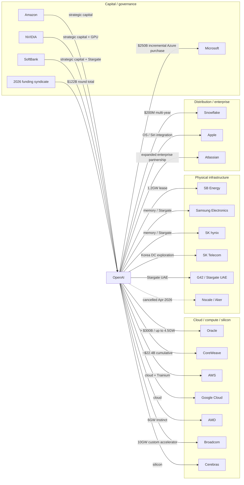
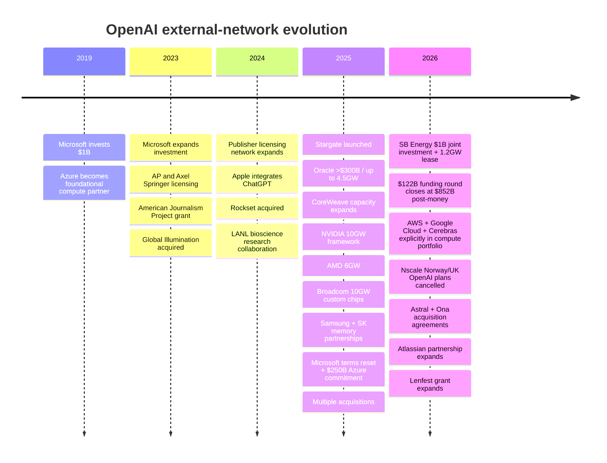
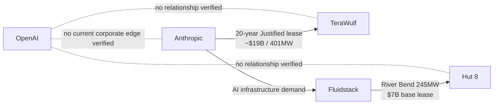

> Integration note: Supplied by the author from drr.md, research date 2026-10-08. Source links and conclusions are attributed to that report and were not independently reverified during integration. Negative findings reflect its search scope.

# OpenAI External Relationship Network — Updated Merge Report

**Research date:** 2026-10-08\
**Target dataset:** `model-lab-network.json`\
**Entity:** OpenAI / OpenAI Group PBC / OpenAI Foundation\
**Purpose:** verifiable relationship records suitable for merging into the existing Model Lab Network dataset.

## Executive summary

The existing Model Lab Network already captures several of OpenAI’s largest compute and capital relationships, including Oracle, CoreWeave, AMD, Broadcom, SoftBank/SB Energy, Stargate UAE, Nscale and the February 2026 strategic investment commitments. However, a fresh review of the baseline JSON, OpenAI’s primary disclosures, counterparties’ official releases, filings, and the Aral research library shows that the OpenAI graph needs several **material additions and status corrections**.

The highest-priority merge changes are:

**First, the February 2026 financing records should be updated rather than duplicated.** OpenAI initially announced $110 billion of strategic commitments—$50 billion from Amazon, $30 billion from NVIDIA and $30 billion from SoftBank—but on **March 31, 2026** it disclosed that the round had actually **closed with $122 billion of committed capital at an $852 billion post-money valuation**, with Microsoft continuing to participate and a large institutional syndicate joining. The $122 billion is the round-level total; it should **not** be added on top of the earlier $110 billion. OpenAI also expanded its undrawn revolving credit facility to approximately $4.7 billion.

**Second, the Microsoft edge is materially more complex than a simple investor/cloud relationship.** The October 28, 2025 definitive agreement left Microsoft as OpenAI’s frontier-model partner, extended key model/product IP rights through 2032, preserved Azure API exclusivity until verified AGI, removed Microsoft’s right of first refusal on new OpenAI compute, and committed OpenAI to purchase an **incremental $250 billion of Azure services**. At recapitalization Microsoft’s holding was valued at roughly **$135 billion**, about **27%** on an as-converted diluted basis at that point.

**Third, Samsung and SK are major missing OpenAI infrastructure edges.** On October 1, 2025, OpenAI made Samsung Electronics and SK hynix strategic memory partners under Stargate, targeting capacity sufficient for **up to 900,000 DRAM wafer starts per month**. OpenAI also signed Korean data-center arrangements with Samsung SDS, Samsung C&T, Samsung Heavy Industries, SK Telecom and Korea’s Ministry of Science and ICT. Samsung SDS separately became an OpenAI-services reseller in Korea. These are not marginal supplier references—they are part of OpenAI’s stated global infrastructure architecture.

**Fourth, several older “potential” Stargate relationships need their status changed.** OpenAI’s July 2025 Norway announcement described Nscale/Aker as a prospective infrastructure partner and OpenAI as a potential initial offtaker; the UK announcement was similarly exploratory. But a September 2026 Bloomberg report reproduced in Aral from Nscale’s S-1 says **OpenAI cancelled the Norway and UK Nscale Stargate plans in April 2026**, with Microsoft taking over Norway and Google reportedly positioned to replace OpenAI in the UK. Those nodes should remain in the historical graph but be marked **cancelled / historical**, not active OpenAI capacity.

**Fifth, OpenAI’s current compute architecture is deliberately multi-provider.** OpenAI itself described its March 2026 infrastructure portfolio as cloud through **Microsoft, Oracle, AWS, CoreWeave and Google Cloud**; silicon through **NVIDIA, AMD, AWS Trainium, Cerebras and OpenAI/Broadcom custom chips**; and data centers through **Oracle, SB Energy and SoftBank**. The graph should therefore stop treating Microsoft/Azure as an exclusive compute relationship even though Azure retains API exclusivity under defined contractual terms.

Finally, the three entities specifically requested require careful treatment. **TeraWulf and Hut 8 do not have a verifiable direct OpenAI relationship in the sources reviewed. Their prominent AI-lab relationships are with Anthropic and its infrastructure partners, not OpenAI.** Anthropic likewise has **no verifiable current corporate partnership, investment or contract with OpenAI**; there is a historical people lineage because Anthropic was founded by former OpenAI personnel, but that is not a current corporate edge. TeraWulf’s 2026 Justified lease is with Anthropic, while Hut 8’s River Bend project is tied to Fluidstack/Anthropic.



## Scope and merge methodology

I treated a relationship as dataset-worthy when it was publicly attributable to OpenAI and met at least one of these tests: material capital exposure; contracted or proposed compute capacity; strategic hardware/supply-chain relationship; strategic product/distribution partnership; content or technology licensing; acquisition; grant; public research collaboration; or a present governance/person overlap. Ordinary customer references and generic API users were excluded unless OpenAI or the counterparty publicly elevated the arrangement into a strategic relationship.

The provided baseline JSON was inspected as the starting point. Its OpenAI records already contain, among others, Oracle, CoreWeave, AMD, AMD warrants, Broadcom, SoftBank/SB Energy, Stargate UAE, Nscale and the February 2026 Amazon/NVIDIA/SoftBank capital commitments.  The proposed actions below therefore use:

**KEEP** — baseline relationship remains substantively correct.\
**UPDATE** — retain the edge but change economics, status or current-progress fields.\
**ADD** — material relationship was not observed among the baseline OpenAI edges parsed for this review.\
**NEGATIVE** — explicit “no verifiable relationship found” control record requested by the user.

For forward-looking or conditional transactions, I do **not** treat announced capacity, warrants, memoranda of understanding, intended investments, or exploratory offtake as equivalent to cash paid or capacity operating. This distinction is especially important for NVIDIA’s 2025 10GW/$100 billion framework, the Nscale projects, AMD warrants, and several Stargate site announcements.

## Updated relationship table

| Merge | Date / range | Counterparty | Amount / scale | Type | Relationship and current progress | Sources |
|---|---|---|---|---|---|---|
| **ADD** | 2019-07-22 | Microsoft | **$1B investment** | investment | Microsoft invested $1B and became OpenAI’s preferred partner for commercializing AI technologies; Azure supercomputing infrastructure was a core component. This is the foundational capital/cloud edge. | [S04](https://openai.com/index/microsoft-invests-in-and-partners-with-openai/)  |
| **ADD / consolidate** | 2023-01-23 | Microsoft | “Multi-billion dollar”; exact primary-source amount unspecified | investment | Expanded multi-year partnership covering additional investment, Azure supercomputing and commercial deployment. Best represented as a historical financing milestone under the broader Microsoft relationship rather than a second unrelated edge. | [S05](https://blogs.microsoft.com/blog/2023/01/23/microsoftandopenaiextendpartnership/)  |
| **UPDATE** | 2025-10-28 onward | Microsoft | **$250B incremental Azure services purchase**; Microsoft stake valued **~$135B / ~27%** at recapitalization | contract | Definitive agreement extended model/product IP rights through 2032, retained Azure API exclusivity until independently verified AGI, removed Microsoft’s compute ROFR, and committed OpenAI to another $250B of Azure services. The ~27% stake is explicitly the recapitalization-date figure, not necessarily the post-March-2026 fully diluted percentage. | [S02](https://openai.com/index/next-chapter-of-microsoft-openai-partnership/), [S03](https://openai.com/our-structure/)  |
| **UPDATE** | 2026-02-27 → 2026-03-31 | Amazon, NVIDIA, SoftBank, Microsoft, a16z, D. E. Shaw Ventures, MGX, TPG, T. Rowe Price-advised accounts, BlackRock-affiliated funds, Blackstone, Coatue, Fidelity, Sequoia, Temasek, Thrive, UC Investments and others | **$122B committed capital; $852B post-money** | investment | Replace/roll up the baseline’s February $110B announcement. Initial anchors were $50B Amazon, $30B NVIDIA, $30B SoftBank; the round subsequently closed at $122B with broader participation. **Do not sum $110B + $122B.** | [S01](https://openai.com/index/accelerating-the-next-phase-ai/)  |
| **ADD** | 2026-03-31 | JPMorgan, Citi, Goldman Sachs, Morgan Stanley, Wells Fargo, Mizuho, RBC, SMBC, UBS, HSBC, Santander | **~$4.7B revolving credit facility; undrawn at close** | contract | OpenAI expanded its revolver to approximately $4.7B. The banking syndicate is an important financing/liquidity edge separate from the equity round. | [S01](https://openai.com/index/accelerating-the-next-phase-ai/)  |
| **ADD** | 2025-01-21 onward | SoftBank, Oracle, MGX | **$500B intended over 4 years; $100B intended immediately** | infrastructure deal | Stargate Project launched as OpenAI’s U.S. AI-infrastructure platform. SoftBank was designated financial lead, OpenAI operational lead, Masayoshi Son chair; Oracle and MGX were initial equity funders. These figures are program ambitions, not equivalent to executed OpenAI purchase contracts. | [S06](https://openai.com/index/announcing-the-stargate-project/)  |
| **UPDATE** | 2025-07 to present | Oracle | **>$300B over five years; up to 4.5GW** | infrastructure deal | Core Stargate/OCI relationship. OpenAI says the Oracle partnership exceeds $300B over five years. Abilene was already operating in 2025; multiple additional sites were announced. A New Mexico component later encountered permitting/financing delays, but that does **not** imply cancellation of the overall Oracle relationship. | [S07](https://openai.com/index/five-new-stargate-sites/), [A3](https://aral.instap.net/reports?topic_id=14425428548582552)  |
| **UPDATE** | 2025-03 → 2025-09-23 and ongoing | CoreWeave | **~$22.4B cumulative contracted capacity** | contract | Initial ~$11.9B agreement was expanded by ~$4B and then up to another $6.5B; the September order runs through May 2031. Aral’s September 2026 UBS report still identifies OpenAI as a major CoreWeave customer, supporting an active-status classification. | [S00](https://reports.instap.net/data/model-lab-network.json), [A4](https://aral.instap.net/reports?topic_id=55521524811245514)  |
| **UPDATE** | 2025-09-22 → 2026 | NVIDIA | 2025 LOI: **≥10GW systems / intended investment up to $100B**; 2026 package included **$30B capital and 5GW dedicated Vera Rubin capacity** | infrastructure deal | The September 2025 announcement was a framework/LOI, not $100B cash received. By February–March 2026 the relationship had been reframed around $30B of strategic capital plus 3GW inference and 2GW training on Vera Rubin. For the graph, keep the 2025 LOI as historical and use the 2026 package as the current state; do not double count them. | [S08](https://openai.com/index/openai-nvidia-systems-partnership/), [S01](https://openai.com/index/accelerating-the-next-phase-ai/)  |
| **KEEP / UPDATE** | 2025-10-06 onward | AMD | Amount unspecified; **6GW** AMD Instinct GPUs | infrastructure deal | Definitive multi-generation GPU agreement. First 1GW of MI450 systems was scheduled for 2H26. As of this research date the deployment window has begun, but no primary-source completion announcement was found in this review. | [S09](https://openai.com/index/openai-amd-strategic-partnership/)  |
| **KEEP** | 2025-10-06 onward | AMD | Warrants for **up to 160M AMD shares** | investment | Equity-linked component tied to deployment, commercial and share-price milestones. This is **not** a cash investment and should not be added to infrastructure contract value. | [S09](https://openai.com/index/openai-amd-strategic-partnership/)  |
| **KEEP / UPDATE** | 2025-10-13 → 2029 | Broadcom | Amount unspecified; **10GW custom accelerators** | infrastructure deal | OpenAI designs the accelerators; Broadcom co-develops and deploys racks/networking. Deployment was scheduled to begin in 2H26 and run through 2029. OpenAI’s March 2026 disclosure continued to identify the OpenAI/Broadcom chip as part of its silicon strategy. | [S10](https://openai.com/index/openai-and-broadcom-announce-strategic-collaboration/), [S01](https://openai.com/index/accelerating-the-next-phase-ai/)  |
| **ADD / consolidate** | 2026-02-27 onward | Amazon / AWS | Strategic capital plus cloud distribution/compute; cloud-contract amount unspecified | partnership | In addition to Amazon’s strategic investment, OpenAI identifies AWS as one of its core cloud platforms and AWS Trainium as part of its silicon portfolio. Treat capital and compute/distribution as distinct economic dimensions even if represented under one entity node. | [S01](https://openai.com/index/accelerating-the-next-phase-ai/)  |
| **ADD** | By 2026-03-31 | Google Cloud | unspecified | infrastructure deal | OpenAI explicitly lists Google Cloud among its current cloud infrastructure providers. This is a significant change from an Azure-centric historical model and should be represented as an active compute edge. | [S01](https://openai.com/index/accelerating-the-next-phase-ai/)  |
| **ADD** | By 2026-03-31 | Cerebras | unspecified | partnership | OpenAI publicly lists Cerebras among the silicon platforms in its infrastructure strategy. Public terms were not specified in the source reviewed. | [S01](https://openai.com/index/accelerating-the-next-phase-ai/)  |
| **UPDATE / ADD investment edge** | 2026-01-09 onward | SB Energy, SoftBank | **$1B total equity investment: $500M OpenAI + $500M SoftBank** | investment | OpenAI and SoftBank each invested $500M in SB Energy. This is a separate equity relationship and should not be collapsed into the Stargate site-development edge. | [S12](https://openai.com/index/stargate-sb-energy-partnership/)  |
| **UPDATE** | 2026-01-09 onward | SB Energy | **1.2GW data-center lease**; financial amount unspecified | infrastructure deal | OpenAI selected SB Energy to build and operate the Milam County campus and signed a 1.2GW lease. SB Energy also became an OpenAI customer and the parties formed a non-exclusive preferred data-center partnership. Facilities were described as under construction with service beginning in 2026. | [S12](https://openai.com/index/stargate-sb-energy-partnership/)  |
| **ADD — high priority** | 2025-10-01 onward | Samsung Electronics, SK hynix | Financial amount unspecified; target support for **up to 900,000 DRAM wafer starts/month** | infrastructure deal | Samsung and SK became strategic Stargate memory partners and agreed to accelerate advanced-memory capacity for OpenAI. Both also planned broader internal deployment of ChatGPT Enterprise/API capabilities. This is one of the clearest omissions from the current graph. | [S13](https://openai.com/index/samsung-and-sk-join-stargate/), [S14](https://news.samsung.com/global/samsung-and-openai-announce-strategic-partnership-to-accelerate-advancements-in-global-ai-infrastructure), [A5](https://aral.instap.net/reports?topic_id=82258815548451152)  |
| **ADD** | 2025-10-01 onward | Samsung SDS | unspecified | partnership | LOI covering AI-data-center design/development/operation; Samsung SDS also signed a reseller partnership for OpenAI services in Korea. | [S14](https://news.samsung.com/global/samsung-and-openai-announce-strategic-partnership-to-accelerate-advancements-in-global-ai-infrastructure)  |
| **ADD** | 2025-10-01 onward | Samsung C&T, Samsung Heavy Industries | unspecified | research collaboration | Parties agreed to assess additional AI-data-center capacity and explore floating data centers, floating power plants and control centers. This remains exploratory rather than committed deployed capacity. | [S14](https://news.samsung.com/global/samsung-and-openai-announce-strategic-partnership-to-accelerate-advancements-in-global-ai-infrastructure)  |
| **ADD** | 2025-10-01 onward | SK Telecom | unspecified | infrastructure deal | OpenAI and SK Telecom agreed to explore construction of an AI data center in Korea. Status remains exploration/MoU-stage in the primary announcement. | [S13](https://openai.com/index/samsung-and-sk-join-stargate/)  |
| **ADD** | 2025-10-01 onward | Korea Ministry of Science and ICT | unspecified | partnership | MoU to evaluate AI-data-center opportunities outside the Seoul metropolitan area. Government/infrastructure-policy edge rather than a commercial capacity contract. | [S13](https://openai.com/index/samsung-and-sk-join-stargate/)  |
| **UPDATE** | 2025-05-22 onward | G42, Oracle, NVIDIA, Cisco, SoftBank | 2026 reporting: **~$30B first 1GW phase**; official 2025 announcement: 1GW cluster with first 200MW targeted for 2026 | infrastructure deal | Stargate UAE remains strategically active. A September 2026 Reuters report preserved in Aral says the broader 5GW masterplan is being reconsidered/distributed geographically because of security threats, while the first 1GW phase is expected to continue. Mark **active but design/timeline under review**. | [S15](https://openai.com/index/introducing-stargate-uae/), [A2](https://aral.instap.net/reports?topic_id=22258815181252811)  |
| **UPDATE → cancelled** | 2025-07-31 → 2026-04 | Nscale, Aker | Planned 230MW initially; target 100k GPUs by end-2026; amount unspecified | infrastructure deal | Original Stargate Norway announcement made OpenAI a prospective initial offtaker. Nscale’s later S-1/Bloomberg reporting says OpenAI **cancelled the Norway plan in April 2026**, with Microsoft agreeing to take it over. Keep as historical, status `cancelled`. | [S16](https://openai.com/index/introducing-stargate-norway/), [A1](https://aral.instap.net/reports?topic_id=55521525825288524)  |
| **UPDATE → cancelled / replaced** | 2025-09-16 → 2026-04 | Nscale, NVIDIA | Exploratory **8k GPUs, potential 31k** | infrastructure deal | Stargate UK involved exploratory OpenAI offtake rather than a firm take-or-pay commitment. Nscale’s later S-1/Bloomberg reporting says OpenAI cancelled its Nscale UK plan in April 2026 and Google was expected to take its place. | [S17](https://openai.com/index/introducing-stargate-uk/), [A1](https://aral.instap.net/reports?topic_id=55521525825288524)  |
| **KEEP** | 2026-02-02 onward | Snowflake | **$200M multi-year** | partnership | Multi-year partnership to embed OpenAI models/products into Snowflake’s enterprise-data environment. Baseline already captures this material commercial edge. | [S00](https://reports.instap.net/data/model-lab-network.json)  |
| **ADD / update prior 2023 tie** | 2023 → 2026-10-06 | Atlassian | unspecified | partnership | Partnership expanded in October 2026: GPT‑6 family/GPT‑6 Astra/GPT‑5.6 integrated across Atlassian/Rovo; more than 3,000 Atlassian developers use Codex; Atlassian expanded ChatGPT Enterprise, while OpenAI itself uses Jira. Active and unusually reciprocal enterprise relationship. | [S19](https://openai.com/index/atlassian-partnership/)  |
| **ADD** | 2024-06-10 onward | Apple | unspecified | partnership | Apple integrated ChatGPT into iOS, iPadOS and macOS, including Siri and Writing Tools. This is a distribution/product-integration edge, not a disclosed capital relationship. | [S20](https://openai.com/index/openai-and-apple-announce-partnership/)  |
| **ADD** | 2026-08-18 onward | Code.org / CodeAI | unspecified | partnership | Joint AI-literacy initiative covering students and educators, an advisory council, Hour of AI and Builders Challenge programs over the following year. | [S21](https://openai.com/index/partnering-with-codeai/)  |
| **ADD** | 2023-07-13 onward | Associated Press | undisclosed | licensing | AP licensed part of its text archive, including material dating back to 1985, for OpenAI use; AP gained access to OpenAI technology. | [S26](https://www.ap.org/media-center/press-releases/2023/ap-open-ai-agree-to-share-select-news-content-and-technology-in-new-collaboration/)  |
| **ADD** | 2023-12-13 onward | Axel Springer | undisclosed | licensing | Global partnership covers current/archival content from brands including POLITICO, Business Insider, BILD and WELT, with attribution and training rights. | [S27](https://www.axelspringer.com/en/ax-press-release/axel-springer-and-openai-partner-to-deepen-beneficial-use-of-ai-in-journalism)  |
| **ADD** | 2024-03-13 onward | Le Monde, Prisa Media | undisclosed | licensing | Content partnership covering ChatGPT responses and model training, including Le Monde and Prisa properties. | [S28](https://openai.com/index/global-news-partnerships-le-monde-and-prisa-media/)  |
| **ADD** | 2024-04-29 onward | Financial Times | undisclosed | licensing | Strategic partnership and content licensing, with attributed FT summaries/links in ChatGPT and product collaboration. FT was also already a ChatGPT Enterprise customer. | [S29](https://aboutus.ft.com/press_release/financial-times-announces-strategic-partnership-with-openai)  |
| **ADD** | 2024-05 | Reddit | undisclosed | licensing | OpenAI received access to Reddit’s real-time structured content through its Data API; Reddit gained OpenAI-powered features and OpenAI became an advertising partner. | [S38](https://www.redditinc.com/blog/reddit-and-openai-build-partnership)  |
| **ADD** | 2024-05-22 onward | News Corp | undisclosed | licensing | Multi-year content relationship covering current and archival material across major News Corp publications for OpenAI products. | [S30](https://openai.com/index/news-corp-and-openai-sign-landmark-multi-year-global-partnership/)  |
| **ADD** | 2024-05-29 onward | The Atlantic | undisclosed | licensing | Content and product partnership focused on attribution/discoverability and access to OpenAI technology for publisher experiments. | [S31](https://www.theatlantic.com/press-releases/archive/2024/05/atlantic-and-openai-announce-strategic-content-product-partnership/678558/)  |
| **ADD** | 2024-05-29 onward | Vox Media | undisclosed | licensing | OpenAI may use Vox archives to improve ChatGPT while Vox uses OpenAI technology in publishing products. | [S32](https://www.voxmedia.com/2024/5/29/24167472/vox-media-and-openai-form-strategic-content-and-product-partnership)  |
| **ADD** | 2024-06-27 onward | TIME | undisclosed | licensing | Multi-year content agreement covering TIME’s current content and century-scale archive for attributed use in OpenAI products. | [S33](https://openai.com/index/time-and-openai-announce-strategic-content-partnership/)  |
| **ADD** | 2024-08-20 onward | Condé Nast | undisclosed | licensing | Partnership enables OpenAI products to surface content from Condé Nast brands with attribution/links. | [S34](https://openai.com/index/conde-nast/)  |
| **ADD** | 2024-10-08 onward | Hearst | undisclosed | licensing | Content partnership covering more than 20 magazine brands and more than 40 newspapers, with attribution and links in OpenAI products. | [S35](https://www.hearst.com/-/hearst-and-openai-announce-strategic-content-partnership)  |
| **ADD** | 2024-12-04 onward | Future plc | undisclosed | licensing | Strategic content partnership covering Future’s portfolio of 200+ media brands for ChatGPT content experiences. | [S36](https://openai.com/index/future-partnership/)  |
| **ADD** | 2025-02-10 onward | Schibsted Media | undisclosed | licensing | Content from VG, Aftenposten, Aftonbladet and Svenska Dagbladet made available for attributed ChatGPT experiences. | [S37](https://openai.com/index/schibsted-media-partnership/)  |
| **ADD** | 2023-07-18 onward | American Journalism Project | **$5M cash grant + up to $5M API credits** | grant | OpenAI supported AJP’s local-news AI work through a $5M grant plus up to $5M of API credits. | [S22](https://www.theajp.org/news-insights/press-releases/openai-commits-5-million-to-the-american-journalism-project-to-support-ai-powered-local-news/)  |
| **ADD** | 2026-09-28 onward | Lenfest Institute / Lenfest AI Collaborative | **$5M commitment + up to $5M software credits/engineering support** | grant | OpenAI doubled down on Lenfest’s journalism-AI initiatives through new cash support and up to an equivalent amount of software/engineering support. | [S23](https://openai.com/index/lenfest-ai-collaborative-expansion/)  |
| **ADD** | 2024-07-10 onward | Los Alamos National Laboratory | unspecified | research collaboration | Joint bioscience safety research evaluates how multimodal frontier models affect expert and novice performance in physical laboratory tasks and dual-use-risk evaluation. | [S24](https://openai.com/index/openai-and-los-alamos-national-laboratory-work-together/)  |
| **ADD / expand research edge** | 2025-01-30 onward | Los Alamos, Lawrence Livermore, Sandia National Laboratories, Microsoft | unspecified | research collaboration | OpenAI signed an agreement making reasoning models available to approximately 15,000 national-lab scientists, including deployment on the Venado NVIDIA supercomputer at LANL; work includes science, cybersecurity and carefully reviewed national-security use cases. | [S25](https://openai.com/index/strengthening-americas-ai-leadership-with-the-us-national-laboratories/)  |
| **ADD** | 2023-08-16 | Global Illumination | undisclosed | acquisition | OpenAI acquired the company; its full team joined OpenAI to work on core products including ChatGPT. Completed. | [S39](https://openai.com/index/openai-acquires-global-illumination/)  |
| **ADD** | 2024-06-21 | Rockset | undisclosed | acquisition | Acquired real-time analytics/database company Rockset; team joined OpenAI and technology was slated for integration into retrieval infrastructure. Completed. | [S40](https://openai.com/index/openai-acquires-rockset/)  |
| **ADD** | 2025-05-21 / 2025-07-09 update | io Products / Jony Ive’s design team | Primary source does not state consideration | acquisition | io Products’ team merged into OpenAI; Jony Ive/LoveFrom remained independent but continued deep design/creative collaboration. Treat the corporate acquisition and LoveFrom relationship separately conceptually even if displayed around one node. | [S41](https://openai.com/sam-and-jony/)  |
| **ADD** | 2025-09-02 | Statsig | Primary announcement: unspecified | acquisition | OpenAI announced acquisition of Statsig and planned for founder Vijaye Raji to become CTO of Applications. Announcement was subject to approval; later closing was not separately re-verified in this research pass. | [S42](https://openai.com/index/vijaye-raji-to-become-cto-of-applications-with-acquisition-of-statsig/)  |
| **ADD** | 2025-10-23 | Software Applications Inc. / Sky | undisclosed | acquisition | OpenAI acquired the maker of Sky for Mac; team joined OpenAI and Sky technology is intended for ChatGPT integration. OpenAI disclosed that a fund associated with Sam Altman held a passive investment, with independent board committees approving the deal. | [S43](https://openai.com/index/openai-acquires-software-applications-incorporated/)  |
| **ADD** | 2025-12-03 | Neptune.ai | undisclosed | acquisition | Definitive acquisition agreement after prior close collaboration on frontier-training experiment tracking. Public announcement described intended deep integration into OpenAI’s training stack. | [S44](https://openai.com/index/openai-to-acquire-neptune/)  |
| **ADD** | 2026-03-09 | Promptfoo | undisclosed | acquisition | OpenAI announced acquisition of Promptfoo to strengthen security/evaluation capabilities around OpenAI Frontier; announcement-stage transaction in the source reviewed. | [S45](https://openai.com/index/openai-to-acquire-promptfoo/)  |
| **ADD** | 2026-03-19 | Astral | undisclosed | acquisition | OpenAI agreed to acquire the company behind `uv`, `Ruff` and `ty` for integration with Codex. The primary announcement explicitly says closing is subject to customary conditions and regulatory approval; no later closing confirmation was located in this review. | [S46](https://openai.com/index/openai-to-acquire-astral/)  |
| **ADD** | 2026-06-11 | Ona | undisclosed | acquisition | OpenAI agreed to acquire Ona’s secure cloud-execution/orchestration technology for Codex. The parties remained separate pending customary closing and regulatory approvals at announcement. | [S47](https://openai.com/index/openai-to-acquire-ona/)  |
| **ADD** | Current as of 2026-10-08 | Sierra / Bret Taylor | none | board overlap | Bret Taylor is Chair of OpenAI’s board and co-founder of Sierra, creating a current people/governance overlap between two AI companies. This does **not** by itself imply a commercial OpenAI–Sierra contract. | [S03](https://openai.com/our-structure/), [S48](https://sierra.ai/author/bret-taylor)  |
| **NEGATIVE / historical people link only** | Through 2026-10-08 | Anthropic | none | other | **No verifiable current corporate relationship found.** Anthropic has historical people lineage to OpenAI through former OpenAI personnel, but the searches found no current OpenAI↔Anthropic investment, partnership, contract, infrastructure deal or licensing arrangement. Their 2026 infrastructure/deployment programs are separate and competitive. | [[S51]], [S52](https://www.anthropic.com/news/anthropic-invests-50-billion-in-american-ai-infrastructure)  |
| **NEGATIVE** | Through 2026-10-08 | TeraWulf | none | other | **no verifiable relationship found.** TeraWulf’s material frontier-model lease found in this research is with **Anthropic**, not OpenAI: a 20-year Justified-campus lease with roughly $19B contracted revenue and 401MW critical IT load. | [S49](https://investors.terawulf.com/news-events/press-releases/detail/142/terawulf-announces-anthropic-lease-at-justified-data-campus-and-sale-of-majority-interest-in-abernathy-joint-venture-to-fluidstack)  |
| **NEGATIVE** | Through 2026-10-08 | Hut 8 | none | other | **no verifiable relationship found.** Hut 8’s River Bend AI infrastructure is tied to Fluidstack/Anthropic; the announced Fluidstack lease was 245MW with $7B base-term revenue and Google financial support. No OpenAI counterparty was identified. | [S50](https://www.hut8.com/news-insights/press-releases/hut-8-announces-ai-infrastructure-partnership-with-anthropic-and-fluidstack)  |

A useful way to interpret the chronology is that OpenAI has progressively moved from **one strategic cloud partner** toward a highly diversified, vertically integrated infrastructure network:



## Critical status corrections and network interpretation

The largest analytical mistake the network could make is to sum headline numbers as though they were homogeneous liabilities or cash transactions. They are not. The `$500B Stargate`, `>$300B Oracle`, `$122B financing`, `$250B Azure purchase`, NVIDIA’s old `up to $100B intended investment`, CoreWeave’s `$22.4B`, and capacity figures in gigawatts belong to different economic categories and overlapping time horizons. They must remain separate attributes rather than a single “OpenAI commitments” total.

The more revealing structural change is **supplier diversification without abandoning Microsoft**. In October 2025 Microsoft surrendered its right of first refusal on OpenAI compute while retaining powerful IP/API rights; by March 2026 OpenAI explicitly described a cloud portfolio spanning Microsoft, Oracle, AWS, CoreWeave and Google Cloud. That suggests OpenAI is managing compute more like a hyperscale buyer with a portfolio of capacity and silicon suppliers than like a captive Azure tenant.

The **Samsung/SK relationship is strategically more important than a routine memory-purchase edge**. OpenAI is effectively moving one layer deeper into semiconductor capacity planning: Samsung Electronics and SK hynix are being asked to plan accelerated DRAM supply against OpenAI’s long-run infrastructure needs, while Samsung’s broader conglomerate participates in data centers, reseller distribution and even floating-data-center research. Samsung’s own release describes it as a “strategic memory partner,” not merely a spot supplier.

The same “deeper into the stack” pattern appears with Broadcom and AMD. OpenAI is designing its own accelerator with Broadcom and received milestone-linked AMD warrants alongside a 6GW deployment agreement. That means OpenAI’s network contains not just customer→supplier edges but **co-design, incentive alignment and quasi-vertical-integration edges**.

The most important negative update is **Nscale**. The July/September 2025 announcements were useful evidence of OpenAI exploring European Stargate capacity, but they should no longer be presented as active OpenAI capacity. Aral’s September 21, 2026 report reproducing Bloomberg’s reading of Nscale’s S-1 states that OpenAI cancelled its Norway and UK Nscale plans in **April 2026**. The same report says Microsoft took over Norway, while Google was expected to succeed OpenAI in the UK. This is exactly the kind of lifecycle update a static relationship graph tends to miss. [A1](https://aral.instap.net/reports?topic_id=55521525825288524)

The second important execution-risk edge is Oracle’s **Project Jupiter / New Mexico** component. OpenAI’s overall Oracle relationship remains active, but Aral reporting on September 24 describes Oracle issuing a force-majeure notice concerning a 2.45GW New Mexico campus after natural-gas-pipeline permitting setbacks, with an associated $18B financing trading below par and outside estimates pushing first power later than underwriting assumptions. That belongs in the **current progress / risk** field of the Oracle relation, not as evidence that the whole Oracle/OpenAI contract is cancelled. [A3](https://aral.instap.net/reports?topic_id=14425428548582552)

Stargate UAE likewise needs nuance. OpenAI’s original announcement established the G42/Oracle/NVIDIA/Cisco/SoftBank relationship and the planned 1GW cluster. September 2026 Reuters reporting carried by Aral indicates the broader 5GW UAE campus concept was being reconsidered after regional attacks, potentially shifting from one large campus to a distributed network with additional physical protection. The first 1GW phase was reported as continuing. The correct state is therefore **active / configuration under review**, not cancelled.  [A2](https://aral.instap.net/reports?topic_id=22258815181252811)

```mermaid
flowchart TB
    Demand["OpenAI model + product demand"]

    Demand --> Capital["Capital<br/>$122B 2026 round"]
    Demand --> Cloud["Cloud portfolio"]
    Demand --> Silicon["Silicon portfolio"]
    Demand --> DC["Physical data centers"]
    Demand --> Memory["Memory / semiconductor capacity"]
    Demand --> Distribution["Distribution + enterprise"]
    Demand --> Content["Content / data rights"]
    Demand --> MNA["M&A / capability absorption"]

    Cloud --> MS["Microsoft"]
    Cloud --> O["Oracle"]
    Cloud --> AWS2["AWS"]
    Cloud --> CW["CoreWeave"]
    Cloud --> GC["Google Cloud"]

    Silicon --> N["NVIDIA"]
    Silicon --> A["AMD"]
    Silicon --> T["AWS Trainium"]
    Silicon --> C["Cerebras"]
    Silicon --> B["Broadcom custom chip"]

    DC --> SBE2["SB Energy"]
    DC --> SB["SoftBank"]
    DC --> G["G42 / UAE"]

    Memory --> SS["Samsung"]
    Memory --> SK["SK hynix"]

    Distribution --> Apple["Apple"]
    Distribution --> Atl["Atlassian"]
    Distribution --> Snow["Snowflake"]

    Content --> Media["AP / FT / News Corp /<br/>Atlantic / Vox / TIME / etc."]

    MNA --> Dev["Astral / Ona / Statsig"]
    MNA --> Data["Rockset / Neptune"]
    MNA --> UX["io / Sky"]

    NS["Nscale"] -. "cancelled Apr 2026" .-> DC
```



## Anthropic, TeraWulf and Hut 8 validation

The user’s original concern about Anthropic–TeraWulf–Hut 8 connections is valid for the broader **Model Lab Network**, but those links should **not** be attached to the OpenAI node.

### Anthropic

I found **no verifiable current corporate OpenAI↔Anthropic relationship** through October 8, 2026. The meaningful connection is historical human-capital lineage: Anthropic was founded by former OpenAI personnel. That is worth representing in a broad genealogy/people layer, but it should not be rendered as a current investment, contract or infrastructure relationship.

Importantly, 2026 reporting shows OpenAI and Anthropic pursuing **separate** deployment/infrastructure vehicles rather than a joint venture.

**Recommended graph treatment:** historical `other / people lineage`, current status `no current corporate relationship verified`.

### TeraWulf

**no verifiable relationship found** between TeraWulf and OpenAI.

TeraWulf announced a **20-year Anthropic lease** at the Justified Data Campus in July 2026, representing approximately **$19 billion of contracted revenue** and **401MW of critical IT load**, with initial capacity targeted for the second half of 2027 and full ramp in early 2028. That is a strong **Anthropic → TeraWulf** infrastructure edge, not an OpenAI edge.

The Aral full-text search for `OpenAI TeraWulf` also returned no report records.

### Hut 8

**no verifiable relationship found** between Hut 8 and OpenAI.

Hut 8’s River Bend relationship is an AI-infrastructure deal with **Fluidstack**, associated with Anthropic capacity. Hut 8 announced a 15-year lease representing **$7 billion of base-term revenue for 245MW**, with renewal potential taking total contract value higher and Google providing a financial backstop. Independent October 2026 reporting also describes the site in the context of Fluidstack/Anthropic computing demand.

**Recommended Model Lab graph:**



The investment implication is important: **TeraWulf and Hut 8 are not generic “frontier-lab compute” proxies in the same way as CoreWeave or Oracle. Their currently verified lab concentration is materially more Anthropic-linked.** By contrast, CoreWeave has a directly documented OpenAI customer relationship, and Oracle’s giant contracted infrastructure program is explicitly tied to OpenAI/Stargate.

## JSON export

The following export mirrors the cited records above. `unspecified` is used whenever I could not verify a monetary value in a sufficiently reliable source. Conditional capacities, warrants and intended investments are explicitly labeled so downstream code does not mistakenly treat them as cash consideration.

```json
[
  {
    "date": "2019-07-22",
    "amount": "USD 1 billion",
    "counterparties": ["OpenAI", "Microsoft"],
    "relationship_type": "investment",
    "summary": "Microsoft invested $1 billion in OpenAI and became a preferred commercialization and Azure supercomputing partner.",
    "current_status_progress": "Historical foundation of the still-active Microsoft relationship; subsequently expanded and renegotiated.",
    "sources": [
      "https://openai.com/index/microsoft-invests-in-and-partners-with-openai/"
    ]
  },
  {
    "date": "2023-01-23",
    "amount": "multi-billion USD; exact primary-source amount unspecified",
    "counterparties": ["OpenAI", "Microsoft"],
    "relationship_type": "investment",
    "summary": "OpenAI and Microsoft expanded their multi-year partnership through additional investment, Azure compute and commercial deployment.",
    "current_status_progress": "Superseded in important respects by the October 2025 definitive agreement but remains part of the financing history.",
    "sources": [
      "https://blogs.microsoft.com/blog/2023/01/23/microsoftandopenaiextendpartnership/"
    ]
  },
  {
    "date": "2025-10-28 onward",
    "amount": "USD 250 billion incremental Azure services commitment; Microsoft investment valued at approximately USD 135 billion at recapitalization",
    "counterparties": ["OpenAI", "Microsoft"],
    "relationship_type": "contract",
    "summary": "Definitive partnership reset extended key Microsoft model/product IP rights through 2032, retained Azure API exclusivity until verified AGI, removed Microsoft's compute right of first refusal, and committed OpenAI to an incremental $250 billion of Azure services.",
    "current_status_progress": "Active. Microsoft remained a major investor and participated in OpenAI's March 2026 financing.",
    "sources": [
      "https://openai.com/index/next-chapter-of-microsoft-openai-partnership/",
      "https://openai.com/our-structure/"
    ]
  },
  {
    "date": "2026-02-27 to 2026-03-31",
    "amount": "USD 122 billion committed capital at USD 852 billion post-money valuation",
    "counterparties": [
      "OpenAI",
      "Amazon",
      "NVIDIA",
      "SoftBank",
      "Microsoft",
      "a16z",
      "D. E. Shaw Ventures",
      "MGX",
      "TPG",
      "T. Rowe Price-advised accounts",
      "BlackRock-affiliated funds",
      "Blackstone",
      "Coatue",
      "Fidelity Management & Research",
      "Sequoia Capital",
      "Temasek",
      "Thrive Capital",
      "UC Investments",
      "other disclosed institutional investors"
    ],
    "relationship_type": "investment",
    "summary": "OpenAI closed a $122 billion funding round. The earlier February strategic announcement included $50 billion from Amazon, $30 billion from NVIDIA and $30 billion from SoftBank; the March closing added broader participation.",
    "current_status_progress": "Closed March 31, 2026. The $122 billion total supersedes the earlier $110 billion announcement and should not be added to it.",
    "sources": [
      "https://openai.com/index/accelerating-the-next-phase-ai/"
    ]
  },
  {
    "date": "2026-03-31",
    "amount": "approximately USD 4.7 billion revolving credit facility; undrawn at close",
    "counterparties": ["OpenAI", "JPMorgan Chase", "Citi", "Goldman Sachs", "Morgan Stanley", "Wells Fargo", "Mizuho", "RBC", "SMBC", "UBS", "HSBC", "Santander"],
    "relationship_type": "contract",
    "summary": "Global bank syndicate supports OpenAI's expanded revolving credit facility.",
    "current_status_progress": "Facility was undrawn at the March 2026 financing close.",
    "sources": [
      "https://openai.com/index/accelerating-the-next-phase-ai/"
    ]
  },
  {
    "date": "2025-01-21 onward",
    "amount": "USD 500 billion intended over four years; USD 100 billion intended immediately",
    "counterparties": ["OpenAI", "SoftBank", "Oracle", "MGX"],
    "relationship_type": "infrastructure deal",
    "summary": "Stargate Project established a large-scale U.S. AI infrastructure platform, with SoftBank as financial lead and OpenAI as operational lead.",
    "current_status_progress": "Active umbrella program. Program-level investment ambitions should not be treated as a single executed OpenAI contract.",
    "sources": [
      "https://openai.com/index/announcing-the-stargate-project/"
    ]
  },
  {
    "date": "2025-07 onward",
    "amount": "more than USD 300 billion over five years; up to 4.5 GW",
    "counterparties": ["OpenAI", "Oracle"],
    "relationship_type": "infrastructure deal",
    "summary": "OpenAI contracted major Oracle Cloud/Stargate capacity across multiple U.S. data-center sites.",
    "current_status_progress": "Active overall. Abilene entered operation; the New Mexico Project Jupiter component later encountered permitting and financing delays.",
    "sources": [
      "https://openai.com/index/five-new-stargate-sites/",
      "https://aral.instap.net/reports?topic_id=14425428548582552",
      "https://aral.instap.net/reports?topic_id=82258281182885242"
    ]
  },
  {
    "date": "2025-03 to 2025-09-23 and ongoing",
    "amount": "approximately USD 22.4 billion cumulative contracted capacity",
    "counterparties": ["OpenAI", "CoreWeave"],
    "relationship_type": "contract",
    "summary": "OpenAI progressively expanded reserved CoreWeave cloud capacity through multiple agreements, including a September 2025 order of up to $6.5 billion.",
    "current_status_progress": "Active; September order extends through May 2031. 2026 sell-side research continues to identify OpenAI as a major CoreWeave customer.",
    "sources": [
      "https://reports.instap.net/data/model-lab-network.json",
      "https://aral.instap.net/reports?topic_id=55521524811245514"
    ]
  },
  {
    "date": "2025-09-22 to 2026",
    "amount": "2025 framework: intended investment up to USD 100 billion and at least 10 GW; 2026 strategic package included USD 30 billion investment and 5 GW dedicated Vera Rubin capacity",
    "counterparties": ["OpenAI", "NVIDIA"],
    "relationship_type": "infrastructure deal",
    "summary": "OpenAI and NVIDIA established a large systems/investment framework; subsequent 2026 arrangements reframed the relationship around strategic equity and dedicated training/inference capacity.",
    "current_status_progress": "Active. Treat the 2025 $100 billion figure as an intended framework, not cash received, and avoid double counting against the 2026 package.",
    "sources": [
      "https://openai.com/index/openai-nvidia-systems-partnership/",
      "https://openai.com/index/accelerating-the-next-phase-ai/"
    ]
  },
  {
    "date": "2025-10-06 onward",
    "amount": "unspecified; 6 GW capacity",
    "counterparties": ["OpenAI", "AMD"],
    "relationship_type": "infrastructure deal",
    "summary": "Definitive multi-generation agreement for 6 GW of AMD Instinct GPUs.",
    "current_status_progress": "First 1 GW of MI450 systems was scheduled for deployment in the second half of 2026; no separate completion announcement was identified in this review.",
    "sources": [
      "https://openai.com/index/openai-amd-strategic-partnership/"
    ]
  },
  {
    "date": "2025-10-06 onward",
    "amount": "warrants for up to 160 million AMD shares",
    "counterparties": ["OpenAI", "AMD"],
    "relationship_type": "investment",
    "summary": "AMD issued OpenAI milestone-linked warrants tied to deployments, commercial outcomes and share-price milestones.",
    "current_status_progress": "Conditional equity instrument; not equivalent to cash consideration.",
    "sources": [
      "https://openai.com/index/openai-amd-strategic-partnership/"
    ]
  },
  {
    "date": "2025-10-13 to 2029",
    "amount": "unspecified; 10 GW custom accelerator deployment",
    "counterparties": ["OpenAI", "Broadcom"],
    "relationship_type": "infrastructure deal",
    "summary": "OpenAI designs custom accelerators while Broadcom co-develops and deploys accelerator and networking systems.",
    "current_status_progress": "Deployment scheduled from the second half of 2026 through the end of 2029; OpenAI still listed its Broadcom chip in its March 2026 infrastructure strategy.",
    "sources": [
      "https://openai.com/index/openai-and-broadcom-announce-strategic-collaboration/",
      "https://openai.com/index/accelerating-the-next-phase-ai/"
    ]
  },
  {
    "date": "2026-02-27 onward",
    "amount": "strategic investment included in 2026 funding round; cloud economics unspecified",
    "counterparties": ["OpenAI", "Amazon", "AWS"],
    "relationship_type": "partnership",
    "summary": "Strategic relationship spanning Amazon investment, AWS cloud capacity/distribution and AWS Trainium silicon.",
    "current_status_progress": "Active; OpenAI lists AWS among its core cloud providers and Trainium among its silicon platforms.",
    "sources": [
      "https://openai.com/index/accelerating-the-next-phase-ai/"
    ]
  },
  {
    "date": "by 2026-03-31",
    "amount": "unspecified",
    "counterparties": ["OpenAI", "Google Cloud"],
    "relationship_type": "infrastructure deal",
    "summary": "Google Cloud is explicitly included in OpenAI's multi-cloud infrastructure portfolio.",
    "current_status_progress": "Active as of OpenAI's March 2026 infrastructure disclosure.",
    "sources": [
      "https://openai.com/index/accelerating-the-next-phase-ai/"
    ]
  },
  {
    "date": "by 2026-03-31",
    "amount": "unspecified",
    "counterparties": ["OpenAI", "Cerebras"],
    "relationship_type": "partnership",
    "summary": "OpenAI explicitly lists Cerebras among the silicon platforms supporting its infrastructure strategy.",
    "current_status_progress": "Active relationship disclosed by OpenAI; detailed commercial terms unspecified.",
    "sources": [
      "https://openai.com/index/accelerating-the-next-phase-ai/"
    ]
  },
  {
    "date": "2026-01-09 onward",
    "amount": "USD 1 billion total equity investment; USD 500 million OpenAI and USD 500 million SoftBank",
    "counterparties": ["OpenAI", "SoftBank", "SB Energy"],
    "relationship_type": "investment",
    "summary": "OpenAI and SoftBank each invested $500 million in SB Energy.",
    "current_status_progress": "Active equity relationship separate from the data-center lease.",
    "sources": [
      "https://openai.com/index/stargate-sb-energy-partnership/"
    ]
  },
  {
    "date": "2026-01-09 onward",
    "amount": "financial amount unspecified; 1.2 GW lease",
    "counterparties": ["OpenAI", "SB Energy"],
    "relationship_type": "infrastructure deal",
    "summary": "OpenAI selected SB Energy to build and operate the Milam County data-center campus and signed a 1.2 GW lease.",
    "current_status_progress": "Facilities described as under construction with service beginning in 2026; SB Energy also became an OpenAI customer.",
    "sources": [
      "https://openai.com/index/stargate-sb-energy-partnership/"
    ]
  },
  {
    "date": "2025-10-01 onward",
    "amount": "unspecified; advanced-memory capacity targeting up to 900,000 DRAM wafer starts per month",
    "counterparties": ["OpenAI", "Samsung Electronics", "SK hynix"],
    "relationship_type": "infrastructure deal",
    "summary": "Samsung Electronics and SK hynix became strategic memory partners for Stargate and agreed to accelerate advanced-memory production supporting OpenAI infrastructure.",
    "current_status_progress": "Active strategic partnerships; detailed purchase values and allocation remain unspecified.",
    "sources": [
      "https://openai.com/index/samsung-and-sk-join-stargate/",
      "https://news.samsung.com/global/samsung-and-openai-announce-strategic-partnership-to-accelerate-advancements-in-global-ai-infrastructure",
      "https://aral.instap.net/reports?topic_id=82258815548451152",
      "https://aral.instap.net/reports?topic_id=82258251441524222"
    ]
  },
  {
    "date": "2025-10-01 onward",
    "amount": "unspecified",
    "counterparties": ["OpenAI", "Samsung SDS"],
    "relationship_type": "partnership",
    "summary": "LOI covers AI-data-center development and operation; Samsung SDS also became a reseller for OpenAI services in Korea.",
    "current_status_progress": "Active strategic/reseller relationship; data-center component remains development-stage.",
    "sources": [
      "https://news.samsung.com/global/samsung-and-openai-announce-strategic-partnership-to-accelerate-advancements-in-global-ai-infrastructure"
    ]
  },
  {
    "date": "2025-10-01 onward",
    "amount": "unspecified",
    "counterparties": ["OpenAI", "Samsung C&T", "Samsung Heavy Industries"],
    "relationship_type": "research collaboration",
    "summary": "Parties agreed to explore global and floating AI data centers, floating power plants and control centers.",
    "current_status_progress": "Exploratory; no committed deployed capacity or monetary consideration disclosed.",
    "sources": [
      "https://news.samsung.com/global/samsung-and-openai-announce-strategic-partnership-to-accelerate-advancements-in-global-ai-infrastructure"
    ]
  },
  {
    "date": "2025-10-01 onward",
    "amount": "unspecified",
    "counterparties": ["OpenAI", "SK Telecom"],
    "relationship_type": "infrastructure deal",
    "summary": "Partnership to explore an AI data center in Korea.",
    "current_status_progress": "Exploratory/MoU-stage in the public announcement.",
    "sources": [
      "https://openai.com/index/samsung-and-sk-join-stargate/"
    ]
  },
  {
    "date": "2025-10-01 onward",
    "amount": "unspecified",
    "counterparties": ["OpenAI", "Korea Ministry of Science and ICT"],
    "relationship_type": "partnership",
    "summary": "MoU to evaluate AI-data-center development outside the Seoul metropolitan area.",
    "current_status_progress": "Evaluation-stage government infrastructure partnership.",
    "sources": [
      "https://openai.com/index/samsung-and-sk-join-stargate/"
    ]
  },
  {
    "date": "2025-05-22 onward",
    "amount": "approximately USD 30 billion reported for first 1 GW phase; original primary announcement did not specify this amount",
    "counterparties": ["OpenAI", "G42", "Oracle", "NVIDIA", "Cisco", "SoftBank"],
    "relationship_type": "infrastructure deal",
    "summary": "Stargate UAE established a 1 GW Abu Dhabi compute cluster as the first phase of a larger UAE-US AI campus.",
    "current_status_progress": "Active but broader 5 GW masterplan was reported in September 2026 as being redesigned for security and geographic distribution; first 1 GW phase expected to continue.",
    "sources": [
      "https://openai.com/index/introducing-stargate-uae/",
      "https://aral.instap.net/reports?topic_id=22258815181252811"
    ]
  },
  {
    "date": "2025-07-31 to 2026-04",
    "amount": "unspecified; original plan 230 MW with expansion ambition and target of 100,000 NVIDIA GPUs by end-2026",
    "counterparties": ["OpenAI", "Nscale", "Aker"],
    "relationship_type": "infrastructure deal",
    "summary": "Stargate Norway was announced with OpenAI as a prospective initial offtaker.",
    "current_status_progress": "Cancelled by OpenAI in April 2026 according to Nscale S-1/Bloomberg reporting carried by Aral; Microsoft agreed to take over the Norway capacity.",
    "sources": [
      "https://openai.com/index/introducing-stargate-norway/",
      "https://aral.instap.net/reports?topic_id=55521525825288524"
    ]
  },
  {
    "date": "2025-09-16 to 2026-04",
    "amount": "unspecified; exploratory 8,000 GPUs with potential scaling to 31,000",
    "counterparties": ["OpenAI", "Nscale", "NVIDIA"],
    "relationship_type": "infrastructure deal",
    "summary": "Stargate UK announcement contemplated OpenAI GPU offtake from Nscale infrastructure.",
    "current_status_progress": "OpenAI cancelled the Nscale UK plan in April 2026 according to Nscale S-1/Bloomberg reporting carried by Aral; Google was reportedly positioned as replacement.",
    "sources": [
      "https://openai.com/index/introducing-stargate-uk/",
      "https://aral.instap.net/reports?topic_id=55521525825288524"
    ]
  },
  {
    "date": "2026-02-02 onward",
    "amount": "USD 200 million multi-year",
    "counterparties": ["OpenAI", "Snowflake"],
    "relationship_type": "partnership",
    "summary": "Multi-year enterprise AI partnership integrating OpenAI capabilities into Snowflake's data platform.",
    "current_status_progress": "Active according to the existing Model Lab Network baseline.",
    "sources": [
      "https://reports.instap.net/data/model-lab-network.json"
    ]
  },
  {
    "date": "2023 to 2026-10-06",
    "amount": "unspecified",
    "counterparties": ["OpenAI", "Atlassian"],
    "relationship_type": "partnership",
    "summary": "Long-running enterprise partnership expanded in October 2026 across Atlassian products, Rovo, ChatGPT Enterprise and Codex.",
    "current_status_progress": "Active and expanded; more than 3,000 Atlassian developers were reported using Codex.",
    "sources": [
      "https://openai.com/index/atlassian-partnership/"
    ]
  },
  {
    "date": "2024-06-10 onward",
    "amount": "unspecified",
    "counterparties": ["OpenAI", "Apple"],
    "relationship_type": "partnership",
    "summary": "Apple integrated ChatGPT into iOS, iPadOS and macOS, including Siri and Writing Tools.",
    "current_status_progress": "Product-distribution/integration relationship; no disclosed capital consideration in the primary announcement.",
    "sources": [
      "https://openai.com/index/openai-and-apple-announce-partnership/"
    ]
  },
  {
    "date": "2026-08-18 onward",
    "amount": "unspecified",
    "counterparties": ["OpenAI", "CodeAI", "Code.org"],
    "relationship_type": "partnership",
    "summary": "AI-literacy partnership supporting students and educators through advisory, Hour of AI and Builders Challenge initiatives.",
    "current_status_progress": "Active program announced for the following year.",
    "sources": [
      "https://openai.com/index/partnering-with-codeai/"
    ]
  },
  {
    "date": "2023-07-13 onward",
    "amount": "undisclosed",
    "counterparties": ["OpenAI", "Associated Press"],
    "relationship_type": "licensing",
    "summary": "AP licensed portions of its text archive to OpenAI while gaining access to OpenAI technology.",
    "current_status_progress": "No public termination identified in this review.",
    "sources": [
      "https://www.ap.org/media-center/press-releases/2023/ap-open-ai-agree-to-share-select-news-content-and-technology-in-new-collaboration/"
    ]
  },
  {
    "date": "2023-12-13 onward",
    "amount": "undisclosed",
    "counterparties": ["OpenAI", "Axel Springer"],
    "relationship_type": "licensing",
    "summary": "Global content and technology partnership covering brands including POLITICO, Business Insider, BILD and WELT.",
    "current_status_progress": "Multi-year strategic content relationship; no public termination identified.",
    "sources": [
      "https://www.axelspringer.com/en/ax-press-release/axel-springer-and-openai-partner-to-deepen-beneficial-use-of-ai-in-journalism"
    ]
  },
  {
    "date": "2024-03-13 onward",
    "amount": "undisclosed",
    "counterparties": ["OpenAI", "Le Monde", "Prisa Media"],
    "relationship_type": "licensing",
    "summary": "Content partnerships provide attributed publisher material in ChatGPT and support model training.",
    "current_status_progress": "No public termination identified in this review.",
    "sources": [
      "https://openai.com/index/global-news-partnerships-le-monde-and-prisa-media/"
    ]
  },
  {
    "date": "2024-04-29 onward",
    "amount": "undisclosed",
    "counterparties": ["OpenAI", "Financial Times"],
    "relationship_type": "licensing",
    "summary": "Strategic licensing and product-development partnership with attribution and links to FT content.",
    "current_status_progress": "Ongoing multi-dimensional publisher and enterprise relationship unless otherwise terminated.",
    "sources": [
      "https://aboutus.ft.com/press_release/financial-times-announces-strategic-partnership-with-openai"
    ]
  },
  {
    "date": "2024-05 onward",
    "amount": "undisclosed",
    "counterparties": ["OpenAI", "Reddit"],
    "relationship_type": "licensing",
    "summary": "OpenAI received access to Reddit's real-time structured content through its Data API; Reddit gained OpenAI-powered capabilities and OpenAI became an advertising partner.",
    "current_status_progress": "Strategic data/product relationship; no termination identified in this review.",
    "sources": [
      "https://www.redditinc.com/blog/reddit-and-openai-build-partnership"
    ]
  },
  {
    "date": "2024-05-22 onward",
    "amount": "undisclosed",
    "counterparties": ["OpenAI", "News Corp"],
    "relationship_type": "licensing",
    "summary": "Multi-year agreement permits use of current and archival content from major News Corp publications in OpenAI products.",
    "current_status_progress": "Multi-year relationship; no public termination identified.",
    "sources": [
      "https://openai.com/index/news-corp-and-openai-sign-landmark-multi-year-global-partnership/"
    ]
  },
  {
    "date": "2024-05-29 onward",
    "amount": "undisclosed",
    "counterparties": ["OpenAI", "The Atlantic"],
    "relationship_type": "licensing",
    "summary": "Content and product partnership involving discoverability, attribution and publisher experimentation with OpenAI technology.",
    "current_status_progress": "No public termination identified.",
    "sources": [
      "https://www.theatlantic.com/press-releases/archive/2024/05/atlantic-and-openai-announce-strategic-content-product-partnership/678558/"
    ]
  },
  {
    "date": "2024-05-29 onward",
    "amount": "undisclosed",
    "counterparties": ["OpenAI", "Vox Media"],
    "relationship_type": "licensing",
    "summary": "Strategic partnership allows OpenAI to use Vox archives to enhance ChatGPT while Vox uses OpenAI technology in publishing products.",
    "current_status_progress": "No public termination identified.",
    "sources": [
      "https://www.voxmedia.com/2024/5/29/24167472/vox-media-and-openai-form-strategic-content-and-product-partnership"
    ]
  },
  {
    "date": "2024-06-27 onward",
    "amount": "undisclosed",
    "counterparties": ["OpenAI", "TIME"],
    "relationship_type": "licensing",
    "summary": "Multi-year agreement provides OpenAI access to TIME's current content and historical archive for attributed responses.",
    "current_status_progress": "Multi-year relationship; no public termination identified.",
    "sources": [
      "https://openai.com/index/time-and-openai-announce-strategic-content-partnership/"
    ]
  },
  {
    "date": "2024-08-20 onward",
    "amount": "undisclosed",
    "counterparties": ["OpenAI", "Condé Nast"],
    "relationship_type": "licensing",
    "summary": "OpenAI products may surface attributed content from Condé Nast brands.",
    "current_status_progress": "No public termination identified.",
    "sources": [
      "https://openai.com/index/conde-nast/"
    ]
  },
  {
    "date": "2024-10-08 onward",
    "amount": "undisclosed",
    "counterparties": ["OpenAI", "Hearst"],
    "relationship_type": "licensing",
    "summary": "Content partnership covers more than 20 magazine brands and more than 40 newspapers.",
    "current_status_progress": "No public termination identified.",
    "sources": [
      "https://www.hearst.com/-/hearst-and-openai-announce-strategic-content-partnership"
    ]
  },
  {
    "date": "2024-12-04 onward",
    "amount": "undisclosed",
    "counterparties": ["OpenAI", "Future plc"],
    "relationship_type": "licensing",
    "summary": "Strategic content partnership covers Future's portfolio of more than 200 media brands.",
    "current_status_progress": "No public termination identified.",
    "sources": [
      "https://openai.com/index/future-partnership/"
    ]
  },
  {
    "date": "2025-02-10 onward",
    "amount": "undisclosed",
    "counterparties": ["OpenAI", "Schibsted Media"],
    "relationship_type": "licensing",
    "summary": "Content from major Scandinavian news brands is made available for attributed ChatGPT experiences.",
    "current_status_progress": "No public termination identified.",
    "sources": [
      "https://openai.com/index/schibsted-media-partnership/"
    ]
  },
  {
    "date": "2023-07-18 onward",
    "amount": "USD 5 million cash grant plus up to USD 5 million of API credits",
    "counterparties": ["OpenAI", "American Journalism Project"],
    "relationship_type": "grant",
    "summary": "OpenAI funded experimentation and tooling for AI in local journalism.",
    "current_status_progress": "Programmatic grant relationship.",
    "sources": [
      "https://www.theajp.org/news-insights/press-releases/openai-commits-5-million-to-the-american-journalism-project-to-support-ai-powered-local-news/"
    ]
  },
  {
    "date": "2026-09-28 onward",
    "amount": "USD 5 million commitment plus up to USD 5 million in software credits and engineering support",
    "counterparties": ["OpenAI", "Lenfest Institute", "Lenfest AI Collaborative"],
    "relationship_type": "grant",
    "summary": "OpenAI expanded support for journalism-focused AI development and fellowships.",
    "current_status_progress": "Active newly expanded program.",
    "sources": [
      "https://openai.com/index/lenfest-ai-collaborative-expansion/"
    ]
  },
  {
    "date": "2024-07-10 onward",
    "amount": "unspecified",
    "counterparties": ["OpenAI", "Los Alamos National Laboratory"],
    "relationship_type": "research collaboration",
    "summary": "Joint bioscience safety research evaluates multimodal frontier-model effects in physical laboratory tasks.",
    "current_status_progress": "Research collaboration later broadened through the U.S. National Laboratories agreement.",
    "sources": [
      "https://openai.com/index/openai-and-los-alamos-national-laboratory-work-together/"
    ]
  },
  {
    "date": "2025-01-30 onward",
    "amount": "unspecified",
    "counterparties": ["OpenAI", "Los Alamos National Laboratory", "Lawrence Livermore National Laboratory", "Sandia National Laboratories", "Microsoft"],
    "relationship_type": "research collaboration",
    "summary": "OpenAI agreed to make reasoning models available to approximately 15,000 national-lab scientists, including deployment on the Venado NVIDIA supercomputer.",
    "current_status_progress": "Expanded public-sector scientific and national-security collaboration.",
    "sources": [
      "https://openai.com/index/strengthening-americas-ai-leadership-with-the-us-national-laboratories/"
    ]
  },
  {
    "date": "2023-08-16",
    "amount": "unspecified",
    "counterparties": ["OpenAI", "Global Illumination"],
    "relationship_type": "acquisition",
    "summary": "OpenAI acquired Global Illumination and its team joined OpenAI.",
    "current_status_progress": "Completed and integrated.",
    "sources": [
      "https://openai.com/index/openai-acquires-global-illumination/"
    ]
  },
  {
    "date": "2024-06-21",
    "amount": "unspecified",
    "counterparties": ["OpenAI", "Rockset"],
    "relationship_type": "acquisition",
    "summary": "OpenAI acquired real-time analytics database company Rockset to strengthen retrieval infrastructure.",
    "current_status_progress": "Completed; Rockset team joined OpenAI and technology was slated for product integration.",
    "sources": [
      "https://openai.com/index/openai-acquires-rockset/"
    ]
  },
  {
    "date": "2025-05-21 to 2025-07-09",
    "amount": "unspecified in primary source",
    "counterparties": ["OpenAI", "io Products", "Jony Ive", "LoveFrom"],
    "relationship_type": "acquisition",
    "summary": "io Products' team merged into OpenAI; Jony Ive and LoveFrom remained independent while taking a deep design role across OpenAI.",
    "current_status_progress": "io team integrated; LoveFrom relationship remains collaborative rather than acquired.",
    "sources": [
      "https://openai.com/sam-and-jony/"
    ]
  },
  {
    "date": "2025-09-02",
    "amount": "unspecified in primary announcement",
    "counterparties": ["OpenAI", "Statsig"],
    "relationship_type": "acquisition",
    "summary": "OpenAI announced the acquisition of Statsig and planned for founder Vijaye Raji to become CTO of Applications.",
    "current_status_progress": "Transaction was announced subject to approval; later closing was not separately re-verified in this research pass.",
    "sources": [
      "https://openai.com/index/vijaye-raji-to-become-cto-of-applications-with-acquisition-of-statsig/"
    ]
  },
  {
    "date": "2025-10-23",
    "amount": "unspecified",
    "counterparties": ["OpenAI", "Software Applications Incorporated", "Sky"],
    "relationship_type": "acquisition",
    "summary": "OpenAI acquired Software Applications Incorporated, maker of the Sky natural-language Mac interface.",
    "current_status_progress": "Completed; team joined OpenAI. OpenAI disclosed a passive investment by a fund associated with Sam Altman and independent board approval.",
    "sources": [
      "https://openai.com/index/openai-acquires-software-applications-incorporated/"
    ]
  },
  {
    "date": "2025-12-03",
    "amount": "unspecified",
    "counterparties": ["OpenAI", "Neptune.ai"],
    "relationship_type": "acquisition",
    "summary": "OpenAI entered a definitive agreement to acquire Neptune after collaborating on frontier-training experiment tooling.",
    "current_status_progress": "Integration into OpenAI's training stack was planned; later closing status was not separately re-verified.",
    "sources": [
      "https://openai.com/index/openai-to-acquire-neptune/"
    ]
  },
  {
    "date": "2026-03-09",
    "amount": "unspecified",
    "counterparties": ["OpenAI", "Promptfoo"],
    "relationship_type": "acquisition",
    "summary": "OpenAI announced acquisition of Promptfoo to expand security and evaluation capabilities.",
    "current_status_progress": "Announcement-stage transaction in the primary source reviewed.",
    "sources": [
      "https://openai.com/index/openai-to-acquire-promptfoo/"
    ]
  },
  {
    "date": "2026-03-19",
    "amount": "unspecified",
    "counterparties": ["OpenAI", "Astral"],
    "relationship_type": "acquisition",
    "summary": "OpenAI agreed to acquire Astral and integrate its Python developer tooling with Codex.",
    "current_status_progress": "Primary announcement says closing remains subject to customary conditions and regulatory approval; no later closing confirmation was identified.",
    "sources": [
      "https://openai.com/index/openai-to-acquire-astral/"
    ]
  },
  {
    "date": "2026-06-11",
    "amount": "unspecified",
    "counterparties": ["OpenAI", "Ona"],
    "relationship_type": "acquisition",
    "summary": "OpenAI agreed to acquire Ona's secure cloud execution and orchestration technology for Codex.",
    "current_status_progress": "At announcement, closing was subject to customary conditions and regulatory approvals and the companies remained independent until close.",
    "sources": [
      "https://openai.com/index/openai-to-acquire-ona/"
    ]
  },
  {
    "date": "current as of 2026-10-08",
    "amount": "none",
    "counterparties": ["OpenAI", "Bret Taylor", "Sierra"],
    "relationship_type": "board overlap",
    "summary": "Bret Taylor is Chair of OpenAI's board and co-founder of Sierra.",
    "current_status_progress": "Current governance/people overlap; no commercial OpenAI-Sierra relationship should be inferred solely from the shared individual.",
    "sources": [
      "https://openai.com/our-structure/",
      "https://sierra.ai/author/bret-taylor"
    ]
  },
  {
    "date": "as of 2026-10-08",
    "amount": "none",
    "counterparties": ["OpenAI", "Anthropic"],
    "relationship_type": "other",
    "summary": "No verifiable current corporate relationship found. Historical people lineage exists because Anthropic was founded by former OpenAI personnel, but no current OpenAI-Anthropic investment, contract, partnership, licensing or infrastructure deal was verified.",
    "current_status_progress": "Competitors with separate infrastructure/deployment strategies.",
    "sources": [
      "https://www.anthropic.com/news/anthropic-invests-50-billion-in-american-ai-infrastructure"
    ]
  },
  {
    "date": "as of 2026-10-08",
    "amount": "none",
    "counterparties": ["OpenAI", "TeraWulf"],
    "relationship_type": "other",
    "summary": "no verifiable relationship found",
    "current_status_progress": "TeraWulf's verified frontier-model relationship is with Anthropic, including a 20-year Justified campus lease, not OpenAI.",
    "sources": [
      "https://investors.terawulf.com/news-events/press-releases/detail/142/terawulf-announces-anthropic-lease-at-justified-data-campus-and-sale-of-majority-interest-in-abernathy-joint-venture-to-fluidstack"
    ]
  },
  {
    "date": "as of 2026-10-08",
    "amount": "none",
    "counterparties": ["OpenAI", "Hut 8"],
    "relationship_type": "other",
    "summary": "no verifiable relationship found",
    "current_status_progress": "Hut 8's River Bend AI infrastructure relationship is with Fluidstack/Anthropic; no OpenAI counterparty was identified.",
    "sources": [
      "https://www.hut8.com/news-insights/press-releases/hut-8-announces-ai-infrastructure-partnership-with-anthropic-and-fluidstack"
    ]
  }
]
```

## Sources

The source registry below is organized for direct import into an Obsidian research vault. Primary-company sources are preferred; Aral entries are explicitly separated as secondary/research-library evidence.

### Primary and official sources

- [[S00 Model Lab Network baseline]] — `https://reports.instap.net/data/model-lab-network.json`
- [[S01 OpenAI — $122B funding round / infrastructure strategy]] — `https://openai.com/index/accelerating-the-next-phase-ai/`
- [[S02 OpenAI — Microsoft partnership reset]] — `https://openai.com/index/next-chapter-of-microsoft-openai-partnership/`
- [[S03 OpenAI — corporate structure and board]] — `https://openai.com/our-structure/`
- [[S04 OpenAI — Microsoft 2019 investment]] — `https://openai.com/index/microsoft-invests-in-and-partners-with-openai/`
- [[S05 Microsoft — 2023 OpenAI expansion]] — `https://blogs.microsoft.com/blog/2023/01/23/microsoftandopenaiextendpartnership/`
- [[S06 OpenAI — Stargate launch]] — `https://openai.com/index/announcing-the-stargate-project/`
- [[S07 OpenAI — five new Stargate sites]] — `https://openai.com/index/five-new-stargate-sites/`
- [[S08 OpenAI — NVIDIA systems partnership]] — `https://openai.com/index/openai-nvidia-systems-partnership/`
- [[S09 OpenAI — AMD strategic partnership]] — `https://openai.com/index/openai-amd-strategic-partnership/`
- [[S10 OpenAI — Broadcom collaboration]] — `https://openai.com/index/openai-and-broadcom-announce-strategic-collaboration/`
- [[S12 OpenAI — SB Energy partnership]] — `https://openai.com/index/stargate-sb-energy-partnership/`
- [[S13 OpenAI — Samsung and SK join Stargate]] — `https://openai.com/index/samsung-and-sk-join-stargate/`
- [[S14 Samsung — OpenAI strategic partnership]] — `https://news.samsung.com/global/samsung-and-openai-announce-strategic-partnership-to-accelerate-advancements-in-global-ai-infrastructure`
- [[S15 OpenAI — Stargate UAE]] — `https://openai.com/index/introducing-stargate-uae/`
- [[S16 OpenAI — Stargate Norway]] — `https://openai.com/index/introducing-stargate-norway/`
- [[S17 OpenAI — Stargate UK]] — `https://openai.com/index/introducing-stargate-uk/`
- [[S19 OpenAI — Atlassian partnership expansion]] — `https://openai.com/index/atlassian-partnership/`
- [[S20 OpenAI — Apple partnership]] — `https://openai.com/index/openai-and-apple-announce-partnership/`
- [[S21 OpenAI — CodeAI]] — `https://openai.com/index/partnering-with-codeai/`
- [[S22 American Journalism Project — OpenAI grant]] — `https://www.theajp.org/news-insights/press-releases/openai-commits-5-million-to-the-american-journalism-project-to-support-ai-powered-local-news/`
- [[S23 OpenAI — Lenfest expansion]] — `https://openai.com/index/lenfest-ai-collaborative-expansion/`
- [[S24 OpenAI — LANL bioscience partnership]] — `https://openai.com/index/openai-and-los-alamos-national-laboratory-work-together/`
- [[S25 OpenAI — U.S. National Laboratories]] — `https://openai.com/index/strengthening-americas-ai-leadership-with-the-us-national-laboratories/`
- [[S26 Associated Press — OpenAI agreement]] — `https://www.ap.org/media-center/press-releases/2023/ap-open-ai-agree-to-share-select-news-content-and-technology-in-new-collaboration/`
- [[S27 Axel Springer — OpenAI partnership]] — `https://www.axelspringer.com/en/ax-press-release/axel-springer-and-openai-partner-to-deepen-beneficial-use-of-ai-in-journalism`
- [[S28 OpenAI — Le Monde / Prisa]] — `https://openai.com/index/global-news-partnerships-le-monde-and-prisa-media/`
- [[S29 Financial Times — OpenAI partnership]] — `https://aboutus.ft.com/press_release/financial-times-announces-strategic-partnership-with-openai`
- [[S30 OpenAI — News Corp]] — `https://openai.com/index/news-corp-and-openai-sign-landmark-multi-year-global-partnership/`
- [[S31 The Atlantic — OpenAI partnership]] — `https://www.theatlantic.com/press-releases/archive/2024/05/atlantic-and-openai-announce-strategic-content-product-partnership/678558/`
- [[S32 Vox Media — OpenAI partnership]] — `https://www.voxmedia.com/2024/5/29/24167472/vox-media-and-openai-form-strategic-content-and-product-partnership`
- [[S33 OpenAI — TIME]] — `https://openai.com/index/time-and-openai-announce-strategic-content-partnership/`
- [[S34 OpenAI — Condé Nast]] — `https://openai.com/index/conde-nast/`
- [[S35 Hearst — OpenAI partnership]] — `https://www.hearst.com/-/hearst-and-openai-announce-strategic-content-partnership`
- [[S36 OpenAI — Future partnership]] — `https://openai.com/index/future-partnership/`
- [[S37 OpenAI — Schibsted Media]] — `https://openai.com/index/schibsted-media-partnership/`
- [[S38 Reddit — OpenAI partnership]] — `https://www.redditinc.com/blog/reddit-and-openai-build-partnership`
- [[S39 OpenAI — Global Illumination acquisition]] — `https://openai.com/index/openai-acquires-global-illumination/`
- [[S40 OpenAI — Rockset acquisition]] — `https://openai.com/index/openai-acquires-rockset/`
- [[S41 OpenAI — Sam & Jony / io]] — `https://openai.com/sam-and-jony/`
- [[S42 OpenAI — Statsig acquisition]] — `https://openai.com/index/vijaye-raji-to-become-cto-of-applications-with-acquisition-of-statsig/`
- [[S43 OpenAI — Software Applications / Sky acquisition]] — `https://openai.com/index/openai-acquires-software-applications-incorporated/`
- [[S44 OpenAI — Neptune acquisition]] — `https://openai.com/index/openai-to-acquire-neptune/`
- [[S45 OpenAI — Promptfoo acquisition]] — `https://openai.com/index/openai-to-acquire-promptfoo/`
- [[S46 OpenAI — Astral acquisition]] — `https://openai.com/index/openai-to-acquire-astral/`
- [[S47 OpenAI — Ona acquisition]] — `https://openai.com/index/openai-to-acquire-ona/`
- [[S48 Sierra — Bret Taylor]] — `https://sierra.ai/author/bret-taylor`
- [[S49 TeraWulf — Anthropic lease]] — `https://investors.terawulf.com/news-events/press-releases/detail/142/terawulf-announces-anthropic-lease-at-justified-data-campus-and-sale-of-majority-interest-in-abernathy-joint-venture-to-fluidstack`
- [[S50 Hut 8 — Anthropic / Fluidstack infrastructure partnership]] — `https://www.hut8.com/news-insights/press-releases/hut-8-announces-ai-infrastructure-partnership-with-anthropic-and-fluidstack`
- [[S52 Anthropic — American AI infrastructure]] — `https://www.anthropic.com/news/anthropic-invests-50-billion-in-american-ai-infrastructure`

### Aral research-library sources

- [[A1 Nscale S-1 / Bloomberg — OpenAI Norway and UK cancellations]] — `https://aral.instap.net/reports?topic_id=55521525825288524`
- [[A2 Reuters / Aral — Stargate UAE security redesign]] — `https://aral.instap.net/reports?topic_id=22258815181252811`
- [[A3 Aral — Oracle Project Jupiter / Stargate financing and delay risk]] — `https://aral.instap.net/reports?topic_id=14425428548582552`
- [[A4 UBS / Aral — CoreWeave customer concentration and infrastructure outlook]] — `https://aral.instap.net/reports?topic_id=55521524811245514`
- [[A5 Aral — OpenAI / Samsung strategic-memory significance]] — `https://aral.instap.net/reports?topic_id=82258815548451152`
- [[A6 Aral — model companies moving toward direct memory procurement; OpenAI Samsung/SK reference]] — `https://aral.instap.net/reports?topic_id=82258251441524222`
- [[A7 Aral — Oracle credit/Stargate concentration discussion]] — `https://aral.instap.net/reports?topic_id=82258281182885242`
