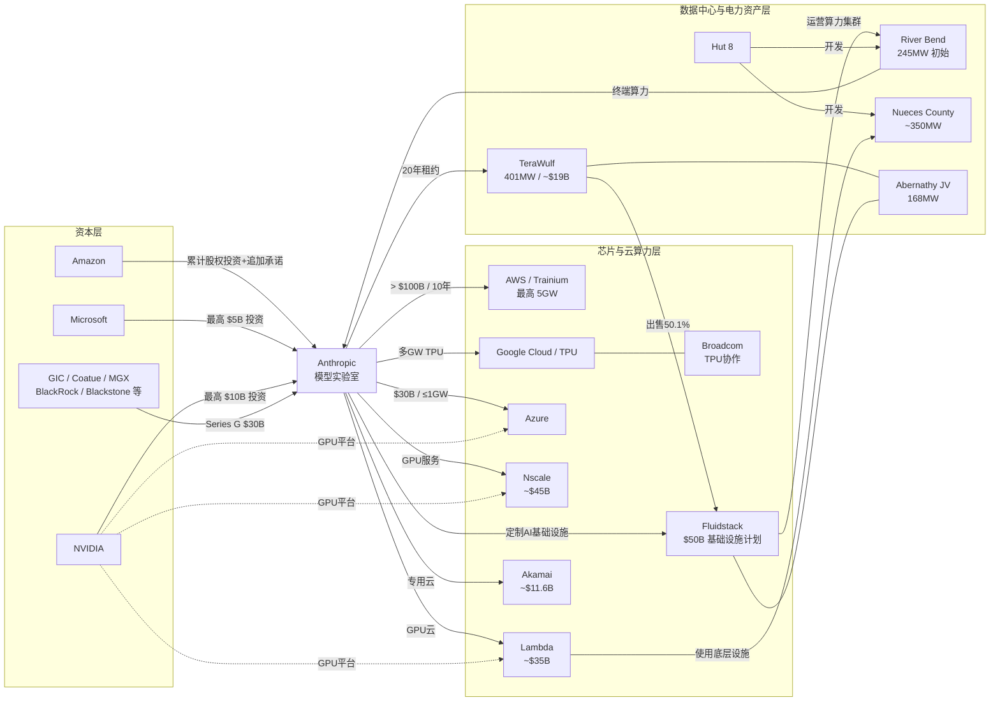

# Model Lab Network 公司关联更新：Anthropic 算力、资本与数据中心网络

## 执行摘要

截至 **2026-10-07**，对 Instap《2026-10 Model Lab Network》所指向的公开关系网进行反向重建，并以公司公告、SEC 文件、Reuters 等原始/权威资料和 Aral 研报库交叉核验后，最值得补入原图谱的不是单纯“谁投资了哪家模型公司”，而是 **Anthropic 已形成一张横跨资本、芯片、GPU 云、数据中心、电力资产的多层网络**。

最重要的新增关系包括：**Anthropic–TeraWulf** 的 20 年、约 **190 亿美元** Justified Data 数据中心租约；**Anthropic–Hut 8–Fluidstack** 的至少 245MW、潜在最高 2,295MW 基础设施合作；**Anthropic–Lambda–Hut 8** 的约 **350 亿美元/350MW** 云算力交易；**Anthropic–Nscale** 约 **450 亿美元** GPU 服务合同；以及此前容易遗漏的 **Anthropic–Akamai** 约 **116 亿美元** 七年期专用云合同，并附带 Akamai 股权权证。

与此同时，AWS、Google/Broadcom、Microsoft/NVIDIA 已从普通“云供应商”升级为 Anthropic 的**资本股东 + 芯片/云供应商 + 长期算力承购方/技术联合开发方**：AWS 的最新安排是 Anthropic 十年承诺 **超过 1,000 亿美元、最高 5GW** 新算力，同时 Amazon 追加 50 亿美元投资、未来另可追加最高 200 亿美元；Google/Broadcom 是多 GW TPU 路线；Microsoft/NVIDIA 则对应 **300 亿美元 Azure 算力承诺 + 最高 1GW NVIDIA 系统 + 最多 150 亿美元战略投资**。

**核心判断：Model Lab Network 应从“股权关系图”升级为“信用—算力—电力关系图”。** Anthropic 正把自身长期算力需求分散给 AWS、Google、Azure、Fluidstack、Nscale、Lambda、Akamai、TeraWulf 等不同层级供应商；这些长期承诺反过来成为数据中心开发商和 GPU 云融资的信用锚。Akamai 获得与商业合同挂钩的股权权证、TeraWulf 获得 20 年租约、Nscale 合同专门设置融资条件，都是这一结构已经实质化的证据。该判断属于基于已披露合同结构的推论，而非对未来业绩的推测。

需要特别说明：本次工具环境无法直接解析用户给定的 `reports.instap.net/reports/2026-10-model-lab-network` 动态页面正文，因此无法机械逐项比对原页面每一个节点；下表采用“**页面主题反向重建 + 全网新增关系 + Aral 核证**”方式。对无法由原始资料确认的 Aral 聚合数字，本文不直接视为已验证事实。

## 关联总表

| 时间 | 金额 | 关联方 | 类型 | 概要 | 截至 2026-10-07 进展 | 主要来源 |
|---|---:|---|---|---|---|---|
| 2023-02 | 未披露 | Anthropic ↔ Google Cloud | 云合作/供应链 | Anthropic 选择 Google Cloud，使用 GPU/TPU 集群训练、扩展和部署模型，并共同开发 AI 计算系统 | 后续已发展成百万级 TPU、多 GW 合作 | [W1](https://www.anthropic.com/news/anthropic-partners-with-google-cloud)  |
| 2023-05 | **4.5 亿美元**（整轮） | Anthropic ← Spark Capital、Google、Salesforce Ventures、Sound Ventures、Zoom Ventures 等 | 股权投资 | Series C，由 Spark Capital 领投；各参与方单独投资额未披露 | 已完成 | [W2](https://www.anthropic.com/news/anthropic-series-c)  |
| 2024-11 | **新增 40 亿美元；累计 80 亿美元** | Amazon → Anthropic；Anthropic ↔ AWS/Annapurna Labs | 股权+云+芯片联合开发 | Amazon 保持少数股权；AWS 成为主要云和训练合作伙伴；共同优化 Trainium/Neuron | 已扩展至 Project Rainier 和 2026 年新 5GW 框架 | [W3](https://www.anthropic.com/news/anthropic-amazon-trainium)  |
| 2025-09 | **130 亿美元** | Anthropic ← ICONIQ、Fidelity、Lightspeed、BlackRock、Blackstone、GIC、QIA 等 | 股权投资 | Series F，投后估值 1,830 亿美元 | 已完成 | [W4](https://www.anthropic.com/news/anthropic-raises-series-f-at-usd183b-post-money-valuation)  |
| 2025-10 | **数百亿美元** | Anthropic ↔ Google Cloud | 云/TPU供应 | 最高约 **100 万颗 TPU**，计划 2026 年上线明显超过 1GW 容量 | 是 Anthropic 三芯片平台之一 | [W5](https://www.anthropic.com/news/expanding-our-use-of-google-cloud-tpus-and-services)  |
| 2025-11 | **500 亿美元** | Anthropic ↔ Fluidstack | 战略合作/数据中心 | 在得州、纽约等建设 Anthropic 定制化算力设施 | 2026 年持续扩展，并衍生 Hut 8/TeraWulf 等基础设施链 | [W6](https://www.anthropic.com/news/anthropic-invests-50-billion-in-american-ai-infrastructure) [A1](https://aral.instap.net/reports?topic_id=55521512522251214)  |
| 2025-11 | **Azure 算力 300 亿美元；NVIDIA 最多投资 100 亿美元；Microsoft 最多 50 亿美元** | Anthropic ↔ Microsoft ↔ NVIDIA | 战略合作+股权+算力 | Claude 上 Azure；Anthropic 承购最高 1GW NVIDIA Grace Blackwell/Vera Rubin 算力；三方共同优化软硬件 | 已成为 AWS、GCP 之外第三大云平台路径 | [W7](https://www.anthropic.com/news/microsoft-nvidia-anthropic-announce-strategic-partnerships)  |
| 2025-12 | **合作金额未披露** | Anthropic ↔ Hut 8 ↔ Fluidstack | 数据中心/客户/供应链 | Hut 8 为 Anthropic 建至少 **245MW**、潜在最高 **2,295MW**；Fluidstack 运营计算集群 | River Bend 正在建设；2026-10-07 Axios 报道项目规模约 **100 亿美元**，目标 2027 年初投运；该 100 亿美元是项目投资规模，并非 Anthropic 合同额 | [W8](https://canada.hut8.com/resources/press-releases/hut-8-announces-ai-infrastructure-partnership-with-anthropic-and-fluidstack)[W9](https://www.axios.com/local/new-orleans/2026/10/07/data-center-louisiana-hut-8-anthropic)  |
| 2026-02 | **300 亿美元** | Anthropic ← GIC、Coatue、D.E. Shaw Ventures、MGX、BlackRock、Blackstone 等 | 股权投资 | Series G，投后估值 **3,800 亿美元**；包含此前 Microsoft/NVIDIA 投资的一部分 | 已完成 | [W10](https://www.anthropic.com/news/anthropic-raises-30-billion-series-g-funding-380-billion-post-money-valuation)  |
| 2026-04 | 未披露 | Anthropic ↔ Google ↔ Broadcom | 芯片/战略供应链 | 新签**多 GW**下一代 TPU 容量，自 2027 年起上线；绝大部分计划位于美国 | 已签协议，处建设/交付前阶段 | [W11](https://www.anthropic.com/news/google-broadcom-partnership-compute)  |
| 2026-04 | **算力承诺 >1,000 亿美元/10年；Amazon 当期投资 50 亿美元，未来最多再投 200 亿美元** | Anthropic ↔ Amazon/AWS | 云+股权+供应链 | 最高 **5GW** 新容量，覆盖 Trainium2–Trainium4；AWS 继续为主要训练/云供应商 | 2026 年已有 Trainium2/3 容量陆续上线 | [W12](https://www.anthropic.com/news/anthropic-amazon-compute) [A1](https://aral.instap.net/reports?topic_id=55521512522251214)  |
| 2026-07 | **约 190 亿美元** | Anthropic ↔ TeraWulf | 客户/20年租赁 | Anthropic 租用肯塔基 Justified Data 园区，约 **401MW IT load** | 首批预计 2027H2 上线，2028 年初达到 401MW | [W13](https://investors.terawulf.com/news-events/press-releases/detail/142/terawulf-announces-anthropic-lease-at-justified-data-campus-and-sale-of-majority-interest-in-abernathy-joint-venture-to-fluidstack) [A1](https://aral.instap.net/reports?topic_id=55521512522251214)  |
| 2026-07 | **成交价未披露；TeraWulf 原投入约 4.5 亿美元** | TeraWulf ↔ Fluidstack/投资者组 | 股权/资产交易 | TeraWulf 出售 Abernathy JV 的 **50.1%**，项目约 168MW；Fluidstack 继续主导项目 | 已签 definitive agreement，出售价格高于 TeraWulf 投入成本但具体金额未披露 | [W13](https://investors.terawulf.com/news-events/press-releases/detail/142/terawulf-announces-anthropic-lease-at-justified-data-campus-and-sale-of-majority-interest-in-abernathy-joint-venture-to-fluidstack)  |
| 2026-08 | **约 450 亿美元** | Anthropic ↔ Nscale | GPU云/客户 | Anthropic 租用 Nscale NVIDIA Vera Rubin NVL72 等专用 GPU 服务；SEC 合同显示同一站点四个 tranche 均专供 Anthropic | 合同已签；部分融资仍是项目履约的重要前置条件 | [W14](https://www.sec.gov/Archives/edgar/data/2110365/000119312526395475/ck0002110365-ex10_25.htm)[W15](https://www.sec.gov/Archives/edgar/data/2110365/000119312526395475/0001193125-26-395475-index.htm)  |
| 2026-08/09 | **约 350 亿美元** | Anthropic ↔ Lambda ↔ Hut 8 | 云算力/数据中心供应链 | Reuters 报道 Lambda 为 Anthropic 提供 NVIDIA 云算力；底层约 **350MW** 数据中心由 Hut 8 在得州 Nueces County 开发 | 已签云合同；项目仍处建设/算力部署阶段 | [W16](https://www.streetinsider.com/Reuters/Anthropic+signs+%2435+billion+cloud+deal+with+Nvidia-backed+Lambda%2C+source+says/27007212.html)  |
| 2026-09 | **约 116 亿美元** | Anthropic ↔ Akamai | 云服务+客户+潜在股权 | Akamai 向 Anthropic 提供专用云计算和托管支持；七年期 Project Plan 2/3；Anthropic 同时取得最高相当于 **7,741,020 股普通股**的权证经济敞口 | SEC 8-K 已正式披露，合同生效；权证分 tranche 按付款和新增合同价值归属 | [W17](https://www.sec.gov/Archives/edgar/data/1086222/000119312526401048/d288154d8k.htm)  |

表中金额必须注意**口径不可直接相加**。股权融资、模型公司自建投资、云算力购买承诺、数据中心租约总收入和底层项目资本开支属于不同经济层级。Aral 的一篇 2026-09-29 报告将 Anthropic 云基础设施承诺汇总到约 **5,180 亿美元**，并列出 AWS、GCP、Lambda/Nscale、Fluidstack、Azure、TeraWulf 等路径；这一材料非常适合作为关系发现器，但其中个别分项金额没有在本文检索到同等强度的原始披露，因此本文没有把 5,180 亿美元作为“经审计的总合同价值”直接采用。[A1](https://aral.instap.net/reports?topic_id=55521512522251214) 官方文件反而显示，各合同还包含不同期限、可选容量、融资条件、交付验收和取消条款。

## 重点新增关系与投资含义

### TeraWulf 与 Hut 8 是原网络中最值得补的两条边

**TeraWulf 已不是“Anthropic 的潜在上游”，而是明确的直接房东/基础设施供应商。** 2026 年 7 月 6 日双方正式签署 20 年租约，约 190 亿美元基础期限合同收入，401MW IT 负载；这使 WULF 对 Anthropic 的关系强度显著高于仅有意向书或间接云服务的基础设施公司。

**Hut 8 的关系更加复杂，但也更值得画进图。** 第一条链是 `Anthropic → Fluidstack → Hut 8 River Bend`，初始 245MW；第二条是 Anthropic 与 Hut 8 可以直接共同评估 Hut 8 其他开发管线，潜在再扩 1,050MW。到 2026 年 10 月 7 日，River Bend 已进入实质施工阶段，Axios 将项目规模描述为约 100 亿美元、预计 2027 年初投运。换言之，这已从 2025 年的远期合作转为可观测的在建资产。

此外，Reuters 披露的 **Lambda–Anthropic 350 亿美元合同又落到了 Hut 8 的约 350MW 得州项目上**，说明 HUT 与 Anthropic 之间至少存在两条不同的经济链：一条经 Fluidstack，一条经 Lambda。

### Akamai 是容易被漏掉、但经济实质极强的关系

Akamai 在 2026 年 9 月的 SEC 8-K 中首次把 Anthropic 关系量化为约 **116 亿美元**，并披露双方原始 Master Services Agreement 可追溯至 **2026-05-05**。更重要的是，Anthropic 获得 Akamai 权证，其归属条件与首笔付款及后续每增加 30 亿美元合同价值相关。

这意味着 Anthropic 与供应商关系正在从“客户付款”演变成**客户 + 潜在股东**的双重结构。它和 Amazon/Microsoft/NVIDIA 对 Anthropic 的“供应商 + 股东”结构形成镜像：资本关系开始沿算力供应链双向延伸。此为基于合同结构作出的分析判断。

### 模型实验室正在成为基础设施融资的信用核心

Nscale 的 SEC 合同尤其说明这一点：四个 tranche 被安排成单独协议以支持供应商融资，整个站点要求专供 Anthropic，并明确写入获得合格融资的要求；Anthropic 只有在交付并验收后才产生相关付款义务。

因此，与其只交易“GPU 需求增长”，更值得关注的是 **谁拥有已经签约的电力、土地和长期 investment-grade AI 客户合同**。TeraWulf 20 年期 190 亿美元租约、Hut 8/Fluidstack 的长期部署、Akamai 七年 116 亿美元合同都把模型实验室信用转换成了基础设施资产的融资能力和长期现金流可见度。

Aral 的基础设施主题研报同样把这种模式概括为“锁定稀缺电力 + 长租给模型/云客户”，并重点覆盖 Hut 8、TeraWulf、Cipher、Galaxy、IREN、Nebius 等标的。[A2](https://aral.instap.net/reports?topic_id=55521518855414524)[A3](https://aral.instap.net/reports?topic_id=45548858211185818) 其中值得保持纪律的一点是：**签约 MW ≠ 已上电 MW，合同总额 ≠ 当年收入，客户承诺 ≠ 无条件债权。**

### 尚不应写成确定关系的项目

Aral 中还出现了 **Anthropic 2.6GW NVIDIA 硬件采购**、与 Google/Broadcom 相关的 **600 亿美元芯片租赁融资**，以及 Anthropic 与 SpaceX/xAI 基础设施交易等线索。[A4](https://aral.instap.net/reports?topic_id=22258225542588821) 本次公开检索可以确认 Anthropic 确实大规模使用 NVIDIA GPU、并与 Google/Broadcom 签署多 GW 下一代 TPU 协议，但截至检索截止日，我没有找到与上述每一个具体 Aral 数字完全对应、且足以达到本文核心表核证标准的官方合同或监管文件，因此**不把这些金额作为已确认交易录入总表**。Anthropic 自身已明确其硬件策略同时覆盖 AWS Trainium、Google TPU 和 NVIDIA GPU。

同理，TeraWulf 与 Kentucky Power/AEP 的 **Muskie 园区** 2026 年将签约电力由 500MW 扩至 1GW、第二阶段提前到 2029 年，是值得跟踪的 WULF 独立扩容关系，但没有证据表明 Muskie 就是 Anthropic 的 Justified Data 401MW 项目，故不能把两者混为一谈。[A2](https://aral.instap.net/reports?topic_id=55521518855414524)

## 实体关系图

下面的图将“资本”和“物理算力”分层，能比普通股权图更准确地表现当前 Model Lab Network。关系及金额均对应上表已核证项目。



这张网络真正重要的变化是：**Amazon、Microsoft、NVIDIA 位于 Anthropic 上游资本层，同时又位于下游供应链；Fluidstack、Hut 8、TeraWulf、Nscale、Lambda、Akamai 则把 Anthropic 的需求继续向土地、电力、建筑、GPU 和债务融资传导。** 因而模型实验室的资本开支已经不是简单的“NVDA 收入”，而是一个能跨多层资产负债表传导的资本循环。

## 检索方法与关键词

本次采用“**页面 → 公司原始资料 → SEC → 权威媒体 → Aral 反查 → 再回原始资料核证**”的顺序。原 Instap 页面因动态站点访问限制未能直接读取正文，因此没有把搜索引擎无法抓取的页面内容自行补写为事实。

公开互联网检索主要使用了以下关键词组合：

```text
"2026-10-model-lab-network"
site:reports.instap.net "model lab network"
Anthropic TeraWulf lease Justified $19 billion
Anthropic Hut 8 Fluidstack 245 MW 2295 MW
Anthropic Fluidstack $50 billion
Anthropic AWS Amazon $100 billion 5GW
Anthropic Google TPU Broadcom multiple gigawatts
Anthropic Microsoft NVIDIA Azure $30 billion
Anthropic Nscale $45 billion
Anthropic Lambda $35 billion Hut 8 350 MW
Anthropic Akamai $11.6 billion
site:sec.gov Anthropic Akamai
site:sec.gov Anthropic Nscale GPU Services
Anthropic Series F $13 billion
Anthropic Series G $30 billion
Hut 8 River Bend Anthropic October 7 2026
TeraWulf Fluidstack Abernathy JV
```

Aral 库分别检索了：

```text
Anthropic
TeraWulf
Anthropic TeraWulf
Hut 8 Anthropic
Anthropic Fluidstack
Anthropic Nscale
Anthropic Akamai
AI基础设施 / 数据中心 / 算力 / 电力
```

核证原则为：**官方公告/SEC > 公司投资者关系材料 > Reuters 等权威媒体 > Aral 研报 > 其他行业媒体**。Aral 的优势在于发现关系和聚合产业链，原始文件用于确认交易金额、期限和法律状态；对于 Aral 报告自身标注“AI整理”或没有原始文件对应的数字，本报告保留但不升级为“已确认事实”。

## 来源索引

以下按 Obsidian 可直接整理的来源节点形式列出；英文资料均标记为 **[EN]**。

**W1 — Anthropic-Google-Cloud-2023** [EN] Anthropic，2023-02-03，Google Cloud 合作  
https://www.anthropic.com/news/anthropic-partners-with-google-cloud 

**W2 — Anthropic-Series-C** [EN] Anthropic，2023-05-23，4.5 亿美元 Series C  
https://www.anthropic.com/news/anthropic-series-c 

**W3 — Anthropic-Amazon-2024** [EN] Anthropic，2024-11-22，Amazon 累计投资 80 亿美元、AWS 成为主要云/训练合作伙伴  
https://www.anthropic.com/news/anthropic-amazon-trainium 

**W4 — Anthropic-Series-F** [EN] Anthropic，2025-09-02，130 亿美元 Series F  
https://www.anthropic.com/news/anthropic-raises-series-f-at-usd183b-post-money-valuation 

**W5 — Anthropic-Google-TPU-2025** [EN] Anthropic，2025-10-23，最高 100 万 TPU / 数百亿美元  
https://www.anthropic.com/news/expanding-our-use-of-google-cloud-tpus-and-services 

**W6 — Anthropic-Fluidstack** [EN] Anthropic，2025-11-12，500 亿美元美国 AI 基础设施计划  
https://www.anthropic.com/news/anthropic-invests-50-billion-in-american-ai-infrastructure 

**W7 — Anthropic-Microsoft-NVIDIA** [EN] Anthropic，2025-11-18，Azure/NVIDIA/战略投资  
https://www.anthropic.com/news/microsoft-nvidia-anthropic-announce-strategic-partnerships 

**W8 — Hut8-Anthropic-Fluidstack** [EN] Hut 8，2025-12-17，245MW—2,295MW AI 基础设施合作  
https://canada.hut8.com/resources/press-releases/hut-8-announces-ai-infrastructure-partnership-with-anthropic-and-fluidstack 

**W9 — River-Bend-Progress** [EN] Axios，2026-10-07，River Bend 现场建设进展  
https://www.axios.com/local/new-orleans/2026/10/07/data-center-louisiana-hut-8-anthropic 

**W10 — Anthropic-Series-G** [EN] Anthropic，2026-02-12，300 亿美元 Series G  
https://www.anthropic.com/news/anthropic-raises-30-billion-series-g-funding-380-billion-post-money-valuation 

**W11 — Anthropic-Google-Broadcom** [EN] Anthropic，2026-04-06，多 GW 下一代 TPU 合作  
https://www.anthropic.com/news/google-broadcom-partnership-compute 

**W12 — Anthropic-AWS-5GW** [EN] Anthropic，2026-04-20，>1,000 亿美元/10 年、最高 5GW  
https://www.anthropic.com/news/anthropic-amazon-compute 

**W13 — TeraWulf-Anthropic-Fluidstack** [EN] TeraWulf，2026-07-06，Anthropic 190 亿美元租约及 Abernathy 股权交易  
https://investors.terawulf.com/news-events/press-releases/detail/142/terawulf-announces-anthropic-lease-at-justified-data-campus-and-sale-of-majority-interest-in-abernathy-joint-venture-to-fluidstack 

**W14 — Anthropic-Nscale-SEC-Agreement** [EN] SEC，Nscale–Anthropic GPU Services Agreement  
https://www.sec.gov/Archives/edgar/data/2110365/000119312526395475/ck0002110365-ex10_25.htm 

**W15 — Nscale-SEC-Filing** [EN] SEC，Nscale filing index  
https://www.sec.gov/Archives/edgar/data/2110365/000119312526395475/0001193125-26-395475-index.htm 

**W16 — Anthropic-Lambda-Hut8** [EN] Reuters 转载，2026-08-31，350 亿美元 Lambda 云合同、约 350MW Hut 8 项目  
https://www.streetinsider.com/Reuters/Anthropic+signs+%2435+billion+cloud+deal+with+Nvidia-backed+Lambda%2C+source+says/27007212.html 

**W17 — Akamai-Anthropic-SEC** [EN] SEC，2026-09-24，Akamai–Anthropic 约 116 亿美元合同及权证  
https://www.sec.gov/Archives/edgar/data/1086222/000119312526401048/d288154d8k.htm 

**A1 — Aral-Anthropic-Cloud-Commitments** [中文] Aral，2026-09-29，Anthropic 云基础设施合同口径梳理；覆盖 AWS/GCP/Azure/TeraWulf 等  
https://aral.instap.net/reports?topic_id=55521512522251214

**A2 — Aral-TeraWulf-Kentucky-Power** [中文] Aral，2026-10-05，TeraWulf–Kentucky Power Muskie 园区签约容量 500MW→1GW  
https://aral.instap.net/reports?topic_id=55521518855414524

**A3 — Aral-AI-Infrastructure-Power** [中文] Aral，2026-08-28，AI 基建、电力资产及 Hut 8 等基础设施运营商分析  
https://aral.instap.net/reports?topic_id=45548858211185818

**A4 — Aral-Anthropic-Compute-Long-Term-Contracts** [中文] Aral，2026-10-06，Anthropic 长期算力采购、2.6GW NVIDIA 硬件等产业链线索  
https://aral.instap.net/reports?topic_id=22258225542588821
